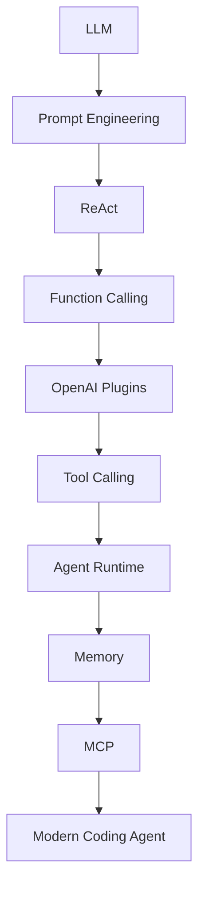
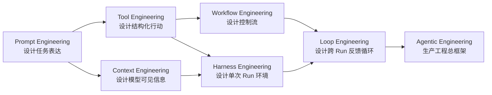
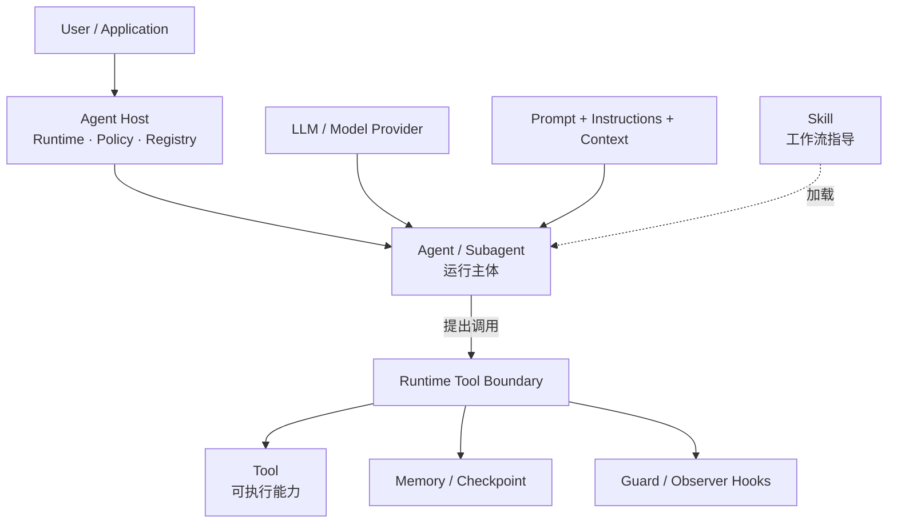
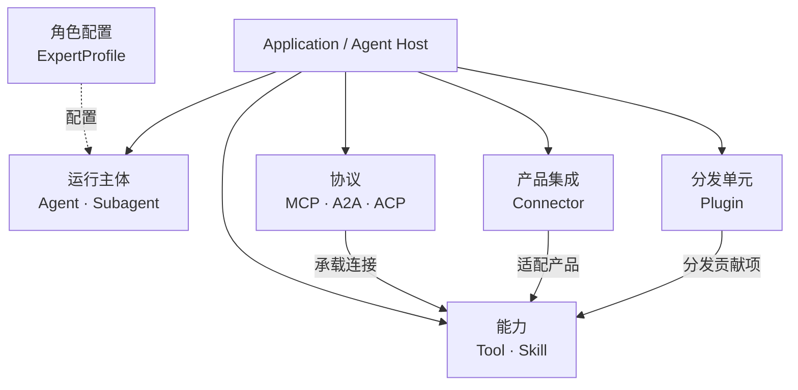

# 第 1 章：AI Agent 简介与历史演进

> **难度等级：** ⭐⭐
> **所属模块：** 第一部分：基础认知
> **来源可信度：** 官方文档 / 论文 / 推导 / 观点
> **状态：** ✅ 已完成

---

## 学习目标

完成本章学习后，你将能够：

1. 理解 AI Agent 的核心定义及其与传统 LLM 应用的本质区别
2. 掌握 AI Agent 从 LLM 到现代 Coding Agent 的完整演进路径
3. 理解每个演进阶段的出现原因、核心突破和局限性
4. 建立 Agent 核心概念之间的关系地图
5. 区分常见混淆概念（Prompt vs Instructions、Skill vs Tool、Tool vs MCP 等）
6. 理解 Prompt、Context、Tool、Workflow、Harness、Loop 与 Agentic Engineering 的关注面

---

## 前置知识

- 基本的 LLM（大语言模型）概念
- 了解 API 调用的基本流程
- 无需阅读其他章节

---

## 1. 背景

### 1.1 为什么需要 AI Agent

2022 年底 ChatGPT 的发布标志着大语言模型（LLM）从实验室走向大众。然而，早期的 LLM 应用存在一个根本性局限：它们只能做「输入 → 输出」的线性文本生成，无法与外部世界交互。

想象一下，你让一个 LLM 帮你查询今天的天气。它可能会生成一段看起来合理的回答，但无法真正调用天气 API 获取实时数据。这就是 LLM 的「知识边界」问题——模型的知识截止于训练数据，无法获取实时信息，也无法执行具体操作。

**AI Agent 的出现正是为了解决这个问题。** Agent 不仅能够「思考」，还能「行动」——调用工具、查询数据库、操作文件系统，并基于执行结果调整后续决策。

> **来源类型：** 推导分析 —— 基于 LLM 能力边界和 Agent 设计目标的逻辑推断

### 1.2 什么是 AI Agent

AI Agent 是一个能够自主感知环境、推理、规划并执行动作的 AI 系统。其核心特征是：

1. **自主性（Autonomy）：** 能够独立做出决策，无需人类逐步指导
2. **反应性（Reactivity）：** 能够感知环境变化并做出响应
3. **主动性（Pro-activeness）：** 能够主动采取行动以实现目标
4. **社交能力（Social Ability）：** 能够与其他 Agent 或人类交互

> **来源类型：** Fact —— 基于 Wooldridge & Jennings (1995) 的 Agent 定义框架，结合现代 LLM-based Agent 的实践

### 1.3 Agent 与传统 LLM 应用的区别

| 维度 | 典型单轮 LLM 应用 | 带执行循环的 Agent |
|------|-------------------|--------------------|
| 流程 | 应用显式编排输入 → 输出，通常单轮完成 | 在步数、预算与权限边界内循环：推理 → 规划 → 执行 → 观察 |
| 工具使用 | 可由应用显式调用 Tool，但模型通常不参与循环决策 | 可根据当前上下文提出或选择 Tool 调用，并读取结果继续决策 |
| 状态 | 应用按需传入当前上下文或状态 | 可显式管理会话状态、任务状态与长期记忆；并非所有 Agent 都需要长期记忆 |
| 决策 | 单次生成或固定工作流 | 多步骤决策、规划或受控工作流 |
| 自主性 | 路径主要由应用代码固定 | 路径可由模型/策略在受限能力范围内调整，关键动作仍应由应用控制 |

---

## 2. 核心概念

### 2.1 概念速查表

本书涉及的核心概念及其关系如下：

| 概念 | 本质 | 读取/调用时机 |
|------|------|--------------|
| Prompt | 当前任务目标 | 任务开始时读取 |
| Instructions | 跨任务的行为规则与约束 | 由 Host 按配置版本在执行前注入 |
| Skills | 可复用工作流模板 | Agent 判断匹配时读取，不真正调用 |
| Tools | 可执行的执行接口 | Planning 完成后调用 |
| Built-in Tool | Agent 自带能力 | 无需安装，直接调用 |
| MCP | 连接外部 Tool、Resource、Prompt 等能力的互操作协议 | Host 需要标准化接入外部能力时使用；不要求动态发现 |
| Connector | 面向 GitHub、Drive 等具体产品的集成配置与适配 | 需要管理服务身份、授权范围、端点和数据映射时使用 |
| Plugin | 可安装、版本化和启停的一组 Host 扩展 | 需要分发 Tool、Skill、Hook、Connector 预设等能力时使用 |
| Subagent | 由上层 Agent 委派、拥有受限上下文与预算的 Agent Run | 任务适合隔离、并行或专业化处理时运行 |
| Hooks | 生命周期事件 | 特定事件前后触发 |

> **来源类型：** 推导分析 —— 基于 Claude Code、OpenAI Agents SDK 等主流框架的实际设计模式

这些概念不是严格的包含树。第 2 章将它们统一归入运行主体、能力、协议、产品集成和分发单元五类正交概念。

### 2.2 常见混淆澄清

这是初学者最容易混淆的几组概念：

| 对比 | 区别 |
|------|------|
| Prompt vs Instructions | Prompt 是任务目标（「帮我查天气」），Instructions 是长期规则（「始终使用中文回复」） |
| Skill vs Tool | Skill 告诉 Agent 怎么做（工作流模板），Tool 真正去做（执行接口） |
| Tool vs MCP | Tool 是能力（执行什么），MCP 是提供 Tool 的协议（如何发现和调用 Tool） |
| MCP vs Connector | MCP 是通用协议；Connector 是面向某个具体产品的身份、授权、端点和数据映射集成，可以使用 MCP 或其他 API |
| Plugin vs Skill/Tool | Plugin 是分发与生命周期单元；Skill 和 Tool 是它可以贡献的能力 |
| Expert vs Subagent | Expert Profile 描述专业角色；Subagent 描述一次由父 Agent 委派的运行关系 |
| Tool vs Function Calling | Tool 是能力抽象，Function Calling 是调用方式/协议 |

> **来源类型：** 推导分析 —— 基于对主流框架中这些概念的实际使用方式的归纳

---

## 3. 历史演进

### 3.1 演进路径总览



> **图 1-1：** AI Agent 历史演进时间线

### 3.2 阶段一：LLM（2020-2022）

**出现原因：** GPT-3（2020）展示了大规模语言模型在零样本和少样本学习上的惊人能力，但模型能力仅限于文本生成。

**核心突破：** 证明了 Scaling Law——更大的模型、更多的数据、更多的算力可以带来可预测的能力提升。

**局限性：**
- 无法获取实时信息
- 无法执行具体操作
- 输出不可控（幻觉问题）
- 知识截止于训练数据

**对现代 Agent 的影响：** LLM 是 Agent 的「大脑」，为后续所有发展奠定了基础。没有强大的推理能力，Agent 就无法做出合理的决策。

> **来源类型：** Fact —— 基于 GPT-3 论文 (Brown et al., 2020) 和 Scaling Law 论文 (Kaplan et al., 2020)

### 3.3 阶段二：Prompt Engineering（2022-2023）

**出现原因：** 随着 LLM 能力的提升，如何有效地「引导」模型输出成为关键问题。Prompt Engineering 从一种「技巧」逐渐发展为一门系统性的工程学科。

**核心突破：**
- **Chain-of-Thought（CoT）：** 通过让模型「逐步思考」显著提升推理能力 (Wei et al., 2022)
- **Few-shot Prompting：** 通过少量示例引导模型行为
- **System Prompt：** 定义模型的全局行为准则

**局限性：**
- Prompt 的质量高度依赖人工设计
- 复杂任务需要极长的 Prompt
- 无法超越模型的固有知识边界

**对现代 Agent 的影响：** Prompt Engineering 是 Agent Instructions 和 System Prompt 的前身，奠定了「通过自然语言控制模型行为」的基础范式。

> **来源类型：** Fact —— 基于 CoT 论文 (Wei et al., 2022) 和社区实践

### 3.4 阶段三：Function Calling（2023）

**出现原因：** 用户需要模型不只是「说」，还能「做」——调用 API、查询数据库、操作文件。OpenAI 在 2023 年 6 月推出了 Function Calling 能力。

**核心突破：**
- 模型能够输出结构化的函数调用请求（函数名 + 参数 JSON）
- 开发者可以定义函数签名（JSON Schema），模型据此决定调用哪个函数
- 打通了 LLM 与外部系统的连接

**局限性：**
- 函数调用只是「请求」，需要外部代码执行
- 缺乏统一的 Tool 抽象
- 错误处理依赖开发者自行实现

**对现代 Agent 的影响：** Function Calling 是 Tool Calling 的基础，至今仍是 Agent 与外部世界交互的核心机制。

> **来源类型：** Fact —— 基于 OpenAI Function Calling 官方文档（2023年6月发布）

### 3.5 阶段四：OpenAI Plugins（2023）

**出现原因：** Function Calling 解决了「如何调用」的问题，但「有哪些工具可用」仍然需要开发者手动集成。OpenAI Plugins 试图通过插件市场解决工具发现和标准化的问题。

**核心突破：**
- 标准化的插件 manifest 格式
- 插件市场生态
- 自动化的工具发现

**局限性：**
- 封闭生态，依赖 OpenAI 平台
- 插件审核和分发流程复杂
- 安全性依赖于 OpenAI 的审核机制
- 最终被弃用，生态未达预期

**对现代 Agent 的影响：** OpenAI Plugins 为后来的 MCP 提供了重要的经验教训——开放协议比封闭生态更具生命力。

> **来源类型：** Fact —— 基于 OpenAI Plugins 官方文档（2023年3月发布，2024年弃用）

### 3.6 阶段五：ReAct（2022）

**出现原因：** 单纯调用工具不够，Agent 需要在「推理」和「行动」之间交替进行，形成闭环。ReAct 论文提出了 Reasoning + Acting 的范式。

**核心突破：**
- 将推理（Thought）和行动（Action）交替进行
- 每次行动后观察结果（Observation），再决定下一步
- 形成了一个完整的 Agent 循环

**局限性：**
- 循环可能无限进行（需要最大步数限制）
- 缺乏长期规划能力
- 对复杂多步骤任务效率较低

**对现代 Agent 的影响：** ReAct 是 Agent 主循环的雏形，现代 Agent 的 Reasoning → Planning → Tool Calling → Observation 流程直接继承自 ReAct 范式。

> **来源类型：** Fact —— 基于 ReAct 论文 (Yao et al., 2022)

### 3.7 阶段六：Tool Calling（2023-2024）

**出现原因：** Function Calling 是 OpenAI 的实现，Tool Calling 则是更通用的抽象。Anthropic 在 Claude 中引入了 Tool Use，Google 在 Gemini 中引入了 Function Calling，Tool Calling 成为跨模型的标准能力。

**核心突破：**
- 统一的 Tool 抽象（名称、描述、参数 Schema）
- 跨模型的 Tool Calling 支持
- 更丰富的 Tool 类型（Built-in、MCP、Plugin）

**局限性：**
- Tool 的选择和调度仍需要框架层实现
- 缺乏统一的 Tool 注册和发现机制
- Tool 数量增多导致选择困难

**对现代 Agent 的影响：** Tool Calling 是 Agent 架构的核心组件，第 6 章将详细展开。

> **来源类型：** 推导分析 —— 基于 Anthropic Tool Use 文档和 OpenAI Function Calling 的演进

### 3.8 阶段七：Agent Runtime + Memory（2024）

**出现原因：** 有了 Tool Calling 和 ReAct 循环，还需要一个运行环境来管理 Agent 的生命周期、状态和组件协调。Memory 模块使得 Agent 能「记住」历史信息。

**核心突破：**
- Agent Runtime 统一管理生命周期
- Memory 模块实现分级存储（短期/中期/长期）
- 上下文窗口管理策略

**局限性：**
- Memory 的长期一致性仍是挑战
- 上下文窗口有限，需要裁剪策略
- 跨 Session 的记忆管理复杂

**对现代 Agent 的影响：** Runtime 和 Memory 是现代 Agent 框架的核心基础设施，详见第 8 章和第 9 章。

> **来源类型：** 推导分析 —— 基于 OpenAI Agents SDK、LangGraph 等框架的架构设计

### 3.9 阶段八：MCP（2024-2025）

**出现原因：** 每个 Agent 框架都需要集成各种外部上下文和能力，但缺乏统一的互操作协议。Anthropic 在 2024 年底推出了 MCP（Model Context Protocol），旨在标准化 Tool、Resource、Prompt 等能力的连接与协作。

**核心突破：**
- 开放协议，不绑定任何特定模型或框架
- 标准化的 Tool、Resource 与 Prompt 能力模型
- 连接后发现 Server 已声明的能力；具体暴露和刷新策略由 Host 决定
- Client-Server 架构，支持多语言实现

**局限性：**
- 协议仍在快速演进中
- 安全性（任意 MCP Server 可能带来风险）
- 性能（网络延迟、序列化开销）

**对现代 Agent 的影响：** MCP 已被多个 Agent 产品和 SDK 采用，是理解外部能力互操作的重要协议之一。它仍在演进，具体版本与传输层差异见第 13 章。

> **来源类型：** Fact —— 基于 MCP 官方规范 (modelcontextprotocol.io)

### 3.10 阶段九：Modern Coding Agent（2025-2026）

**出现原因：** 将 Agent 架构应用于软件开发领域，出现了 GitHub Copilot、Claude Code、Cursor、Continue 等 Coding Agent，它们代表了 Agent 架构的最前沿实践。

**核心特征：**
- 深度集成 IDE 和开发工具链
- 完整的 Agent 架构（Runtime + Planner + Tool Registry + Memory + MCP）
- Skills 和 Hooks 系统
- 企业级的安全和权限控制

**当前挑战：**
- 代码生成的准确性和可靠性
- 大型代码库的上下文管理
- 安全性和权限控制
- 用户信任和采纳

**对未来的影响：** Coding Agent 是 Agent 架构的「实验场」，许多设计模式（如 Skills、Hooks、MCP）首先在 Coding Agent 中得到验证，然后推广到更广泛的 Agent 应用场景。

> **来源类型：** 推导分析 —— 基于 GitHub Copilot、Claude Code、Cursor 的公开文档和架构分析

---

## 4. Agent 工程关注面的扩展

现代 Agent 工程不能只用一条更长的 Prompt 解释。随着系统开始调用外部能力、维护状态、接受反馈并跨 Run 工作，工程对象逐步扩大；这不是后一项技术淘汰前一项技术，而是多组可以组合的实践。



> **图 1-4：** Agent 工程关注面的扩展。箭头表示系统责任扩大和依赖关系，不是技术替代或业界公认的线性年代划分；Prompt、Context、Tool、Workflow、Harness 与 Loop 在生产系统中通常同时存在。

| 工程实践 | 主要设计对象 | 典型问题 |
|----------|--------------|----------|
| Prompt Engineering | 单次任务表达与输出要求 | 这次要求模型做什么？ |
| Tool / Function Calling Engineering | Schema、调用意图、Handler 与 Observation | 模型如何请求受控行动？ |
| Workflow Engineering | DAG、状态机和确定性业务步骤 | 哪些步骤应由代码固定？ |
| Context Engineering | Instructions、Skill、Memory、证据和 Token 预算 | 当前模型应该看到什么？ |
| Harness Engineering | Runtime、工具、权限、沙箱、工作区和反馈 | 单次 Agent Run 在什么环境中工作？ |
| Loop Engineering | Trigger、Run、Verifier、状态、预算和停止规则 | 如何安全地跨 Run 重复执行和验证？ |
| Agentic Engineering | 上述实践及评估、安全、运维的组合 | 如何交付可治理的生产 Agent 系统？ |

其中 Prompt Engineering、Tool/Function Calling 和 Workflow 已有相对稳定的工程含义；Context Engineering 正在形成较广泛共识；Harness Engineering 和 Loop Engineering 是较新的工作术语，不同团队的范围可能不同。本书把 `Agentic Engineering` 作为总称，而不是演进链末端的一项组件。

> **来源类型：** Fact + 作者工作定义 —— Workflow/Agent 区分参考 Anthropic《Building Effective Agents》；Harness Engineering 参考 OpenAI 公开工程实践；Loop Engineering 属于新兴术语，本书只采用“有边界、可验证、可停止的跨 Run 循环”这一保守定义。

---

## 5. 概念关系图

### 5.1 Agent 应用运行结构



> **图 1-2：** Agent 应用运行结构预览。Host 提供治理和执行环境，Agent/Subagent 是运行主体；Skill 指导主体，Tool 经 Runtime 执行。第 2 章给出完整职责边界。

### 5.2 核心概念关系



> **图 1-3：** 五类正交概念预览。它们回答“谁运行、能做什么、如何互操作、接入哪个产品、如何分发”五个不同问题；ExpertProfile 是角色配置。完整定义见第 2 章图 2-6。

---

## 6. 最小可运行示例

### 6.1 Hello Agent

以下是一个最小化的 Agent 实现，展示 Agent 的核心循环：

```python
"""
Hello Agent - 最小化 Agent 实现
运行环境：Python 3.10+
依赖：无
预期输出：Agent 执行一次推理-行动-观察循环
"""

class MinimalAgent:
    """最小 Agent 实现，展示核心循环"""

    def __init__(self, name: str):
        self.name = name
        self.memory = []  # 简单的记忆列表

    def reason(self, task: str) -> str:
        """推理阶段：分析任务"""
        thought = f"[{self.name}] 思考: 我需要完成 '{task}'"
        self.memory.append(thought)
        return thought

    def plan(self, task: str) -> list[str]:
        """规划阶段：将任务分解为步骤"""
        steps = [
            f"1. 理解任务: {task}",
            "2. 确定所需工具",
            "3. 执行操作",
            "4. 检查结果",
        ]
        return steps

    def act(self, step: str) -> str:
        """执行阶段：执行具体步骤"""
        result = f"[{self.name}] 执行: {step} -> 完成"
        self.memory.append(result)
        return result

    def observe(self, result: str) -> str:
        """观察阶段：评估结果"""
        observation = f"[{self.name}] 观察: {result}"
        self.memory.append(observation)
        return observation

    def run(self, task: str) -> list[str]:
        """Agent 主循环"""
        outputs = []

        # 1. 推理
        outputs.append(self.reason(task))

        # 2. 规划
        plan = self.plan(task)
        outputs.extend(plan)

        # 3. 执行 + 观察
        for step in plan:
            result = self.act(step)
            outputs.append(self.observe(result))

        return outputs


if __name__ == "__main__":
    agent = MinimalAgent("HelloAgent")
    results = agent.run("向世界问好")

    print("=" * 50)
    print("Agent 执行过程:")
    print("=" * 50)
    for r in results:
        print(r)
    print("=" * 50)
    print(f"记忆条目: {len(agent.memory)} 条")
```

**预期输出：**

```
==================================================
Agent 执行过程:
==================================================
[HelloAgent] 思考: 我需要完成 '向世界问好'
1. 理解任务: 向世界问好
2. 确定所需工具
3. 执行操作
4. 检查结果
[HelloAgent] 执行: 1. 理解任务: 向世界问好 -> 完成
[HelloAgent] 观察: [HelloAgent] 执行: 1. 理解任务: 向世界问好 -> 完成
[HelloAgent] 执行: 2. 确定所需工具 -> 完成
[HelloAgent] 观察: [HelloAgent] 执行: 2. 确定所需工具 -> 完成
[HelloAgent] 执行: 3. 执行操作 -> 完成
[HelloAgent] 观察: [HelloAgent] 执行: 3. 执行操作 -> 完成
[HelloAgent] 执行: 4. 检查结果 -> 完成
[HelloAgent] 观察: [HelloAgent] 执行: 4. 检查结果 -> 完成
==================================================
记忆条目: 9 条
```

> **运行方式：** 见 `examples/hello-agent/python/main.py`

---

## 7. 最佳实践

1. **从历史理解当下：** 学习 Agent 架构时，先理解演进路径，再深入具体组件。每个设计决策都有其历史背景。
2. **概念先行：** 在深入代码之前，先建立清晰的概念地图。Prompt、Instructions、Skills、Tools、MCP 这些概念的关系是理解整个 Agent 架构的钥匙。
3. **动手实践：** 每学习一个概念，运行对应的示例代码。从 `hello-agent` 开始，逐步增加复杂度。
4. **区分事实与推导：** 阅读 Agent 相关内容时，注意区分哪些是官方文档确认的事实，哪些是社区推导或作者观点。

---

## 8. 反模式

| 反模式 | 风险 | 推荐方案 |
|--------|------|---------|
| 跳过历史演进直接学框架 | 不理解设计动机，遇到问题无法从根源分析 | 先理解演进路径，再深入具体框架 |
| 概念混淆（Skill vs Tool） | 架构设计错误，职责不清 | 建立清晰的概念地图，理解每个概念的定位 |
| 过早深入实现细节 | 迷失在代码中，失去整体视角 | 先建立架构认知，再逐步深入实现 |
| 将 Agent 等同于 LLM + 循环 | 忽略 Memory、Hooks、Skills 等关键组件 | 从完整架构出发理解 Agent |

---

## 9. FAQ

### Q: Agent 和聊天机器人有什么区别？

聊天机器人是 Agent 的一种简化形式。聊天机器人通常只有「输入 → 推理 → 输出」的线性流程，而 Agent 具有完整的推理-规划-执行-观察循环，可以调用工具、管理记忆、处理多步骤任务。

### Q: 为什么需要从 LLM 演进到 Agent？

LLM 只能「说」，不能「做」。Agent 让 LLM 获得了与外部世界交互的能力——调用 API、查询数据库、操作文件、执行代码。这种能力对于实际应用至关重要。

### Q: 什么是 Agent 的「自主性」边界？

Agent 的自主性是有边界的。虽然 Agent 可以自主决策，但通常受限于：Instructions 定义的规则、Tool 提供的能力范围、安全策略设定的权限边界。Agent 不是无限制的自主系统。

### Q: MCP 会取代 Function Calling 吗？

不会。MCP 是 Tool 提供协议，Function Calling 是 Tool 调用机制。MCP 解决了「如何发现和提供 Tool」的问题，Function Calling 解决了「如何调用 Tool」的问题。两者是互补关系，而非替代关系。

### Q: 学习 Agent 架构需要什么基础？

建议具备：基础的 LLM 使用经验、基本的编程能力（Python）、了解 API 调用原理。本书从基础概念开始，逐步深入，适合初学者。

---

## 10. 官方参考

| 编号 | 来源 | 类型 | 说明 |
|------|------|------|------|
| REF-1 | [GPT-3 Paper](https://arxiv.org/abs/2005.14165) (Brown et al., 2020) | 论文 | LLM 能力的基础性研究 |
| REF-2 | [Chain-of-Thought Paper](https://arxiv.org/abs/2201.11903) (Wei et al., 2022) | 论文 | CoT Prompting 的开创性工作 |
| REF-3 | [ReAct Paper](https://arxiv.org/abs/2210.03629) (Yao et al., 2022) | 论文 | Reasoning + Acting 范式的提出 |
| REF-4 | [OpenAI Function Calling](https://platform.openai.com/docs/guides/function-calling) | 官方文档 | Function Calling 的官方说明 |
| REF-5 | [MCP Specification](https://modelcontextprotocol.io/specification) | 官方规范 | MCP 协议的官方规范 |
| REF-6 | [Anthropic: Building Effective Agents](https://www.anthropic.com/research/building-effective-agents) | 官方文章 | Workflow 与 Agent 的边界 |
| REF-7 | [OpenAI: Harness Engineering](https://openai.com/index/harness-engineering/) | 官方工程文章 | Agent 环境、意图和反馈系统的公开实践 |
| REF-8 | [Stop Hand-Holding Your Coding Agent](https://arxiv.org/abs/2607.00038) | 预印本 | Loop Engineering 新兴术语、循环规范与局限；不作为统一标准 |

---

## 11. 延伸阅读

- [Toolformer Paper](https://arxiv.org/abs/2302.04761) (Schick et al., 2023) —— 模型自学使用工具的早期研究
- [Generative Agents Paper](https://arxiv.org/abs/2304.03442) (Park et al., 2023) —— 具有记忆和反思能力的 Agent
- [Anthropic Tool Use Guide](https://docs.anthropic.com/en/docs/build-with-claude/tool-use) —— Anthropic 的 Tool Use 文档
- [Lilian Weng's Blog: LLM Powered Autonomous Agents](https://lilianweng.github.io/posts/2023-06-23-agent/) —— 经典的 Agent 综述文章

---

## 本章小结

AI Agent 的关键不在于“更长的 Prompt”，而在于围绕目标形成可观察、可约束的循环：模型作出决策，Tool 连接外部世界，状态支持连续执行，Runtime 控制边界。后续章节会把这套抽象逐步拆成可实现的组件。

---

## 本章 Checklist

- [ ] 理解 AI Agent 的核心定义
- [ ] 能说出 Agent 与普通 LLM 应用的三个区别
- [ ] 能画出 Agent 历史演进时间线
- [ ] 理解每个演进阶段的出现原因和核心突破
- [ ] 能区分 Prompt/Instructions、Skill/Tool、Tool/MCP、Tool/Function Calling
- [ ] 能画出 Agent 概念层次关系图
- [ ] 运行了 hello-agent 示例代码
- [ ] 阅读了至少 2 篇官方参考文献
