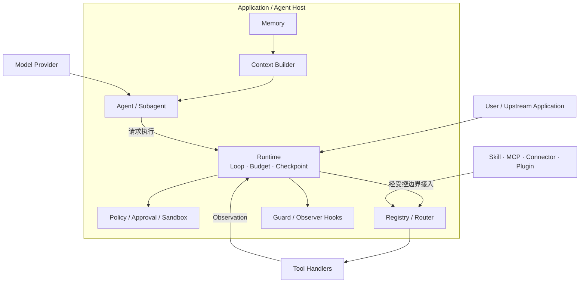
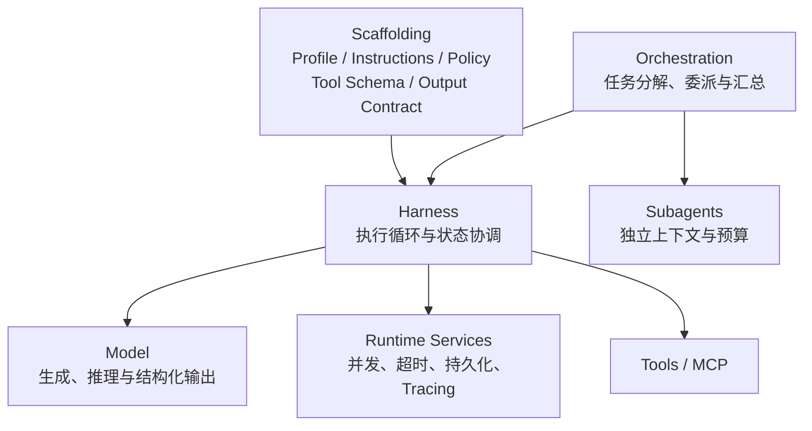
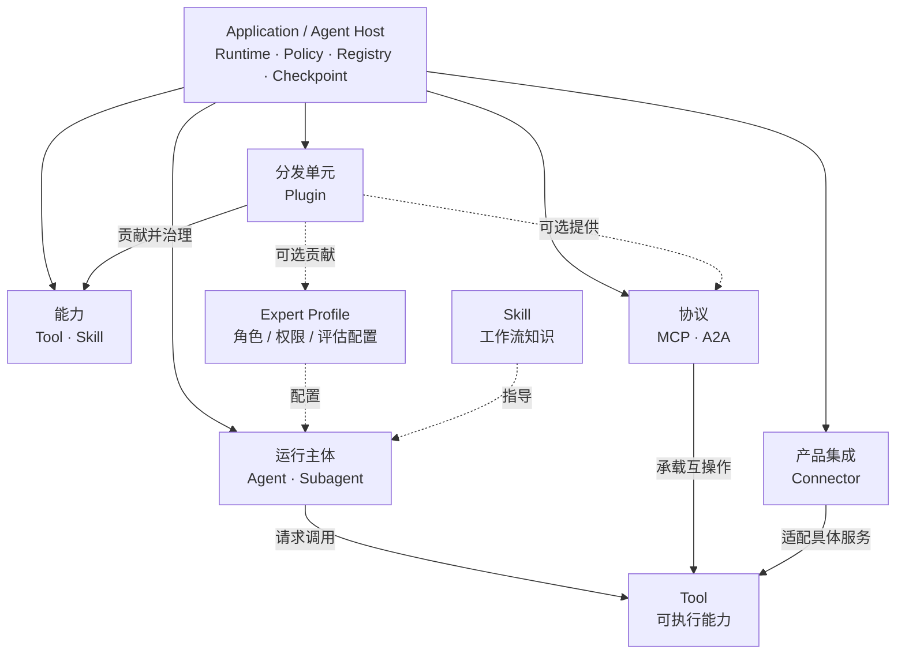
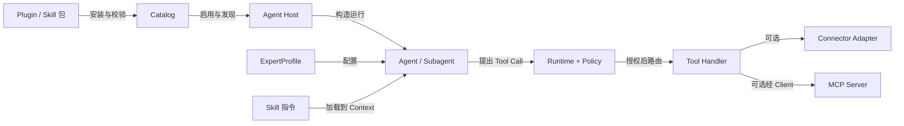
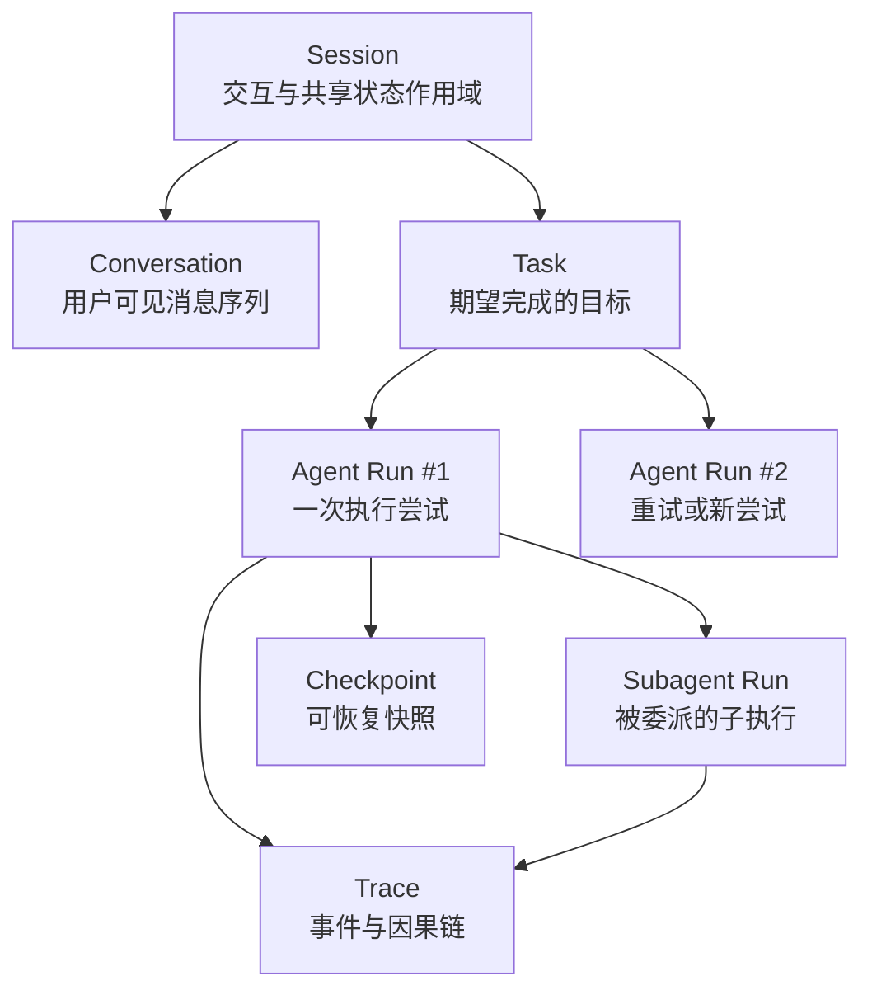
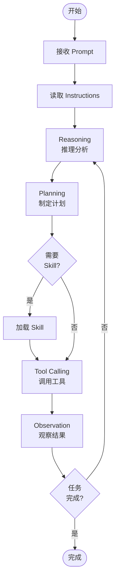
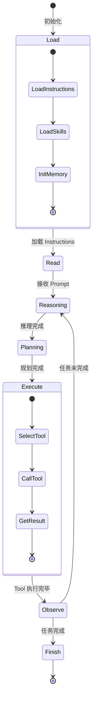
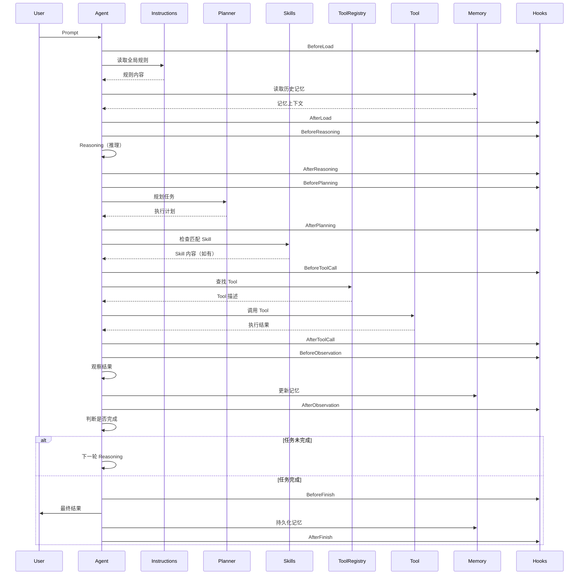

# 第 2 章：总体架构与生命周期

> **难度等级：** ⭐⭐⭐
> **所属模块：** 第一部分：基础认知
> **来源可信度：** 官方文档 / 源码 / 论文 / 推导 / 观点
> **状态：** ✅ 已完成

---

## 学习目标

完成本章学习后，你将能够：

1. 理解 AI Agent 的完整架构及各组件职责
2. 掌握 Agent 主循环的完整流程
3. 理解 Agent 生命周期的 7 个关键阶段
4. 理解各组件之间的交互时序
5. 建立从整体架构到具体组件的认知框架
6. 使用“运行主体、能力、协议、产品集成、分发单元”分类相邻概念

---

## 前置知识

- 阅读第 1 章「AI Agent 简介与历史演进」
- 了解 Agent 核心概念的基本定义

---

## 1. 背景

### 1.1 为什么需要理解总体架构

在学习具体组件（Tools、Memory、Hooks 等）之前，必须先建立对 Agent 整体架构的认知。这就像在建造一座房子时，你需要先看建筑设计图，而不是直接从某个房间的装修开始。

理解总体架构可以帮助你回答以下问题：

- Agent 有哪些核心组件？它们之间的关系是什么？
- 一个用户请求如何从输入变成最终输出？
- 每个组件在什么时机被调用？承担什么职责？
- 如果要自己实现一个 Agent，需要设计哪些模块？

> **来源类型：** 推导分析 —— 基于对主流 Agent 框架（Claude Code、OpenAI Agents SDK、LangGraph）的共性架构归纳

### 1.2 架构设计的核心原则

现代 AI Agent 的架构设计遵循以下核心原则：

1. **关注点分离（Separation of Concerns）：** 推理、规划、执行、记忆各自独立
2. **可扩展性（Extensibility）：** 通过 Plugin、MCP 等机制动态扩展能力
3. **可观测性（Observability）：** 通过 Hooks 暴露生命周期事件
4. **可组合性（Composability）：** 组件可独立替换和组合

---

## 2. 核心概念

### 2.1 整体架构

现代 AI Agent 的架构由以下核心组件构成：



> **图 2-1：** Agent 应用运行架构。Host 是组合与治理边界，Agent/Subagent 是运行主体；Runtime 驱动循环并通过 Policy、Registry 和 Sandbox 执行 Tool，扩展只能经受控边界接入。

### 2.2 组件职责总览

| 组件 | 职责 | 类比 |
|------|------|------|
| Agent Host | 提供 Runtime、Policy、Registry、Checkpoint 与扩展生命周期 | 受治理的工作环境 |
| Agent / Subagent | 接收目标并执行决策循环的运行主体 | 员工 / 被委派的协作者 |
| Prompt | 承载当前任务目标 | 用户说的话 |
| Instructions | Host 按作用域、优先级和当前策略组装的较稳定行为约束 | 员工手册 |
| Reasoning | 基于上下文进行逻辑推理 | 大脑思考 |
| Planning | 将复杂任务分解为可执行步骤 | 制定计划 |
| Memory | 存储和检索历史信息 | 记忆 |
| Tool Calling | 调用外部工具执行操作 | 使用工具 |
| Skills | 可复用工作流模板 | 操作手册 |
| Hooks | 生命周期事件回调 | 监控告警 |
| MCP | 连接外部 Tool、Resource、Prompt 等能力的互操作协议 | 外部能力接口标准 |
| Connector | 接入具体产品的身份、授权、端点与数据映射 | 某个服务的接入适配器 |
| Plugin | 安装、版本化、启停和分发一组 Host 扩展 | 可治理的扩展包 |

> **来源类型：** 推导分析 —— 基于 Claude Code、OpenAI Agents SDK 等框架的组件设计

### 2.3 组件间的关系

各组件的核心关系可以概括为：

- **Prompt + Instructions → Agent 的输入约束**
- **Reasoning + Planning → Agent 的决策层**
- **Tool + Skill → Agent 可请求使用的能力层**
- **MCP → Host 与独立 Server 互操作的协议层**
- **Connector → Host 接入具体产品的集成层**
- **Plugin → Host 安装和治理扩展的分发层**
- **Memory → Agent 的状态层**
- **Hooks → Agent 的横切关注点**
- **Agent Host → 运行并治理 Agent/Subagent，而不是替代 Agent 做业务决策**

### 2.4 Scaffolding、Harness、Runtime 与 Orchestration

这些术语经常被混用，但它们描述的是不同层次；也没有一套被所有框架共同采用的严格定义。本书使用下图和下表作为工程讨论中的工作定义。



> **图 2-5：** 从静态配置到单 Agent 执行，再到多 Agent 编排的职责边界。图中是工程抽象，不代表任一产品的内部实现。

| 术语 | 本书中的工作定义 | 不应误解为 |
|------|------------------|-------------|
| Model | 负责理解、生成与结构化输出的模型能力 | 单独完成权限、状态或工具执行的完整 Agent |
| Scaffolding | 影响行为的静态或缓慢变化的配置：Profile、Instructions、Policy、Tool Schema、输出契约等 | 每轮任务都动态产生的计划或上下文 |
| Harness | 驱动模型调用、工具循环、状态更新和终止条件的执行骨架 | 所有框架都公开存在同名模块 |
| Runtime | Harness 依赖的运行时服务，如并发、超时、持久化、资源管理和 Tracing | 仅等同于主循环 |
| Orchestration | 在多个 Agent 或工作流之间做分解、调度、汇总和故障处理 | 只要有多个 Prompt 就天然具备编排能力 |

`Profile` 和 `Policy` 更适合作为 Scaffolding 的组成部分：前者描述角色与职责，后者定义权限、人工确认和安全边界。简单单 Agent 可以把 Harness 与 Runtime 放在同一个类中；出现并发、恢复或子代理后，再拆分这些边界通常更容易维护。

> **来源类型：** 推导分析 —— 基于 Agent 工程中的常用术语和本书第 3、12、16、18 章的职责划分

### 2.5 Model Layer：能力、选择与可替换性

模型是 Agent 的推理与生成核心，但生产系统不应把“某个模型名称”当成架构。Harness 应面向能力约束来选择和调用模型，并通过 Provider 适配层隔离不同 API 的消息格式、Tool Calling、Token 统计和流式协议。

| 选择维度 | 需要问的问题 | 常见架构影响 |
|----------|--------------|--------------|
| 任务质量 | 是否需要复杂推理、代码理解、多模态或严格结构化输出？ | 决定默认模型、评估集和回退模型 |
| Tool 能力 | 是否可靠支持结构化 Tool 调用、并行调用或流式结果？ | 决定 Tool Schema 和执行循环的适配范围 |
| 上下文与知识 | 任务需要多长上下文，是否要先检索或压缩？ | 影响 Context Manager 与 RAG 策略 |
| 延迟与成本 | 哪些任务需要低延迟，哪些可用更高推理预算？ | 决定模型路由、缓存、预算与超时 |
| 数据与部署 | 数据能否离开边界，是否需要区域、本地或私有部署？ | 影响 Provider 选择、审计和降级方案 |

推荐为每个关键任务定义“可接受能力”而非绑定单一供应商：例如要求 JSON Schema 校验通过、首字延迟不超过目标、失败可切换到兼容模型。模型路由是优化手段，不应绕过 Guardrails、权限检查或统一评估。

> **来源类型：** 推导分析 —— 基于第 4、6、12、18、19 章的上下文、Tool、运行时、成本和评估要求

### 2.6 五类正交概念：主体、能力、协议、集成与分发

Agent 生态中的名词不能排成一棵“从大到小”的包含树。它们回答的是五个不同问题，因此应作为正交概念理解：

| 分类 | 回答的问题 | 本书中的概念 | 主要展开章节 |
|------|------------|--------------|--------------|
| 运行主体（Runtime Subject） | 谁在接收目标并运行决策循环？ | Agent、Subagent | 第 1、2、15～16 章 |
| 能力（Capability） | 主体知道怎么做或可以调用什么？ | Skill、Tool | 第 6、11～12 章 |
| 协议（Protocol） | Host 如何与独立系统交换能力和上下文？ | MCP；跨系统协作场景中的 A2A | 第 13、15 章 |
| 产品集成（Product Integration） | 如何接入某个具体服务及其身份、授权和数据映射？ | Connector | 第 13 章 |
| 分发单元（Distribution Unit） | 如何安装、版本化、启停和分发一组扩展？ | Plugin | 第 14 章 |



> **图 2-6：** 五类正交概念及其关系。`AgentHost` 是宿主，不是运行主体；Expert Profile 是配置，不是另一种执行层；MCP 是协议，Connector 是具体产品集成，Plugin 是分发和生命周期边界。

关键边界如下：

- `AgentHost ≠ Agent`：Host 提供 Runtime、Policy、Registry、Sandbox 和状态服务，Agent 是其中运行的决策主体。
- `Expert Profile ≠ Subagent`：Expert Profile 可配置顶层 Agent 或 Subagent；Subagent 描述父子委派关系。
- `Skill ≠ Tool`：Skill 提供按需加载的工作流知识，Tool 提供受 Runtime 治理的可执行能力；Skill 不直接绕过 Runtime 执行脚本。
- `Connector ≠ MCP`：Connector 可以使用 MCP、REST、SDK 或数据同步实现；MCP 不绑定某个具体 SaaS 产品。
- `Plugin ≠ Tool`（也不等于任一 Capability）：Plugin 可以打包 Tool、Skill、Hook、Connector 预设或 Subagent 定义，但安装 Plugin 不代表这些能力已获运行授权。

这套分类是后续章节的导航框架，不要求所有产品都使用相同名称。遇到新概念时，先判断它在回答“谁运行、能做什么、如何通信、接入哪个产品、如何分发”中的哪一个问题。

#### 2.6.1 本书统一概念树

下面的树是阅读导航，不是面向对象继承树，也不表示父节点自动拥有子节点权限：

```text
Application / Agent Host
├── 运行主体（Runtime Subject）
│   ├── Agent
│   └── Subagent
├── 角色配置（Role Configuration）
│   └── ExpertProfile
├── 能力（Capability）
│   ├── Tool
│   └── Skill
├── 协议（Protocol）
│   └── MCP
├── 产品集成（Product Integration）
│   └── Connector
└── 分发单元（Distribution Unit）
    └── Plugin
```

这里的 `Application / Agent Host` 是组合与治理边界；五类概念和角色配置都由它托管、解析或连接。`ExpertProfile` 单独列出，是因为“用什么角色配置一次运行”既不是运行主体，也不是可执行能力。

#### 2.6.2 同一个扩展从安装到执行经过什么



> **图 2-7：** 从分发、发现到运行和执行的完整边界。Skill 中即使附带脚本，也只能要求 Agent 经 Runtime 暴露的文件、命令或专用 Tool 执行；Skill Loader 不直接运行脚本。

| 阶段 | 主要对象 | 必须回答的治理问题 |
|------|----------|--------------------|
| 安装 | Plugin、Skill、Connector 配置 | 来源是否可信、版本是否兼容、完整性是否通过 |
| 启用 | Plugin、Connector、MCP Server | 当前作用域是否允许，依赖与认证是否就绪 |
| 发现 | Skill 元数据、Tool Schema、ExpertProfile | 本次运行应看到哪些候选项，名称如何消歧 |
| 装载 | Skill 正文、Profile、Tool 快照 | 内容是否可信，权限是否按父子关系收窄 |
| 调用 | Agent/Subagent → Runtime → Tool | 参数、策略、审批、沙箱、超时是否通过 |
| 观测 | Observation、Trace、Checkpoint | 结果是否脱敏、可追踪、可恢复与可撤销 |

因此，`安装成功 ≠ 已启用 ≠ 对本次运行可见 ≠ 获准调用`。这一分层贯穿第 9、11～16 章。

### 2.7 Task、Run、Session、Checkpoint 与 Trace

“用户在聊什么”“系统正在执行什么”和“从哪里恢复”必须使用不同标识：



> **图 2-8：** 交互、目标、执行、恢复和观测对象的身份关系。一个 Session 可承载多个 Task/Run；一次 Run 可产生多个 Checkpoint 和子 Run，并共同进入 Trace。

| 对象 | 身份与生命周期 | 不应混同 |
|------|----------------|----------|
| Task | 用户或上游提交的目标；可以被取消、重试或拆分 | Prompt 文本、某次执行尝试 |
| Agent Run | Agent 对 Task 的一次有开始、终态和预算的执行尝试 | Session、Agent 定义 |
| Subagent Run | 带 `parent_run_id` 和委派契约的子执行 | ExpertProfile、普通函数调用 |
| Session | 多轮交互、身份和可共享状态的作用域 | 单次 Run、永久 Memory |
| Conversation | Session 中面向参与者的消息序列 | 完整 Runtime 状态或 Trace |
| Checkpoint | 某个 Run 在某个 revision 的可恢复快照 | Memory、备份、审计日志 |
| Trace | Run/子 Run/Tool 调用的因果与观测事件链 | 可直接恢复的状态快照 |

`resume` 从兼容 Checkpoint 继续未完成 Run；`replay` 读取或重演既有事件，默认不得再次产生外部副作用。`task_id` 用于业务目标，`run_id` 标识一次尝试，`idempotency_key` 用于下游副作用去重，三者不能复用为同一个概念。

> **来源类型：** Fact + 工程推导 —— A2A 官方规范用 `contextId` 组合多个 Task，并为 Task 分配独立 ID；本书据此区分 Session/Context 与 Task，再为 Host 内部可恢复尝试定义 `run_id`。Trace/Span 的父子因果语义可与 OpenTelemetry 对齐，但 OpenTelemetry 是通用可观测性标准，不是 Agent 框架，也不定义 Task、Run 或 Session。

### 2.8 Workflow、Agent 与 Orchestrator

| 类型 | 谁决定下一步 | 适合场景 | 主要风险 |
|------|--------------|----------|----------|
| Workflow | 代码、DAG 或状态机 | 稳定流程、合规步骤、可重复批处理 | 分支爆炸、适应性不足 |
| Agent | 模型基于 Context 和 Observation 动态决策 | 开放式分析、工具选择、未知步骤 | 不确定性、成本与权限扩大 |
| Agentic Workflow | Workflow 固定外层边界，Agent 只在指定节点决策 | 既要治理又要局部适应的生产任务 | 两套状态与错误语义需对齐 |
| Orchestrator | 调度 Workflow、Agent Run 或外部 Job | 并发、依赖、委派、汇总与补偿 | 中央复杂度和状态一致性 |

`Workflow ≠ Agent`，Planner 生成的一次 Plan 也不等于稳定的 Workflow 定义。能由确定性步骤可靠完成的流程，应先使用 Workflow；只有步骤无法预先穷举、确实需要基于观察动态选择时才引入 Agent。Orchestrator 可以调度 Agent，但自身不必是 Agent。

### 2.9 七类工程实践导航

五类正交概念描述“系统里有什么”，工程实践描述“设计者在优化什么”。两套分类不能互相替代：

| 工程实践 | 核心设计对象 | 主要章节 | 不应误解为 |
|----------|--------------|----------|------------|
| Prompt Engineering | 单次任务、示例与输出契约 | 第 3 章 | 只靠措辞解决权限和事实问题 |
| Context Engineering | 模型可见的 Instructions、Skill、Memory、证据、Schema 与预算 | 第 3、4、8、12 章 | 把所有信息塞进长窗口 |
| Tool Engineering | Tool Schema、Handler、Observation、副作用和幂等 | 第 6、11、13 章 | Function Calling 自动执行函数 |
| Workflow Engineering | DAG、状态机、确定性业务步骤与补偿 | 第 5、15 章 | 每个 Workflow 都必须由 Agent 决策 |
| Harness Engineering | 单次 Run 的 Runtime、工作区、Tool、Policy、Sandbox、反馈和恢复 | 第 9～11、16～17 章 | Agent Host 产品组件的同义词 |
| Loop Engineering | 跨 Run 的 Trigger、Dispatch、Verifier、State、Budget、Stop 与 Human Gate | 第 9、16～18 章 | Agent 内部 `while` 循环或无限自治 |
| Agentic Engineering | 上述实践与评估、安全、部署、运维的系统组合 | 全书，重点第 16～18 章 | 一项位于演进链末端的新组件 |

这些实践通常同时存在。例如，一个 Coding Agent 的单次 Run 需要 Prompt、Context、Tool 与 Harness；定时扫描 Issue、为每项工作创建隔离 Run、独立验证并在人工门禁处停止，则进一步需要 Loop Engineering。

---

## 3. Agent 主循环

### 3.1 主循环流程

Agent 的主循环（Agent Loop）是 Agent 运行的核心机制：



> **图 2-2：** Agent 主循环。从 Prompt 到 Reasoning → Planning → Tool Calling → Observation 的循环，直到任务完成。

### 3.2 主循环各阶段详解

**阶段 1：接收 Prompt**

用户输入 Prompt，Agent 开始处理。Prompt 是当前任务的描述，可能包含具体指令、上下文信息或预期输出格式。

**阶段 2：读取 Instructions**

Agent 读取全局 Instructions（System Prompt 的一部分）。Instructions 定义 Agent 的行为准则，如「始终使用中文回复」「不要编造信息」「遇到不确定的情况请询问用户」。

**阶段 3：Reasoning（推理）**

Agent 基于当前上下文（Prompt + Instructions + 历史对话 + Memory）进行推理。推理的目标是分析任务需求、确定需要哪些信息、判断是否需要调用工具。

**阶段 4：Planning（规划）**

如果任务较为复杂，Agent 需要制定执行计划。规划可以是：
- 隐式规划（模型内部推理）
- 显式规划（输出结构化的步骤列表）
- 动态规划（根据执行结果调整计划）

**阶段 5：Skill 匹配（可选）**

Agent 检查是否有匹配的 Skill 可以指导当前任务。Skill 提供工作流模板，告诉 Agent 如何处理特定类型的任务。注意：Skill 是读取，不是调用——Agent 将 Skill 内容加载到上下文中作为参考。

**阶段 6：Tool Calling（工具调用）**

Agent 调用 Tool 执行具体操作。Tool 可以是：
- Built-in Tool：框架内置工具（如文件读写、搜索）
- MCP Tool：通过 MCP 协议发现的第三方工具

**阶段 7：Observation（观察）**

Agent 接收 Tool 的执行结果。Observation 是下一轮 Reasoning 的输入，Agent 基于结果判断任务是否完成，或是否需要调整策略。

**阶段 8：循环判断**

Agent 判断任务是否完成。如果完成，输出最终结果；如果未完成，回到 Reasoning 阶段，基于新的 Observation 继续推理。

> **来源类型：** 推导分析 —— 基于 ReAct 论文 (Yao et al., 2022) 和 Claude Code 的实际执行流程

### 3.3 主循环的终止条件

Agent 主循环不会无限进行。终止条件包括：

1. **任务完成：** Agent 判断任务已完成
2. **最大步数：** 达到预设的最大循环次数
3. **超时：** 执行时间超过限制
4. **用户中断：** 用户主动停止
5. **错误终止：** 遇到不可恢复的错误

---

## 4. 生命周期

### 4.1 生命周期状态机

Agent 的生命周期可以用以下状态机描述：



> **图 2-3：** Agent 生命周期状态机。7 个阶段：Load → Read → Reasoning → Planning → Execute → Observe → Finish。

### 4.2 生命周期各阶段详解

#### 阶段 1：Load（加载）

Agent 启动时加载必要的资源：

- Instructions（全局规则）
- Skills 索引（可用工作流模板列表）
- Memory 数据（如果有持久化记忆）
- Tool Registry（注册可用工具）

> **来源类型：** 推导分析 —— 基于 Claude Code 的初始化流程

#### 阶段 2：Read（读取）

Agent 读取当前上下文：

- 用户 Prompt
- Instructions（由 Host 按当前作用域与策略组装）
- 历史对话（如果有）
- 加载的 Skill 内容（如果有匹配的 Skill）

#### 阶段 3：Reasoning（推理）

Agent 基于完整上下文进行推理：

- 分析任务需求和约束
- 确定需要的信息和工具
- 评估当前状态和下一步方向

#### 阶段 4：Planning（规划）

Agent 制定执行计划：

- 将复杂任务分解为子任务
- 确定每个子任务需要的工具
- 设定执行顺序和依赖关系

#### 阶段 5：Execute（执行）

Agent 调用工具执行操作：

- 选择最合适的 Tool
- 构造 Tool 调用参数
- 执行 Tool 调用
- 处理执行错误

#### 阶段 6：Observe（观察）

Agent 处理 Tool 执行结果：

- 解析执行结果
- 评估结果质量
- 更新 Memory 和上下文
- 判断是否需要重试或调整

#### 阶段 7：Finish（完成）

Agent 完成所有任务：

- 输出最终结果
- 更新 Memory（持久化）
- 触发完成 Hook
- 释放资源

---

## 5. 组件交互时序

### 5.1 完整交互时序



> **图 2-4：** 组件交互时序图。展示从 Prompt 到 Finish 的完整交互顺序，以及 Hooks 在生命周期中的拦截点。

---

## 6. 最小可运行示例

### 6.1 Agent 主循环实现

以下代码展示了 Agent 主循环的教学实现：

```python
"""
Agent 主循环教学实现
运行环境：Python 3.10+
依赖：无
预期输出：Agent 完整执行一次推理-规划-执行-观察循环
"""

from dataclasses import dataclass, field
from enum import Enum, auto
from typing import Callable, Optional


class AgentState(Enum):
    """Agent 生命周期状态"""
    LOAD = auto()
    READ = auto()
    REASONING = auto()
    PLANNING = auto()
    EXECUTE = auto()
    OBSERVE = auto()
    FINISH = auto()


@dataclass
class Tool:
    """工具定义"""
    name: str
    description: str
    func: Callable


@dataclass
class AgentConfig:
    """Agent 配置"""
    max_steps: int = 10
    timeout_seconds: int = 30
    instructions: str = ""


@dataclass
class AgentMemory:
    """Agent 记忆"""
    messages: list[str] = field(default_factory=list)
    tool_results: list[str] = field(default_factory=list)

    def add_message(self, msg: str):
        self.messages.append(msg)

    def add_result(self, result: str):
        self.tool_results.append(result)


class AgentRuntime:
    """Agent 运行时 - 完整主循环实现"""

    def __init__(self, config: AgentConfig):
        self.config = config
        self.state = AgentState.LOAD
        self.memory = AgentMemory()
        self.tools: dict[str, Tool] = {}
        self.hooks: dict[str, list[Callable]] = {
            "before_reasoning": [],
            "after_reasoning": [],
            "before_tool_call": [],
            "after_tool_call": [],
            "before_finish": [],
        }
        self.step_count = 0

    # ── Hook 系统 ──────────────────────────────

    def register_hook(self, event: str, callback: Callable):
        """注册生命周期钩子"""
        if event in self.hooks:
            self.hooks[event].append(callback)

    def _trigger_hooks(self, event: str, *args):
        """触发钩子"""
        for hook in self.hooks.get(event, []):
            hook(*args)

    # ── Tool 管理 ──────────────────────────────

    def register_tool(self, tool: Tool):
        """注册工具"""
        self.tools[tool.name] = tool

    # ── 生命周期阶段 ──────────────────────────

    def _load(self):
        """Load 阶段：加载资源"""
        self.state = AgentState.LOAD
        self.memory.add_message(f"[Load] Agent 启动，指令: {self.config.instructions[:50]}...")

    def _read(self, prompt: str):
        """Read 阶段：读取上下文"""
        self.state = AgentState.READ
        self.memory.add_message(f"[Read] 接收 Prompt: {prompt}")

    def _reasoning(self, prompt: str) -> str:
        """Reasoning 阶段：推理分析"""
        self.state = AgentState.REASONING
        self._trigger_hooks("before_reasoning", prompt)

        # 简化的推理逻辑：分析任务类型
        if "搜索" in prompt or "查询" in prompt:
            thought = "需要调用搜索工具获取信息"
        elif "计算" in prompt:
            thought = "需要调用计算工具"
        else:
            thought = f"分析任务: {prompt}，确定执行策略"

        self.memory.add_message(f"[Reasoning] {thought}")
        self._trigger_hooks("after_reasoning", thought)
        return thought

    def _planning(self, thought: str) -> list[str]:
        """Planning 阶段：制定计划"""
        self.state = AgentState.PLANNING

        # 简化的规划逻辑
        steps = [
            "Step 1: 确定所需工具",
            "Step 2: 调用工具执行",
            "Step 3: 检查执行结果",
            "Step 4: 评估任务完成度",
        ]
        self.memory.add_message(f"[Planning] 制定 {len(steps)} 步执行计划")
        return steps

    def _execute(self, step: str) -> str:
        """Execute 阶段：执行操作"""
        self.state = AgentState.EXECUTE
        self._trigger_hooks("before_tool_call", step)

        # 模拟工具调用
        result = f"执行完成: {step}"

        self._trigger_hooks("after_tool_call", step, result)
        return result

    def _observe(self, result: str) -> bool:
        """Observe 阶段：观察结果，返回是否完成"""
        self.state = AgentState.OBSERVE
        self.memory.add_result(result)

        # 简化判断：如果执行了所有步骤则完成
        self.step_count += 1
        return self.step_count >= self.config.max_steps

    def _finish(self) -> str:
        """Finish 阶段：输出结果"""
        self.state = AgentState.FINISH
        self._trigger_hooks("before_finish")

        summary = "\n".join(self.memory.messages + self.memory.tool_results)
        return f"任务完成。\n执行摘要:\n{summary}"

    # ── 主循环 ──────────────────────────────

    def run(self, prompt: str) -> str:
        """Agent 主循环"""
        self._load()
        self._read(prompt)

        while self.step_count < self.config.max_steps:
            # Reasoning
            thought = self._reasoning(prompt)

            # Planning
            plan = self._planning(thought)

            # Execute + Observe
            for step in plan:
                result = self._execute(step)
                task_complete = self._observe(result)

                if task_complete:
                    return self._finish()

        return self._finish()


if __name__ == "__main__":
    # 创建 Agent 配置
    config = AgentConfig(
        max_steps=5,
        instructions="你是一个友好的助手，始终使用中文回复。"
    )

    # 创建 Agent
    agent = AgentRuntime(config)

    # 注册一个日志 Hook
    agent.register_hook(
        "before_tool_call",
        lambda step: print(f"[Hook] 即将执行: {step}")
    )
    agent.register_hook(
        "after_tool_call",
        lambda step, result: print(f"[Hook] 执行完成: {step}")
    )

    # 注册一个工具
    agent.register_tool(Tool(
        name="search",
        description="搜索信息",
        func=lambda q: f"搜索结果: {q}"
    ))

    # 运行 Agent
    result = agent.run("搜索今天的天气")
    print("=" * 50)
    print(result)
    print("=" * 50)
    print(f"最终状态: {agent.state}")
    print(f"执行步数: {agent.step_count}")
```

**预期输出：**

```
[Hook] 即将执行: Step 1: 确定所需工具
[Hook] 执行完成: Step 1: 确定所需工具
[Hook] 即将执行: Step 2: 调用工具执行
[Hook] 执行完成: Step 2: 调用工具执行
[Hook] 即将执行: Step 3: 检查执行结果
[Hook] 执行完成: Step 3: 检查执行结果
[Hook] 即将执行: Step 4: 评估任务完成度
[Hook] 执行完成: Step 4: 评估任务完成度
[Hook] 即将执行: Step 1: 确定所需工具
[Hook] 执行完成: Step 1: 确定所需工具
==================================================
任务完成。
执行摘要:
[Load] Agent 启动，指令: 你是一个友好的助手，始终使用中文回复。...
[Read] 接收 Prompt: 搜索今天的天气
[Reasoning] 需要调用搜索工具获取信息
[Planning] 制定 4 步执行计划
执行完成: Step 1: 确定所需工具
执行完成: Step 2: 调用工具执行
执行完成: Step 3: 检查执行结果
执行完成: Step 4: 评估任务完成度
[Reasoning] 需要调用搜索工具获取信息
[Planning] 制定 4 步执行计划
执行完成: Step 1: 确定所需工具
==================================================
最终状态: AgentState.FINISH
执行步数: 5
```

> **运行方式：** 本章代码为架构演示的简化实现，完整可运行版本见 `examples/hello-agent/python/main.py`

---

## 7. 最佳实践

1. **先理解架构，再深入细节：** 在阅读后续章节之前，确保对整体架构有清晰认知。每学一个新组件，都在整体架构图中定位它的位置。
2. **关注生命周期：** 理解每个组件在生命周期中的激活时机。这有助于理解组件之间的依赖关系和交互顺序。
3. **使用 Hooks 做可观测性：** 在 Agent 开发中，通过 Hooks 记录关键生命周期事件，便于调试和监控。
4. **控制循环深度：** 始终设置最大步数和超时时间，防止 Agent 陷入无限循环。
5. **保持组件职责单一：** 每个组件只做一件事。不要让 Planning 组件直接操作 Memory，不要让 Hooks 包含业务逻辑。

---

## 8. 反模式

| 反模式 | 风险 | 推荐方案 |
|--------|------|---------|
| 单体 Agent 设计 | 所有逻辑耦合在一起，难以维护和测试 | 遵循关注点分离，组件化设计 |
| 无限制循环 | Agent 无限执行，消耗资源 | 设置最大步数、超时、Token 预算 |
| 跳过 Planning 阶段 | 复杂任务执行效率低，容易出错 | 为复杂任务显式规划步骤 |
| 忽略 Observation | 不评估 Tool 执行结果，盲目继续 | 每次 Tool 调用后必须评估结果 |
| Hooks 承担业务逻辑 | 耦合严重，难以调试 | Hooks 只做横切关注点（日志、监控、权限） |

---

## 9. FAQ

### Q: Agent 主循环和 ReAct 循环是什么关系？

Agent 主循环（Reasoning → Planning → Tool Calling → Observation）是 ReAct 循环（Thought → Action → Observation）的工程化扩展。ReAct 提供了基础范式，Agent 主循环在此基础上增加了 Planning（显式规划）、Skills（工作流模板）、Hooks（生命周期管理）等工程化组件。

### Q: 为什么需要显式的 Planning 阶段？

对于简单任务，模型可以隐式规划（在推理中完成）。但对于复杂多步骤任务，显式规划可以：
- 提高执行效率（避免反复试错）
- 提高可解释性（用户可以看到执行计划）
- 便于错误恢复（某步失败时从失败步骤重试）

### Q: Agent 生命周期和 Web 请求生命周期有什么相似之处？

两者都遵循「请求 → 处理 → 响应」的模式，但 Agent 生命周期是循环的（处理可能多次迭代），而 Web 请求通常是线性的。Agent 的 Hooks 类似于 Web 框架的 Middleware，都是在关键节点提供拦截能力。

### Q: 如何判断 Agent 是否「完成任务」？

这是一个开放问题。常见策略包括：
- 模型自主判断（通过特定的 finish reason）
- 达到最大步数上限
- 连续 N 轮没有新的 Tool 调用
- 用户定义的完成条件（如特定 Tool 返回成功标记）

---

## 10. 官方参考

| 编号 | 来源 | 类型 | 说明 |
|------|------|------|------|
| REF-1 | [ReAct Paper](https://arxiv.org/abs/2210.03629) (Yao et al., 2022) | 论文 | Agent 循环的基础范式 |
| REF-2 | [OpenAI Agents SDK](https://github.com/openai/openai-agents-python) | 源码 | Agent Runtime 的参考实现 |
| REF-3 | [Anthropic Claude Code Architecture](https://docs.anthropic.com/en/docs/claude-code) | 官方文档 | Claude Code 的架构设计 |
| REF-4 | [LangGraph Documentation](https://langchain-ai.github.io/langgraph/) | 官方文档 | 图状态机在 Agent 中的应用 |

---

## 11. 延伸阅读

- [Agent Design Patterns](https://arxiv.org/abs/2401.03568) —— Agent 设计模式综述
- [Building Effective Agents](https://www.anthropic.com/research/building-effective-agents) —— Anthropic 的 Agent 构建指南
- [OpenAI Agents SDK Lifecycle](https://openai.github.io/openai-agents-python/) —— Agent 生命周期的参考实现

---

## 本章小结

总体架构的核心是职责分离：Prompt 表达任务，Instructions 约束行为，Planner 组织步骤，Tool 执行动作，Memory 保存状态，Runtime 协调整个生命周期。组件是否需要独立，取决于替换、测试、恢复和治理需求，而不是架构图是否足够复杂。

---

## 本章 Checklist

- [ ] 能画出 Agent 整体架构图
- [ ] 理解核心组件的职责和关系
- [ ] 能用五类正交概念区分 Agent、Subagent、Tool、Skill、MCP、Connector 与 Plugin
- [ ] 能描述 Agent 主循环的 8 个阶段
- [ ] 理解生命周期的 7 个状态及转换条件
- [ ] 能画出组件交互时序图
- [ ] 运行了 Agent 主循环示例代码
- [ ] 理解 Hooks 在生命周期中的位置
- [ ] 知道如何设置循环终止条件
