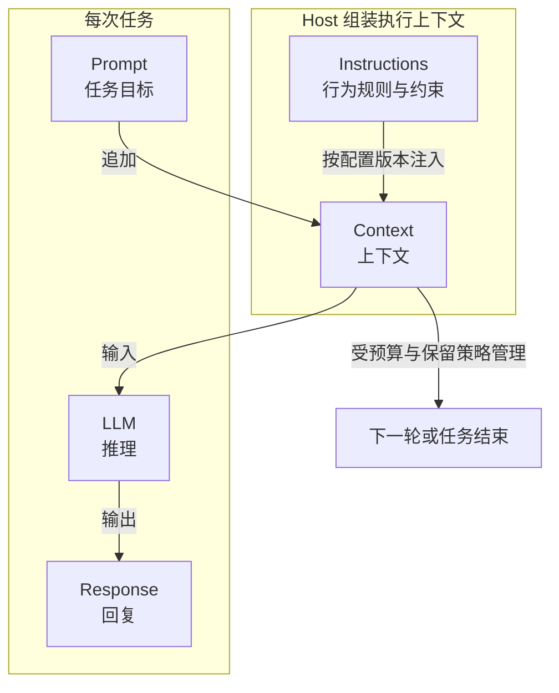
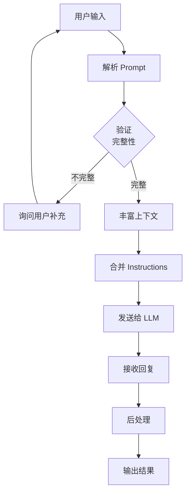

# 第 3 章：Prompt 与 Instructions

> **难度等级：** ⭐⭐
> **所属模块：** 第一部分：基础认知
> **来源可信度：** 官方文档 / 论文 / 推导 / 观点
> **状态：** ✅ 已完成

---

## 学习目标

完成本章学习后，你将能够：

1. 理解 Prompt 和 Instructions 的本质区别及其在 Agent 架构中的不同定位
2. 掌握 System Prompt 的设计原则和最佳实践
3. 理解 Instructions 的加载时机、作用域和生命周期
4. 设计结构化的 Prompt 模板
5. 避免 Prompt 和 Instructions 混淆的常见反模式

---

## 前置知识

- 阅读第 1 章「AI Agent 简介与历史演进」
- 阅读第 2 章「总体架构与生命周期」
- 了解 LLM 的基本使用方式

---

## 1. 背景

### 1.1 为什么需要区分 Prompt 和 Instructions

在 Agent 架构中，有两个概念经常被混淆：Prompt 和 Instructions。它们在功能、加载时机、作用范围和生命周期上有着本质区别。

**Prompt 是「这次要做什么」。** 它是用户输入的任务目标，每次对话都可能不同。例如：「帮我搜索今天的天气」「写一个排序函数」「分析这段代码的性能问题」。

**Instructions 是「应该怎么做」。** 它是 Agent 的跨任务行为准则，由 Host 按应用、项目、租户或 Session 配置在执行前注入。很多实现会在 Session 中复用它，但也可能在每次调用时按当前策略重建。例如：「始终使用中文回复」「不要编造信息」「遇到不确定的情况请询问用户」「优先使用官方文档作为信息来源」。

混用这两者会导致严重问题：如果在 Prompt 中重复描述行为准则，会导致上下文膨胀；如果 Instructions 写得过于具体，会限制 Agent 的灵活性。

> **来源类型：** 推导分析 —— 基于 Claude Code、OpenAI Agents SDK 等框架的实际设计模式

### 1.2 设计哲学

Prompt 和 Instructions 的分离体现了 Agent 架构中的核心设计原则：**关注点分离（Separation of Concerns）**。

- **Prompt 是变量**，随任务变化
- **Instructions 是相对稳定的版本化配置**，不应被临时任务随意覆盖

这种分离使得：
- Instructions 可以被复用、版本化、独立测试
- Prompt 可以保持简洁，聚焦于当前任务
- Agent 的行为可预测、可配置

> **来源类型：** 作者观点 —— 基于对主流 Agent 框架设计模式的归纳

---

## 2. 核心概念

### 2.1 Prompt 的构成

一个结构化的 Prompt 通常包含以下要素：

| 要素 | 说明 | 示例 |
|------|------|------|
| 任务描述 | 要完成什么 | 「帮我写一个 Python 排序函数」 |
| 上下文信息 | 任务相关的背景 | 「这个函数将用于处理百万级数据」 |
| 约束条件 | 特殊要求 | 「时间复杂度 O(n log n)，空间复杂度 O(1)」 |
| 输出格式 | 期望的输出形式 | 「请输出完整的 Python 代码，包含注释」 |
| 示例（可选） | Few-shot 示例 | 提供一个排序函数的示例 |

### 2.2 Instructions 的构成

Instructions 通常包含以下要素：

| 要素 | 说明 | 示例 |
|------|------|------|
| 角色定义 | Agent 的身份 | 「你是一个资深的 Python 开发者」 |
| 行为准则 | 行为规范 | 「始终编写可读性高的代码」 |
| 安全规则 | 安全边界 | 「不要执行危险操作」 |
| 工具使用规则 | 何时使用 Tool | 「当需要实时数据时，使用搜索工具」 |
| 输出风格 | 回复风格 | 「使用简洁专业的中文」 |

### 2.3 Prompt 与 Instructions 的关系



> **图 3-1：** Prompt 与 Instructions 在上下文中的关系。Host 将版本化 Instructions 和当前 Prompt 组装为执行上下文；是否跨 Session 保留取决于产品的状态与 Context 策略。

### 2.4 核心区别对比

| 维度 | Prompt | Instructions |
|------|--------|-------------|
| 本质 | 任务目标 | 行为准则 |
| 变化频率 | 每次任务或对话轮次可能不同 | 通常按应用、项目或 Session 版本管理；可由策略更新 |
| 加载时机 | 任务开始或当前轮次组装时 | Host 在执行前注入，可能在 Session 初始化或每次调用时重建 |
| 作用范围 | 当前任务 / 当前轮次 | Agent、项目、租户或 Session 的行为边界 |
| 生命周期 | 随任务完成或上下文裁剪而结束 | 由配置版本和 Host 生命周期决定，不等同于固定 Session |
| 编写者 | 用户、应用或上游工作流 | 开发者、系统管理员、项目维护者或受控配置系统 |
| 类比 | 「帮我查天气」 | 「始终使用中文回复」 |

> **来源类型：** 推导分析 —— 基于 Claude Code、OpenAI Agents SDK 的实际设计

---

## 3. Prompt 设计

### 3.1 Prompt 设计原则

**原则 1：明确具体**

模糊的 Prompt 产生模糊的输出。好的 Prompt 应该：

- 明确任务目标
- 提供必要的上下文
- 指定约束条件
- 描述期望的输出格式

```python
# 不好的 Prompt
"写一个函数"

# 好的 Prompt
"""写一个 Python 函数，接受一个整数列表，返回排序后的列表。
要求：时间复杂度 O(n log n)，使用原地排序算法。
输出完整代码，包含类型注解和文档字符串。"""
```

**原则 2：结构化**

使用结构化的 Prompt 模板提升一致性和可维护性：

```python
from dataclasses import dataclass


@dataclass
class PromptTemplate:
    """结构化 Prompt 模板"""

    task: str                    # 任务描述
    context: str = ""            # 上下文信息
    constraints: list[str] = None  # 约束条件
    output_format: str = ""      # 输出格式
    examples: list[dict] = None  # Few-shot 示例

    def build(self) -> str:
        """构建完整的 Prompt"""
        parts = [f"## 任务\n{self.task}"]

        if self.context:
            parts.append(f"## 上下文\n{self.context}")

        if self.constraints:
            parts.append("## 约束条件")
            for i, c in enumerate(self.constraints, 1):
                parts.append(f"{i}. {c}")

        if self.output_format:
            parts.append(f"## 输出格式\n{self.output_format}")

        if self.examples:
            parts.append("## 示例")
            for i, ex in enumerate(self.examples, 1):
                parts.append(f"### 示例 {i}")
                parts.append(f"输入: {ex.get('input', '')}")
                parts.append(f"输出: {ex.get('output', '')}")

        return "\n\n".join(parts)


# 使用示例
template = PromptTemplate(
    task="写一个 Python 函数，对整数列表进行排序",
    context="该函数将用于处理百万级数据，需要高性能",
    constraints=[
        "时间复杂度 O(n log n)",
        "空间复杂度 O(1)，使用原地排序",
        "包含类型注解和文档字符串"
    ],
    output_format="```python\n<完整代码>\n```",
    examples=[
        {
            "input": "[3, 1, 4, 1, 5, 9, 2, 6]",
            "output": "[1, 1, 2, 3, 4, 5, 6, 9]"
        }
    ]
)

print(template.build())
```

**原则 3：避免歧义**

避免使用模糊的词汇，如「可能」「大概」「差不多」。如果某个约束是必须的，明确标注「必须」。

**原则 4：提供示例**

对于复杂任务，提供一个或多个输入输出示例（Few-shot Prompting），显著提升模型输出质量。

> **来源类型：** Fact —— 基于 OpenAI Prompt Engineering Guide 和 Anthropic Prompt Library 的最佳实践

### 3.2 Prompt 处理流程



> **图 3-2：** Prompt 处理流程。从用户输入到最终输出的完整处理链路。

---

## 4. Instructions 设计

### 4.1 Instructions 加载机制

Host 在执行前将 Instructions 组装进 Agent Context。它可以在 Session 初始化时缓存，也可以按每次调用、租户或策略版本重建；关键是使来源、优先级和版本可追溯。其教学加载机制如下：

```python
"""
Instructions 加载与管理
运行环境：Python 3.10+
依赖：无
"""

from dataclasses import dataclass, field
from typing import Optional


@dataclass
class Instructions:
    """Agent 全局指令"""

    role: str = ""                          # 角色定义
    behavior_rules: list[str] = field(default_factory=list)  # 行为准则
    safety_rules: list[str] = field(default_factory=list)    # 安全规则
    tool_usage: list[str] = field(default_factory=list)      # 工具使用规则
    output_style: str = ""                  # 输出风格

    def build_system_prompt(self) -> str:
        """构建 System Prompt"""
        parts = []

        if self.role:
            parts.append(f"你是 {self.role}。")

        if self.behavior_rules:
            parts.append("## 行为准则")
            for rule in self.behavior_rules:
                parts.append(f"- {rule}")

        if self.safety_rules:
            parts.append("## 安全规则")
            for rule in self.safety_rules:
                parts.append(f"- {rule}")

        if self.tool_usage:
            parts.append("## 工具使用")
            for rule in self.tool_usage:
                parts.append(f"- {rule}")

        if self.output_style:
            parts.append(f"## 输出风格\n{self.output_style}")

        return "\n\n".join(parts)


class InstructionsLoader:
    """Instructions 加载器"""

    def __init__(self):
        self._templates: dict[str, Instructions] = {}

    def register_template(self, name: str, instructions: Instructions):
        """注册 Instructions 模板"""
        self._templates[name] = instructions

    def load(self, template_name: str,
             overrides: Optional[dict] = None) -> Instructions:
        """加载 Instructions，支持覆盖"""
        import copy

        if template_name not in self._templates:
            raise ValueError(f"Instructions 模板不存在: {template_name}")

        instructions = copy.deepcopy(self._templates[template_name])

        if overrides:
            # 允许覆盖特定字段
            for key, value in overrides.items():
                if hasattr(instructions, key):
                    setattr(instructions, key, value)

        return instructions


# ── 使用示例 ───────────────────────────────────

loader = InstructionsLoader()

# 注册一个 Coding Agent 的 Instructions
loader.register_template("coding-agent", Instructions(
    role="一个资深的软件开发者助手",
    behavior_rules=[
        "始终使用中文回复",
        "编写代码时包含类型注解和文档字符串",
        "优先使用标准库，减少依赖",
        "对复杂逻辑添加注释说明",
    ],
    safety_rules=[
        "不要执行危险操作（如 rm -rf）",
        "不要修改系统配置文件",
        "遇到不确定的情况请询问用户",
    ],
    tool_usage=[
        "当需要读取文件时，使用 read_file 工具",
        "当需要搜索代码时，使用 search_code 工具",
        "当需要执行命令时，使用 execute_command 工具",
    ],
    output_style="简洁专业，代码块使用 Markdown 格式"
))

# 加载默认 Instructions
instructions = loader.load("coding-agent")
print(instructions.build_system_prompt())
```

### 4.2 Instructions 设计原则

**原则 1：分层设计**

将 Instructions 按层次组织，从通用到具体：

```
Layer 1: 角色定义（你是谁）
Layer 2: 行为准则（你怎么做）
Layer 3: 安全规则（你不能做什么）
Layer 4: 工具使用规则（你用什么工具）
Layer 5: 输出风格（你如何呈现）
```

**原则 2：最小化原则**

Instructions 不是越多越好。每条规则都应该有明确的理由。过多的 Instructions 会：
- 占用宝贵的上下文窗口
- 可能与具体任务冲突
- 增加模型理解成本

**原则 3：可测试性**

Instructions 应该像代码一样可以被测试。为不同类型的任务验证 Instructions 是否产生预期行为。

**原则 4：版本管理**

Instructions 应该被版本管理，追踪每次修改的原因和影响。

> **来源类型：** 推导分析 —— 基于 Claude Code System Prompt 设计模式和社区最佳实践

---

## 5. System Prompt 设计模式

### 5.1 常见 System Prompt 模式

**模式 1：角色扮演（Role-Playing）**

```text
你是一个 {角色}，擅长 {技能}。你的任务是 {任务}。
```

**模式 2：规则清单（Rule Checklist）**

```text
请遵循以下规则：
1. {规则1}
2. {规则2}
3. {规则3}
```

**模式 3：情境设定（Scenario Setting）**

```text
你正在 {情境}。你将面对 {挑战}。你的目标是 {目标}。
```

**模式 4：混合模式（Hybrid）**

现代 Agent 的 System Prompt 通常采用混合模式，结合角色定义、规则清单和情境设定。

### 5.2 System Prompt 示例

```python
# 一个典型的 Coding Agent System Prompt
CODING_AGENT_SYSTEM_PROMPT = """
你是 Coding Agent，一个帮助用户完成编程任务的 AI 助手。

## 核心能力
你拥有以下能力：
- 阅读和编写代码文件
- 搜索代码库
- 执行 Shell 命令
- 安装依赖包

## 行为准则
- 始终使用中文与用户交流
- 在修改代码前，先阅读和理解现有代码
- 编写代码时包含类型注解和文档字符串
- 对复杂逻辑添加注释
- 优先使用标准库，减少外部依赖

## 安全规则
- 不要执行危险命令（如 rm -rf）
- 不要修改系统配置文件
- 不要访问用户未明确指定的文件
- 遇到不确定的情况请询问用户

## 输出风格
- 使用简洁专业的语言
- 代码块使用 Markdown 格式
- 解释修改原因
- 标注潜在风险
"""
```

> **来源类型：** 推导分析 —— 基于 Claude Code 和 OpenAI Agents SDK 的 System Prompt 设计模式

---

## 6. 最小可运行示例

### 6.1 Prompt 模板引擎

````python
"""
Prompt 模板引擎 - 结构化 Prompt 的构建和管理
运行环境：Python 3.10+
依赖：无
预期输出：结构化的 Prompt 字符串
"""

from dataclasses import dataclass, field
from typing import Any


@dataclass
class PromptTemplateDef:
    """Prompt 模板定义"""

    name: str
    template: str
    variables: list[str] = field(default_factory=list)

    def render(self, **kwargs) -> str:
        """渲染模板"""
        missing = [v for v in self.variables if v not in kwargs]
        if missing:
            raise ValueError(f"缺少变量: {missing}")
        return self.template.format(**kwargs)


class PromptManager:
    """Prompt 管理器"""

    def __init__(self):
        self._templates: dict[str, PromptTemplateDef] = {}
        self._instructions: str = ""

    def set_instructions(self, instructions: str):
        """设置全局 Instructions"""
        self._instructions = instructions

    def register_template(self, template: PromptTemplateDef):
        """注册模板"""
        self._templates[template.name] = template

    def build(self, template_name: str, **variables) -> str:
        """构建完整 Prompt（含 Instructions）"""
        if template_name not in self._templates:
            raise ValueError(f"模板不存在: {template_name}")

        template = self._templates[template_name]
        prompt = template.render(**variables)

        if self._instructions:
            return f"{self._instructions}\n\n---\n\n{prompt}"
        return prompt

    def build_raw(self, user_input: str) -> str:
        """构建原始 Prompt（不使用模板）"""
        if self._instructions:
            return f"{self._instructions}\n\n---\n\n{user_input}"
        return user_input


def main():
    manager = PromptManager()

    # 设置 Instructions
    manager.set_instructions("""你是 Coding Agent，一个编程助手。
行为准则：
- 始终使用中文回复
- 编写代码时包含类型注解
- 对复杂逻辑添加注释""")

    # 注册模板
    manager.register_template(PromptTemplateDef(
        name="code_review",
        template="""## 任务：代码审查
请审查以下代码：

```python
{code}
```

审查维度：
1. 代码正确性
2. 性能优化
3. 安全性
4. 可读性""",
        variables=["code"]
    ))

    manager.register_template(PromptTemplateDef(
        name="write_function",
        template="""## 任务：编写函数
功能描述：{description}
输入参数：{input_params}
返回值：{return_type}
额外要求：{requirements}""",
        variables=["description", "input_params", "return_type", "requirements"]
    ))

    # 使用模板
    print("=" * 60)
    print("  使用模板构建 Prompt")
    print("=" * 60)

    prompt = manager.build(
        "code_review",
        code="def add(a, b):\n    return a + b"
    )
    print(prompt)
    print()

    prompt = manager.build(
        "write_function",
        description="对整数列表进行排序",
        input_params="nums: list[int]",
        return_type="list[int]",
        requirements="时间复杂度 O(n log n)，原地排序"
    )
    print(prompt)
    print()

    # 使用原始输入
    prompt = manager.build_raw("帮我写一个二分查找算法")
    print(prompt)
    print("=" * 60)


if __name__ == "__main__":
    main()
````

**预期输出：**

````text
============================================================
  使用模板构建 Prompt
============================================================
你是 Coding Agent，一个编程助手。
行为准则：
- 始终使用中文回复
- 编写代码时包含类型注解
- 对复杂逻辑添加注释

---

## 任务：代码审查
请审查以下代码：

```python
def add(a, b):
    return a + b
```

审查维度：
1. 代码正确性
2. 性能优化
3. 安全性
4. 可读性

...
============================================================
````

> **运行方式：** 本章代码为 Prompt 和 Instructions 模块的独立示例，不依赖 hello-agent 工程

---

## 7. 最佳实践

1. **Prompt 和 Instructions 分离：** 不要在 Prompt 中重复 Instructions 的内容。Prompt 聚焦于任务，Instructions 聚焦于行为准则。
2. **Instructions 版本化管理：** 像管理代码一样管理 Instructions，使用版本控制追踪变更。
3. **Prompt 模板化：** 为常见任务类型创建 Prompt 模板，提升一致性和效率。
4. **Instructions 最小化：** 每条 Instructions 规则都应该有明确的必要性。过长的 Instructions 占用上下文窗口，可能降低 Agent 性能。
5. **分层设计 Instructions：** 从角色定义到具体规则，层次清晰，便于维护和覆盖。
6. **测试 Instructions：** 为 Instructions 编写测试用例，验证不同场景下的 Agent 行为。

---

## 8. 反模式

| 反模式 | 风险 | 推荐方案 |
|--------|------|---------|
| Prompt 承担 Instructions 职责 | 上下文膨胀，每次对话重复大量规则 | 将行为规则放入 Instructions，Prompt 聚焦任务 |
| Instructions 过于冗长 | 占用大量上下文窗口，影响模型性能 | 最小化 Instructions，每条规则有明确理由 |
| Instructions 过于具体 | 限制 Agent 灵活性，与具体任务冲突 | Instructions 保持通用性，具体约束放入 Prompt |
| 硬编码 Instructions | 难以维护和更新 | 使用模板和配置化管理 Instructions |
| 忽略 Instructions 的测试 | Agent 行为不可预测 | 为 Instructions 编写测试用例 |
| Prompt 缺乏结构 | 输出质量不稳定 | 使用结构化 Prompt 模板 |

---

## 9. FAQ

### Q: Prompt 和 Instructions 的边界在哪里？

Prompt 是「这次要做什么」，Instructions 是「应该怎么做」。如果一条规则适用于所有任务（如「始终使用中文回复」），它应该放在 Instructions 中。如果一条规则只适用于当前任务（如「这个函数的时间复杂度必须为 O(n)」），它应该放在 Prompt 中。

### Q: Instructions 应该多长？

没有固定字数。太短可能遗漏关键边界，太长会挤占任务与证据的 Context 预算。关键原则是：每条规则都有明确必要性、可测试，并把少见细节移至按需加载的资料或工作流。

### Q: 如何测试 Instructions 的效果？

为不同类型的任务创建测试用例，验证 Agent 是否按照 Instructions 的规则执行。例如：测试「始终使用中文回复」这条规则时，用英文提问，验证 Agent 是否用中文回复。

### Q: System Prompt 和 Instructions 是什么关系？

Instructions 是 System Prompt 的核心组成部分。System Prompt 通常包含 Instructions（行为准则）和 Tool 定义（可用工具列表）。在本书中，我们使用 Instructions 特指 Agent 的行为准则部分。

### Q: 可以在运行时动态修改 Instructions 吗？

可以，但必须受控。动态修改会改变 Agent 行为，因此应有明确触发条件、配置版本、审计记录和回归测试；不得让不可信的当前任务内容直接覆盖安全规则或权限边界。

---

## 10. 官方参考

| 编号 | 来源 | 类型 | 说明 |
|------|------|------|------|
| REF-1 | [OpenAI Prompt Engineering Guide](https://platform.openai.com/docs/guides/prompt-engineering) | 官方文档 | Prompt 设计的最佳实践 |
| REF-2 | [Anthropic Prompt Library](https://docs.anthropic.com/en/prompt-library) | 官方文档 | Anthropic 的 Prompt 库参考 |
| REF-3 | [Chain-of-Thought Paper](https://arxiv.org/abs/2201.11903) (Wei et al., 2022) | 论文 | CoT Prompting 的开创性工作 |
| REF-4 | [Constitutional AI](https://arxiv.org/abs/2212.08073) (Bai et al., 2022) | 论文 | 通过规则约束 AI 行为的研究 |

---

## 11. 延伸阅读

- [Prompt Engineering Guide (DAIR.AI)](https://www.promptingguide.ai/) —— 全面的 Prompt 工程指南
- [Anthropic's System Prompts](https://docs.anthropic.com/en/release-notes/system-prompts) —— Anthropic 的 System Prompt 设计
- [Lilian Weng's Blog: Prompt Engineering](https://lilianweng.github.io/posts/2023-03-15-prompt-engineering/) —— Prompt 工程综述

---

## 本章小结

Prompt 主要描述当前任务，Instructions 主要承载跨任务的行为与安全约束。二者都应结构清晰、尽量精简并接受测试；当规则需要执行层强制保证时，还必须配合 schema、权限检查和 Runtime 控制，不能只依赖自然语言。

---

## 本章 Checklist

- [ ] 理解 Prompt 和 Instructions 的本质区别
- [ ] 能设计结构化的 Prompt 模板
- [ ] 理解 Instructions 的加载时机和分层设计
- [ ] 能画出 Prompt 处理流程图
- [ ] 理解 Prompt 和 Instructions 在上下文中的关系
- [ ] 运行了 Prompt 模板引擎示例代码
- [ ] 能识别 Prompt 承担 Instructions 职责的反模式
- [ ] 阅读了至少 2 篇官方参考文档
