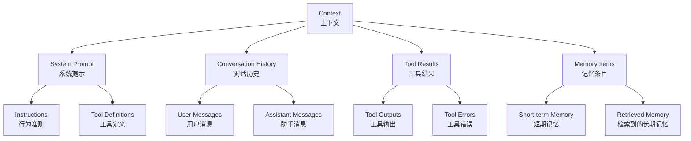
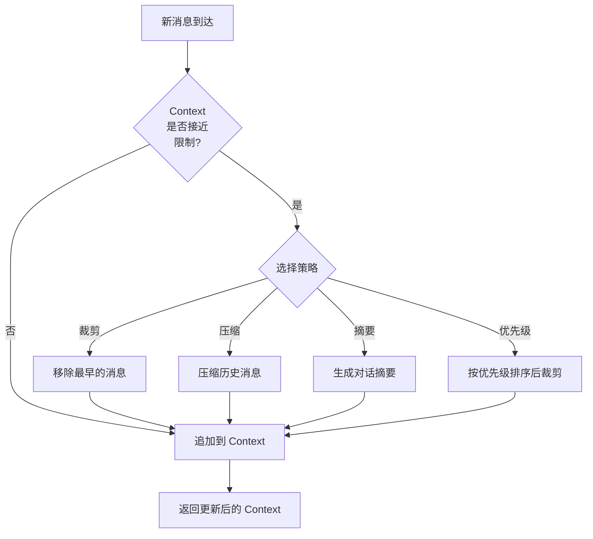

# 第 4 章：Context 管理

> **难度等级：** ⭐⭐⭐
> **所属模块：** 第一部分：基础认知
> **来源可信度：** 官方文档 / 源码 / 论文 / 推导 / 观点
> **状态：** ✅ 已完成

---

## 学习目标

完成本章学习后，你将能够：

1. 理解 Context 的组成结构和各部分的权重
2. 掌握 Context Window 的管理策略和 Token 预算分配
3. 理解上下文裁剪、压缩和优先级排序的算法
4. 实现一个基本的 Context Manager
5. 区分 Context 管理与 Context Engineering，并设计来源、权限、安全和评估边界
5. 避免常见的 Context 管理反模式

---

## 前置知识

- 阅读第 1 章「AI Agent 简介与历史演进」
- 阅读第 2 章「总体架构与生命周期」
- 阅读第 3 章「Prompt 与 Instructions」
- 了解 Token 的基本概念

---

## 1. 背景

### 1.1 为什么 Context 管理至关重要

Context（上下文）是 Agent 的「工作记忆」。Agent 的所有推理和决策都基于当前上下文中的信息。如果上下文管理不当，会导致：

- **信息丢失：** 重要信息被裁剪，Agent 做出错误决策
- **上下文膨胀：** 过多无关信息占用 Token 预算，降低推理质量
- **成本增加：** 每次请求的 Token 数量直接影响 API 调用成本
- **延迟增加：** 更大的上下文导致更长的推理时间

Context 管理是 Agent 架构中最基础也最容易被忽视的问题。

> **来源类型：** 推导分析 —— 基于 LLM 上下文窗口限制和 Agent 长对话场景的工程实践

### 1.2 Context Window 的演进

| 时间 | 模型 | 上下文窗口 | 影响 |
|------|------|-----------|------|
| 2022 | GPT-3.5 | 4K tokens | 仅支持短对话 |
| 2023 | GPT-4 | 8K-32K tokens | 支持中等长度文档 |
| 2023 | Claude 2 | 100K tokens | 支持整本书级上下文 |
| 2024 | Gemini 1.5 Pro | 1M+ tokens | 支持超长上下文 |
| 2023 | GPT-4 Turbo | 128K tokens | 大规模上下文处理 |
| 2025 | Claude 4 | 200K tokens | 企业级上下文管理 |

虽然上下文窗口越来越大，但「更大」并不等于「更好」——上下文越长，模型在长文本中的注意力越分散，推理成本也越高。因此，Context 管理的核心目标是**在有限的空间内保留最有价值的信息**。

> **来源类型：** Fact —— 基于各模型官方文档的上下文窗口数据

---

## 2. 核心概念

### 2.1 Context 的组成



> **图 4-1：** Context 组成结构。四大部分：System Prompt、Conversation History、Tool Results、Memory Items。

### 2.2 Token 预算分配

在有限的上下文窗口中，需要合理分配 Token 预算：

```
┌────────────────────────────────────────────────────┐
│                  Context Window                     │
│  ┌──────────┐ ┌──────────────────┐ ┌────────────┐ │
│  │ System   │ │  Conversation    │ │  Reserve   │ │
│  │ Prompt   │ │  History / Evidence│ │ Response + │ │
│  │ + Tools  │ │                  │ │ Tool Reserve│ │
│  └──────────┘ └──────────────────┘ └────────────┘ │
└────────────────────────────────────────────────────┘
```

| 区域 | 预算依据 | 内容 | 说明 |
|------|----------|------|------|
| System Prompt / Tool Definitions | 固定规则、schema 和安全约束的实际长度 | Instructions + Tool Definitions | 应保持最小且稳定；每次请求都包含 |
| Conversation History / Evidence | 当前任务相关性、可恢复性与来源权限 | 对话历史 + Tool Results + 检索证据 | 动态增长，需要裁剪、摘要或按需检索 |
| Reserve Space | 期望输出长度、下一轮 Tool 结果和模型限制 | 缓冲空间 | 先为必须产生的输出留出预算，再决定历史可占多少 |

> **来源类型：** 推导分析 —— 预算必须依据模型限制、任务形态和实际 Tool 输出校准；没有适用于所有模型或任务的固定百分比。

### 2.3 Context 管理策略



> **图 4-2：** Context Window 管理策略。当 Context 接近限制时，可以通过裁剪、压缩、摘要或优先级排序来管理。

### 2.4 如何选择策略：何时使用，以及代价

Context 管理不是“窗口满了就删”的单一算法，而是在**保真、成本、延迟与实现复杂度**之间做选择。先按信息是否能被恢复、是否仍与当前任务相关、以及是否存在合规留存要求分类，再选择策略。

| 策略 | When：适用信号 | Trade-off：主要代价与防护 |
|------|----------------|---------------------------|
| 裁剪 | 早期闲聊或可从原始系统重新获取的信息；任务主要依赖最近轮次 | 最快也最便宜，但会丢失承诺、约束和决策；固定保留系统规则、任务状态和关键用户偏好 |
| 摘要 / 压缩 | 对话长、历史语义仍有价值、可以接受少量信息损失 | 需要额外模型调用，摘要还会累积失真；保留原始记录或可追溯摘要版本，并在任务切换时重建 |
| 优先级检索 | 多来源信息混杂，且能标记任务相关性、时效性或权限 | 需要元数据和排序逻辑；错误排序会让关键证据缺席，不能只按“最新”排序 |
| 滑动窗口 | 连续对话、最近消息几乎总是最相关 | 实现简单但对跨轮长期任务脆弱；与摘要或持久化任务状态配合使用 |
| 外部检索 | 原文、证据或大量领域资料必须按需引用 | 增加检索延迟、权限和索引维护成本；检索结果应带来源、版本和访问控制，不能直接当作可信记忆 |

**不应使用 Context 管理来替代 Memory 或知识库。** 会话中的可恢复工作状态可压缩；需长期保留的用户偏好、可审计事实和原始证据，应分别按第 8 章的 Memory、Knowledge System 与 RAG 边界处理。

### 2.5 Context、Observation、Artifact、Resource 与 Memory

| 对象 | 是什么 | 如何进入 Context | 生命周期负责人 |
|------|--------|------------------|----------------|
| Context | 当前模型调用真正可见的有预算输入 | Context Builder 组装 | Runtime / Context Manager |
| Observation | 一次 Tool 调用返回的结构化结果 | 校验、脱敏和裁剪后加入 | Tool Runtime |
| Artifact | 大文件、报告、日志或二进制等可持久化结果 | 以摘要、ID/URI、checksum 和分页游标引用 | Artifact Store |
| Resource | 外部系统可读取的数据对象；MCP Resource 是一种协议暴露形式 | 经权限与提示注入检查后读取 | Knowledge/Connector/MCP Adapter |
| Memory Item | Agent/Application 写入、以后可检索的状态或经验 | 按租户、主体、来源和用途检索 | Memory System |
| Knowledge Evidence | 有独立来源、版本和访问控制的外部事实 | RAG/搜索后以引用证据加入 | Knowledge System |

`Context` 是投影视图，不是存储系统；`Observation` 是执行结果，不自动成为长期 Memory；`Artifact Reference` 不是 Artifact 内容；`MCP Resource` 也不等于 Memory。任何外部内容进入 Context 前都要重新执行权限、来源、大小、时效和提示注入检查。

### 2.6 从 Context 管理到 Context Engineering

Context 管理关注窗口预算、裁剪和压缩；Context Engineering 的范围更大，它设计模型在当前调用中获得的完整信息环境：

```text
Context Engineering
├── 来源：Prompt / Instructions / Skill / Memory / Resource / Artifact
├── 身份与权限：tenant / subject / resource scope
├── 选择与排序：相关性 / 时效 / trust / provenance
├── 预算：输入 / Tool Schema / Observation / 输出预留
├── 表达：原文 / 摘要 / 结构化字段 / 引用
├── 安全：指令与不可信数据隔离 / Prompt Injection 防护
├── 生命周期：加载 / 压缩 / 失效 / 恢复
└── 评估：证据覆盖 / 遗漏 / 污染 / Token 成本
```

它与 Prompt Engineering 的边界是：Prompt 主要表达本次任务和输出要求，Context Engineering 决定哪些受控信息共同进入模型调用。它与 Harness Engineering 的边界是：Context 设计“模型看到什么”，Harness 设计“Agent 在什么工具、权限、工作区和反馈环境中运行”。

Context 越多不一定越好。应通过任务评估验证某项信息是否提高成功率或减少错误；无法说明用途、来源和失效条件的内容不应长期占据 Context。

---

## 3. Context 管理策略详解

### 3.1 裁剪策略（Truncation）

最简单直接的策略：移除最早的消息，为新的消息腾出空间。

```python
def truncate_oldest(messages: list[dict], max_tokens: int) -> list[dict]:
    """从最早的消息开始移除，直到 Token 数在限制内"""
    while estimate_tokens(messages) > max_tokens and len(messages) > 0:
        messages.pop(0)  # 移除最早的消息
    return messages
```

**优点：** 简单、快速
**缺点：** 可能丢失重要的早期信息（如用户最初的需求）

### 3.2 压缩策略（Compression）

将多条消息压缩为一条摘要消息，保留关键信息。

```python
def compress_history(messages: list[dict],
                     keep_recent: int = 5) -> list[dict]:
    """压缩历史消息：保留最近 N 条，其余压缩为摘要"""
    if len(messages) <= keep_recent:
        return messages

    # 保留最近的消息
    recent = messages[-keep_recent:]
    old = messages[:-keep_recent]

    # 压缩旧消息为摘要（实际实现中调用 LLM 生成摘要）
    summary = f"[压缩了 {len(old)} 条历史消息]"
    compressed = [{"role": "system", "content": f"[历史摘要] {summary}"}]

    return compressed + recent
```

**优点：** 保留关键上下文，减少 Token 使用
**缺点：** 摘要可能丢失细节，需要额外的摘要生成步骤

### 3.3 优先级排序策略（Prioritization）

为每条消息分配优先级，保留高优先级的消息。

```python
def prioritize_messages(messages: list[dict],
                        max_tokens: int) -> list[dict]:
    """按优先级排序，保留最重要的消息"""
    # 为每条消息分配优先级（保留原始位置）
    scored = []
    for i, msg in enumerate(messages):
        priority = calculate_priority(msg)
        scored.append((priority, i, msg))

    # 按优先级降序排列
    scored.sort(key=lambda x: x[0], reverse=True)

    # 保留高优先级消息，直到 Token 限制
    result = []
    current_tokens = 0
    for priority, orig_idx, msg in scored:
        # 使用类内部的 _estimate_tokens 方法进行估算
        msg_tokens = len(msg.get("content", "")) // 4
        if current_tokens + msg_tokens <= max_tokens:
            result.append((orig_idx, msg))
            current_tokens += msg_tokens
        else:
            break

    # 恢复原始顺序（使用记录的原始位置，避免 dict 重复时的 == 比较问题）
    result.sort(key=lambda x: x[0])
    return [msg for _, msg in result]


def calculate_priority(msg: dict) -> int:
    """计算消息优先级"""
    priority = 0

    # System Prompt 最高优先级
    if msg["role"] == "system":
        priority += 100

    # 用户消息高优先级
    if msg["role"] == "user":
        priority += 50

    # Tool 错误消息高优先级（需要关注）
    content = msg.get("content", "")
    if "error" in content.lower():
        priority += 30

    # 包含关键信息的消息
    keywords = ["任务", "要求", "约束", "错误", "失败"]
    for kw in keywords:
        if kw in content:
            priority += 10

    return priority
```

### 3.4 滑动窗口策略（Sliding Window）

保留最近的 N 条消息，同时保留 System Prompt 和关键的用户消息。

```python
def sliding_window(messages: list[dict],
                   max_tokens: int,
                   system_prompts: int = 1,
                   keep_user_goals: bool = True) -> list[dict]:
    """滑动窗口策略"""
    result = []

    # 1. 始终保留 System Prompt
    system_msgs = [m for m in messages if m["role"] == "system"]
    result.extend(system_msgs[:system_prompts])

    # 2. 保留用户最初的目标（第一条用户消息）
    if keep_user_goals:
        user_msgs = [m for m in messages if m["role"] == "user"]
        if user_msgs:
            result.append(user_msgs[0])

    # 3. 从最新消息开始填充，直到 Token 限制
    remaining = max_tokens - estimate_tokens(result)
    recent = []
    for msg in reversed(messages):
        if msg in result:
            continue
        msg_tokens = estimate_tokens([msg])
        if estimate_tokens(recent) + msg_tokens <= remaining:
            recent.insert(0, msg)
        else:
            break

    result.extend(recent)
    return result
```

---

## 4. Context Manager 实现

### 4.1 教学实现

```python
"""
Context Manager - 上下文管理器教学实现
运行环境：Python 3.10+
依赖：无
预期输出：Context 管理策略的演示
"""

from dataclasses import dataclass, field
from typing import Literal


@dataclass
class ContextManager:
    """上下文管理器"""

    max_tokens: int = 8000
    system_prompt: str = ""
    messages: list[dict] = field(default_factory=list)
    strategy: Literal["truncate", "sliding", "prioritize"] = "sliding"

    def set_system_prompt(self, prompt: str):
        """设置 System Prompt"""
        self.system_prompt = prompt

    def add_message(self, role: str, content: str):
        """添加消息"""
        self.messages.append({"role": role, "content": content})
        self._maybe_compact()

    def _maybe_compact(self):
        """检查是否需要压缩上下文"""
        total_tokens = self._estimate_tokens()
        if total_tokens > self.max_tokens * 0.85:
            self._compact()

    def _compact(self):
        """执行上下文压缩"""
        if self.strategy == "truncate":
            self._truncate()
        elif self.strategy == "sliding":
            self._sliding_window()
        elif self.strategy == "prioritize":
            self._prioritize()

    def _truncate(self):
        """裁剪策略：移除最早的消息"""
        while self._estimate_tokens() > self.max_tokens * 0.7:
            # 跳过 System Prompt
            removed = False
            for i, msg in enumerate(self.messages):
                if msg["role"] != "system":
                    self.messages.pop(i)
                    removed = True
                    break
            # 只剩不可裁剪的 System Prompt 时必须退出，交由上层缩短或拒绝输入
            if not removed:
                break

    def _sliding_window(self):
        """滑动窗口策略"""
        # 保留 System Prompt
        system_msgs = [m for m in self.messages if m["role"] == "system"]
        # 保留最近的消息
        other_msgs = [m for m in self.messages if m["role"] != "system"]

        self.messages = system_msgs + other_msgs
        while self._estimate_tokens() > self.max_tokens * 0.7:
            if len(other_msgs) > 0:
                other_msgs.pop(0)
                self.messages = system_msgs + other_msgs
            else:
                break

    def _prioritize(self):
        """优先级策略"""
        priority_map = {
            "system": 100,
            "user": 50,
            "tool": 30,
            "assistant": 10,
        }
        self.messages.sort(
            key=lambda m: priority_map.get(m["role"], 0),
            reverse=True
        )
        # 移除优先级最低的消息（列表末尾的非 system 消息）
        while self._estimate_tokens() > self.max_tokens * 0.7:
            for i in range(len(self.messages) - 1, -1, -1):
                if self.messages[i]["role"] != "system":
                    self.messages.pop(i)
                    break
            else:
                break
        # 简化：不恢复顺序

    def _estimate_tokens(self) -> int:
        """估算 Token 数量（粗略估算：4 字符 ≈ 1 Token）"""
        total = len(self.system_prompt)
        for msg in self.messages:
            total += len(msg["content"])
        return total // 4

    def get_messages(self) -> list[dict]:
        """获取完整消息列表（含 System Prompt）"""
        result = []
        if self.system_prompt:
            result.append({"role": "system", "content": self.system_prompt})
        result.extend(self.messages)
        return result

    def get_stats(self) -> dict:
        """获取统计信息"""
        tokens = self._estimate_tokens()
        return {
            "total_tokens": tokens,
            "max_tokens": self.max_tokens,
            "usage_percent": f"{tokens / self.max_tokens * 100:.1f}%",
            "message_count": len(self.messages),
            "strategy": self.strategy,
        }


def main():
    cm = ContextManager(max_tokens=500, strategy="sliding")
    cm.set_system_prompt("你是 Coding Agent，帮助用户完成编程任务。始终使用中文回复。")

    # 模拟大量对话
    for i in range(30):
        role = "user" if i % 2 == 0 else "assistant"
        content = f"消息 {i}: " + "这是一个比较长的消息内容，用于模拟真实对话场景。" * 5
        cm.add_message(role, content)

        stats = cm.get_stats()
        if i % 5 == 0:
            print(f"  消息 {i}: {stats['message_count']} 条消息, "
                  f"{stats['usage_percent']} Token 使用")

    print("=" * 60)
    print("  Context Manager 演示")
    print("=" * 60)
    stats = cm.get_stats()
    print(f"  策略: {stats['strategy']}")
    print(f"  消息数: {stats['message_count']}")
    print(f"  Token 使用: {stats['usage_percent']}")
    print(f"  Token 上限: {stats['max_tokens']}")
    print("=" * 60)


if __name__ == "__main__":
    main()
```

**预期输出：**

```
  消息 0: 1 条消息, 8.0% Token 使用
  消息 5: 6 条消息, 39.6% Token 使用
  消息 10: 11 条消息, 71.0% Token 使用
  消息 15: 12 条消息, 77.6% Token 使用
  消息 20: 13 条消息, 84.2% Token 使用
  消息 25: 10 条消息, 65.2% Token 使用
============================================================
  Context Manager 演示
============================================================
  策略: sliding
  消息数: 10
  Token 使用: 65.2%
  Token 上限: 500
============================================================
```

---

## 5. 最佳实践

1. **动态计算预算：** 根据模型限制、预留输出、固定 Instructions、当前 Tool Schema 和历史波动计算输入预算；不要照搬固定缓冲比例。
2. **分层管理消息：** 将 System Prompt、用户目标、最近对话分开管理，确保关键信息不丢失。
3. **优先保留用户目标：** 用户最初的需求（第一条消息）可能包含关键约束，不应被裁剪。
4. **监控 Token 使用：** 实时监控 Token 使用量，在接近限制前主动压缩。
5. **选择合适的压缩策略：** 对于对话型 Agent 使用滑动窗口，对于任务型 Agent 使用优先级排序。
6. **Tool 结果 Artifact 化：** 完整结果存入受权限控制的 Artifact Store；Context 只放带来源、摘要、游标、大小和校验值的受预算视图。

一个更可靠的预算关系是：

```text
可用输入预算
= 模型总限制
- 预留输出预算
- 固定 Instructions
- 当前 Tool / MCP Schema
- 根据历史 Token 估算误差校准的安全余量
```

这些值应由实际 Tokenizer 和 Trace 数据计算。切换模型、Tool 集或多模态输入后必须重新估算，不能把某个百分比当作跨 Provider 常量。

---

## 6. 反模式

| 反模式 | 风险 | 推荐方案 |
|--------|------|---------|
| 无限制增长 | 上下文溢出，信息丢失 | 实施主动压缩策略 |
| 仅依赖裁剪 | 丢失早期关键信息 | 结合优先级排序和摘要 |
| 忽略 System Prompt 大小 | System Prompt 占用过多 Token | 精简 Instructions，最小化 Tool 定义 |
| Tool 结果不截断 | 单个 Tool 结果占用大量上下文 | 对 Tool 结果设置最大长度限制 |
| 不监控 Token 使用 | 无法及时发现上下文问题 | 实施实时 Token 监控 |
| 一刀切的压缩策略 | 不同场景需要不同策略 | 根据任务类型动态选择策略 |

---

## 7. FAQ

### Q: 上下文窗口越大越好吗？

不是。虽然更大的上下文窗口可以容纳更多信息，但也会带来问题：模型在长文本中的注意力分散（「Lost in the Middle」现象）、推理成本和延迟显著增加。关键是**在有限空间内保留最有价值的信息**。

### Q: 如何选择压缩策略？

- **对话型 Agent**（如客服机器人）：使用滑动窗口，保留最近对话
- **任务型 Agent**（如 Coding Agent）：使用优先级排序，保留关键约束和结果
- **研究型 Agent**（如文档分析）：使用摘要压缩，保留关键发现

### Q: Tool 结果应该完整保留还是截断？

不要只做不可逆的字符串截断。完整结果应保存在 Artifact Store，并记录权限、来源、内容类型、大小和 checksum；Context 中放结构化摘要、关键字段、错误信息以及可按页继续读取的引用。只有确认不再需要恢复、引用或审计时，才可以丢弃原始结果。

### Q: 如何处理「Lost in the Middle」问题？

研究表明，模型对上下文开头和结尾的信息关注度更高，对中间部分关注度较低。应对策略：将关键信息放在开头（System Prompt）或结尾（最近消息），定期将重要信息「重新提示」到最近消息中。

---

## 8. 官方参考

| 编号 | 来源 | 类型 | 说明 |
|------|------|------|------|
| REF-1 | [OpenAI Token Usage](https://platform.openai.com/docs/guides/tokens) | 官方文档 | Token 计数和管理 |
| REF-2 | [Anthropic Context Windows](https://docs.anthropic.com/en/docs/build-with-claude/context-windows) | 官方文档 | 上下文窗口管理 |
| REF-3 | [Lost in the Middle](https://arxiv.org/abs/2307.03172) (Liu et al., 2023) | 论文 | 长上下文中的注意力分布研究 |
| REF-4 | [MemGPT](https://arxiv.org/abs/2310.08560) (Packer et al., 2023) | 论文 | 虚拟内存管理在 LLM 中的应用 |

---

## 9. 延伸阅读

- [Attention Is All You Need](https://arxiv.org/abs/1706.03762) (Vaswani et al., 2017) —— Transformer 注意力机制
- [RAG: Retrieval-Augmented Generation](https://arxiv.org/abs/2005.11401) (Lewis et al., 2020) —— 通过检索扩展上下文
- [StreamingLLM](https://arxiv.org/abs/2309.17453) (Xiao et al., 2023) —— 无限长度上下文的高效推理

---

## 本章小结

Context 管理是在有限预算中选择本轮模型真正需要的信息。裁剪、摘要、排序和检索各有信息损失与成本，不能用固定比例替代测量；同时，Context 不是 Memory 或知识库，长期状态和可核查事实应进入各自受控的系统。

---

## 本章 Checklist

- [ ] 理解 Context 的四大组成部分
- [ ] 能画出 Context 组成结构图
- [ ] 理解 Token 预算的分配策略
- [ ] 掌握至少 3 种上下文压缩策略
- [ ] 能实现一个基本的 Context Manager
- [ ] 理解「Lost in the Middle」问题
- [ ] 运行了 Context Manager 示例代码
- [ ] 阅读了至少 2 篇官方参考文档
