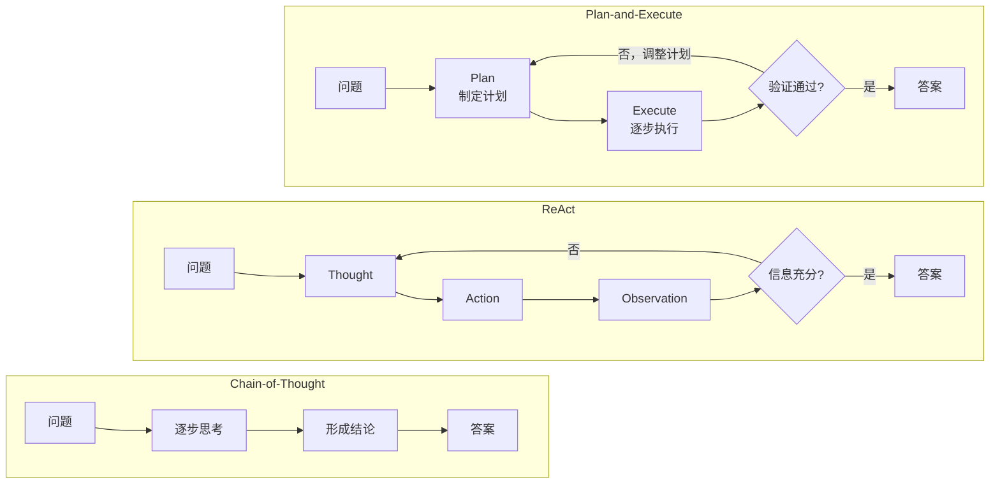
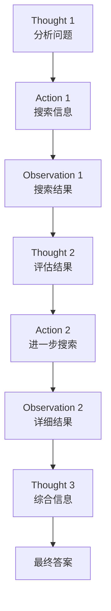
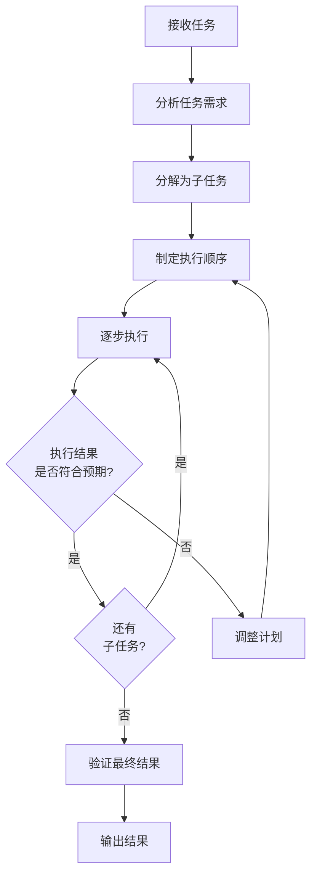

# 第 5 章：Reasoning 与 Planning

> **难度等级：** ⭐⭐⭐⭐
> **所属模块：** 第二部分：构建首个 Agent
> **来源可信度：** 官方文档 / 论文 / 推导 / 观点
> **状态：** ✅ 已完成

---

## 学习目标

完成本章学习后，你将能够：

1. 理解 Agent 中 Reasoning 和 Planning 的区别与协作关系
2. 掌握 ReAct、Chain-of-Thought、Tree of Thoughts 等推理策略
3. 理解 Plan-and-Execute 模式的设计与实现
4. 实现动态规划和自适应调整
5. 理解不同推理策略的适用场景和取舍

---

## 前置知识

- 阅读第 1 章「AI Agent 简介与历史演进」
- 阅读第 2 章「总体架构与生命周期」
- 了解 LLM 推理的基本原理

---

## 1. 背景

### 1.1 为什么需要 Reasoning 和 Planning

单纯的 LLM 推理是「一步到位」的：输入问题，输出答案。但对于复杂任务，这种模式存在明显的局限：

- **单步推理的局限：** 复杂问题无法在一步内解决，需要多步推理
- **缺乏结构化思考：** 没有显式的思考过程，难以调试和验证
- **无法自我纠正：** 出错后无法回溯和修正

**Reasoning（推理）** 和 **Planning（规划）** 是 Agent 解决复杂任务的两个核心能力：

- **Reasoning** 回答「现在该怎么做」——基于当前状态做出决策
- **Planning** 回答「整体怎么做」——将复杂任务分解为可执行步骤

> **来源类型：** 推导分析 —— 基于 CoT、ReAct 等论文和 Agent 框架的实践

### 1.2 推理策略的演进

```
直接回答 → Chain-of-Thought → ReAct → Tree of Thoughts → Plan-and-Execute
```

从直接的「输入 → 输出」，到逐步思考（CoT），到思考与行动交替（ReAct），到多路径探索（ToT），再到先规划后执行（Plan-and-Execute），推理策略的演进反映了 Agent 处理复杂任务能力的不断提升。

> **来源类型：** Fact —— 基于各论文的发表时间线

---

## 2. 核心概念

### 2.1 Reasoning 与 Planning 的区别

| 维度 | Reasoning | Planning |
|------|-----------|----------|
| 粒度 | 细粒度，单步决策 | 粗粒度，全局规划 |
| 时机 | 每一步都进行 | 任务开始时 + 计划调整时 |
| 输出 | 下一步行动 | 完整执行计划 |
| 依赖 | 当前上下文 | 整体任务目标 |
| 类比 | 棋手每步的思考 | 开局前的整体策略 |

### 2.2 推理策略对比



> **图 5-1：** 三种推理策略对比。CoT 是线性思考链，ReAct 是思考与行动交替，Plan-and-Execute 是先规划再执行。

---

## 3. 推理策略详解

### 3.1 Chain-of-Thought（CoT）

**核心思想：** 让模型在给出最终答案之前，逐步展示推理过程。

**工作原理：**

```
问题: 小明有 5 个苹果，给了小红 2 个，又买了 3 个，现在有几个？

CoT 推理:
1. 小明最初有 5 个苹果
2. 给了小红 2 个后，剩下 5 - 2 = 3 个
3. 又买了 3 个后，共有 3 + 3 = 6 个
4. 答案: 6 个苹果
```

**优点：**
- 提高推理准确性，尤其对数学和逻辑问题
- 推理过程可解释、可验证
- 实现简单，不需要额外工具

**缺点：**
- 无法与外部环境交互
- 不能获取实时信息
- 对需要行动的复杂任务无能为力

> **来源类型：** Fact —— 基于 Chain-of-Thought 论文 (Wei et al., 2022)

### 3.2 ReAct（Reasoning + Acting）

**核心思想：** 将推理（Thought）和行动（Action）交替进行，每次行动后观察结果（Observation），再决定下一步。

**ReAct 循环：**



> **图 5-2：** ReAct 循环。Thought → Action → Observation 的交替循环，直到产生最终答案。

**ReAct 实现：**

```python
"""
ReAct 模式实现
运行环境：Python 3.10+
依赖：无
"""

from dataclasses import dataclass, field
from typing import Any


@dataclass
class ReActStep:
    """ReAct 单步记录"""
    thought: str
    action: str = ""
    action_input: dict = field(default_factory=dict)
    observation: str = ""


class ReActAgent:
    """ReAct 模式的 Agent 实现"""

    def __init__(self, max_steps: int = 10):
        self.max_steps = max_steps
        self.steps: list[ReActStep] = []
        self.tools: dict[str, Any] = {}
        self.current_step = 0

    def register_tool(self, name: str, handler):
        """注册工具"""
        self.tools[name] = handler

    def reason(self, task: str, context: str) -> str:
        """推理阶段：生成 Thought"""
        # 简化实现：根据任务类型生成推理
        if self.current_step == 1:
            return f"我需要完成'{task}'。首先分析任务需求。"

        if "搜索" in task:
            return f"已经获取了搜索结果，现在需要筛选最相关的信息。"

        return f"第 {self.current_step} 步推理：评估当前状态，确定下一步行动。"

    def act(self, thought: str, task: str) -> tuple[str, dict]:
        """行动阶段：决定并执行 Action"""
        # 简化实现：根据推理内容决定行动
        if "搜索" in task and self.current_step == 1:
            return "search", {"query": task}
        elif "搜索" in task:
            return "analyze", {"data": "search_results"}
        return "reason", {"task": task}

    def observe(self, action: str, action_input: dict) -> str:
        """观察阶段：获取 Action 结果"""
        if action in self.tools:
            result = self.tools[action](**action_input)
            return str(result)
        return f"执行 {action} 完成"

    def should_continue(self) -> bool:
        """判断是否继续循环"""
        return self.current_step < self.max_steps

    def run(self, task: str) -> list[ReActStep]:
        """ReAct 主循环"""
        context = ""

        while self.should_continue():
            self.current_step += 1

            # Thought
            thought = self.reason(task, context)

            # Action
            action, action_input = self.act(thought, task)

            # Observation
            observation = self.observe(action, action_input)

            # 记录
            step = ReActStep(
                thought=thought,
                action=action,
                action_input=action_input,
                observation=observation
            )
            self.steps.append(step)

            # 更新上下文
            context += f"\nThought: {thought}\nAction: {action}\nObservation: {observation}"

            # 判断是否完成
            if "最终答案" in thought or self.current_step >= 3:
                break

        return self.steps


def main():
    agent = ReActAgent(max_steps=5)

    # 注册模拟工具
    agent.register_tool("search", lambda query: f"搜索 '{query}' 的结果: [结果1, 结果2, 结果3]")
    agent.register_tool("analyze", lambda data: f"分析完成: {data}")

    print("=" * 60)
    print("  ReAct Agent 演示")
    print("=" * 60)

    task = "搜索 AI Agent 架构设计的最新资料"
    print(f"  任务: {task}\n")

    steps = agent.run(task)

    for i, step in enumerate(steps, 1):
        print(f"  Step {i}:")
        print(f"    Thought: {step.thought}")
        print(f"    Action: {step.action}({step.action_input})")
        print(f"    Observation: {step.observation[:80]}...")
        print()

    print("=" * 60)


if __name__ == "__main__":
    main()
```

> **来源类型：** Fact —— 基于 ReAct 论文 (Yao et al., 2022) 的实现

### 3.3 Tree of Thoughts（ToT）

**核心思想：** 在推理过程中探索多条路径，对每条路径进行评估，选择最优路径继续。

**与 CoT 的区别：**

| 维度 | CoT | ToT |
|------|-----|-----|
| 推理路径 | 单一路径 | 多路径探索 |
| 决策方式 | 线性推进 | 评估 + 选择 |
| 适用场景 | 确定性推理 | 需要探索的问题 |
| 计算成本 | 低 | 高（多条路径） |

**ToT 处理流程：**

```
1. 生成多个候选 Thought
2. 评估每个 Thought 的质量
3. 选择最有希望的 Thought
4. 基于选择的 Thought 继续生成
5. 重复直到找到满意答案
```

> **来源类型：** Fact —— 基于 Tree of Thoughts 论文 (Yao et al., 2023)

**简化实现：**

```python
from dataclasses import dataclass, field

@dataclass
class ThoughtNode:
    """思维树节点"""
    content: str
    score: float = 0.0
    children: list["ThoughtNode"] = field(default_factory=list)

class TreeOfThoughts:
    """Tree of Thoughts 简化实现"""

    def __init__(self, max_depth: int = 3, beam_width: int = 2):
        self.max_depth = max_depth
        self.beam_width = beam_width

    def solve(self, problem: str, generate_fn, evaluate_fn) -> str:
        """运行 ToT 搜索"""
        root = ThoughtNode(content=f"问题: {problem}")

        current_level = [root]
        for depth in range(self.max_depth):
            # 1. 为当前层每个节点生成候选思路
            candidates = []
            for node in current_level:
                thoughts = generate_fn(node.content, self.beam_width)
                for thought in thoughts:
                    child = ThoughtNode(content=thought)
                    node.children.append(child)
                    candidates.append(child)

            if not candidates:
                break

            # 2. 评估所有候选
            for node in candidates:
                node.score = evaluate_fn(node.content)

            # 3. 选择最优的 beam_width 个
            candidates.sort(key=lambda n: n.score, reverse=True)
            current_level = candidates[:self.beam_width]

            # 4. 检查是否找到满意答案
            if current_level and current_level[0].score > 0.9:
                return current_level[0].content

        # 返回最高分路径
        best = max(current_level, key=lambda n: n.score) if current_level else root
        return best.content
```

> **注意：** 上述为教学简化实现，实际 ToT 需要 LLM 作为 `generate_fn` 和 `evaluate_fn`，且搜索策略可替换为 BFS/DFS。

---

## 4. Planning 详解

### 4.1 Plan-and-Execute 模式



> **图 5-3：** Plan-and-Execute 流程。任务分解 → 制定顺序 → 逐步执行 → 动态调整 → 验证结果。

### 4.2 Planner 实现

```python
"""
Planner - Plan-and-Execute 模式实现
运行环境：Python 3.10+
依赖：无
"""

from dataclasses import dataclass, field
from enum import Enum


class StepStatus(Enum):
    PENDING = "⏳"
    RUNNING = "🔄"
    DONE = "✅"
    FAILED = "❌"
    SKIPPED = "⏭️"


@dataclass
class PlanStep:
    """计划步骤"""
    id: int
    description: str
    tool: str = ""
    depends_on: list[int] = field(default_factory=list)
    status: StepStatus = StepStatus.PENDING
    result: str = ""


@dataclass
class Plan:
    """执行计划"""
    task: str
    steps: list[PlanStep] = field(default_factory=list)

    def get_pending(self) -> list[PlanStep]:
        """获取可执行的步骤（依赖已满足）"""
        done_ids = {
            s.id for s in self.steps
            if s.status in (StepStatus.DONE, StepStatus.SKIPPED)
        }
        return [
            s for s in self.steps
            if s.status == StepStatus.PENDING
            and all(dep in done_ids for dep in s.depends_on)
        ]

    def is_complete(self) -> bool:
        return all(
            s.status in (StepStatus.DONE, StepStatus.SKIPPED, StepStatus.FAILED)
            for s in self.steps
        )


class Planner:
    """规划器"""

    def create_plan(self, task: str) -> Plan:
        """根据任务创建执行计划（简化实现）"""
        plan = Plan(task=task)

        if "分析" in task and "代码" in task:
            plan.steps = [
                PlanStep(1, "读取目标代码文件", "read_file"),
                PlanStep(2, "分析代码结构", "analyze", depends_on=[1]),
                PlanStep(3, "识别潜在问题", "analyze", depends_on=[2]),
                PlanStep(4, "生成分析报告", "generate_report", depends_on=[3]),
                PlanStep(5, "验证报告准确性", "verify", depends_on=[4]),
            ]
        elif "搜索" in task:
            plan.steps = [
                PlanStep(1, "解析搜索需求", "parse_query"),
                PlanStep(2, "执行搜索", "search"),
                PlanStep(3, "筛选结果", "filter", depends_on=[2]),
                PlanStep(4, "整理输出", "format", depends_on=[3]),
            ]
        elif "修复" in task or "修改" in task:
            plan.steps = [
                PlanStep(1, "理解问题描述", "analyze"),
                PlanStep(2, "定位相关代码", "search_code", depends_on=[1]),
                PlanStep(3, "读取代码文件", "read_file", depends_on=[2]),
                PlanStep(4, "制定修改方案", "plan_fix", depends_on=[3]),
                PlanStep(5, "执行修改", "edit_file", depends_on=[4]),
                PlanStep(6, "验证修改", "verify", depends_on=[5]),
            ]
        else:
            plan.steps = [
                PlanStep(1, "分析任务需求", "analyze"),
                PlanStep(2, "确定执行策略", "plan"),
                PlanStep(3, "执行操作", "execute", depends_on=[2]),
                PlanStep(4, "验证结果", "verify", depends_on=[3]),
            ]

        return plan


class PlanExecutor:
    """计划执行器"""

    def __init__(self, planner: Planner):
        self.planner = planner

    def execute_step(self, step: PlanStep) -> str:
        """执行单个步骤（模拟）"""
        # 实际实现中调用 Tool
        return f"完成: {step.description}"

    def run(self, task: str) -> Plan:
        """执行完整计划"""
        plan = self.planner.create_plan(task)

        while not plan.is_complete():
            pending = plan.get_pending()

            if not pending:
                # 检查是否有失败的步骤阻塞
                failed = [s for s in plan.steps if s.status == StepStatus.FAILED]
                if failed:
                    # 标记剩余步骤为跳过
                    for s in plan.steps:
                        if s.status == StepStatus.PENDING:
                            s.status = StepStatus.SKIPPED
                break

            for step in pending:
                step.status = StepStatus.RUNNING
                try:
                    step.result = self.execute_step(step)
                    step.status = StepStatus.DONE
                except Exception as e:
                    step.status = StepStatus.FAILED
                    step.result = str(e)

        return plan


def main():
    planner = Planner()
    executor = PlanExecutor(planner)

    tasks = [
        "分析 main.py 的代码质量",
        "搜索 AI Agent 相关的开源项目",
        "修复登录页面的性能问题",
        "帮我写一个排序函数",
    ]

    for task in tasks:
        print(f"\n{'='*60}")
        print(f"  任务: {task}")
        print(f"{'='*60}")

        plan = executor.run(task)

        print(f"  计划步骤数: {len(plan.steps)}")
        for step in plan.steps:
            deps = f" (依赖: {step.depends_on})" if step.depends_on else ""
            print(f"    {step.status.value} Step {step.id}: {step.description}{deps}")
            if step.result:
                print(f"       -> {step.result}")

    print(f"\n{'='*60}")


if __name__ == "__main__":
    main()
```

**预期输出：**

```
============================================================
  任务: 分析 main.py 的代码质量
============================================================
  计划步骤数: 5
    ✅ Step 1: 读取目标代码文件
       -> 完成: 读取目标代码文件
    ✅ Step 2: 分析代码结构 (依赖: [1])
       -> 完成: 分析代码结构
    ✅ Step 3: 识别潜在问题 (依赖: [2])
       -> 完成: 识别潜在问题
    ✅ Step 4: 生成分析报告 (依赖: [3])
       -> 完成: 生成分析报告
    ✅ Step 5: 验证报告准确性 (依赖: [4])
       -> 完成: 验证报告准确性
...
============================================================
```

---

## 5. 动态规划与自适应调整

### 5.1 动态重规划

当执行结果与预期不符时，Agent 需要动态调整计划。这需要：

1. **监控执行结果：** 每个步骤完成后评估结果质量
2. **检测偏差：** 判断结果是否偏离预期
3. **触发重规划：** 当偏差超过阈值时，调整后续步骤

```python
class AdaptivePlanner(Planner):
    """自适应规划器"""

    def replan(self, plan: Plan, failed_step: PlanStep,
               reason: str) -> Plan:
        """基于失败步骤重新规划"""
        new_plan = Plan(task=plan.task)

        # 保留已完成的步骤
        for step in plan.steps:
            if step.status == StepStatus.DONE:
                new_plan.steps.append(step)
            elif step.id == failed_step.id:
                # 添加替代步骤，保留原依赖关系
                new_plan.steps.append(
                    PlanStep(step.id, f"替代方案: {step.description}",
                            tool=f"alt_{step.tool}",
                            depends_on=list(step.depends_on))
                )
            elif step.id > failed_step.id:
                # 调整后续步骤，保留原依赖关系
                new_plan.steps.append(
                    PlanStep(step.id, f"调整后: {step.description}",
                            tool=step.tool,
                            depends_on=list(step.depends_on))
                )

        return new_plan
```

---

## 6. 推理策略选择指南

| 场景 | 推荐策略 | 理由 |
|------|---------|------|
| 简单问答 | 直接回答 | 不需要多步推理 |
| 数学/逻辑问题 | CoT | 逐步推理提高准确性 |
| 需要工具的任务 | ReAct | 思考与行动交替 |
| 探索性任务 | ToT | 多路径探索 |
| 复杂多步骤任务 | Plan-and-Execute | 先规划后执行，结构清晰 |
| 不确定性强 | ReAct + 动态规划 | 灵活应对变化 |

---

## 7. 最佳实践

1. **根据任务复杂度选择策略：** 简单任务不需要复杂的 Planning，避免过度工程化。
2. **显式规划优于隐式推理：** 对于 3 步以上的任务，显式规划比隐式推理更可靠。
3. **设置步骤上限：** 防止无限循环，实践中建议 ReAct 5-10 步，Plan-and-Execute 3-7 步。
4. **保留规划历史：** 记录每一步的决策和结果，便于调试和优化。
5. **支持动态重规划：** 执行结果偏离预期时，能够调整后续计划。

---

## 8. 反模式

| 反模式 | 风险 | 推荐方案 |
|--------|------|---------|
| 过度规划 | 简单任务规划复杂，浪费 Token | 根据任务复杂度自适应选择策略 |
| 无步骤限制 | Agent 无限循环 | 设置最大步数限制 |
| 忽略执行结果 | 偏离预期不调整 | 每步后评估结果，触发重规划 |
| 规划过于刚性 | 无法应对意外情况 | 支持动态重规划和替代方案 |
| 所有任务用同一种策略 | 效率低下 | 根据任务类型选择策略 |

---

## 9. FAQ

### Q: ReAct 和 Plan-and-Execute 什么时候用哪个？

ReAct 适合不确定性高的任务——你不知道需要多少步、每一步做什么。Plan-and-Execute 适合结构化任务——你可以在开始前确定大致步骤。实践中，可以结合使用：先用 Plan-and-Execute 制定高层计划，每个步骤内部使用 ReAct。

### Q: CoT 和 ReAct 的核心区别是什么？

CoT 是纯推理链（只在「脑中」思考），ReAct 是推理+行动链（思考后可以调用工具获取外部信息）。CoT 适合纯推理任务，ReAct 适合需要外部信息的任务。

### Q: 如何判断规划是否合理？

好的规划应该：（1）步骤之间有清晰的依赖关系；（2）每个步骤有明确的输入和输出；（3）步骤数量适中（3-7 步）；（4）有错误处理机制。

### Q: 动态重规划会不会导致无限循环？

需要设置重规划次数上限。建议最多重规划 2-3 次，超过后向用户求助或使用备选策略。

---

## 10. 官方参考

| 编号 | 来源 | 类型 | 说明 |
|------|------|------|------|
| REF-1 | [Chain-of-Thought Paper](https://arxiv.org/abs/2201.11903) (Wei et al., 2022) | 论文 | CoT 的开创性工作 |
| REF-2 | [ReAct Paper](https://arxiv.org/abs/2210.03629) (Yao et al., 2022) | 论文 | Reasoning + Acting 范式 |
| REF-3 | [Tree of Thoughts Paper](https://arxiv.org/abs/2305.10601) (Yao et al., 2023) | 论文 | 多路径推理探索 |
| REF-4 | [Plan-and-Solve Paper](https://arxiv.org/abs/2305.04091) (Wang et al., 2023) | 论文 | Plan-and-Execute 的早期工作 |
| REF-5 | [Reflexion Paper](https://arxiv.org/abs/2303.11366) (Shinn et al., 2023) | 论文 | 自我反思与修正的推理 |

---

## 11. 延伸阅读

- [AutoGen: Multi-Agent Conversation](https://arxiv.org/abs/2308.08155) (Wu et al., 2023) —— 多 Agent 协作规划
- [Voyager: Open-Ended Embodied Agent](https://arxiv.org/abs/2305.16291) (Wang et al., 2023) —— 动态技能学习与规划
- [HuggingGPT](https://arxiv.org/abs/2303.17580) (Shen et al., 2023) —— 基于 LLM 的任务规划与模型调度

---

## 本章小结

Reasoning 负责形成当前判断，Planning 负责把目标组织成可执行步骤。简单任务不必显式规划；只有当依赖关系、恢复、并行或审计带来真实价值时，才值得引入 Plan-and-Execute、重规划或树搜索，并为循环设置明确的停止条件。

---

## 本章 Checklist

- [ ] 理解 Reasoning 和 Planning 的区别
- [ ] 能画出 CoT、ReAct、Plan-and-Execute 的对比图
- [ ] 理解 ReAct 循环的三个阶段
- [ ] 能实现 Plan-and-Execute 模式
- [ ] 理解动态重规划的必要性
- [ ] 能根据任务类型选择合适的推理策略
- [ ] 运行了 ReAct 和 Planner 示例代码
- [ ] 阅读了至少 2 篇论文原文
