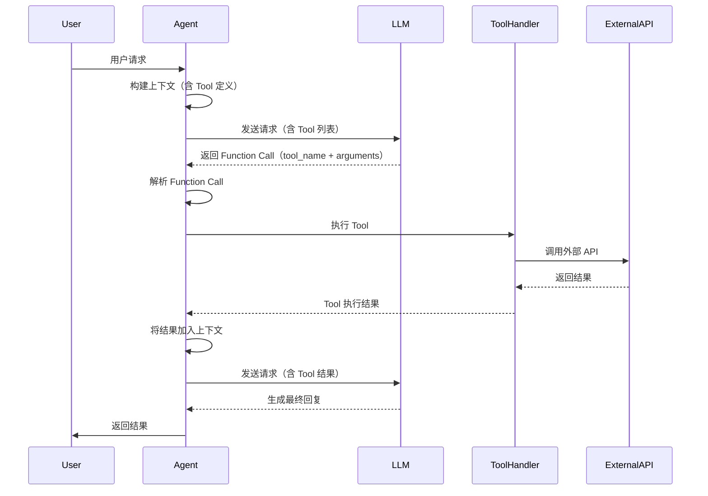
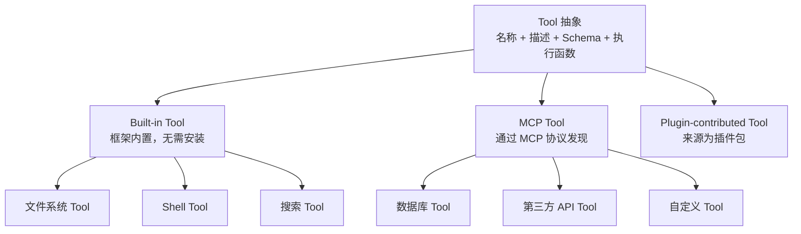
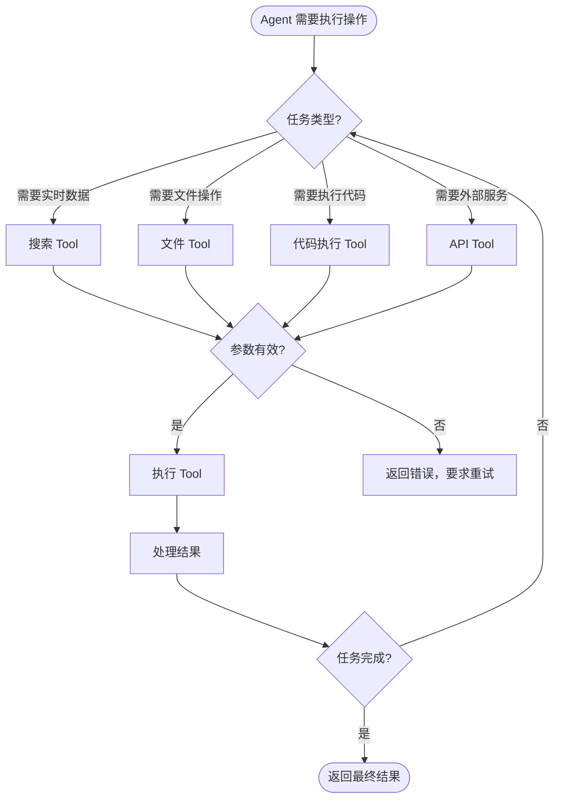

# 第 6 章：Tools 与 Function Calling

> **难度等级：** ⭐⭐⭐
> **所属模块：** 第二部分：构建首个 Agent
> **来源可信度：** 官方文档 / 源码 / 论文 / 推导 / 观点
> **状态：** ✅ 已完成

---

## 学习目标

完成本章学习后，你将能够：

1. 理解 Tool 的抽象层次和设计原则
2. 掌握 Function Calling 的请求/响应格式和工作流程
3. 理解 Built-in Tool 和 MCP Tool 的区别和适用场景
4. 实现一个完整的 Tool 调用流程
5. 理解 Tool 的选择、调度和错误处理策略

---

## 前置知识

- 阅读第 1 章「AI Agent 简介与历史演进」
- 阅读第 2 章「总体架构与生命周期」
- 了解 JSON Schema 的基本概念

---

## 1. 背景

### 1.1 为什么需要 Tool

LLM 的核心能力是文本生成，但实际应用场景通常需要与外部世界交互：

- 查询实时数据（天气、股票、新闻）
- 操作文件系统（读取、写入、删除文件）
- 调用外部 API（发送邮件、创建工单）
- 执行代码（计算、数据处理）

**Tool 是 LLM 与外部世界之间的桥梁。** 它定义了 Agent 可以执行的操作，以及如何描述这些操作供模型理解。

> **来源类型：** 推导分析 —— 基于 LLM 能力边界和 Tool 设计目标的逻辑推断

### 1.2 Tool 的演进

```
API 调用 → Function Calling → Tool 抽象 → Tool Registry → MCP
```

从最原始的 API 调用，到 OpenAI 的 Function Calling，再到通用的 Tool 抽象，最后到 MCP 的标准化协议，Tool 的设计经历了从「手写集成」到「标准化协议」的演进。

> **来源类型：** 推导分析 —— 基于第 1 章历史演进的展开

---

## 2. 核心概念

### 2.1 Tool 的定义

一个 Tool 由以下要素构成：

| 要素 | 说明 | 示例 |
|------|------|------|
| 名称（name） | 唯一标识符 | `search_web`, `read_file` |
| 描述（description） | 自然语言描述，帮助模型理解何时使用 | 「搜索互联网获取最新信息」 |
| 参数 Schema（parameters） | JSON Schema 格式的参数定义 | `{"query": {"type": "string"}}` |
| 执行函数（handler） | 实际执行逻辑 | 调用搜索 API 的函数 |

> **来源类型：** Fact —— 基于 OpenAI Function Calling 和 Anthropic Tool Use 的 Tool 定义规范

### 2.2 Function Calling 工作流程



> **图 6-1：** Function Calling 完整时序图。Agent 将 Tool 定义发送给 LLM，LLM 返回 Function Call，Agent 执行 Tool 后将结果反馈给 LLM 生成最终回复。

### 2.3 Tool 抽象层次



> **图 6-2：** Tool 抽象层次。所有 Tool 共享统一调用接口，但来源不同：Built-in（Host 内置）、MCP（协议接入）、Plugin-contributed（由插件包贡献）。Plugin 本身不是 Tool 类型。

### 2.4 Tool 调用决策流程



> **图 6-3：** Tool 调用决策树。Agent 根据任务类型选择合适的 Tool，验证参数后执行，处理结果后判断是否继续。

### 2.5 Tool、Function Calling、Handler、API 与 Command

| 概念 | 所在边界 | 职责 |
|------|----------|------|
| Tool Definition | Host ↔ Model | 名称、描述、输入/输出 Schema 与副作用契约 |
| Function/Tool Calling | Model → Host | 模型表达“希望调用哪个 Tool、参数是什么”的结构化机制 |
| Tool Handler | Runtime 内执行边界 | 校验后执行 Tool，并返回 Observation |
| API / SDK / CLI | Handler ↔ 下游系统 | Handler 使用的具体集成接口，不自动成为模型 Tool |
| Slash Command | User → Product | 用户显式启动任务或工作流的入口，不是 Tool 授权 |
| MCP Resource | Host ↔ MCP Server | 可读取上下文数据的协议原语，不应默认为有副作用 Tool |

`Function Calling ≠ Function Execution`：模型只产生调用请求，Host 决定是否执行。`API ≠ Connector`、`CLI Command ≠ Tool`；只有经过 Schema、Policy 和 Runtime 包装后，它们才可能成为 Tool Handler 的底层实现。

---

## 3. Tool 设计

### 3.1 Tool 定义规范

一个设计良好的 Tool 定义应遵循以下规范：

```python
from dataclasses import dataclass
from typing import Any, Callable

@dataclass
class ToolDefinition:
    """Tool 定义的标准结构"""
    name: str                    # 唯一标识符，使用 snake_case
    description: str             # 清晰描述 Tool 的功能和使用场景
    parameters: dict             # JSON Schema 格式的参数定义
    handler: Callable            # 实际执行函数
    required: list[str] = None   # 必填参数列表
    side_effect: bool = False
    idempotent: bool = True

    def __post_init__(self):
        if self.required is None:
            self.required = []
```

**设计原则：**

1. **名称清晰：** 使用动词+名词格式，如 `search_web`、`read_file`、`send_email`
2. **描述精准：** 说明 Tool 做什么、何时使用、返回什么
3. **参数明确：** 每个参数有类型、描述和是否必填
4. **返回值规范：** 返回结构化的结果，包含成功/失败标记

> **来源类型：** 推导分析 —— 基于 OpenAI、Anthropic 的 Tool 定义最佳实践

### 3.2 Tool 示例：搜索引擎

```python
"""
搜索引擎 Tool 示例
运行环境：Python 3.10+
依赖：httpx
预期输出：搜索结果 JSON
"""

import json
from dataclasses import dataclass
from typing import Any


@dataclass
class SearchTool:
    """搜索引擎 Tool"""

    name: str = "search_web"
    description: str = "搜索互联网获取最新信息。当需要获取实时数据或用户询问最新信息时使用。"

    @property
    def parameters(self) -> dict:
        return {
            "type": "object",
            "properties": {
                "query": {
                    "type": "string",
                    "description": "搜索关键词"
                },
                "max_results": {
                    "type": "integer",
                    "description": "最大返回结果数",
                    "default": 5
                }
            },
            "required": ["query"]
        }

    def handler(self, query: str, max_results: int = 5) -> dict:
        """执行搜索（简化实现）"""
        # 实际应用中调用搜索 API
        return {
            "success": True,
            "query": query,
            "results": [
                {"title": f"结果 {i}: {query}", "url": f"https://example.com/{i}"}
                for i in range(1, min(max_results, 3) + 1)
            ]
        }


@dataclass
class FileReadTool:
    """文件读取 Tool"""

    name: str = "read_file"
    description: str = "读取指定文件的内容。当需要查看文件内容时使用。"
    workspace_root: str = "./workspace"
    max_bytes: int = 1024 * 1024

    @property
    def parameters(self) -> dict:
        return {
            "type": "object",
            "properties": {
                "path": {
                    "type": "string",
                    "description": "文件路径"
                }
            },
            "required": ["path"]
        }

    def handler(self, path: str) -> dict:
        """只读取 Workspace Root 内的普通文件，并限制返回大小。"""
        from pathlib import Path
        try:
            root = Path(self.workspace_root).resolve(strict=True)
            target = (root / path).resolve(strict=True)
            if not target.is_relative_to(root) or not target.is_file():
                return {"success": False, "error": "路径不在允许工作区内"}
            with target.open("r", encoding="utf-8") as f:
                content = f.read(self.max_bytes + 1)
            if len(content.encode("utf-8")) > self.max_bytes:
                return {
                    "success": False,
                    "error": "文件超过 Tool 返回上限，请使用分页读取",
                }
            return {"success": True, "content": content, "path": str(target.relative_to(root))}
        except FileNotFoundError:
            return {"success": False, "error": f"文件不存在: {path}"}
        except Exception as e:
            return {"success": False, "error": str(e)}
```

> **来源类型：** Fact —— 基于 Anthropic Tool Use 的 Tool 定义格式

---

## 4. Function Calling 实现

### 4.1 Function Calling 消息格式

以 OpenAI 兼容格式为例，Function Calling 的消息流如下：

```python
# 1. 发送请求（包含 Tool 定义）
request_messages = [
    {"role": "system", "content": "你是一个有用的助手"},
    {"role": "user", "content": "搜索今天的 AI 新闻"}
]

tools = [
    {
        "type": "function",
        "function": {
            "name": "search_web",
            "description": "搜索互联网获取最新信息",
            "parameters": {
                "type": "object",
                "properties": {
                    "query": {"type": "string", "description": "搜索关键词"},
                    "max_results": {"type": "integer", "default": 5}
                },
                "required": ["query"]
            }
        }
    }
]

# 2. 模型返回 Function Call
response = {
    "role": "assistant",
    "content": None,
    "tool_calls": [
        {
            "id": "call_abc123",
            "type": "function",
            "function": {
                "name": "search_web",
                "arguments": '{"query": "AI news 2026", "max_results": 5}'
            }
        }
    ]
}

# 3. 执行 Tool 后将结果追加到消息
tool_result = {
    "role": "tool",
    "tool_call_id": "call_abc123",
    "content": '{"success": true, "results": [...]}'
}

# 4. 将 Tool 结果发送给模型，获取最终回复
final_messages = request_messages + [response, tool_result]
```

> **来源类型：** Fact —— 基于 OpenAI Chat Completions API 文档

### 4.2 完整 Function Calling 实现

```python
"""
Function Calling 教学实现
运行环境：Python 3.10+
依赖：openai>=1.0.0
注意：本节代码引用前文定义的 Tool 类和 FunctionCall 等结构，
完整可运行版本见 examples/tool-calling/
预期输出：完整的 Function Calling 流程演示
"""

import json
from typing import Any


class ToolExecutor:
    """Tool 执行器 - 管理 Tool 注册和执行"""

    def __init__(self):
        self._tools: dict[str, Any] = {}

    def register(self, tool: Any) -> None:
        """注册 Tool"""
        self._tools[tool.name] = tool

    def get_definitions(self) -> list[dict]:
        """获取所有 Tool 的 OpenAI 格式定义"""
        definitions = []
        for tool in self._tools.values():
            definitions.append({
                "type": "function",
                "function": {
                    "name": tool.name,
                    "description": tool.description,
                    "parameters": tool.parameters
                }
            })
        return definitions

    def execute(self, name: str, arguments: dict) -> dict:
        """执行 Tool"""
        tool = self._tools.get(name)
        if not tool:
            return {"success": False, "error": f"Tool 不存在: {name}"}

        try:
            result = tool.handler(**arguments)
            return result
        except Exception as e:
            return {"success": False, "error": str(e)}

    def execute_tool_call(self, tool_call: dict) -> dict:
        """从 Function Call 响应中执行 Tool"""
        func_name = tool_call["function"]["name"]
        func_args = json.loads(tool_call["function"]["arguments"])
        return self.execute(func_name, func_args)


class AgentWithTools:
    """带 Tool 调用的 Agent"""

    def __init__(self, tool_executor: ToolExecutor):
        self.tool_executor = tool_executor
        self.messages: list[dict] = []

    def add_system_message(self, content: str):
        self.messages.append({"role": "system", "content": content})

    def add_user_message(self, content: str):
        self.messages.append({"role": "user", "content": content})

    def process_tool_calls(self, tool_calls: list[dict]) -> list[dict]:
        """处理 Function Call，返回 Tool 结果消息"""
        tool_results = []
        for tool_call in tool_calls:
            result = self.tool_executor.execute_tool_call(tool_call)
            tool_results.append({
                "role": "tool",
                "tool_call_id": tool_call["id"],
                "content": json.dumps(result, ensure_ascii=False)
            })
        return tool_results

    def get_tool_definitions(self) -> list[dict]:
        return self.tool_executor.get_definitions()


if __name__ == "__main__":
    # 创建 Tool 执行器并注册 Tool
    executor = ToolExecutor()
    executor.register(SearchTool())
    executor.register(FileReadTool())

    # 创建 Agent
    agent = AgentWithTools(executor)
    agent.add_system_message("你是一个有用的助手，可以使用工具完成任务。")
    agent.add_user_message("搜索今天的 AI 新闻")

    # 打印 Tool 定义
    print("=" * 50)
    print("已注册的 Tool:")
    for td in agent.get_tool_definitions():
        print(f"  - {td['function']['name']}: {td['function']['description']}")
    print("=" * 50)

    # 模拟一个 Function Call
    mock_tool_call = {
        "id": "call_demo",
        "type": "function",
        "function": {
            "name": "search_web",
            "arguments": '{"query": "AI news 2026", "max_results": 3}'
        }
    }

    print("执行 Tool Call:")
    print(f"  Tool: {mock_tool_call['function']['name']}")
    print(f"  Args: {mock_tool_call['function']['arguments']}")

    results = agent.process_tool_calls([mock_tool_call])
    for r in results:
        print(f"  Result: {r['content']}")
    print("=" * 50)
```

**预期输出：**

```
==================================================
已注册的 Tool:
  - search_web: 搜索互联网获取最新信息。当需要获取实时数据或用户询问最新信息时使用。
  - read_file: 读取指定文件的内容。当需要查看文件内容时使用。
==================================================
执行 Tool Call:
  Tool: search_web
  Args: {"query": "AI news 2026", "max_results": 3}
  Result: {"success": true, "query": "AI news 2026", "results": [{"title": "结果 1: AI news 2026", "url": "https://example.com/1"}, {"title": "结果 2: AI news 2026", "url": "https://example.com/2"}, {"title": "结果 3: AI news 2026", "url": "https://example.com/3"}]}
==================================================
```

> **运行方式：** 见 `examples/tool-calling/python/main.py`

---

## 5. Built-in Tool vs MCP Tool

### 5.1 对比分析

| 维度 | Built-in Tool | MCP Tool |
|------|-------------|----------|
| 部署方式 | 通常由 Host 包、进程或应用代码提供 | MCP Server 可通过本地 stdio 或远程 HTTP 等传输接入 |
| 发现方式 | 显式注册、Host 配置或代码导入 | 初始化后的能力协商与列表发现；也可由 Host 固定配置 |
| 延迟 | 取决于 Handler 和下游服务，不必然低 | 取决于传输、Server 与下游服务；本地 stdio 不必然经过网络 |
| 适用场景 | Host 内稳定、紧密集成的能力 | 跨语言、跨进程、跨产品或第三方提供的标准化能力 |
| 更新方式 | 常与 Host 发布节奏绑定，也可配置化更新 | Server 可独立演进，但需处理协议、版本和兼容性 |
| 安全性 | 仍须执行 Host 的授权、输入校验和审计 | 除 Host 控制外，还需处理远程身份、授权、凭据范围与传输边界 |
| 示例 | Host 内的文件读取、受控 Shell 包装 | 本地或远程的数据库、企业系统、第三方 API 能力 |

> **来源类型：** 推导分析 —— 基于 Claude Code 和 MCP 规范的设计权衡

### 5.2 选择策略

- **使用 Built-in Tool：** Host 内稳定、紧密集成的能力；仍需验证下游延迟和安全边界。
- **使用 MCP Tool：** 需要跨语言、跨进程、跨产品或第三方提供的标准化能力；可本地或远程连接，不以是否动态发现为前提。
- **混合使用：** 只在两类边界确实同时存在时组合；不要为了形式统一而引入额外连接与治理成本。

---

## 6. Tool 错误处理

### 6.1 错误处理策略

```python
class ToolError(Exception):
    """Tool 执行错误"""
    def __init__(self, message: str, retryable: bool = False):
        self.message = message
        self.retryable = retryable
        super().__init__(message)


class SafeToolExecutor(ToolExecutor):
    """带安全处理的 Tool 执行器"""

    def execute(self, name: str, arguments: dict,
                max_retries: int = 2,
                idempotency_key: str | None = None) -> dict:
        """执行 Tool，带重试和错误处理"""
        tool = self._tools.get(name)
        if not tool:
            return {
                "success": False,
                "error": f"Tool '{name}' 不存在",
                "retryable": False
            }
        if getattr(tool, "side_effect", False) and not idempotency_key:
            return {
                "success": False,
                "error": "副作用 Tool 必须提供 idempotency_key",
                "retryable": False,
            }

        import random
        import time

        for attempt in range(max_retries + 1):
            try:
                result = tool.handler(**arguments)
                return result
            except ToolError as e:
                can_retry = (
                    e.retryable
                    and getattr(tool, "idempotent", False)
                    and attempt < max_retries
                )
                if not can_retry:
                    return {
                        "success": False,
                        "error": e.message,
                        "retryable": e.retryable,
                        "attempts": attempt + 1
                    }
                # 指数退避 + 抖动；真实实现还应尊重下游 Retry-After。
                time.sleep(min(2 ** attempt * 0.1 + random.random() * 0.05, 2.0))
            except Exception as e:
                return {
                    "success": False,
                    "error": f"未知错误: {str(e)}",
                    "retryable": False,
                    "attempts": attempt + 1
                }

        # 注意：此处不会执行到，因为 for 循环内所有路径都已 return
        # 保留此返回作为安全守卫
        return {"success": False, "error": "达到最大重试次数"}
```

---

## 7. 最佳实践

1. **Tool 描述要精准：** 名称、描述、schema 与当前候选集共同影响模型选择。明确说明 Tool 的功能、使用场景、参数约束和限制；执行前仍须由应用校验权限与输入。
2. **参数校验要严格：** 在 Tool handler 中校验所有参数，不要依赖模型的输出一定正确。
3. **返回结构化结果：** 所有 Tool 返回统一的结构化格式，包含 `success` 字段标记执行状态。
4. **处理部分失败：** 当多个 Tool 并行调用时，处理部分成功部分失败的情况。
5. **控制 Tool 数量：** 注册的 Tool 过多会导致模型选择困难。合理分组，按需注册。
6. **Tool 幂等性：** 对于有副作用的 Tool（如发送邮件），确保支持幂等调用。
7. **最小资源边界：** 文件、网络和数据库 Tool 必须限定 Workspace、Host/Origin、租户与返回大小。
8. **错误要可分类：** 区分 validation、authorization、conflict、transient、timeout 和 cancelled；只有明确可重试且幂等的错误进入重试。

---

## 8. 反模式

| 反模式 | 风险 | 推荐方案 |
|--------|------|---------|
| Tool 描述模糊 | 模型错误选择 Tool | 描述精确、包含使用场景和限制 |
| 参数无校验 | 异常输入导致错误 | Handler 中严格校验所有参数 |
| Tool 数量失控 | 模型选择困难，延迟增加 | 合理分组，动态注册，按场景裁剪 |
| 忽略 Tool 错误 | 错误传播，Agent 行为异常 | 统一错误处理，返回结构化错误信息 |
| 同步阻塞调用 | Agent 响应慢 | 对独立 Tool 使用并行调用 |
| Tool 返回值过大 | 占用大量上下文 | 限制返回值大小，必要时截断 |

---

## 9. FAQ

### Q: Function Calling 和 Tool Calling 有什么区别？

Function Calling 是 OpenAI 提出的具体实现，指模型输出结构化的函数调用请求。Tool Calling 是更通用的概念，指 Agent 调用 Tool 的整个过程。Function Calling 是 Tool Calling 的一种实现方式，其他实现方式包括 Anthropic 的 Tool Use、Google 的 Function Calling 等。

### Q: 模型如何知道该调用哪个 Tool？

模型基于 Tool 的名称和描述来做决策。Tool 描述的质量直接影响模型的选择准确性。因此，Tool 描述应清晰说明功能、适用场景和限制。

### Q: 如何处理 Tool 调用失败？

Tool 调用失败时，将错误信息作为 Tool 结果返回给模型。模型可以基于错误信息决定：重试（修改参数后再次调用）、换用其他 Tool、向用户询问更多信息、放弃该操作。

### Q: 一个 Tool 应该有多少参数？

建议参数数量控制在 5 个以内。参数过多会增加模型构造正确参数 JSON 的难度，也会增加用户的理解成本。如果操作复杂，考虑拆分为多个 Tool。

### Q: MCP Tool 和 Built-in Tool 在代码层面有什么区别？

对 Agent 的调用抽象来说，两者都可归为 Tool；但连接、能力发现、错误、授权和审计路径并不相同。Built-in Tool 通常由 Host 直接提供；MCP Tool 经协议连接后协商能力，也可由 Host 固定配置。

---

## 10. 官方参考

| 编号 | 来源 | 类型 | 说明 |
|------|------|------|------|
| REF-1 | [OpenAI Function Calling](https://platform.openai.com/docs/guides/function-calling) | 官方文档 | Function Calling 的完整说明 |
| REF-2 | [Anthropic Tool Use](https://docs.anthropic.com/en/docs/build-with-claude/tool-use) | 官方文档 | Anthropic 的 Tool Use 实现 |
| REF-3 | [Toolformer Paper](https://arxiv.org/abs/2302.04761) (Schick et al., 2023) | 论文 | 模型自学使用工具的早期研究 |
| REF-4 | [Gorilla Paper](https://arxiv.org/abs/2305.15334) (Patil et al., 2023) | 论文 | LLM 连接海量 API 的研究 |
| REF-5 | [JSON Schema Specification](https://json-schema.org/) | 规范 | Tool 参数定义的标准格式 |

---

## 11. 延伸阅读

- [MCP Specification](https://modelcontextprotocol.io/specification) —— MCP 协议的 Tool 定义规范
- [OpenAI Function Calling Best Practices](https://platform.openai.com/docs/guides/function-calling/best-practices) —— OpenAI 官方最佳实践
- [Building Reliable Agents with Tool Use](https://www.anthropic.com/engineering/building-reliable-agents) —— Anthropic 工程博客

---

## 本章小结

Tool 是 Agent 影响外部世界的执行边界，Function Calling 是模型向应用表达结构化调用意图的机制。可靠实现必须在模型之外完成参数校验、授权、超时、幂等和错误处理；Tool 描述帮助模型选择，但不能代替执行层控制。

---

## 本章 Checklist

- [ ] 理解 Tool 的抽象层次和设计原则
- [ ] 能定义自己的 Tool（名称、描述、参数 Schema、handler）
- [ ] 理解 Function Calling 的完整流程
- [ ] 能实现 Tool 的注册和执行
- [ ] 理解 Built-in Tool 和 MCP Tool 的区别
- [ ] 能处理 Tool 调用错误
- [ ] 运行了 tool-calling 示例代码
- [ ] 阅读了至少 2 篇官方参考文档
