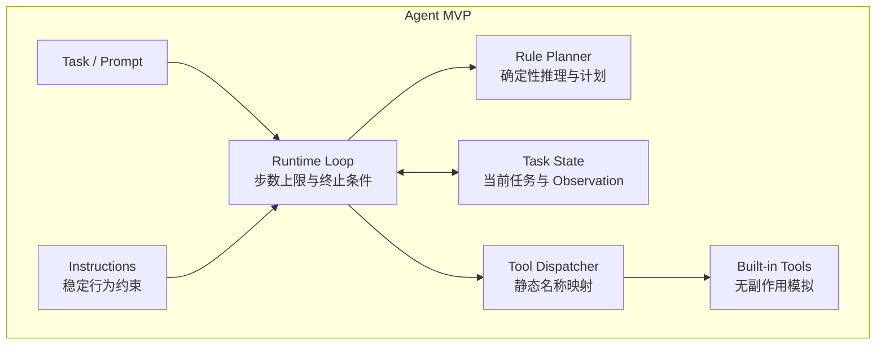
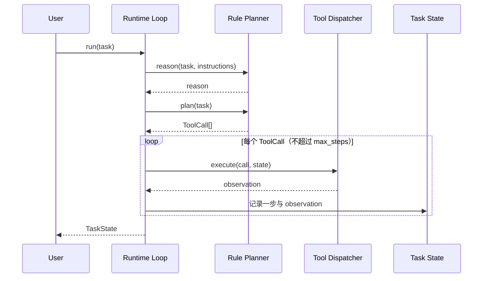

# 第 7 章：Agent MVP：从零实现

> **难度等级：** ⭐⭐⭐⭐
> **所属模块：** 第二部分：构建首个 Agent
> **来源可信度：** 官方文档 / 源码 / 推导 / 观点
> **状态：** ✅ 已完成

---

## 学习目标

完成本章学习后，你将能够：

1. 从零实现一个可运行的最小 AI Agent，整合第 1--6 章的关键概念
2. 理解任务、Instructions、规划、Tool、观察和终止条件如何组成最小纵向闭环
3. 用测试验证 Tool 调用、步数上限和失败终止
4. 说清 MVP 有意省略的能力，以及后续章节如何逐步补齐

---

## 前置知识

- 阅读第 1--6 章
- 具备 Python 或 TypeScript 基础
- 理解 dataclass / interface、循环和基础断言

---

## 1. 背景

### 1.1 MVP 设计哲学

MVP（Minimum Viable Product）的核心是**用最少的组件验证核心价值**。本章不提前组装后续章节的 Memory、Hook、动态 Tool Registry、MCP 和 Plugin，而是先跑通一条可观察、可终止、可测试的纵向路径。

- **包含最小闭环**：Task / Prompt、Instructions、规则 Planner、内置 Tool、当前任务状态和终止条件
- **保持确定性**：不依赖远程 LLM 或外部 API，便于复现行为
- **为演进留接口**：后续章节替换简化组件，而不是推翻主流程

### 1.2 MVP 目标与边界

本章实现一个只读的 Coding Agent 教学切片，它能够：

1. 接收“查找数据库连接配置”之类的任务
2. 结合 Instructions 生成可读的推理说明
3. 生成包含两个 Tool 调用的固定计划
4. 顺序执行、记录 Observation，并在失败或达到步数上限时停止
5. 返回结构化 `TaskState`

它不是功能完备的 Coding Agent：不会修改真实文件、执行 Shell、调用 LLM，也不会根据 Observation 重新规划。最后一点很重要——本章展示的是**单轮最小纵向闭环**，不是 ReAct 式多轮自治循环。

---

## 2. 架构总览



> **图 7-1：** Agent MVP 架构。Runtime Loop、Rule Planner 和 Tool Dispatcher 都在 MVP 内部；输入叫作 Task / Prompt，不虚构独立的 Prompt Handler。示例没有 LLM Interface，第 16 章才展示模型适配器与外部 Provider 的完整边界。

`Instructions` 在这里是构造 Agent 时注入的稳定行为约束；`Task / Prompt` 是每次 `run()` 接收的当前目标。两者都会进入 Runtime，但承担不同职责。

---

## 3. 运行最小纵向切片

主示例位于 `examples/agent-mvp-minimal/`，Python 与 TypeScript 版本都不依赖第三方运行库。

### 3.1 Python

```bash
cd examples/agent-mvp-minimal/python
python main.py
python -m unittest -v test_main.py
```

### 3.2 TypeScript

```bash
cd examples/agent-mvp-minimal/typescript
npm install
npm run build
npm start
```

预期日志依次出现 `task → instructions → reason → plan → execute → observe → finish`。两个 Tool 都在内存中返回模拟数据，不会读写工作目录。

| MVP 中的最小部件 | 本章实际验证什么 | 后续增强章节 |
|------------------|------------------|--------------|
| `instructions` 字符串 | 稳定约束与单次 Task 分离并参与推理 | 第 3、4 章给出完整加载与 Context 组装方法 |
| `TaskState` | 保存本次任务的 Tool 级步数和 Observation | 第 8 章：分级 Memory、检索与遗忘 |
| `for` 执行循环 | 每次 Tool 调用计为一步；失败或超限即停止 | 第 9 章：暂停、恢复、超时、重试、预算与并发 |
| 静态 `ToolDispatcher` | 只分发两个已知的内置 Tool | 第 11 章：注册、来源、状态、路由与调度 |
| 无扩展协议 | MVP 不接入远程能力或 Host 扩展 | 第 12--14 章：Skills、MCP、Plugin |

---

## 4. 核心实现

完整可运行代码以以下文件为唯一事实来源：

- Python：`examples/agent-mvp-minimal/python/main.py`
- TypeScript：`examples/agent-mvp-minimal/typescript/main.ts`

正文只解释关键契约，避免复制一份随后与示例漂移的“完整实现”。

### 4.1 当前任务状态

```python
@dataclass
class TaskState:
    task: str
    step_count: int = 0
    observations: list[dict[str, Any]] = field(default_factory=list)
    finished: bool = False
    error: str | None = None
```

`step_count` 的单位是 **Tool 调用次数**，不是规划轮数。`finished=True` 只表示计划成功执行完毕；未知 Tool、Tool 返回失败或步数不足时，`error` 会记录原因，任务不会被误报为成功。

### 4.2 Instructions 与 Planner

```python
class RulePlanner:
    def reason(self, task: str, instructions: str) -> str:
        return f"遵循约束“{instructions}”，先查找相关信息，再整理可读结论：{task}"

    def plan(self, task: str) -> list[ToolCall]:
        return [
            ToolCall("search_catalog", {"query": task}),
            ToolCall("summarize_observation", {}),
        ]
```

Rule Planner 只用于把 Reasoning / Planning 在架构中的位置显式化。它不会假装具有模型推理能力，也没有未使用的 `available_tools` 参数或未执行的 `depends` 字段。

### 4.3 Runtime Loop

```python
for call in plan:
    if state.step_count >= self.max_steps:
        state.error = f"达到最大步数: {self.max_steps}"
        break

    state.step_count += 1
    observation = self.tools.execute(call, state)
    state.observations.append(observation)

    if not observation.get("ok", False):
        state.error = str(observation.get("error", "tool execution failed"))
        break
else:
    state.finished = True
```

这段循环有三个明确语义：

1. 每次 Tool 调用前检查上限，每次调用只增加一次计数。
2. Tool 失败立即终止，不会在重试全部失败后仍返回成功。
3. 只有完整消费计划时才进入 `for ... else` 并标记完成。

`step_timeout`、总超时、重试和依赖调度没有被“先声明但不生效”；它们分别在第 9 章 Runtime 和第 16 章 Agent Host 参考实现中加入。

### 4.4 组件交互



> **图 7-2：** 单轮最小纵向闭环的组件时序。第二个 Tool 可以读取第一个 Observation，但 Planner 不会根据 Observation 再规划；需要动态循环时，应使用第 5、9、15、16 章介绍的相应模式与运行机制。

---

## 5. 测试核心契约

Python 测试文件 `examples/agent-mvp-minimal/python/test_main.py` 覆盖以下行为：

- 默认计划完成时，`finished=True` 且恰好执行两次 Tool
- `max_steps=1` 时，任务以明确错误停止，不能误报成功
- 未知 Tool 返回结构化失败
- Instructions 确实出现在 Reasoning 中，而不是仅存在于配置字段

测试直接导入示例实现，不在文档中重新定义另一套 `AgentMVP`、Memory、Hook 或 Registry。

---

## 6. MVP 的取舍

### 6.1 有意简化的部分

| 简化项 | 为什么现在不加入 | 增强方向 |
|--------|------------------|----------|
| 不使用真实 LLM | 保持离线、确定、可测试 | 第 16 章加入 LLM Adapter 与结构化 Planner |
| 固定两步计划 | 先验证执行契约，而非规划质量 | 第 5、15、16 章加入动态规划与反思模式 |
| 单线程顺序执行 | 避免提前引入竞态与部分失败 | 第 9、16 章加入依赖感知并发 |
| 只保存当前任务状态 | 避免把列表包装成“完整 Memory” | 第 8 章加入分级 Memory 与持久化策略 |
| 静态 Tool 映射 | 两个 Tool 不需要动态控制面 | 第 11 章加入 Tool Registry 与路由 |
| 无 Hook / Skill / MCP / Plugin | 首个闭环不需要扩展面 | 第 10、12--14 章按需求逐项加入 |

### 6.2 从 MVP 到最终架构

```text
第 7 章 MVP 核心
  → 第 8--11 章：可靠状态、Runtime、Hooks、Tool Registry
  → 第 12--14 章：Skills、MCP、Plugin 扩展
  → 第 15--17 章：编排模式、增强实现、工程治理
```

第 16 章图 16-1 给出最终功能完备的总览，并用章节编号标明每组能力从哪里加入。演进原则是：保留第 7 章的输入—决策—执行—观察主轴，在外围增加可靠性、扩展性与治理能力。

---

## 7. 最佳实践

1. **保持一个事实来源：** 可运行文件是实现真相，正文只摘录稳定契约。
2. **明确计数单位：** `max_steps` 限制 Tool 调用次数，不混用规划轮数。
3. **先定义失败语义：** 失败、超限和完成必须能从返回状态区分。
4. **不声明空能力：** 未实现的 timeout、retry、dependency 字段不要提前加入配置。
5. **隔离副作用：** MVP 使用内存模拟；真实文件和命令执行要等权限、沙箱与审计边界明确后再加入。

---

## 8. 反模式

| 反模式 | 风险 | 推荐方案 |
|--------|------|----------|
| 在 MVP 章提前塞入后续所有组件 | 章节顺序与代码能力冲突 | 第 7 章只保留最小纵向闭环 |
| 正文复制数百行“完整实现” | 文档与示例独立演进后漂移 | 链接可运行文件，只摘录关键契约 |
| 将一次计划执行称为自治循环 | 读者误以为 Observation 会触发重规划 | 明确称为单轮最小纵向闭环 |
| 声明但不执行配置和依赖 | API 给出虚假的可靠性承诺 | 能力实现时再加入字段与测试 |
| 教学示例直接写入任务描述生成的路径 | 产生意外文件或越权副作用 | 使用内存模拟或受控临时工作区 |

---

## 9. FAQ

### Q: MVP 应该用真实 LLM 吗？

不必。先用确定性规则验证状态、Tool 和终止契约，能降低调试变量。任务确实需要语义判断和动态规划时，再按第 16 章接入 LLM。

### Q: 这算“完整 Agent 循环”吗？

它完成了任务输入、规划、执行、观察和终止的一次纵向闭环，但不会把 Observation 反馈给 Planner 再决策。因此本章称它为“单轮最小纵向闭环”；ReAct 或长期自治 Agent 需要额外的循环、预算和恢复机制。

### Q: 为什么本章没有完整组合版？

因为 Memory、Hooks、Tool Registry、MCP 和 Plugin 在第 7 章尚未讲解。把它们提前组合会让示例与学习顺序冲突。读完相关组件后，直接使用第 16 章的 Agent Host 最终组装架构和实现更清晰。

---

## 10. 官方参考

| 编号 | 来源 | 类型 | 说明 |
|------|------|------|------|
| REF-1 | [OpenAI Agents SDK](https://openai.github.io/openai-agents-python/) | 官方文档 | Agent 实现参考 |
| REF-2 | [LangGraph Quickstart](https://langchain-ai.github.io/langgraph/tutorials/introduction/) | 官方文档 | Agent 构建指南 |
| REF-3 | [Building Effective Agents](https://www.anthropic.com/research/building-effective-agents) | 博文 | Agent / Workflow 取舍原则 |

---

## 本章小结

第 7 章只建立一条诚实的最小纵向闭环：Task 与 Instructions 进入内部 Runtime，Rule Planner 产生确定性 ToolCall，Dispatcher 执行无副作用 Tool，TaskState 记录 Tool 级步数与结果。后续章节沿这条主轴逐项增强，而不再维护一份提前容纳全部知识点的“伪最终版”。

---

## 本章 Checklist

- [ ] 能解释图 7-1 中每个组件的真实代码对应物
- [ ] 能区分单轮纵向闭环与动态 Agent 循环
- [ ] 能运行 Python 或 TypeScript MVP
- [ ] 能说明 `step_count`、`finished` 和 `error` 的语义
- [ ] 能运行核心契约测试
- [ ] 能根据第 16 章总览描述 MVP 的逐章演进路径
