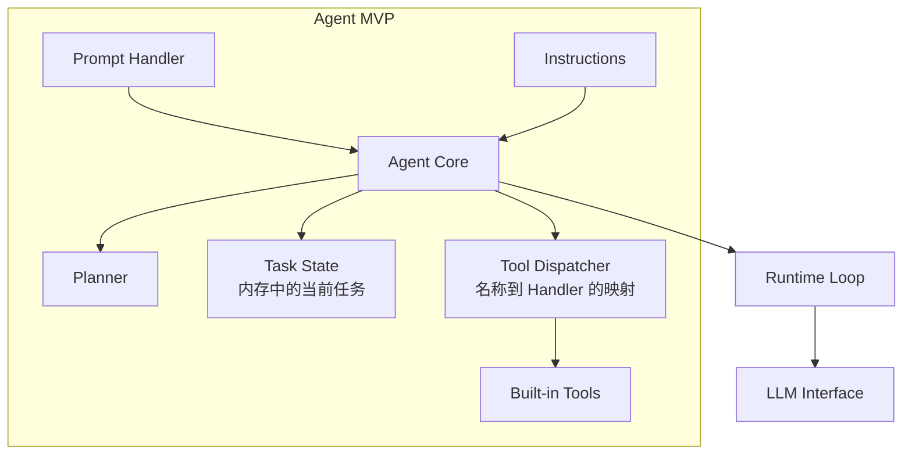
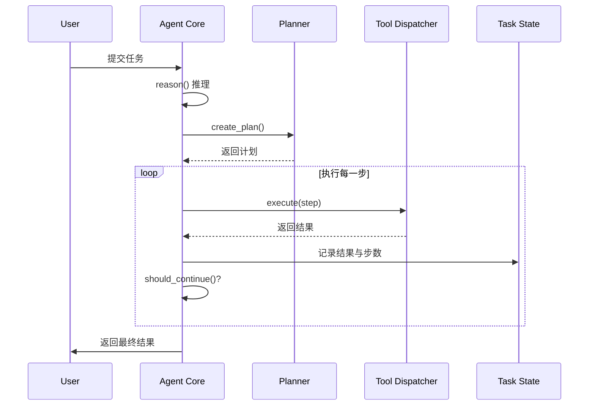

# 第 7 章：Agent MVP：从零实现

> **难度等级：** ⭐⭐⭐⭐
> **所属模块：** 第二部分：构建首个 Agent
> **来源可信度：** 官方文档 / 源码 / 推导 / 观点
> **状态：** ✅ 已完成

---

## 学习目标

完成本章学习后，你将能够：

1. 从零实现一个可运行的最小 AI Agent，整合第 1--6 章的关键概念
2. 理解任务、规划、Tool、观察和终止条件如何形成闭环
3. 掌握 Agent 的测试和调试方法
4. 理解 MVP 设计的取舍原则
5. 获得一个可扩展的 Agent 代码基础

---

## 前置知识

- 阅读第 1--6 章
- 具备 Python 编程能力
- 能阅读 dataclass、枚举和基础单元测试

---

## 1. 背景

### 1.1 MVP 设计哲学

MVP（Minimum Viable Product）的核心是**用最少的代码实现核心价值**。对于 Agent MVP 来说，这意味着：

- **包含最小闭环**：Prompt、Instructions、规则 Planner、内置 Tool、任务状态和终止条件
- **刻意不追求完整**：状态、回调和 Tool 映射只保留教学所需功能，留给后续章节替换
- **可运行、可测试、可扩展**：MVP 是后续增强版的基础

### 1.2 MVP 目标

实现一个 Coding Agent，能够：

1. 接收用户的编程任务
2. 分析任务并制定计划
3. 调用工具（读文件、写文件、搜索、执行命令）
4. 处理执行结果并调整策略
5. 输出最终结果

---

## 2. 架构总览



> **图 7-1：** Agent MVP 架构。先用最小状态、Tool 映射和执行循环跑通闭环；第 8--11 章再分别将它们演进为 Memory、Runtime、Hooks 与 Tool Registry。

---

## 3. 运行最小纵向切片

本章的主示例位于 `examples/agent-mvp-minimal/`，提供 Python 与 TypeScript 两个无外部依赖版本。它只实现“任务 → 推理 → 计划 → 内置 Tool → 观察 → 结束”的闭环，所有 Tool 都是确定性的内存模拟。

```bash
cd book/examples/agent-mvp-minimal/python
python main.py

cd ../typescript
npm install
npm run build
npm start
```

| MVP 中的最小部件 | 本章验证什么 | 后续替换章节 |
|------------------|--------------|--------------|
| `TaskState` | 当前任务的步数和观察结果 | 第 8 章：分级 Memory、检索与遗忘 |
| 执行循环 | 最大步数和基本终止条件 | 第 9 章：暂停、恢复、重试、预算与并发 |
| `ToolDispatcher` | 少量内置 Tool 的静态调用 | 第 11 章：来源、状态、路由与调度 |
| 无 | 不接入远程能力或 Host 扩展 | 第 12--14 章：Skills、MCP、Plugin |

运行结果应清楚输出 `reason → plan → execute → observe → finish`。在此之前不需要理解 Hook、MCP、Plugin 或持久化 Memory。

## 4. 完整组合版（选读）

`examples/coding-agent-mvp/` 以及下方教学代码保留为完整组合版，用于在读完可靠运行部分后观察轻量 Memory、回调和 Tool 映射如何放在同一进程中。它不是第 7 章的前置实现，也不等同于后续章节的生产级组件。

### 4.1 项目结构

```
agent_mvp/
├── core.py            # 最小 Agent 循环与状态
├── planner.py         # 规则 Planner
├── tools.py           # 内置 Tool 与名称映射
├── config.py          # 步数、超时和 Instructions
├── main.py            # 入口
└── tests/             # 核心路径测试
```

本章为了便于单文件阅读，会把上述职责放在同一教学实现中；这不是推荐的生产目录，也不包含 MCP Client、持久化 Memory、完整 Hook Pipeline 或动态 Tool Registry。

### 4.2 核心实现

**图 7-2：Agent MVP 组件交互时序**



> **阅读边界：** 完整组合版使用 `Memory`、`ToolRegistry`、`HookSystem` 等小型类名，目的是让接口位置可见；它们不应被误认为第 8--11 章的完整实现。

| MVP 中的简化物 | 本章只验证什么 | 后续替换章节 |
|----------------|----------------|--------------|
| 内存列表和任务记录 | 本次任务能读取最近结果 | 第 8 章：分级 Memory、检索与遗忘 |
| `while` 循环与超时字段 | 有最大步数和基本终止条件 | 第 9 章：暂停、恢复、重试、预算与并发 |
| 回调列表 | 能观测到关键生命周期点 | 第 10 章：顺序、失败策略、权限和脱敏 |
| 名称到 Handler 的字典 | 能调用少量内置 Tool | 第 11 章：来源、状态、路由与调度 |
| 无 | 不接入远程能力或 Host 扩展 | 第 12--14 章：Skills、MCP、Plugin |

```python
"""
Agent MVP - 核心实现
运行环境：Python 3.10+
依赖：无
"""

import time
import json
from dataclasses import dataclass, field
from enum import Enum
from typing import Any, Callable, Optional
from collections import deque


# ═══════════════════════════════════════════════
# 配置
# ═══════════════════════════════════════════════

@dataclass
class AgentConfig:
    """Agent 全局配置"""
    name: str = "AgentMVP"
    max_steps: int = 10
    step_timeout: float = 30.0
    total_timeout: float = 300.0
    max_retries: int = 2
    instructions: str = ""


# ═══════════════════════════════════════════════
# 状态
# ═══════════════════════════════════════════════

class AgentState(Enum):
    IDLE = "idle"
    LOADING = "loading"
    REASONING = "reasoning"
    PLANNING = "planning"
    EXECUTING = "executing"
    OBSERVING = "observing"
    FINISHED = "finished"
    ERROR = "error"


# ═══════════════════════════════════════════════
# Memory
# ═══════════════════════════════════════════════

@dataclass
class MemoryEntry:
    role: str
    content: str
    timestamp: float = field(default_factory=time.time)
    importance: int = 1


class Memory:
    """分级记忆管理"""

    def __init__(self, short_term_size: int = 20):
        self.short_term: deque[MemoryEntry] = deque(maxlen=short_term_size)
        self.working: dict[str, Any] = {}
        self.long_term: dict[str, MemoryEntry] = {}

    def add(self, role: str, content: str, importance: int = 1):
        self.short_term.append(MemoryEntry(role, content, importance=importance))

    def get_context(self, max_entries: int = 10) -> str:
        entries = list(self.short_term)[-max_entries:]
        return "\n".join(f"[{e.role}] {e.content[:300]}" for e in entries)

    def save(self, key: str, content: str, importance: int = 5):
        self.long_term[key] = MemoryEntry(
            role="memory", content=content, importance=importance
        )

    def recall(self, key: str) -> Optional[str]:
        entry = self.long_term.get(key)
        return entry.content if entry else None

    def search(self, query: str, top_k: int = 5) -> list[str]:
        query_lower = query.lower()
        results = []
        for key, entry in self.long_term.items():
            if query_lower in entry.content.lower():
                results.append((entry.importance, entry.content))
        results.sort(key=lambda x: x[0], reverse=True)
        return [content for _, content in results[:top_k]]


# ═══════════════════════════════════════════════
# Tool
# ═══════════════════════════════════════════════

@dataclass
class Tool:
    """Tool 定义"""
    name: str
    description: str
    parameters: dict
    handler: Callable
    tags: list[str] = field(default_factory=list)


class ToolRegistry:
    """Tool 注册中心"""

    def __init__(self):
        self._tools: dict[str, Tool] = {}

    def register(self, tool: Tool):
        self._tools[tool.name] = tool

    def get(self, name: str) -> Optional[Tool]:
        return self._tools.get(name)

    def list_all(self) -> list[str]:
        return list(self._tools.keys())

    def get_definitions(self) -> list[dict]:
        return [
            {
                "type": "function",
                "function": {
                    "name": t.name,
                    "description": t.description,
                    "parameters": t.parameters
                }
            }
            for t in self._tools.values()
        ]

    def execute(self, name: str, arguments: dict) -> dict:
        tool = self.get(name)
        if not tool:
            return {"success": False, "error": f"Tool '{name}' 不存在"}
        try:
            return tool.handler(**arguments)
        except Exception as e:
            return {"success": False, "error": str(e)}


# ═══════════════════════════════════════════════
# Hooks
# ═══════════════════════════════════════════════

class HookSystem:
    """Hook 系统"""

    EVENTS = [
        "before_load", "after_load",
        "before_reasoning", "after_reasoning",
        "before_planning", "after_planning",
        "before_execute", "after_execute",
        "before_finish", "after_finish",
    ]

    def __init__(self):
        self._hooks: dict[str, list[Callable]] = {e: [] for e in self.EVENTS}

    def on(self, event: str, callback: Callable):
        if event in self._hooks:
            self._hooks[event].append(callback)

    def trigger(self, event: str, *args):
        for hook in self._hooks.get(event, []):
            try:
                hook(*args)
            except Exception as e:
                print(f"  [Hook Error] {event}: {e}")


# ═══════════════════════════════════════════════
# Planner
# ═══════════════════════════════════════════════

class Planner:
    """任务规划器"""

    def create_plan(self, task: str, available_tools: list[str]) -> list[dict]:
        """根据任务创建执行计划"""
        task_lower = task.lower()

        if any(kw in task_lower for kw in ["搜索", "search", "查找"]):
            return [
                {"id": 1, "action": "parse_query", "desc": "解析搜索需求"},
                {"id": 2, "action": "search_code", "desc": "搜索代码库", "depends": [1]},
                {"id": 3, "action": "filter", "desc": "筛选结果", "depends": [2]},
                {"id": 4, "action": "format", "desc": "格式化输出", "depends": [3]},
            ]

        elif any(kw in task_lower for kw in ["读", "read", "查看", "打开"]):
            return [
                {"id": 1, "action": "identify_path", "desc": "确定文件路径"},
                {"id": 2, "action": "read_file", "desc": "读取文件", "depends": [1]},
                {"id": 3, "action": "analyze", "desc": "分析内容", "depends": [2]},
            ]

        elif any(kw in task_lower for kw in ["写", "write", "创建", "修改"]):
            return [
                {"id": 1, "action": "analyze", "desc": "分析需求"},
                {"id": 2, "action": "plan_change", "desc": "制定修改方案", "depends": [1]},
                {"id": 3, "action": "write_file", "desc": "写入文件", "depends": [2]},
                {"id": 4, "action": "verify", "desc": "验证结果", "depends": [3]},
            ]

        else:
            return [
                {"id": 1, "action": "analyze", "desc": "分析任务需求"},
                {"id": 2, "action": "execute", "desc": "执行操作", "depends": [1]},
                {"id": 3, "action": "verify", "desc": "检查结果", "depends": [2]},
            ]


# ═══════════════════════════════════════════════
# Agent Core
# ═══════════════════════════════════════════════

class AgentMVP:
    """Agent MVP 完整实现"""

    from typing import Optional

    def __init__(self, config: Optional[AgentConfig] = None):
        self.config = config or AgentConfig()
        self.state = AgentState.IDLE
        self.memory = Memory()
        self.tools = ToolRegistry()
        self.hooks = HookSystem()
        self.planner = Planner()
        self.step_count = 0
        self._setup()

    def _setup(self):
        """初始化 Agent"""
        # 注册默认 Hook
        self.hooks.on("before_execute",
            lambda ctx, step: print(f"  [Exec] {step.get('desc', '')}"))
        self.hooks.on("after_execute",
            lambda ctx, step, result: print(f"  [Done] {result.get('success', '?')}"))

        # 注册 Built-in Tools
        self._register_builtin_tools()

        self.state = AgentState.LOADING

    def _register_builtin_tools(self):
        """注册内置工具"""
        self.tools.register(Tool(
            name="read_file",
            description="读取文件内容。输入文件路径，返回文件内容。",
            parameters={
                "type": "object",
                "properties": {"path": {"type": "string", "description": "文件路径"}},
                "required": ["path"]
            },
            handler=lambda path: self._read_file(path),
            tags=["file", "io"]
        ))

        self.tools.register(Tool(
            name="write_file",
            description="写入文件内容。输入文件路径和内容，创建或覆盖文件。",
            parameters={
                "type": "object",
                "properties": {
                    "path": {"type": "string", "description": "文件路径"},
                    "content": {"type": "string", "description": "文件内容"}
                },
                "required": ["path", "content"]
            },
            handler=lambda path, content: self._write_file(path, content),
            tags=["file", "io"]
        ))

        self.tools.register(Tool(
            name="search_code",
            description="在代码库中搜索。输入搜索关键词，返回匹配的文件和行。",
            parameters={
                "type": "object",
                "properties": {"query": {"type": "string", "description": "搜索关键词"}},
                "required": ["query"]
            },
            handler=lambda query: self._search_code(query),
            tags=["search"]
        ))

        self.tools.register(Tool(
            name="execute_command",
            description="执行 Shell 命令。输入命令字符串，返回执行结果。",
            parameters={
                "type": "object",
                "properties": {"command": {"type": "string", "description": "Shell 命令"}},
                "required": ["command"]
            },
            handler=lambda command: self._execute_command(command),
            tags=["shell"]
        ))

        self.tools.register(Tool(
            name="list_files",
            description="列出目录中的文件。输入目录路径，返回文件列表。",
            parameters={
                "type": "object",
                "properties": {"path": {"type": "string", "description": "目录路径"}},
                "required": ["path"]
            },
            handler=lambda path: self._list_files(path),
            tags=["file", "io"]
        ))

    # ── Tool 实现 ──────────────────────────────

    def _read_file(self, path: str) -> dict:
        try:
            with open(path, "r") as f:
                content = f.read()
            return {
                "success": True,
                "path": path,
                "content": content[:5000],
                "lines": content.count("\n") + 1,
                "truncated": len(content) > 5000
            }
        except FileNotFoundError:
            return {"success": False, "error": f"文件不存在: {path}"}
        except Exception as e:
            return {"success": False, "error": str(e)}

    def _write_file(self, path: str, content: str) -> dict:
        try:
            with open(path, "w") as f:
                f.write(content)
            return {"success": True, "path": path, "bytes": len(content)}
        except Exception as e:
            return {"success": False, "error": str(e)}

    def _search_code(self, query: str) -> dict:
        # 模拟实现
        return {
            "success": True,
            "query": query,
            "results": [
                {"file": "src/main.py", "line": 42, "match": f"...{query}..."},
                {"file": "src/utils.py", "line": 15, "match": f"...{query}..."},
            ]
        }

    def _execute_command(self, command: str) -> dict:
        import shlex
        import subprocess

        # 教学实现只允许无副作用的 echo；生产环境还需要沙箱、工作目录、
        # 资源限制、审计和逐次授权，不能把模型给出的字符串直接交给 shell。
        parts = shlex.split(command)
        if not parts or parts[0] != "echo":
            return {"success": False, "error": "命令不在教学示例允许列表中"}

        try:
            result = subprocess.run(
                parts, shell=False, capture_output=True,
                text=True, timeout=30
            )
            return {
                "success": result.returncode == 0,
                "stdout": result.stdout[:2000],
                "stderr": result.stderr[:1000],
                "returncode": result.returncode
            }
        except subprocess.TimeoutExpired:
            return {"success": False, "error": "命令执行超时"}
        except Exception as e:
            return {"success": False, "error": str(e)}

    def _list_files(self, path: str) -> dict:
        import os
        try:
            files = os.listdir(path)
            return {
                "success": True,
                "path": path,
                "files": files[:100],
                "count": len(files)
            }
        except Exception as e:
            return {"success": False, "error": str(e)}

    # ── 主循环 ──────────────────────────────────

    def run(self, task: str) -> dict:
        """Agent 主循环"""
        print(f"\n{'='*70}")
        print(f"  {self.config.name} - 开始执行")
        print(f"{'='*70}")
        print(f"  任务: {task}")
        print(f"  可用 Tool: {self.tools.list_all()}")
        print(f"  {'─'*50}")

        start_time = time.time()
        self.memory.add("user", task, importance=5)
        self.state = AgentState.REASONING

        try:
            while self._should_continue(start_time):
                self.step_count += 1

                # 1. Reasoning
                self.state = AgentState.REASONING
                self.hooks.trigger("before_reasoning", self)
                thought = self._reason(task)
                self.memory.add("assistant", f"思考: {thought}")
                self.hooks.trigger("after_reasoning", self, thought)

                # 2. Planning
                self.state = AgentState.PLANNING
                self.hooks.trigger("before_planning", self)
                plan = self.planner.create_plan(task, self.tools.list_all())
                self.hooks.trigger("after_planning", self, plan)

                # 3. Execute
                for step in plan:
                    self.state = AgentState.EXECUTING
                    self.hooks.trigger("before_execute", self, step)

                    result = self._execute_step(step, task)
                    self.memory.add("tool", json.dumps(result, ensure_ascii=False))

                    self.hooks.trigger("after_execute", self, step, result)

                    # 4. Observe
                    self.state = AgentState.OBSERVING
                    if not result.get("success"):
                        self.memory.add("system", f"步骤失败: {result.get('error')}")
                        # 重试当前步骤（最多 max_retries 次）
                        for retry in range(self.config.max_retries):
                            self.hooks.trigger("before_execute", self, step)
                            result = self._execute_step(step, task)
                            self.memory.add("tool",
                                json.dumps(result, ensure_ascii=False))
                            self.hooks.trigger("after_execute", self, step, result)
                            if result.get("success"):
                                break

                # 简单判断：执行完一轮计划就完成
                break

        except Exception as e:
            self.state = AgentState.ERROR
            self.memory.add("system", f"错误: {e}")
            return {
                "success": False,
                "error": str(e),
                "steps": self.step_count,
                "elapsed": time.time() - start_time
            }

        self.state = AgentState.FINISHED
        self.hooks.trigger("before_finish", self)

        elapsed = time.time() - start_time
        result = {
            "success": True,
            "task": task,
            "steps": self.step_count,
            "elapsed": f"{elapsed:.1f}s",
            "memory_entries": len(self.memory.short_term),
            "tools_registered": [t for t in self.tools.list_all()],
        }

        self.hooks.trigger("after_finish", self, result)
        print(f"  {'─'*50}")
        print(f"  ✅ 完成 | 步数: {self.step_count} | 耗时: {elapsed:.1f}s")
        print(f"{'='*70}\n")
        return result

    def _should_continue(self, start_time: float) -> bool:
        if self.step_count >= self.config.max_steps:
            return False
        if time.time() - start_time > self.config.total_timeout:
            return False
        return self.state not in (AgentState.FINISHED, AgentState.ERROR)

    def _reason(self, task: str) -> str:
        """推理阶段（简化实现）"""
        # 实际实现中调用 LLM
        if "搜索" in task:
            return f"需要搜索代码库来查找 '{task}' 相关信息"
        elif "读" in task:
            return f"需要读取文件来获取 '{task}' 内容"
        elif "写" in task:
            return f"需要创建或修改文件来完成 '{task}'"
        return f"分析任务 '{task}'，确定执行策略"

    def _execute_step(self, step: dict, task: str) -> dict:
        """执行单个步骤"""
        action = step.get("action", "")
        desc = step.get("desc", "")

        # 根据 action 类型选择 Tool，从 step 动态获取参数
        tool_map = {
            "read_file": ("read_file", {"path": desc}),
            "write_file": ("write_file", {"path": desc, "content": task}),
            "search_code": ("search_code", {"query": desc}),
            "execute_command": ("execute_command", {"command": f"echo '{desc}'"}),
            "list_files": ("list_files", {"path": "."}),
            # 分析型步骤：使用 search_code 作为通用分析工具
            "parse_query": ("search_code", {"query": desc}),
            "filter": ("search_code", {"query": desc}),
            "format": ("search_code", {"query": desc}),
            "analyze": ("search_code", {"query": desc}),
            "identify_path": ("list_files", {"path": "."}),
            "plan_change": ("search_code", {"query": desc}),
            "verify": ("list_files", {"path": "."}),
        }

        if action in tool_map:
            tool_name, args = tool_map[action]
            return self.tools.execute(tool_name, args)

        # 未识别的 action
        return {"success": True, "action": action, "desc": desc, "result": "完成"}


# ═══════════════════════════════════════════════
# 入口
# ═══════════════════════════════════════════════

def main():
    # 配置
    config = AgentConfig(
        name="AgentMVP",
        max_steps=10,
        instructions="你是一个 Coding Agent，帮助用户完成编程任务。"
    )

    # 创建 Agent
    agent = AgentMVP(config)

    # 注册自定义 Hook
    def metrics_hook(ctx, step=None, result=None):
        print(f"  [Metrics] 步骤: {ctx.step_count}, 记忆: {len(ctx.memory.short_term)}")
    agent.hooks.on("after_execute", metrics_hook)

    # 测试不同任务
    test_tasks = [
        "搜索数据库连接相关的代码",
        "读取 main.py 文件",
        "创建一个 README.md 文件",
        "列出当前目录的文件",
    ]

    for task in test_tasks:
        result = agent.run(task)
        agent.step_count = 0  # 重置计数器
        agent.memory = Memory()  # 清空记忆


if __name__ == "__main__":
    main()
```

**预期输出：**

> 以下为示意输出，实际输出可能因 LLM 响应不同而有所差异。

```
======================================================================
  AgentMVP - 开始执行
======================================================================
  任务: 搜索数据库连接相关的代码
  可用 Tool: ['read_file', 'write_file', 'search_code', 'execute_command', 'list_files']
  ──────────────────────────────────────────────────
  [Exec] 解析搜索需求
  [Done] True
  [Metrics] 步骤: 1, 记忆: 3
  [Exec] 搜索代码库
  [Done] True
  [Metrics] 步骤: 1, 记忆: 4
  [Exec] 筛选结果
  [Done] True
  [Metrics] 步骤: 1, 记忆: 5
  [Exec] 格式化输出
  [Done] True
  [Metrics] 步骤: 1, 记忆: 6
  ──────────────────────────────────────────────────
  ✅ 完成 | 步数: 1 | 耗时: 0.0s
======================================================================
```

---

## 5. Agent MVP 测试

### 5.1 单元测试

```python
"""
Agent MVP 测试
运行环境：Python 3.10+
"""

import unittest


class TestAgentMVP(unittest.TestCase):

    def setUp(self):
        self.agent = AgentMVP(AgentConfig(max_steps=5))

    def test_initialization(self):
        """测试初始化"""
        self.assertEqual(self.agent.state, AgentState.LOADING)
        self.assertGreater(len(self.agent.tools.list_all()), 0)
        self.assertGreater(len(self.agent.hooks._hooks), 0)

    def test_tool_registration(self):
        """测试 Tool 注册"""
        tools = self.agent.tools.list_all()
        self.assertIn("read_file", tools)
        self.assertIn("write_file", tools)
        self.assertIn("search_code", tools)

    def test_tool_execution(self):
        """测试 Tool 执行"""
        result = self.agent.tools.execute("search_code", {"query": "test"})
        self.assertTrue(result["success"])

    def test_tool_not_found(self):
        """测试不存在的 Tool"""
        result = self.agent.tools.execute("nonexistent", {})
        self.assertFalse(result["success"])

    def test_run_basic(self):
        """测试基本运行"""
        result = self.agent.run("搜索代码")
        self.assertTrue(result["success"])
        self.assertGreater(result["steps"], 0)

    def test_plan_creation(self):
        """测试计划生成"""
        plan = self.agent.planner.create_plan(
            "搜索数据库", self.agent.tools.list_all()
        )
        self.assertGreater(len(plan), 0)
        # 搜索任务应该有 4 步
        self.assertEqual(len(plan), 4)

    def test_memory_operations(self):
        """测试记忆操作"""
        self.agent.memory.add("user", "test message")
        context = self.agent.memory.get_context()
        self.assertIn("test message", context)

    def test_hook_trigger(self):
        """测试 Hook 触发"""
        triggered = []

        def test_hook(*args):
            triggered.append(True)

        self.agent.hooks.on("before_reasoning", test_hook)
        self.agent.hooks.trigger("before_reasoning", self.agent)
        self.assertTrue(triggered)


if __name__ == "__main__":
    unittest.main()
```

---

## 6. MVP 的取舍

### 6.1 有意简化的部分

| 简化项 | 原因 | 增强方向 |
|--------|------|---------|
| 不使用真实 LLM | MVP 聚焦架构，不依赖外部 API | 集成 OpenAI/Anthropic API |
| 规划器基于规则 | 简单可靠，不依赖模型推理 | 使用 LLM 进行动态规划 |
| 单线程执行 | 降低复杂度 | 并行 Tool 调用 |
| 内存存储 | 简单直接 | 持久化到数据库 |
| 硬编码 Tool 选择 | 逻辑清晰 | 模型驱动的 Tool 选择 |
| 简化的 Memory / Hook / Registry 类 | 只展示接口位置，避免在首个闭环引入控制面复杂度 | 第 8--11 章逐项替换 |

### 6.2 MVP 到 Enhanced 的路径

```
MVP → 集成 LLM → 动态规划 → 并行执行 → 持久化 → 生产部署
```

第 16 章将详细介绍增强版 Agent 的实现。

---

## 7. 最佳实践

1. **先跑通再优化：** MVP 的首要目标是可运行，然后是正确，最后才是性能。
2. **组件松耦合：** 每个组件通过接口交互，可以独立替换和测试。
3. **配置驱动：** 使用配置对象管理参数，避免硬编码。
4. **日志即文档：** 在关键节点打印日志，既是调试工具也是运行文档。
5. **测试覆盖核心路径：** 至少覆盖 Tool 执行、计划生成、主循环三个核心路径。

---

## 8. 反模式

| 反模式 | 风险 | 推荐方案 |
|--------|------|---------|
| 过度设计 MVP | 开发周期长，核心价值不明确 | 先实现最小可用版本 |
| 忽略测试 | 回归风险高 | 核心路径必须有测试 |
| 硬编码业务逻辑 | 难以扩展 | 使用配置和策略模式 |
| 组件强耦合 | 牵一发而动全身 | 接口隔离，依赖注入 |

---

## 9. FAQ

### Q: MVP 应该用真实 LLM 吗？

建议先用模拟实现验证架构，再集成真实 LLM。这样可以在不依赖外部 API 的情况下快速迭代架构设计。

### Q: MVP 的 Planner 为什么不用 LLM？

基于规则的 Planner 简单可靠，便于理解和调试。在 MVP 阶段，重要的是验证整体架构流程，而非规划的质量。第 16 章将实现 LLM 驱动的 Planner。

### Q: 如何评估 MVP 是否成功？

MVP 成功的标准：能跑通一个完整的 Agent 循环（推理→规划→执行→观察），关键失败路径可测试，且你能明确指出哪些能力仍是简化物。它不要求已经实现持久化、MCP、动态 Registry 或生产级安全控制。

---

## 10. 官方参考

| 编号 | 来源 | 类型 | 说明 |
|------|------|------|------|
| REF-1 | [OpenAI Agents SDK](https://openai.github.io/openai-agents-python/) | 官方文档 | Agent 实现的参考 |
| REF-2 | [LangGraph Quickstart](https://langchain-ai.github.io/langgraph/tutorials/introduction/) | 官方文档 | Agent 构建指南 |
| REF-3 | [Building Effective Agents](https://www.anthropic.com/research/building-effective-agents) | 博文 | Anthropic 的 Agent 构建原则 |

---

## 本章小结

最小 Agent 只需要完成一条纵向闭环：接收目标、决定动作、调用 Tool、观察结果并终止。MVP 的价值是验证任务和接口，而不是提前容纳所有组件；后续增强应由失败样本、恢复需求和评估数据驱动。

---

## 本章 Checklist

- [ ] 理解 MVP 的设计哲学和取舍原则
- [ ] 能画出 Agent MVP 架构图
- [ ] 能实现完整的 Agent 核心循环
- [ ] 运行了 Agent MVP 示例代码
- [ ] 运行了单元测试
- [ ] 理解 MVP 到 Enhanced 的升级路径
