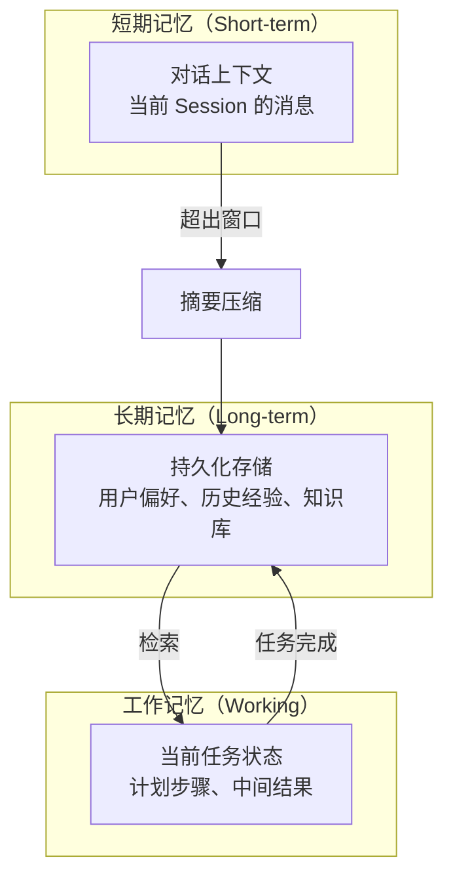
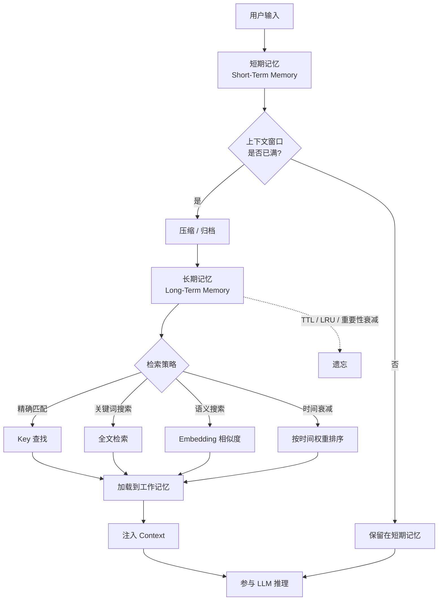
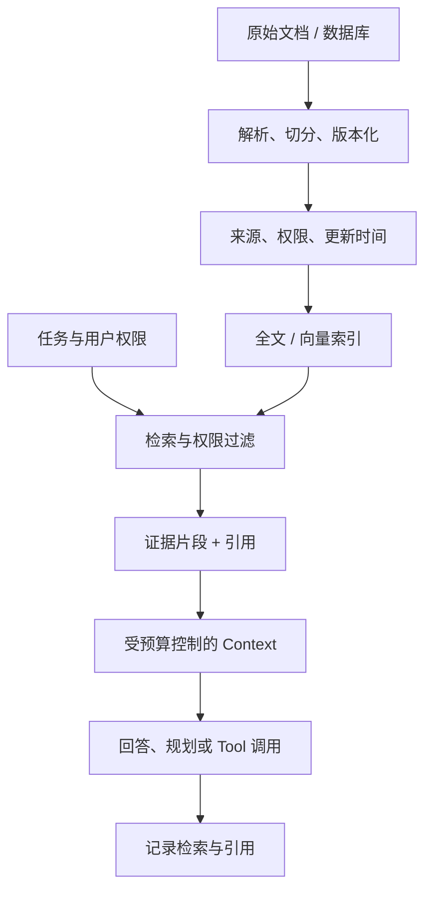

# 第 8 章：Memory：状态与记忆管理

> **难度等级：** ⭐⭐⭐
> **所属模块：** 第三部分：可靠运行
> **来源可信度：** 官方文档 / 论文 / 推导 / 观点
> **状态：** ✅ 已完成

---

## 学习目标

完成本章学习后，你将能够：

1. 理解 Agent 中 Memory 的分级存储模型
2. 掌握短期记忆、工作记忆、长期记忆的设计与实现
3. 理解记忆的检索、更新和遗忘策略
4. 实现一个完整的 Memory 系统
5. 避免 Memory 无限增长等常见反模式

---

## 前置知识

- 阅读第 2 章「总体架构与生命周期」
- 阅读第 4 章「Context 管理」
- Memory 与 Context 管理密切相关

---

## 1. 背景

第 7 章的 MVP 只把最近结果保存在内存中，用来证明执行闭环。本章从这一最小状态开始，解决跨 Session、可检索、可遗忘和可审计的 Memory 问题；不要把 MVP 中的列表直接扩展成无边界长期记忆。

### 1.1 为什么需要 Memory

没有 Memory 的 Agent 是「失忆」的——每次对话从零开始，无法记住之前的交互。这导致：

- 重复询问相同信息
- 无法利用历史经验
- 长期任务无法跟踪进度

Memory 让 Agent 能够「记住」——从几秒前的 Tool 结果到几天前的用户偏好。

> **来源类型：** 推导分析 —— 基于 LLM 无状态特性和 Agent 长对话需求

### 1.2 Memory 分级模型



> **图 8-1：** Memory 分级存储模型。三层记忆：短期（对话上下文）、工作（当前任务状态）、长期（持久化存储）。

| 层级 | 生命周期 | 容量 | 存储方式 | 访问速度 |
|------|---------|------|---------|---------|
| 短期记忆 | 当前 Session | 受模型上下文和请求预算限制 | 内存 / 当前 Context | 极快 |
| 工作记忆 | 当前任务 | 受任务状态、TTL 与资源预算限制 | 内存 / Session 状态 | 快 |
| 长期记忆 | 跨 Session | 受保留期、成本、检索性能和删除义务限制 | 数据库 / 键值库 / 向量索引 | 取决于存储与检索 |

> **来源类型：** 推导分析 —— 基于认知心理学中的记忆模型和 Agent 工程实践

---

## 2. Memory 系统实现

### 2.1 完整 Memory 系统

```python
"""
Memory 系统 - 教学实现
运行环境：Python 3.10+
依赖：无
"""

import time
from dataclasses import dataclass, field
from collections import deque
from typing import Any, Optional


@dataclass
class MemoryEntry:
    """记忆条目"""
    id: str
    content: str
    role: str = ""
    timestamp: float = field(default_factory=time.time)
    last_accessed: float = field(default_factory=time.time)
    importance: int = 1  # 1-10，重要程度
    metadata: dict = field(default_factory=dict)
    tenant_id: str = "default"
    subject_id: str = "anonymous"
    namespace: str = "conversation"
    provenance: str = "user_input"
    trust: str = "untrusted"  # untrusted / verified / user_confirmed
    retention_until: float | None = None
    consent: bool = False
    version: int = 1


class MemorySystem:
    """分级 Memory 系统"""

    def __init__(self,
                 short_term_size: int = 20,
                 working_size: int = 10):
        # 短期记忆：对话上下文
        self.short_term: deque[MemoryEntry] = deque(maxlen=short_term_size)

        # 工作记忆：当前任务状态
        self.working: dict[str, Any] = {}

        # 长期记忆：持久化存储
        self.long_term: dict[str, MemoryEntry] = {}

        self._entry_counter = 0

    def _next_id(self) -> str:
        self._entry_counter += 1
        return f"mem_{self._entry_counter}"

    # ── 短期记忆 ────────────────────────────────

    def add_to_short_term(self, role: str, content: str,
                          importance: int = 1):
        """添加到短期记忆"""
        entry = MemoryEntry(
            id=self._next_id(),
            role=role,
            content=content,
            importance=importance
        )
        self.short_term.append(entry)
        return entry

    def get_short_term_context(self, max_entries: int = 10) -> str:
        """获取短期记忆上下文"""
        entries = list(self.short_term)[-max_entries:]
        return "\n".join(
            f"[{e.role}] {e.content[:200]}"
            for e in entries
        )

    # ── 工作记忆 ────────────────────────────────

    def set_working(self, key: str, value: Any):
        """设置工作记忆"""
        self.working[key] = value

    def get_working(self, key: str) -> Any:
        """获取工作记忆"""
        return self.working.get(key)

    def clear_working(self):
        """清空工作记忆"""
        self.working.clear()

    # ── 长期记忆 ────────────────────────────────

    def save_to_long_term(self, key: str, content: str,
                          importance: int = 5,
                          metadata: Optional[dict] = None,
                          *, tenant_id: str = "default",
                          subject_id: str = "anonymous",
                          namespace: str = "preference",
                          provenance: str = "user_input",
                          trust: str = "untrusted",
                          retention_until: float | None = None,
                          consent: bool = False):
        """保存到长期记忆"""
        if namespace == "preference" and not consent:
            raise PermissionError("用户偏好写入长期记忆前必须获得明确同意")
        storage_key = f"{tenant_id}:{subject_id}:{namespace}:{key}"
        entry = MemoryEntry(
            id=self._next_id(),
            content=content,
            importance=importance,
            metadata=metadata or {}, tenant_id=tenant_id,
            subject_id=subject_id, namespace=namespace,
            provenance=provenance, trust=trust,
            retention_until=retention_until, consent=consent,
        )
        self.long_term[storage_key] = entry
        return entry

    def recall_from_long_term(self, key: str, *, tenant_id: str = "default",
                              subject_id: str = "anonymous",
                              namespace: str = "preference") -> Optional[MemoryEntry]:
        """从长期记忆检索"""
        storage_key = f"{tenant_id}:{subject_id}:{namespace}:{key}"
        entry = self.long_term.get(storage_key)
        if entry and entry.retention_until and entry.retention_until <= time.time():
            del self.long_term[storage_key]
            return None
        if entry:
            entry.last_accessed = time.time()
        return entry

    def search_long_term(self, query: str, top_k: int = 5, *,
                         tenant_id: str = "default",
                         subject_id: str = "anonymous") -> list[MemoryEntry]:
        """搜索长期记忆（简化实现：关键词匹配）"""
        query_lower = query.lower()
        scored = []
        for entry in self.long_term.values():
            if entry.tenant_id != tenant_id or entry.subject_id != subject_id:
                continue
            if entry.retention_until and entry.retention_until <= time.time():
                continue
            score = 0
            if query_lower in entry.content.lower():
                score += 1
                score += entry.importance * 0.1
            if score > 0 or not query_lower:
                scored.append((score, entry))

        scored.sort(key=lambda x: x[0], reverse=True)
        results = [entry for _, entry in scored[:top_k]]
        for entry in results:
            entry.last_accessed = time.time()
        return results

    def forget(self, key: str, *, tenant_id: str = "default",
               subject_id: str = "anonymous",
               namespace: str = "preference") -> bool:
        """删除主存储记录；生产实现还必须传播到索引、缓存和备份策略。"""
        storage_key = f"{tenant_id}:{subject_id}:{namespace}:{key}"
        if storage_key in self.long_term:
            del self.long_term[storage_key]
            return True
        return False

    def _forget_storage_key(self, storage_key: str) -> bool:
        """供保留策略使用；业务调用仍应通过带租户边界的 forget()。"""
        return self.long_term.pop(storage_key, None) is not None

    # ── 记忆压缩 ────────────────────────────────

    def compress_short_term(self):
        """压缩短期记忆：将低重要性的记忆归档到长期"""
        if len(self.short_term) < self.short_term.maxlen:
            return

        # 将低重要性的旧记忆归档并删除
        entries = list(self.short_term)
        for entry in entries[:len(entries)//2]:  # 前半部分
            if entry.importance < 3:
                self.save_to_long_term(
                    key=f"archive_{entry.id}",
                    content=entry.content,
                    importance=entry.importance,
                    namespace="task_archive",
                    provenance="conversation_compaction",
                )
                self.short_term.remove(entry)  # 归档后释放短期记忆空间

    # ── 统计 ────────────────────────────────────

    def get_stats(self) -> dict:
        return {
            "short_term_count": len(self.short_term),
            "short_term_max": self.short_term.maxlen,
            "working_keys": list(self.working.keys()),
            "long_term_count": len(self.long_term),
            "total_entries": self._entry_counter,
        }


def main():
    memory = MemorySystem(short_term_size=10)

    print("=" * 60)
    print("  Memory 系统演示")
    print("=" * 60)

    # 模拟对话
    conversations = [
        ("user", "我叫小明，是一名 Python 开发者", 5),
        ("assistant", "你好小明！有什么可以帮你的？", 1),
        ("user", "帮我搜索异步编程的资料", 3),
        ("tool", "搜索到 15 篇关于 asyncio 的文章", 2),
        ("assistant", "找到了相关资料，需要我总结吗？", 1),
        ("user", "是的，请总结", 3),
        ("assistant", "asyncio 的核心是 event loop...", 4),
        ("user", "把这个总结保存下来", 5),
        ("assistant", "已保存到长期记忆", 3),
    ]

    for role, content, importance in conversations:
        memory.add_to_short_term(role, content, importance)

    # 保存关键信息到长期记忆
    memory.save_to_long_term(
        key="user_name",
        content="用户叫小明，是一名 Python 开发者",
        importance=5,
        subject_id="user-001",
        trust="user_confirmed",
        consent=True,
    )
    memory.save_to_long_term(
        key="asyncio_summary",
        content="asyncio 核心概念: event loop, coroutine, task, future, await/async",
        importance=4,
        subject_id="user-001",
        namespace="saved_note",
        trust="user_confirmed",
        consent=True,
    )

    # 打印统计
    stats = memory.get_stats()
    print(f"\n  短期记忆: {stats['short_term_count']}/{stats['short_term_max']}")
    print(f"  长期记忆: {stats['long_term_count']} 条")
    print(f"  工作记忆: {stats['working_keys']}")

    # 检索
    print(f"\n  检索长期记忆:")
    entry = memory.recall_from_long_term("user_name", subject_id="user-001")
    if entry:
        print(f"    user_name: {entry.content}")

    # 搜索
    print(f"\n  搜索 'asyncio':")
    results = memory.search_long_term("asyncio", subject_id="user-001")
    for r in results:
        print(f"    [{r.importance}] {r.content[:80]}")

    # 压缩
    memory.compress_short_term()
    print(f"\n  压缩后: 长期记忆 {memory.get_stats()['long_term_count']} 条")

    print("=" * 60)


if __name__ == "__main__":
    main()
```

---

## 3. 记忆检索策略



> **图 8-2：** 记忆生命周期与检索流程。短期状态在预算压力下压缩或归档，检索结果经工作记忆进入 Context；遗忘策略独立作用于持久化记录。

### 3.1 检索方式对比

| 方式 | 适用场景 | 优点 | 缺点 |
|------|---------|------|------|
| 精确匹配 | 已知 Key | 快速、准确 | 需要知道 Key |
| 关键词搜索 | 模糊查询 | 灵活 | 可能遗漏 |
| 语义搜索 | 复杂查询 | 理解语义 | 需要 Embedding |
| 时间衰减 | 时效性强的信息 | 自动淘汰旧信息 | 可能丢失重要信息 |

### 3.2 语义搜索（基于 Embedding）

```python
class SemanticMemory(MemorySystem):
    """支持语义搜索的 Memory 系统"""

    def __init__(self, *args, **kwargs):
        super().__init__(*args, **kwargs)
        self._embeddings: dict[str, list[float]] = {}

    def save_with_embedding(self, key: str, content: str,
                            embedding: list[float],
                            importance: int = 5):
        """保存记忆并附带 Embedding"""
        self.save_to_long_term(key, content, importance)
        self._embeddings[key] = embedding

    def semantic_search(self, query_embedding: list[float],
                        top_k: int = 5) -> list[MemoryEntry]:
        """基于余弦相似度的语义搜索"""
        scored = []
        for key, emb in self._embeddings.items():
            similarity = self._cosine_similarity(query_embedding, emb)
            if similarity > 0.5:
                entry = self.long_term.get(key)
                if entry:
                    scored.append((similarity, entry))

        scored.sort(key=lambda x: x[0], reverse=True)
        return [entry for _, entry in scored[:top_k]]

    @staticmethod
    def _cosine_similarity(a: list[float], b: list[float]) -> float:
        dot = sum(x * y for x, y in zip(a, b))
        norm_a = sum(x ** 2 for x in a) ** 0.5
        norm_b = sum(x ** 2 for x in b) ** 0.5
        return dot / (norm_a * norm_b) if norm_a and norm_b else 0
```

### 3.3 Memory、Knowledge System 与 RAG 的边界

向量检索可以用于长期记忆，也可以用于检索增强生成（Retrieval-Augmented Generation, RAG），但两者并不是同义词。混用会导致用户偏好被当成不可变事实，或把文档知识写回为难以更正的“记忆”。

| 维度 | Agent Memory | Knowledge System / RAG |
|------|--------------|------------------------|
| 主要对象 | 会话摘要、任务状态、用户偏好、历史经验 | 文档、数据库记录、产品知识、规范等外部资料 |
| 写入来源 | Agent 或用户交互，可写入也可遗忘 | 受控的数据同步、索引和版本发布 |
| 正确性要求 | 关注相关性、时效和用户可更正性 | 需要来源、版本、权限和可追溯引用 |
| 检索后用途 | 恢复状态或个性化当前任务 | 为回答、规划或 Tool 调用补充可核查事实 |
| 常见存储 | Session、键值库、数据库、向量索引 | 文档库、搜索引擎、向量库、知识图谱 |

推荐的处理顺序是：先根据任务确定需要的是“状态”还是“事实”；对事实检索保留来源和更新时间；仅把经过用户确认或明确归纳的稳定信息写入长期记忆。两类系统可以共享 Embedding 或检索基础设施，但应保留不同的权限、保留期和删除策略。

向量数据库只是可能的存储或索引实现，不是 Memory 的定义。RAG 是“检索证据并增强当前生成”的流程，也不是 Memory。生产系统应避免以下等式：`Vector Store = Memory`、`RAG = Memory`、`Conversation Log = Long-term Memory`。是否属于 Memory 取决于写入主体、用途、可修改/遗忘规则和跨 Run 生命周期，而不是底层是否使用 Embedding。

> **来源类型：** 推导分析 —— 基于本书对 Context、Memory 与外部 Tool 的职责划分

### 3.4 知识接入与可引用检索流程

RAG 的关键不是“把文档向量化”这一动作，而是保持从原始资料到最终回答的可追溯链路。摄取时应记录来源、版本、权限和更新时间；检索时应先过滤无权访问或已过期的资料；注入 Context 时应保留可供用户核查的引用标识。



> **图 8-3：** 知识接入与可引用检索。Knowledge System 通过来源、权限和版本元数据保持可追溯性，而不是直接写入 Agent 的长期记忆。

---

## 4. 记忆遗忘策略

### 4.1 遗忘策略

| 策略 | 说明 | 适用场景 |
|------|------|---------|
| FIFO | 先进先出，移除最旧记忆 | 对话历史 |
| LRU | 最近最少使用 | 缓存型记忆 |
| 重要性衰减 | 低重要性记忆优先遗忘或降权 | 可评分的用户 / Agent 记忆 |
| 时间衰减 | 超过 TTL 的记忆自动遗忘 | 时效性信息 |
| 手动遗忘 | 用户主动删除 | 隐私相关 |

### 4.2 遗忘策略实现

```python
class MemoryWithForgetting(MemorySystem):
    """带遗忘策略的 Memory 系统"""

    def forget_by_importance(self, threshold: int = 2):
        """遗忘低重要性记忆"""
        to_forget = [
            key for key, entry in self.long_term.items()
            if entry.importance < threshold
        ]
        for key in to_forget:
            self._forget_storage_key(key)
        return len(to_forget)

    def forget_by_age(self, max_age_seconds: float):
        """遗忘过期记忆"""
        now = time.time()
        to_forget = [
            key for key, entry in self.long_term.items()
            if now - entry.timestamp > max_age_seconds
        ]
        for key in to_forget:
            self._forget_storage_key(key)
        return len(to_forget)

    def forget_by_lru(self, keep_count: int):
        """保留最近使用的 N 条，遗忘其余（按 last_accessed 排序）"""
        if len(self.long_term) <= keep_count:
            return 0

        # 按 last_accessed 排序，保留最近访问的
        sorted_entries = sorted(
            self.long_term.items(),
            key=lambda x: x[1].last_accessed,
            reverse=True
        )
        to_forget = [key for key, _ in sorted_entries[keep_count:]]
        for key in to_forget:
            self._forget_storage_key(key)
        return len(to_forget)
```

---

## 5. 最佳实践

1. **分层存储：** 短期、工作、长期记忆各司其职，不要混用。
2. **重要性标注：** 对记忆标注重要性，优先保留高重要性记忆。
3. **定期清理：** 实施遗忘策略，防止记忆无限增长。
4. **记忆压缩：** 将短期记忆中的重要内容归档到长期记忆。
5. **检索优化：** 根据查询类型组合精确键、结构化过滤、全文/关键词和语义检索；先做租户与权限过滤，再校准混合排序。
6. **租户与主体隔离：** 每次写入和查询都携带 tenant、subject 与 namespace，不能先全局检索再在应用层过滤。
7. **来源与信任分离：** Tool 输出和模型推断默认是不可信 Observation；只有经过规则验证或用户确认的信息才能升级为长期偏好。
8. **删除必须可证明：** 用户删除请求应传播到主存储、全文/向量索引、缓存和受保留策略约束的备份，并留下不含原文的审计证明。

---

## 6. 反模式

| 反模式 | 风险 | 推荐方案 |
|--------|------|---------|
| Memory 无限增长 | 上下文溢出，检索变慢 | 实施遗忘策略，定期清理 |
| 所有记忆同等重要 | 关键信息被淹没 | 标注重要性，分层存储 |
| 忽略记忆检索 | 存了但找不到 | 实现多种检索策略 |
| 短期记忆当长期用 | 上下文窗口浪费 | 分层存储，按需检索 |
| 将 RAG 当作用户记忆 | 事实与偏好混淆，难以更正或删除 | 分离知识索引与可遗忘的用户记忆 |

---

## 7. FAQ

### Q: Memory 和 Context 管理有什么区别？

Memory 关注「存什么」和「怎么检索」，Context 管理关注「当前上下文放什么」和「怎么裁剪」。Memory 是存储层，Context 是展示层。长期记忆通过检索进入当前上下文。

### Q: Memory 和 RAG 有什么区别？

Memory 主要保存 Agent 的状态、任务经验或用户偏好；RAG 主要从受控的外部知识源检索可引用事实。二者都可能使用向量检索，但 RAG 更强调来源、版本和权限，Memory 更强调写入确认、遗忘和用户控制。

### Q: 长期记忆应该用什么存储？

先按查询模式、并发、租户隔离、备份和删除义务选择存储，而非只按记录数选择。原型可使用 SQLite；已有关系型数据与过滤需求时可使用 PostgreSQL 及其向量扩展；只有检索规模、延迟或运维能力确有要求时，再评估专用检索服务。无论选哪种，都应保存来源、版本、权限和删除策略。

### Q: 如何平衡记忆的「记住」和「遗忘」？

通过重要性评分和时间衰减。重要信息（用户偏好、关键决策）长期保留，临时信息（中间结果、对话细节）自动遗忘。

---

## 8. 官方参考

| 编号 | 来源 | 类型 | 说明 |
|------|------|------|------|
| REF-1 | [MemGPT Paper](https://arxiv.org/abs/2310.08560) (Packer et al., 2023) | 论文 | 虚拟内存管理在 LLM 中的应用 |
| REF-2 | [Generative Agents Paper](https://arxiv.org/abs/2304.03442) (Park et al., 2023) | 论文 | 具有记忆和反思的 Agent |
| REF-3 | [LangChain Memory](https://python.langchain.com/docs/modules/memory/) | 官方文档 | LangChain 的 Memory 实现 |

---

## 本章小结

Memory 保存可恢复状态、任务经验或经确认的用户偏好，知识系统则提供带来源和权限的外部事实。分层的关键不仅是存储介质，还包括写入确认、检索用途、保留期和删除能力；“记住更多”并不天然等于“表现更好”。

---

## 本章 Checklist

- [ ] 理解 Memory 的三级存储模型
- [ ] 能画出 Memory 分级存储图
- [ ] 能实现短期、工作、长期记忆
- [ ] 理解至少 3 种遗忘策略
- [ ] 理解记忆检索的多种方式
- [ ] 运行了 Memory 系统示例代码
