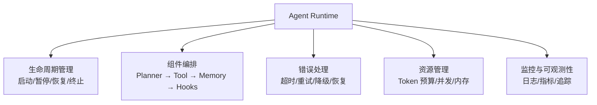
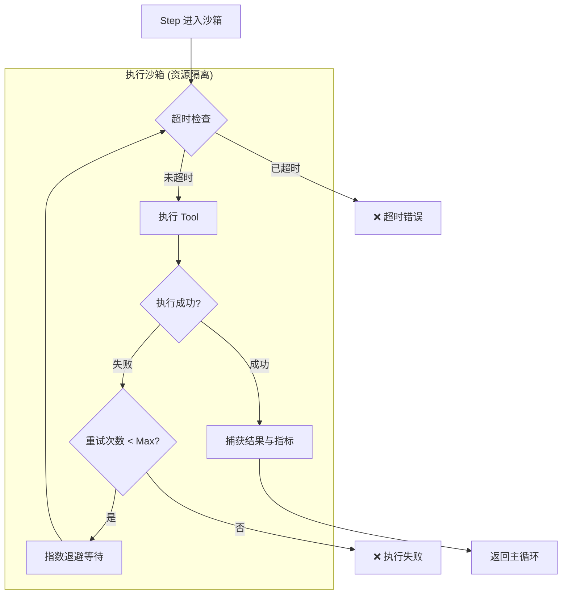

# 第 9 章：Runtime：Agent 运行时

> **难度等级：** ⭐⭐⭐⭐
> **所属模块：** 第三部分：可靠运行
> **来源可信度：** 官方文档 / 源码 / 推导 / 观点
> **状态：** ✅ 已完成

---

## 学习目标

完成本章学习后，你将能够：

1. 理解 Agent Runtime 的职责和核心组件
2. 掌握 Agent 主循环的教学实现
3. 理解并发控制、超时管理和错误恢复
4. 实现一个可配置的 Agent Runtime
5. 理解 Runtime 的性能优化策略

---

## 前置知识

- 阅读第 2 章「总体架构与生命周期」
- 阅读第 6 章「Tools 与 Function Calling」
- 阅读第 8 章「Memory：状态与记忆管理」

---

## 1. 背景

### 1.1 为什么需要 Runtime

第 7 章的 MVP 已有一个简单循环，第 8 章开始把状态显式化；但谁来协调 Planner、Tool 和 Memory？谁来管理生命周期、超时、取消和错误？本章把这些控制责任收束为 Runtime。Hook 是下一章加入的横切扩展，而不是理解本章的前置条件。

**Runtime 是 Agent 的操作系统。** 它负责：

- 调度组件（什么时候调用 Planner，什么时候调用 Tool）
- 管理生命周期（启动、运行、暂停、终止）
- 处理异常（超时、错误、重试）
- 资源管理（Token 预算、并发控制、内存限制）

这里要区分三个层次：Application / Agent Host 是应用级组合与治理边界，Runtime 是驱动一次或多次 Agent Run 的执行服务，Agent/Subagent 才是接收目标并作出决策的运行主体。因此 `AgentHost ≠ Agent`，`Runtime ≠ Agent`；Runtime 可以执行 Agent 请求的 Tool Call，却不应把业务决策硬编码进调度器。

> **来源类型：** 推导分析 —— 基于 Claude Code、OpenAI Agents SDK 等框架的 Runtime 设计

### 1.2 Runtime 的核心职责



> **图 9-1：** Runtime 的核心职责。五大关注点：生命周期、组件编排、错误处理、资源管理、监控。

### 1.3 Runtime 的决策边界：何时需要，以及代价

**What：** Runtime 是把模型、Planner、Tool、Memory、Hook 和审批状态组织为一次可控制执行的协调层；它不等同于某个模型 SDK，也不负责替代业务 Tool 的实现。

**When：** 单次、无副作用的问答可以只由应用代码顺序调用模型；出现以下任一信号时，应引入显式 Runtime：多步 Tool 调用、取消或超时、并发任务、人工审批、会话恢复、预算限制，或需要追踪一次执行的完整轨迹。

| 选择 | 收益 | Trade-off 与控制 |
|------|------|-----------------|
| 应用内顺序调用 | 代码短、调试直接，适合原型和只读任务 | 生命周期与错误处理容易散落在业务层；为每次调用保留请求 ID、超时和最大步数 |
| 轻量 Runtime | 统一状态、预算、重试和 Hook，适合单 Agent 多步任务 | 引入状态机和接口边界；先支持最少状态与可观测性，避免过早做成工作流平台 |
| 可持久化 / 分布式 Runtime | 可恢复、可扩展，能承载审批和长任务 | 增加存储一致性、幂等、租户隔离和运维成本；每个副作用步骤都要有幂等键、检查点和取消语义 |

后续代码演示的是轻量 Runtime：它说明控制流和状态边界，不等同于可直接用于跨进程恢复或高可用调度的生产实现。

### 1.4 运行身份与恢复不变量

Application 与 Runtime 的边界至少应分别保存或关联 `task_id`、`run_id`、`session_id`、`trace_id` 和当前 `checkpoint_revision`：Session/Task 通常由应用层拥有，Run/Checkpoint 由 Runtime 拥有，Trace 贯穿两层。对整个 Task 发起新的执行尝试时创建新的 `run_id`；同一 Run 内针对幂等 Tool 的有限瞬时重试仍属于原 Run；从 Checkpoint 恢复未完成执行也沿用原 `run_id` 并递增 revision。子代理创建 `child_run_id` 并记录 `parent_run_id`。任何写操作使用单独的 `idempotency_key`，不能用 Session 或 Run ID 粗暴替代，因为同一次 Run 可能合法地对同一 Tool 执行多次不同写入。

恢复前必须比较任务版本、能力快照、Policy、Profile 和输入 Artifact 的兼容性。Replay 默认只读；若要重放副作用，必须显式进入重新执行流程并重新授权。

---

## 2. Runtime 实现

### 2.1 完整 Runtime

```python
"""
Agent Runtime - 教学实现
运行环境：Python 3.10+
依赖：无
"""

import time
import concurrent.futures
from dataclasses import dataclass, field
from enum import Enum
from typing import Any, Callable, Optional


class RunState(Enum):
    IDLE = "idle"
    RUNNING = "running"
    PAUSED = "paused"
    ERROR = "error"
    FINISHED = "finished"
    EXHAUSTED = "exhausted"
    CANCELLED = "cancelled"


@dataclass
class RuntimeConfig:
    """Runtime 配置"""
    max_steps: int = 10
    step_timeout: float = 30.0
    total_timeout: float = 300.0
    max_retries: int = 2
    token_budget: int = 100000
    enable_parallel_tools: bool = False


@dataclass
class RunContext:
    """运行上下文"""
    task: str
    state: RunState = RunState.IDLE
    step_count: int = 0
    token_used: int = 0
    start_time: float = 0.0
    errors: list[str] = field(default_factory=list)
    metrics: dict = field(default_factory=dict)


class AgentRuntime:
    """Agent Runtime"""

    from typing import Optional

    def __init__(self, config: Optional[RuntimeConfig] = None):
        self.config = config or RuntimeConfig()
        self.context: Optional[RunContext] = None
        self._hooks: dict[str, list[Callable]] = {}
        self._components: dict[str, Any] = {}

    def register_component(self, name: str, component: Any):
        """注册组件"""
        self._components[name] = component

    def on(self, event: str, callback: Callable):
        """注册事件回调"""
        self._hooks.setdefault(event, []).append(callback)

    def _trigger(self, event: str, *args):
        """触发事件"""
        for hook in self._hooks.get(event, []):
            try:
                hook(*args)
            except Exception as e:
                if self.context:
                    self.context.errors.append(f"Hook error: {e}")

    # ── 生命周期 ────────────────────────────────

    def start(self, task: str) -> RunContext:
        """启动 Runtime"""
        self.context = RunContext(
            task=task,
            state=RunState.RUNNING,
            start_time=time.time()
        )
        self._trigger("on_start", self.context)
        return self.context

    def pause(self):
        """暂停"""
        if self.context:
            self.context.state = RunState.PAUSED
            self._trigger("on_pause", self.context)

    def resume(self):
        """恢复"""
        if self.context and self.context.state == RunState.PAUSED:
            self.context.state = RunState.RUNNING
            self._trigger("on_resume", self.context)

    def cancel(self):
        """取消"""
        if self.context:
            self.context.state = RunState.CANCELLED
            self._trigger("on_cancel", self.context)

    def finish(self, result: Any = None) -> RunContext:
        """收尾并记录指标；不得覆盖取消、暂停、错误或耗尽状态。"""
        if self.context:
            self.context.metrics["total_time"] = (
                time.time() - self.context.start_time
            )
            self._trigger("on_finish", self.context, result)
        return self.context

    # ── 主循环 ──────────────────────────────────

    def run(self, task: str,
            reasoner: Callable,
            planner: Callable,
            executor: Callable) -> RunContext:
        """运行 Agent 主循环"""
        self.start(task)
        result = None
        completed = False

        try:
            while self._should_continue():
                # 检查超时
                self._check_timeout()

                # 1. Reasoning
                self._trigger("before_reasoning", self.context)
                thought = reasoner(self.context)
                self._trigger("after_reasoning", self.context, thought)

                # 2. Planning
                self._trigger("before_planning", self.context)
                plan = planner(self.context, thought)
                self._trigger("after_planning", self.context, plan)

                # 3. Execute
                result = None
                for step in plan:
                    if not self._should_continue():
                        break

                    self._check_timeout()
                    self._trigger("before_execute", self.context, step)
                    result = self._execute_with_retry(executor, step)
                    self._trigger("after_execute", self.context, step, result)

                    self.context.step_count += 1

                # 4. 判断是否完成
                if result is not None and self._is_complete(result):
                    completed = True
                    self.context.state = RunState.FINISHED
                    break

            if self.context.state == RunState.RUNNING and not completed:
                self.context.state = RunState.EXHAUSTED
                self.context.errors.append(
                    f"达到最大 Tool 步数 ({self.config.max_steps})，任务尚未完成"
                )

        except TimeoutError:
            self.context.state = RunState.ERROR
            self.context.errors.append("执行超时")
        except Exception as e:
            self.context.state = RunState.ERROR
            self.context.errors.append(str(e))

        return self.finish()

    def _should_continue(self) -> bool:
        """判断是否继续"""
        if not self.context:
            return False
        return (
            self.context.state == RunState.RUNNING
            and self.context.step_count < self.config.max_steps
        )

    def _check_timeout(self):
        """检查总执行时间；单步超时由 Future 等待负责。"""
        if not self.context:
            return
        elapsed = time.time() - self.context.start_time
        if elapsed > self.config.total_timeout:
            raise TimeoutError(f"总执行时间超时 ({self.config.total_timeout}s)")

    def _remaining_timeout(self) -> float:
        """单步上限不能超过本次运行的剩余总时间。"""
        if not self.context:
            raise RuntimeError("Runtime 尚未启动")
        remaining = self.config.total_timeout - (
            time.time() - self.context.start_time
        )
        if remaining <= 0:
            raise TimeoutError(f"总执行时间超时 ({self.config.total_timeout}s)")
        return min(self.config.step_timeout, remaining)

    def _execute_once(self, executor: Callable, step: Any) -> Any:
        """在独立工作线程中等待一步，超时后立即把控制权还给 Runtime。"""
        pool = concurrent.futures.ThreadPoolExecutor(max_workers=1)
        future = pool.submit(executor, self.context, step)
        try:
            return future.result(timeout=self._remaining_timeout())
        except concurrent.futures.TimeoutError as exc:
            future.cancel()
            raise TimeoutError(
                f"单步执行超时 ({self.config.step_timeout}s)"
            ) from exc
        finally:
            # 不等待已经开始的线程；生产 Tool 仍需实现协作式取消和资源隔离。
            pool.shutdown(wait=False, cancel_futures=True)

    def _execute_with_retry(self, executor: Callable,
                            step: Any) -> Any:
        """带重试的执行"""
        last_error = None
        for attempt in range(self.config.max_retries + 1):
            try:
                return self._execute_once(executor, step)
            except TimeoutError:
                # 底层工作可能仍在运行，未知副作用不得自动重试。
                raise
            except Exception as e:
                last_error = e
                if attempt < self.config.max_retries:
                    self._check_timeout()
                    time.sleep(0.5 * (attempt + 1))  # 退避
        raise last_error

    def _is_complete(self, result: Any) -> bool:
        """判断任务是否完成"""
        if isinstance(result, dict):
            return result.get("done", False)
        return False

    # ── 监控 ────────────────────────────────────

    def get_metrics(self) -> dict:
        """获取运行指标"""
        if not self.context:
            return {}
        return {
            "state": self.context.state.value,
            "steps": self.context.step_count,
            "max_steps": self.config.max_steps,
            "token_used": self.context.token_used,
            "errors": len(self.context.errors),
            "elapsed": time.time() - self.context.start_time,
            **self.context.metrics
        }


def main():
    # 创建 Runtime
    runtime = AgentRuntime(RuntimeConfig(
        max_steps=5,
        step_timeout=10.0,
        total_timeout=60.0,
        max_retries=2
    ))

    # 注册监控 Hook
    runtime.on("on_start", lambda ctx: print(f"  [Start] 任务: {ctx.task}"))
    runtime.on("before_execute", lambda ctx, step: print(f"  [Exec] {step}"))
    runtime.on("on_finish", lambda ctx, result: print(f"  [Finish] {ctx.state.value}"))

    # 定义组件
    def reasoner(ctx):
        return f"思考: {ctx.task}"

    def planner(ctx, thought):
        return ["分析任务", "执行操作", "检查结果"]

    def executor(ctx, step):
        print(f"    执行: {step}")
        if step == "检查结果":
            return {"done": True, "result": "任务完成"}
        return {"done": False}

    # 运行
    print("=" * 60)
    print("  Agent Runtime 演示")
    print("=" * 60)

    ctx = runtime.run(
        task="搜索 Python 异步编程",
        reasoner=reasoner,
        planner=planner,
        executor=executor
    )

    print(f"\n  运行指标:")
    for k, v in runtime.get_metrics().items():
        print(f"    {k}: {v}")
    print("=" * 60)


if __name__ == "__main__":
    main()
```

可运行并带契约测试的双语言版本位于 `examples/runtime/`。它验证只有 `done=true` 才进入 `FINISHED`，并覆盖 `EXHAUSTED`、`CANCELLED` 与单步超时：

```bash
python examples/runtime/python/main.py
python -m unittest discover -s examples/runtime/python -p 'test_*.py' -v
npm --prefix examples/runtime/typescript test
```

---

## 3. 并发控制



> **图 9-2：** 执行沙箱与重试流程。只有可重试且满足幂等约束的失败才返回退避分支；Sandbox 负责资源隔离，不能被重试策略替代。

### 3.1 并行 Tool 调用

当多个 Tool 调用相互独立时，可以并行执行以提升效率：

```python
import concurrent.futures

class ParallelRuntime(AgentRuntime):
    """支持并行 Tool 调用的 Runtime"""

    def _execute(self, ctx, tool_call: dict) -> dict:
        """执行单个 Tool 调用（供并行执行使用）"""
        name = tool_call.get("name", "unknown")
        arguments = tool_call.get("arguments", {})
        # 简化实现：返回调用信息
        # 实际实现中通过 Tool Registry 执行
        return {"success": True, "tool": name, "result": f"executed {name}"}

    def execute_parallel(self, tool_calls: list[dict]) -> list[dict]:
        """并行执行多个 Tool 调用"""
        results = []
        executor = concurrent.futures.ThreadPoolExecutor(max_workers=5)
        futures = {
            executor.submit(self._execute_with_retry, self._execute, tc): tc
            for tc in tool_calls
        }
        done, not_done = concurrent.futures.wait(
            futures,
            timeout=self._remaining_timeout()
        )
        for future in done:
            try:
                results.append(future.result())
            except Exception as e:
                results.append({"success": False, "error": str(e)})
        for future in not_done:
            future.cancel()
            tool_call = futures[future]
            results.append({
                "success": False,
                "tool": tool_call.get("name", "unknown"),
                "error": f"并行批次超时 ({self.config.step_timeout}s)"
            })
        executor.shutdown(wait=False, cancel_futures=True)
        return results
```

> **超时边界：** 线程 Future 超时只能保证 Runtime 不再等待，不能强制终止已经开始的底层调用。生产级 Tool 必须同时具备请求级超时、协作式取消、资源隔离和幂等键；发生未知副作用的超时不得自动重试。

---

## 4. 最佳实践

1. **设置多层超时：** 单步超时 + 总超时 + Token 预算，防止失控。
2. **错误隔离：** 单个 Tool 失败不应影响整个 Agent，应支持重试和降级。
3. **状态可恢复：** Runtime 状态应支持序列化，允许暂停和恢复。
4. **监控先行：** 在 Runtime 层面埋点，记录每一步的耗时、Token 使用和错误。
5. **并发控制：** 对独立 Tool 调用使用并行执行，但限制并发数。

---

## 5. 反模式

| 反模式 | 风险 | 推荐方案 |
|--------|------|---------|
| 无超时控制 | Agent 无限执行 | 多层超时：步骤 + 总时间 + Token |
| 达到步数上限仍标记完成 | 调用方误判任务成功 | 使用 `EXHAUSTED` 等独立终态，只有满足完成条件才进入 `FINISHED` |
| 静默吞错误 | 问题隐藏，难以调试 | 记录所有错误，支持告警 |
| 同步阻塞 | 响应慢 | 独立 Tool 并行执行 |
| 状态不可恢复 | 中断后无法继续 | 支持状态序列化和恢复 |

---

## 6. FAQ

### Q: Runtime 和 Agent Loop 有什么区别？

Agent Loop 是 Runtime 的核心循环（Reasoning → Planning → Execute → Observe），Runtime 是管理这个循环的完整环境（包括生命周期、错误处理、并发控制、监控）。

### Q: 如何实现 Agent 的暂停和恢复？

需要将 Runtime 状态（当前步骤、上下文、Memory）序列化。恢复时反序列化并继续执行。这要求所有组件支持序列化。

---

## 7. 官方参考

| 编号 | 来源 | 类型 | 说明 |
|------|------|------|------|
| REF-1 | [OpenAI Agents SDK](https://github.com/openai/openai-agents-python) | 源码 | Agent Runtime 的参考实现 |
| REF-2 | [LangGraph Runtime](https://langchain-ai.github.io/langgraph/) | 官方文档 | 图状态机 Runtime |
| REF-3 | [Claude Code Architecture](https://docs.anthropic.com/en/docs/claude-code) | 官方文档 | Claude Code 的 Runtime 设计 |

---

## 本章小结

Runtime 把模型、Tool、状态和控制策略组织成一次可管理的执行。它应明确步骤与总量限制、取消与恢复语义、并发边界和错误分类；如果只有短小且不可恢复的单步流程，则无需过早抽象出重量级运行时。

---

## 本章 Checklist

- [ ] 理解 Runtime 的五大核心职责
- [ ] 能实现完整的 Agent Runtime
- [ ] 理解超时控制和重试机制
- [ ] 理解并发 Tool 调用的设计
- [ ] 运行了 Runtime 示例代码
