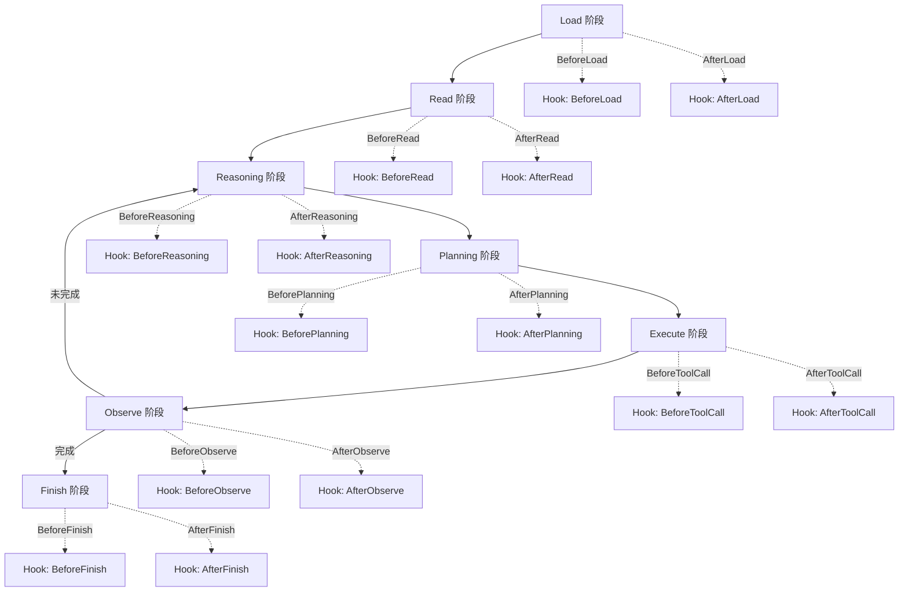
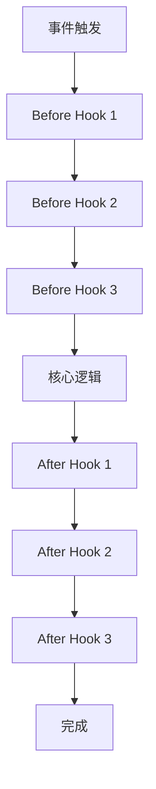

# 第 10 章：Hooks：生命周期事件

> **难度等级：** ⭐⭐⭐
> **所属模块：** 第三部分：可靠运行
> **来源可信度：** 官方文档 / 源码 / 推导 / 观点
> **状态：** ✅ 已完成

---

## 学习目标

完成本章学习后，你将能够：

1. 理解 Hook 在 Agent 生命周期中的定位和作用
2. 掌握 Before/After Hook 的设计模式
3. 理解 Hook Pipeline 的执行顺序和拦截机制
4. 实现常见 Hook 类型（日志、权限、监控、数据脱敏）
5. 避免 Hook 滥用和常见反模式

---

## 前置知识

- 阅读第 2 章「总体架构与生命周期」
- 建议阅读第 9 章「Runtime：Agent 运行时」
- 理解 Agent 生命周期的 7 个阶段
- 了解事件驱动编程的基本概念

---

## 1. 背景

第 7 章 MVP 中的回调列表只用于展示事件位置，第 9 章 Runtime 则定义了可控制的执行生命周期。本章把两者演进为有顺序、可中断、可审计的 Hook Pipeline；它不应承载业务主流程或取代每次 Tool 执行时的授权判断。

### 1.1 为什么需要 Hook

在 Agent 的运行过程中，有许多横切关注点（Cross-cutting Concerns）需要在生命周期的特定节点处理：

- **日志记录：** 记录每一步的执行状态
- **权限检查：** 在 Tool 调用前验证权限
- **性能监控：** 测量每个阶段的耗时
- **数据脱敏：** 在输出前过滤敏感信息
- **审计追踪：** 记录关键决策和操作

如果不使用 Hook，这些逻辑会分散在 Agent 的各个组件中，导致代码耦合、难以维护。

**Hook 将这些横切关注点统一为生命周期事件回调，实现关注点分离。**

> **来源类型：** 推导分析 —— 基于 AOP（面向切面编程）在 Agent 中的应用

### 1.2 Hook 的设计哲学

Hook 的设计遵循以下原则：

1. **非侵入性：** Hook 不修改 Agent 核心逻辑，只做拦截和增强
2. **可组合性：** 多个 Hook 可以注册到同一个事件，按顺序执行
3. **失败隔离：** 一个 Hook 的失败不应影响 Agent 主流程
4. **轻量级：** Hook 应该快速执行，不应阻塞主流程

> **来源类型：** 作者观点 —— 基于 Claude Code Hooks 和 Web 中间件的设计模式

---

## 2. 核心概念

### 2.1 Hook 在生命周期中的位置



> **图 10-1：** Hook 在生命周期中的位置。每个生命周期阶段都有 Before 和 After 两个 Hook 拦截点。

### 2.2 Before Hook vs After Hook

| 维度 | Before Hook | After Hook |
|------|------------|------------|
| 触发时机 | 阶段开始前 | 阶段结束后 |
| 可访问数据 | 输入参数与当前执行上下文 | 输入参数、执行结果与当前执行上下文 |
| 可执行操作 | 验证、修改参数、阻止执行 | 记录结果；仅在 Host 暴露输出管道时修改输出或触发后续操作 |
| 典型用途 | 权限检查、参数校验 | 日志记录、结果脱敏、指标收集 |
| 是否可中断 | 可以（按 Host 约定拒绝或抛出异常） | 可标记失败或阻止后续步骤，但通常无法撤销已经发生的副作用 |

### 2.3 Hook Pipeline



> **图 10-2：** Hook Pipeline。多个 Hook 按注册顺序执行，Before Hook 在核心逻辑之前，After Hook 在核心逻辑之后。

---

## 3. Hook 系统实现

### 3.1 完整 Hook 系统

```python
"""
Hook 系统 - 完整 Hook 实现
运行环境：Python 3.10+
依赖：无
预期输出：Hook 注册、触发和 Pipeline 的演示
"""

import time
from typing import Callable
from dataclasses import dataclass, field
from enum import Enum


class HookPriority(Enum):
    """Hook 优先级"""
    HIGH = 0    # 最先执行
    NORMAL = 1
    LOW = 2     # 最后执行


@dataclass
class HookContext:
    """Hook 执行上下文"""
    event: str
    agent_state: str
    timestamp: float = field(default_factory=time.time)
    data: dict = field(default_factory=dict)


@dataclass
class HookDefinition:
    """Hook 定义"""
    name: str
    event: str
    callback: Callable
    priority: HookPriority = HookPriority.NORMAL
    enabled: bool = True


class HookSystem:
    """Hook 系统"""

    # 标准生命周期事件
    EVENTS = [
        "before_load", "after_load",
        "before_read", "after_read",
        "before_reasoning", "after_reasoning",
        "before_planning", "after_planning",
        "before_tool_call", "after_tool_call",
        "before_observe", "after_observe",
        "before_finish", "after_finish",
    ]

    def __init__(self):
        self._hooks: dict[str, list[HookDefinition]] = {
            event: [] for event in self.EVENTS
        }
        self.shared_data: dict = {}

    def register(self, event: str, callback: Callable,
                 name: str = "",
                 priority: HookPriority = HookPriority.NORMAL):
        """注册 Hook"""
        if event not in self._hooks:
            raise ValueError(f"未知事件: {event}")

        hook = HookDefinition(
            name=name or callback.__name__,
            event=event,
            callback=callback,
            priority=priority,
        )
        self._hooks[event].append(hook)
        # 按优先级排序
        self._hooks[event].sort(key=lambda h: h.priority.value)

    def unregister(self, event: str, name: str):
        """注销 Hook"""
        self._hooks[event] = [
            h for h in self._hooks[event] if h.name != name
        ]

    def trigger(self, event: str, context: HookContext) -> HookContext:
        """触发 Hook Pipeline"""
        if event not in self._hooks:
            return context

        for hook in self._hooks[event]:
            if not hook.enabled:
                continue
            try:
                hook.callback(context)
            except Exception as e:
                if event.startswith("before_"):
                    # Before Hook 异常可阻止操作执行
                    raise
                # 其他 Hook 失败不影响主流程
                print(f"  [Hook Error] {hook.name}: {e}")

        return context

    def list_hooks(self) -> dict[str, list[str]]:
        """列出所有 Hook"""
        return {
            event: [h.name for h in hooks]
            for event, hooks in self._hooks.items()
            if hooks
        }


class AgentWithHooks:
    """带 Hook 系统的 Agent"""

    def __init__(self):
        self.hooks = HookSystem()
        self.state = "init"
        self._setup_default_hooks()

    def _setup_default_hooks(self):
        """设置默认 Hook"""
        # 日志 Hook
        def log_hook(ctx: HookContext):
            print(f"  [LOG] {ctx.event} | state={ctx.agent_state}")

        # 计时 Hook
        def timing_hook(ctx: HookContext):
            ctx.data["start_time"] = time.time()

        def timing_end_hook(ctx: HookContext):
            start = ctx.data.get("start_time")
            if start:
                elapsed = (time.time() - start) * 1000
                print(f"  [TIMING] {ctx.event}: {elapsed:.1f}ms")

        # 为所有事件注册日志
        for event in HookSystem.EVENTS:
            self.hooks.register(event, log_hook, name="logger")

        # 为关键事件注册计时
        self.hooks.register("before_reasoning", timing_hook, name="timing_start")
        self.hooks.register("after_finish", timing_end_hook, name="timing_end")

    def _run_phase(self, phase: str, func: Callable, *args, **kwargs):
        """运行一个生命周期阶段"""
        self.state = phase

        # Before Hook
        ctx = HookContext(
            event=f"before_{phase}",
            agent_state=self.state,
            data={**self.hooks.shared_data, **kwargs}
        )
        try:
            self.hooks.trigger(f"before_{phase}", ctx)
        except Exception as e:
            print(f"  [BLOCKED] {phase}: {e}")
            return None
        # 同步 before hook 写入的数据到共享状态
        self.hooks.shared_data.update(ctx.data)

        # 核心逻辑
        result = func(*args)

        # After Hook
        ctx = HookContext(
            event=f"after_{phase}",
            agent_state=self.state,
            data={**self.hooks.shared_data, "result": result}
        )
        self.hooks.trigger(f"after_{phase}", ctx)

        return result

    def run(self, task: str):
        """运行 Agent 完整生命周期"""
        print("=" * 60)
        print("  Agent Hooks 系统演示")
        print("=" * 60)

        self._run_phase("load", lambda: "loaded")
        self._run_phase("read", lambda: f"read: {task}")
        self._run_phase("reasoning", lambda: f"thinking about: {task}")
        self._run_phase("planning", lambda: "plan created")
        self._run_phase("tool_call", lambda: "tool executed", tool_name="search_code")
        self._run_phase("observe", lambda: "observation done")
        self._run_phase("finish", lambda: "task completed")

        print("=" * 60)


def main():
    agent = AgentWithHooks()

    # 注册自定义 Hook：权限检查
    def permission_check(ctx: HookContext):
        """在 Tool 调用前检查权限"""
        allowed_tools = ["read_file", "search_code", "execute_command"]
        tool_name = ctx.data.get("tool_name", "")
        if tool_name and tool_name not in allowed_tools:
            raise PermissionError(f"Tool '{tool_name}' 不在允许列表中")
        print(f"  [PERMISSION] ✅ {tool_name or 'no tool'}")

    agent.hooks.register(
        "before_tool_call", permission_check,
        name="permission_check",
        priority=HookPriority.HIGH
    )

    # 注册自定义 Hook：数据脱敏
    def data_masking(ctx: HookContext):
        """在输出前脱敏敏感数据"""
        result = ctx.data.get("result", "")
        if isinstance(result, str):
            # 模拟脱敏：替换 API Key
            masked = result.replace("sk-", "sk-***")
            if masked != result:
                ctx.data["result"] = masked
                print(f"  [MASKING] 已脱敏")

    agent.hooks.register(
        "after_observe", data_masking,
        name="data_masking"
    )

    # 列出所有 Hook
    print("\n已注册 Hook:")
    for event, hooks in agent.hooks.list_hooks().items():
        print(f"  {event}: {hooks}")

    # 运行 Agent
    agent.run("搜索 AI 新闻")

    # 显示 Hook 统计
    print(f"\nHook 事件类型: {len(HookSystem.EVENTS)}")
    total_hooks = sum(
        len(hooks) for hooks in agent.hooks._hooks.values()
    )
    print(f"已注册 Hook 总数: {total_hooks}")


if __name__ == "__main__":
    main()
```

---

## 4. 常见 Hook 类型

### 4.1 日志 Hook

```python
def create_logger_hook(log_file: str = ""):
    """创建日志 Hook"""
    def log(ctx: HookContext):
        entry = (
            f"[{time.strftime('%Y-%m-%d %H:%M:%S')}] "
            f"{ctx.event} | state={ctx.agent_state}"
        )
        if log_file:
            with open(log_file, "a") as f:
                f.write(entry + "\n")
        else:
            print(f"  [LOG] {entry}")
    return log
```

### 4.2 性能监控 Hook

```python
def create_metrics_hook():
    """创建性能监控 Hook"""
    metrics = {}

    def before(ctx: HookContext):
        ctx.data["_metrics_start"] = time.time()

    def after(ctx: HookContext):
        start = ctx.data.get("_metrics_start")
        if start:
            elapsed = (time.time() - start) * 1000
            event = ctx.event.replace("after_", "")
            if event not in metrics:
                metrics[event] = []
            metrics[event].append(elapsed)

    def report():
        print("\n  性能报告:")
        for event, times in metrics.items():
            avg = sum(times) / len(times)
            print(f"    {event}: avg={avg:.1f}ms, count={len(times)}")

    return before, after, report
```

### 4.3 权限检查 Hook

```python
def create_permission_hook(allowed_tools: set[str]):
    """创建权限检查 Hook"""
    def check(ctx: HookContext):
        tool_name = ctx.data.get("tool_name", "")
        if not tool_name:
            return
        if tool_name not in allowed_tools:
            raise PermissionError(
                f"Tool '{tool_name}' 不在允许列表中。"
                f"允许: {allowed_tools}"
            )
    return check
```

### 4.4 数据脱敏 Hook

```python
import re

def create_masking_hook(patterns: dict[str, str]):
    """创建数据脱敏 Hook"""
    def mask(ctx: HookContext):
        result = ctx.data.get("result", "")
        if not isinstance(result, str):
            return

        for pattern, replacement in patterns.items():
            result = re.sub(pattern, replacement, result)

        ctx.data["result"] = result
    return mask

# 使用示例
masking = create_masking_hook({
    r'sk-[a-zA-Z0-9]+': 'sk-***REDACTED***',
    r'Bearer [a-zA-Z0-9._-]+': 'Bearer ***REDACTED***',
    r'\b[A-Za-z0-9._%+-]+@[A-Za-z0-9.-]+\.[A-Z|a-z]{2,}\b': '***@***.***',
})
```

---

## 5. 最佳实践

1. **Hook 只做横切关注点：** 日志、监控、权限、脱敏。不要将业务逻辑放入 Hook。
2. **Hook 快速执行：** Hook 不应阻塞主流程。耗时操作（如写数据库）应异步处理。
3. **失败隔离：** 一个 Hook 的失败不应影响其他 Hook 或 Agent 主流程。
4. **优先级排序：** 权限检查应在最前面（HIGH），日志可以放在最后（LOW）。
5. **Hook 可配置：** 通过配置控制 Hook 的启用/禁用，方便调试和性能调优。
6. **命名清晰：** Hook 名称应清晰表达其功能，便于调试时定位。

---

## 6. 反模式

| 反模式 | 风险 | 推荐方案 |
|--------|------|---------|
| Hook 承担业务逻辑 | 耦合严重，难以测试 | Hook 只做横切关注点 |
| Hook 阻塞主流程 | Agent 响应变慢 | 耗时操作异步化 |
| Hook 修改核心数据 | 数据不一致，难以调试 | Hook 只读或只修改元数据 |
| 忽略 Hook 异常 | 静默失败，问题隐藏 | 记录 Hook 异常但不中断主流程 |
| Hook 过多 | 性能下降，调试困难 | 按需注册，定期审查 |
| Hook 间有依赖 | 顺序敏感，脆弱 | 每个 Hook 独立，不依赖其他 Hook |

---

## 7. FAQ

### Q: Hook 和 Middleware 有什么区别？

概念上非常相似，都是拦截器模式。区别在于作用域：Hook 作用于 Agent 生命周期，Middleware 通常作用于 Web 请求/响应。Agent 的 Hook 更关注推理、规划、Tool 调用等 Agent 特定事件。

### Q: Before Hook 可以阻止操作执行吗？

可以。Before Hook 抛出异常可以阻止操作执行。例如，权限检查 Hook 在检测到未授权的 Tool 调用时抛出 `PermissionError`，Agent 应捕获该异常并拒绝执行。

### Q: Hook 的执行顺序如何保证？

按优先级（HIGH → NORMAL → LOW）和注册顺序执行。同优先级按注册先后顺序执行。

### Q: 如何调试 Hook？

1. 为每个 Hook 添加日志输出
2. 通过配置控制 Hook 的启用/禁用
3. 记录 Hook 执行时间，识别性能瓶颈
4. 使用唯一的 Hook 名称便于定位

### Q: Hook 可以修改 Tool 的输入参数吗？

技术上可以，但不推荐。Hook 应该只做验证，不应修改核心数据。如果需要在 Tool 调用前修改参数，应该通过 Tool Registry 的中间层实现。

---

## 8. 官方参考

| 编号 | 来源 | 类型 | 说明 |
|------|------|------|------|
| REF-1 | [Claude Code Hooks](https://docs.anthropic.com/en/docs/claude-code/hooks) | 官方文档 | Claude Code 的 Hook 系统 |
| REF-2 | [OpenAI Agents SDK Lifecycle](https://openai.github.io/openai-agents-python/) | 官方文档 | Agent 生命周期事件 |
| REF-3 | [GitHub Webhooks](https://docs.github.com/en/webhooks) | 官方文档 | Webhook 设计模式参考 |

---

## 9. 延伸阅读

- [Aspect-Oriented Programming](https://en.wikipedia.org/wiki/Aspect-oriented_programming) —— Hook 的编程范式基础
- [Express.js Middleware](https://expressjs.com/en/guide/using-middleware.html) —— Web 框架中的拦截器模式
- [Kubernetes Admission Controllers](https://kubernetes.io/docs/reference/access-authn-authz/admission-controllers/) —— 基础设施中的 Hook 模式

---

## 本章小结

Hooks 适合承载日志、监控、审批和脱敏等横切关注点，使核心执行流程保持清晰。Hook 的顺序、失败策略、超时和可观测性必须显式定义；安全 Hook 可以参与阻断，但不能成为唯一的授权边界。

---

## 本章 Checklist

- [ ] 理解 Hook 在 Agent 生命周期中的定位
- [ ] 能画出 Hook 在生命周期各阶段的拦截点
- [ ] 理解 Before/After Hook 的区别
- [ ] 能实现至少 3 种 Hook 类型
- [ ] 理解 Hook Pipeline 的执行顺序
- [ ] 理解 Hook 失败隔离的原则
- [ ] 运行了 Hook 系统示例代码
- [ ] 阅读了至少 2 篇官方参考文档
