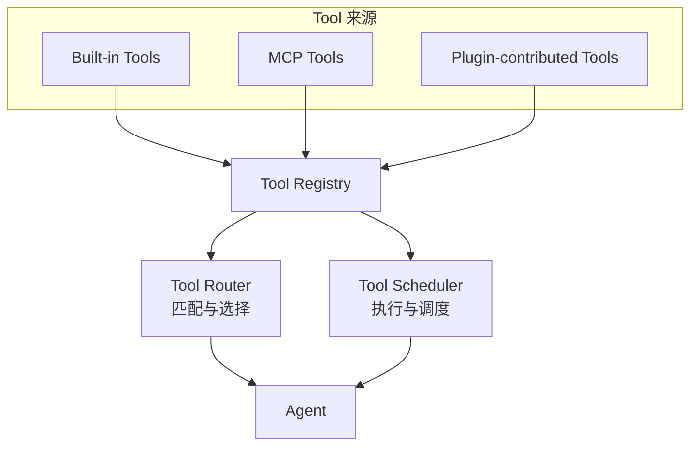
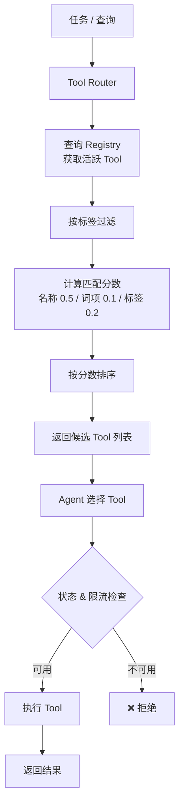

# 第 11 章：Tool Registry：工具注册与调度

> **难度等级：** ⭐⭐⭐
> **所属模块：** 第三部分：可靠运行
> **来源可信度：** 官方文档 / 源码 / 推导 / 观点
> **状态：** ✅ 已完成

---

## 学习目标

完成本章学习后，你将能够：

1. 理解 Tool Registry 在 Agent 架构中的核心地位
2. 掌握 Tool 的注册、发现、路由和调度机制
3. 理解 Tool Router 的匹配算法
4. 实现一个完整的 Tool Registry
5. 理解 Tool 的动态注册和热更新

---

## 前置知识

- 阅读第 6 章「Tools 与 Function Calling」
- 建议先阅读第 9 章「Runtime：Agent 运行时」；第 13、14 章会进一步说明 MCP 与 Plugin 来源

---

## 1. 背景

第 7 章 MVP 用名称到 Handler 的字典调用少量内置 Tool。本章在不改变 Tool 执行语义的前提下，加入来源、状态、发现、路由和调度；MCP 与 Plugin 来源将在第 13--14 章接入，因此本章先建立能容纳它们的控制面，而不要求读者预先掌握协议细节。

### 1.1 为什么需要 Tool Registry

随着 Agent 集成的 Tool 越来越多（Built-in + MCP + Plugin），需要一个统一的组件来管理：

- **注册：** 统一管理所有来源的 Tool
- **发现：** 让 Agent 知道有哪些 Tool 可用
- **路由：** 根据任务选择合适的 Tool
- **调度：** 控制 Tool 的执行顺序和并发
- **生命周期：** 管理 Tool 的启用、禁用、更新

**Tool Registry 是 Agent 的「工具箱」。它不执行 Tool，但知道所有 Tool 在哪里、怎么用、什么时候用。**

> **来源类型：** 推导分析 —— 基于微服务架构中 Service Registry 的设计模式

### 1.2 Tool Registry 的定位



> **图 11-1：** Tool Registry 架构。统一管理所有来源的 Tool，提供路由和调度能力。

### 1.3 Registry、Router 与 Scheduler：边界、适用时机和取舍

**What：** Registry 保存“有哪些可用 Tool、它们的元数据和状态”；Router 根据任务或策略选择候选 Tool；Scheduler 决定何时、以何种并发与限流规则执行。小型系统可以由同一对象承载三者，但职责仍应可区分，避免“注册表”悄悄拥有权限决策和业务逻辑。

| 规模或约束 | When：推荐做法 | Trade-off：为什么不再简单 |
|------------|----------------|----------------------------|
| 1--5 个静态、同团队维护的 Tool | 直接在 Agent 或应用层显式声明；保留稳定名称与 schema | 没有额外抽象，最易读；动态发现、审计和按租户启停会逐渐分散 |
| 多来源或按场景启停的 Tool | 引入 Registry，统一来源、版本、状态、标签和权限元数据 | 要维护注册一致性和冲突策略；Registry 的“可见”不等于“已获授权” |
| Tool 多、成本或风险差异显著 | 单独引入 Router / Scheduler，加入策略、预算、限流和审批 | 路由误选、并发竞态和策略漂移变成新风险；记录候选集、选择理由和执行结果以便审计 |
| 跨租户、远程 MCP 或第三方扩展 | 把身份、授权、凭据范围和健康检查纳入控制面 | 元数据与连接状态需要同步；不能把第三方描述或 Tool 名称当成可信安全边界 |

### 1.4 Catalog、Loader、Manager、Registry、Resolver 与 Router

这些名称描述的是不同生命周期阶段，不应互换：

| 组件 | 权威数据/动作 | 典型输出 |
|------|---------------|----------|
| Catalog | 已安装包的版本、来源、校验和与启用状态 | 安装记录 |
| Loader | 解析静态 Manifest、Skill 或 Plugin 定义 | 内存对象；不负责执行脚本 |
| Manager | 管理连接、子进程、刷新、启停和健康状态 | 活跃连接或服务实例 |
| Resolver | 解析名称、版本、依赖、别名与冲突 | 唯一 canonical identity |
| Registry | 当前 Host 已注册对象及其来源、Schema 和状态 | 可查询的候选集合 |
| Router | 从本次运行可见且获准的候选集中选择并分派 | 目标 Handler/Adapter |
| Scheduler | 决定何时、以何种并发和预算执行 | 执行时序 |

典型链路是 `Installer → Catalog → Loader/Manager → Resolver → Registry → Policy Filter → Router → Scheduler/Handler`。简单系统可以合并实现类，但接口和状态语义仍应区分；尤其不能让 Catalog 中“已安装”的对象直接绕过 Registry 与 Policy 进入 Router。

**How：** 本章示例实现 Registry 与一个基础 Router，重点是可查找、可禁用和可度量的 Tool 元数据。生产环境还应把授权判断放在每次执行路径上，并以第 17 章的 Guardrails、审批和审计机制兜底。

---

## 2. Tool Registry 实现

### 2.1 完整 Tool Registry

```python
"""
Tool Registry - 教学实现
运行环境：Python 3.10+
依赖：无
"""

import time
from dataclasses import dataclass, field
from enum import Enum
from typing import Any, Callable, Optional


class ToolSource(Enum):
    BUILTIN = "builtin"
    MCP = "mcp"
    PLUGIN = "plugin"


class ToolState(Enum):
    ACTIVE = "active"
    DISABLED = "disabled"
    DEPRECATED = "deprecated"
    ERROR = "error"


@dataclass
class RegisteredTool:
    """已注册的 Tool"""
    name: str
    description: str
    parameters: dict
    handler: Callable
    source: ToolSource
    source_name: str = ""        # MCP Server 名或 Plugin 名
    state: ToolState = ToolState.ACTIVE
    version: str = "1.0.0"
    tags: list[str] = field(default_factory=list)
    rate_limit: int = 0          # 每秒最大调用次数
    last_called: float = 0.0
    call_count: int = 0
    error_count: int = 0
    avg_latency: float = 0.0


class ToolRegistry:
    """Tool 注册中心"""

    def __init__(self):
        self._tools: dict[str, RegisteredTool] = {}
        self._by_tag: dict[str, set[str]] = {}
        self._by_source: dict[ToolSource, set[str]] = {
            src: set() for src in ToolSource
        }

    # ── 注册 ────────────────────────────────────

    def register(self, tool: RegisteredTool) -> None:
        """注册 Tool"""
        if tool.name in self._tools:
            existing = self._tools[tool.name]
            if existing.source != tool.source:
                raise ValueError(
                    f"Tool '{tool.name}' 已由 {existing.source.value} 注册"
                )

        self._tools[tool.name] = tool
        self._by_source[tool.source].add(tool.name)

        for tag in tool.tags:
            self._by_tag.setdefault(tag, set()).add(tool.name)

    def unregister(self, name: str) -> bool:
        """注销 Tool"""
        tool = self._tools.pop(name, None)
        if not tool:
            return False

        self._by_source[tool.source].discard(name)
        for tag in tool.tags:
            if tag in self._by_tag:
                self._by_tag[tag].discard(name)

        return True

    def unregister_by_source(self, source: ToolSource,
                             source_name: str = "") -> int:
        """按来源注销所有 Tool"""
        names = [
            name for name in self._by_source[source]
            if not source_name or self._tools[name].source_name == source_name
        ]
        for name in names:
            self.unregister(name)
        return len(names)

    # ── 查询 ────────────────────────────────────

    def get(self, name: str) -> Optional[RegisteredTool]:
        """获取 Tool"""
        return self._tools.get(name)

    def list_all(self) -> list[str]:
        """列出所有 Tool"""
        return list(self._tools.keys())

    def list_active(self) -> list[RegisteredTool]:
        """列出所有活跃 Tool"""
        return [t for t in self._tools.values()
                if t.state == ToolState.ACTIVE]

    def list_by_tag(self, tag: str) -> list[RegisteredTool]:
        """按标签列出 Tool"""
        names = self._by_tag.get(tag, set())
        return [self._tools[n] for n in names if n in self._tools]

    def list_by_source(self, source: ToolSource) -> list[RegisteredTool]:
        """按来源列出 Tool"""
        names = self._by_source.get(source, set())
        return [self._tools[n] for n in names if n in self._tools]

    def search(self, query: str) -> list[RegisteredTool]:
        """搜索 Tool"""
        query_lower = query.lower()
        results = []
        for tool in self._tools.values():
            score = 0
            if query_lower in tool.name.lower():
                score += 3
            if query_lower in tool.description.lower():
                score += 2
            for tag in tool.tags:
                if query_lower in tag.lower():
                    score += 1
            if score > 0:
                results.append((score, tool))
        results.sort(key=lambda x: x[0], reverse=True)
        return [tool for _, tool in results]

    # ── 执行 ────────────────────────────────────

    def execute(self, name: str, arguments: dict) -> dict:
        """执行 Tool"""
        tool = self.get(name)
        if not tool:
            return {"success": False, "error": f"Tool '{name}' 不存在"}
        if tool.state != ToolState.ACTIVE:
            return {"success": False, "error": f"Tool '{name}' 状态: {tool.state.value}"}

        # 速率限制检查
        if tool.rate_limit > 0:
            elapsed = time.time() - tool.last_called
            if elapsed < 1.0 / tool.rate_limit:
                return {"success": False, "error": "速率限制"}

        start = time.time()
        try:
            result = tool.handler(**arguments)
            tool.call_count += 1
            tool.last_called = time.time()
            tool.avg_latency = (
                tool.avg_latency * 0.9 + (time.time() - start) * 0.1
            )
            return result
        except Exception as e:
            tool.error_count += 1
            return {"success": False, "error": str(e)}

    # ── Tool 定义导出 ────────────────────────────

    def get_definitions(self,
                        source: ToolSource = None,
                        tags: list[str] = None) -> list[dict]:
        """获取 OpenAI 兼容的 Tool 定义"""
        tools = self._tools.values()

        if source:
            tools = [t for t in tools if t.source == source]
        if tags:
            tools = [t for t in tools
                     if any(tag in t.tags for tag in tags)]

        return [
            {
                "type": "function",
                "function": {
                    "name": t.name,
                    "description": t.description,
                    "parameters": t.parameters
                }
            }
            for t in tools
            if t.state == ToolState.ACTIVE
        ]

    # ── 统计 ────────────────────────────────────

    def get_stats(self) -> dict:
        """获取统计信息"""
        tools = list(self._tools.values())
        return {
            "total": len(tools),
            "active": sum(1 for t in tools if t.state == ToolState.ACTIVE),
            "disabled": sum(1 for t in tools if t.state == ToolState.DISABLED),
            "by_source": {
                src.value: len(names)
                for src, names in self._by_source.items()
            },
            "total_calls": sum(t.call_count for t in tools),
            "total_errors": sum(t.error_count for t in tools),
        }


def main():
    registry = ToolRegistry()

    # 注册 Built-in Tool
    registry.register(RegisteredTool(
        name="read_file",
        description="读取文件内容",
        parameters={"type": "object", "properties": {"path": {"type": "string"}}, "required": ["path"]},
        handler=lambda path: {"success": True, "content": f"<{path}>"},
        source=ToolSource.BUILTIN,
        tags=["file", "io"]
    ))

    registry.register(RegisteredTool(
        name="write_file",
        description="写入文件",
        parameters={"type": "object", "properties": {"path": {"type": "string"}, "content": {"type": "string"}}, "required": ["path", "content"]},
        handler=lambda path, content: {"success": True, "path": path},
        source=ToolSource.BUILTIN,
        tags=["file", "io"]
    ))

    # 注册 MCP Tool
    registry.register(RegisteredTool(
        name="db_query",
        description="执行数据库查询",
        parameters={"type": "object", "properties": {"sql": {"type": "string"}}, "required": ["sql"]},
        handler=lambda sql: {"success": True, "rows": []},
        source=ToolSource.MCP,
        source_name="database-server",
        tags=["database", "query"]
    ))

    # 注册由 Plugin 贡献的 Tool
    registry.register(RegisteredTool(
        name="git_commit",
        description="创建 Git 提交",
        parameters={"type": "object", "properties": {"message": {"type": "string"}}, "required": ["message"]},
        handler=lambda message: {"success": True, "commit": "abc123"},
        source=ToolSource.PLUGIN,
        source_name="git-plugin",
        tags=["git", "vcs"]
    ))

    print("=" * 60)
    print("  Tool Registry 演示")
    print("=" * 60)

    # 统计
    stats = registry.get_stats()
    print(f"\n  统计: {stats['total']} 个 Tool, {stats['active']} 活跃")
    print(f"  来源: {stats['by_source']}")

    # 按标签查询
    print(f"\n  [file] 标签 Tool:")
    for t in registry.list_by_tag("file"):
        print(f"    • {t.name} ({t.source.value})")

    # 搜索
    print(f"\n  搜索 'file':")
    for t in registry.search("file"):
        print(f"    • {t.name}: {t.description}")

    # 执行
    print(f"\n  执行 read_file:")
    result = registry.execute("read_file", {"path": "/tmp/test.txt"})
    print(f"    {result}")

    # 导出定义
    print(f"\n  OpenAI 格式定义 ({len(registry.get_definitions())} 个):")
    for d in registry.get_definitions():
        print(f"    • {d['function']['name']}")

    # 注销由 Plugin 贡献的 Tool
    count = registry.unregister_by_source(ToolSource.PLUGIN)
    print(f"\n  注销 {count} 个 Plugin-contributed Tool")
    print(f"  剩余: {registry.list_all()}")

    print("=" * 60)


if __name__ == "__main__":
    main()
```

---

## 3. Tool Router



> **图 11-2：** Tool 路由与发现流程。Registry 提供活跃候选，Router 负责排序；最终执行仍需状态、速率和 Policy 检查。

### 3.1 Router 实现

```python
class ToolRouter:
    """Tool 路由器 - 根据任务选择合适的 Tool"""

    def __init__(self, registry: ToolRegistry):
        self.registry = registry

    def route(self, task: str,
              required_tags: list[str] = None) -> list[RegisteredTool]:
        """根据任务路由到合适的 Tool"""
        active = self.registry.list_active()

        if not active:
            return []

        # 按标签过滤
        if required_tags:
            active = [
                t for t in active
                if all(tag in t.tags for tag in required_tags)
            ]

        # 按匹配度排序
        scored = []
        for tool in active:
            score = self._match_score(task, tool)
            if score > 0:
                scored.append((score, tool))

        scored.sort(key=lambda x: x[0], reverse=True)
        return [tool for _, tool in scored]

    def _match_score(self, task: str, tool: RegisteredTool) -> float:
        """计算匹配分数"""
        score = 0.0
        task_lower = task.lower()

        # 名称匹配
        if tool.name.lower() in task_lower:
            score += 0.5

        # 描述匹配
        desc_words = set(tool.description.lower().split())
        task_words = set(task_lower.split())
        overlap = desc_words & task_words
        score += len(overlap) * 0.1

        # 标签匹配
        for tag in tool.tags:
            if tag.lower() in task_lower:
                score += 0.2

        return min(score, 1.0)
```

---

## 4. 最佳实践

1. **统一注册入口：** 所有 Tool（Built-in、MCP、Plugin）通过统一的 Registry 注册。
2. **Tool 元数据丰富：** 名称、描述、标签、版本、来源，便于搜索和路由。
3. **状态管理：** 支持 Tool 的启用、禁用、弃用，便于灰度发布和回滚。
4. **速率限制：** 对高频 Tool 设置速率限制，保护下游服务。
5. **监控指标：** 记录调用次数、错误率、延迟，便于性能优化。

---

## 5. 反模式

| 反模式 | 风险 | 推荐方案 |
|--------|------|---------|
| 分散注册 | Tool 散落在各处，难以管理 | 统一 Registry 入口 |
| 忽略 Tool 状态 | 无法禁用出问题的 Tool | 支持启用/禁用/弃用 |
| 无速率限制 | 下游服务被打垮 | 设置速率限制 |
| 硬编码 Tool 选择 | 无法动态调整 | 使用 Router 动态匹配 |

---

## 6. 官方参考

| 编号 | 来源 | 类型 | 说明 |
|------|------|------|------|
| REF-1 | [MCP Tool Definition](https://modelcontextprotocol.io/specification) | 官方规范 | MCP 的 Tool 定义规范 |
| REF-2 | [OpenAI Function Calling](https://platform.openai.com/docs/guides/function-calling) | 官方文档 | Function Calling 的 Tool 定义 |

---

## 本章小结

Tool Registry 解决的是 Tool 较多、来源动态或需要统一治理时的发现和元数据管理；Router 负责选择，Scheduler 负责执行安排。少量静态 Tool 可以直接声明，只有当动态启停、权限、版本或审计需求出现时，Registry 的复杂度才有回报。

---

## 本章 Checklist

- [ ] 理解 Tool Registry 的架构和职责
- [ ] 能实现 Tool 的注册、发现、路由、调度
- [ ] 理解 Tool Router 的匹配算法
- [ ] 理解 Tool 的状态管理和速率限制
- [ ] 运行了 Tool Registry 示例代码
