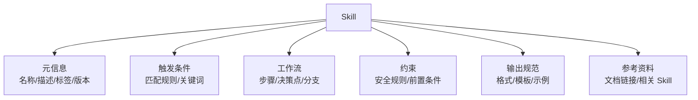
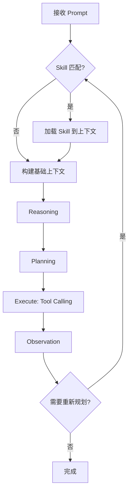

# 第 12 章：Skills：可复用工作流

> **难度等级：** ⭐⭐⭐
> **所属模块：** 第四部分：扩展与互操作
> **来源可信度：** 官方文档 / 源码 / 推导 / 观点
> **状态：** ✅ 已完成

---

## 学习目标

完成本章学习后，你将能够：

1. 理解 Skill 的本质定位——可复用工作流模板，而非执行单元
2. 掌握 Skill 与 Tool 的核心区别及各自的适用场景
3. 设计结构化的 Skill 模板
4. 实现 Skill 的加载、匹配和触发机制
5. 理解 Skill 在整个 Agent 架构中的位置

---

## 前置知识

- 阅读第 2 章「总体架构与生命周期」
- 阅读第 6 章「Tools 与 Function Calling」
- Skill 和 Tool 经常被混淆，建议先理解 Tool 再学习 Skill

---

## 1. 背景

### 1.1 为什么需要 Skill

假设你正在开发一个 Coding Agent。用户可能会提出各种任务：代码审查、重构、测试生成、文档编写、依赖更新等。这些任务有各自的工作流程和最佳实践。

如果每次处理「代码审查」都需要 Agent 从零开始推理，效率会很低。更糟糕的是，不同用户可能对「代码审查」有不同期望——有人关注性能，有人关注安全，有人关注可读性。

**Skill 解决的就是这个问题：将可复用的工作流知识模板化，让 Agent 在遇到匹配任务时自动加载正确的流程指导。**

> **来源类型：** 推导分析 —— 基于 Claude Code Skills 系统的设计理念

### 1.2 Skill 的本质

Skill 不是 Tool，不执行任何操作。Skill 是「知识」——它告诉 Agent：

- 这个任务应该怎么做（工作流）
- 需要注意什么（约束）
- 预期输出什么（格式）
- 常见陷阱有哪些（经验）

```
Skill = 工作流模板 + 领域知识 + 约束条件 + 输出规范
```

> **来源类型：** 作者观点 —— 基于对 Claude Code Skills 系统的分析

### 1.3 Skill 与 Tool 的深度辨析

这是 Agent 架构中最常见的混淆点。下表从多个维度对比：

| 维度 | Skill | Tool |
|------|-------|------|
| 本质 | 工作流模板（知识） | 执行接口（能力） |
| 操作 | 被 Agent 读取，加载到上下文 | 被 Agent 调用，执行操作 |
| 输出 | 指导性文本 | 结构化执行结果 |
| 类比 | 菜谱（告诉你怎么做） | 厨具（真正去做） |
| 触发时机 | Host 或 Agent 在规划前按需加载；任务变化或重新规划时可再次匹配 | 执行阶段由 Host / Agent 调用 |
| 直接副作用 | 仅加载指令本身不执行动作；遵循 Skill 的 Agent 仍可能调用 Tool | 可修改文件、调用 API 或产生其他外部副作用 |
| 可组合性 | 可嵌套引用 | 可链式调用 |
| 版本管理 | 工作流版本 | 接口版本 |

---

## 2. 核心概念

### 2.1 Skill 的组成结构



> **图 12-1：** Skill 的组成结构。六大要素：元信息、触发条件、工作流、约束、输出规范、参考资料。

### 2.2 Skill 在 Agent 主循环中的位置



> **图 12-2：** Skill 在 Agent 主循环中的位置。Agent 先根据任务匹配 Skill，将命中的工作流指令加载到 Context，再进行 Reasoning 和 Planning，使 Skill 能参与计划生成；任务条件变化或重新规划时可以再次匹配。第 16 章 Enhanced Agent 采用这一时序。

### 2.3 Skill 的生命周期

```
定义 → 注册 → 匹配 → 加载 → 使用 → 卸载
```

- **定义：** 开发者编写 Skill 模板
- **注册：** Skill 被注册到 Skill Registry
- **匹配：** Agent 在首次规划前判断当前任务是否匹配某个 Skill；重新规划时可按新状态再次匹配
- **加载：** 匹配的 Skill 内容先进入 Agent 上下文，再参与推理和计划生成
- **使用：** Agent 按照 Skill 的工作流指导执行任务
- **卸载：** 任务完成后，Skill 内容从上下文中移除（或保留到 Session 结束）

### 2.4 渐进式披露（Progressive Disclosure）

Skill 的价值不在于把所有领域手册一次性塞入 Context，而在于按需披露。实践中可将一个 Skill 分为三层：始终可见的摘要（名称、用途、触发条件）、匹配后加载的主工作流，以及仅在特定步骤按链接读取的参考资料、脚本或示例。这样既保留可发现性，也避免无关规则挤占上下文窗口。

| 层级 | 典型内容 | 加载时机 |
|------|----------|----------|
| 元数据 | 名称、描述、标签、风险等级 | Registry 建立索引时 |
| 主指令 | 工作流、约束、输出契约 | 任务匹配后 |
| 补充资料 | API 细节、长示例、检查表、脚本 | 当前步骤明确需要时 |

渐进式披露不能替代权限控制：即使参考资料未加载，对应 Tool 仍必须由 Runtime 和 Guardrails 执行权限检查。

> **来源类型：** 推导分析 —— 基于 Context 预算、Skill 匹配和按需加载的工程取舍

---

## 3. Skill 设计

### 3.1 Skill 模板结构

```python
"""
Skill 模板定义
运行环境：Python 3.10+
依赖：无
"""

from dataclasses import dataclass, field
from typing import Optional


@dataclass
class SkillMetadata:
    """Skill 元信息"""
    name: str                    # 唯一标识符
    version: str = "1.0.0"       # 版本号
    description: str = ""        # 简短描述
    tags: list[str] = field(default_factory=list)  # 标签
    author: str = ""             # 作者


@dataclass
class SkillTrigger:
    """Skill 触发条件"""
    keywords: list[str] = field(default_factory=list)  # 关键词匹配
    patterns: list[str] = field(default_factory=list)  # 正则匹配
    task_types: list[str] = field(default_factory=list)  # 任务类型


@dataclass
class SkillWorkflow:
    """Skill 工作流"""
    steps: list[str] = field(default_factory=list)  # 步骤列表
    decision_points: list[dict] = field(default_factory=list)  # 决策点
    error_handling: str = ""  # 错误处理策略


@dataclass
class Skill:
    """Skill 完整定义"""

    metadata: SkillMetadata
    trigger: SkillTrigger
    workflow: SkillWorkflow
    constraints: list[str] = field(default_factory=list)
    output_spec: str = ""
    references: list[str] = field(default_factory=list)

    def build_prompt(self) -> str:
        """构建 Skill 的 Prompt 内容（加载到上下文）"""
        parts = []

        parts.append(f"# Skill: {self.metadata.name}")
        parts.append(f"\n{self.metadata.description}")

        if self.constraints:
            parts.append("\n## 约束条件")
            for c in self.constraints:
                parts.append(f"- {c}")

        if self.workflow.steps:
            parts.append("\n## 工作流")
            for i, step in enumerate(self.workflow.steps, 1):
                parts.append(f"{i}. {step}")

        if self.workflow.decision_points:
            parts.append("\n## 决策点")
            for dp in self.workflow.decision_points:
                condition = dp.get("condition", "")
                action = dp.get("action", "")
                parts.append(f"- 当 {condition} 时: {action}")

        if self.workflow.error_handling:
            parts.append(f"\n## 错误处理\n{self.workflow.error_handling}")

        if self.output_spec:
            parts.append(f"\n## 输出规范\n{self.output_spec}")

        if self.references:
            parts.append("\n## 参考资料")
            for ref in self.references:
                parts.append(f"- {ref}")

        return "\n".join(parts)
```

### 3.2 Skill 示例

```python
# ── 代码审查 Skill ────────────────────────────

code_review_skill = Skill(
    metadata=SkillMetadata(
        name="code-review",
        version="1.0.0",
        description="对代码进行系统性审查，覆盖正确性、性能、安全性、可读性",
        tags=["code", "review", "quality"],
    ),
    trigger=SkillTrigger(
        keywords=["审查", "review", "检查代码", "代码质量"],
        task_types=["code_review", "pr_review"],
    ),
    workflow=SkillWorkflow(
        steps=[
            "读取目标代码文件，理解代码结构和功能",
            "检查代码正确性：逻辑错误、边界条件、异常处理",
            "检查性能：时间复杂度、空间复杂度、不必要的操作",
            "检查安全性：注入风险、敏感信息泄露、权限问题",
            "检查可读性：命名规范、注释质量、代码结构",
            "汇总发现的问题，按严重程度排序",
            "生成审查报告，包含问题描述、位置、修复建议",
        ],
        decision_points=[
            {"condition": "代码量 > 500 行", "action": "分批审查，每批 200 行"},
            {"condition": "发现严重安全问题", "action": "立即标记为阻塞项"},
            {"condition": "代码有测试", "action": "同时审查测试覆盖率"},
        ],
        error_handling="文件无法读取时，跳过该文件并在报告中注明",
    ),
    constraints=[
        "不要修改代码，只做审查",
        "每个问题必须提供具体的行号和修复建议",
        "区分阻塞项和建议项",
        "使用中文输出审查报告",
    ],
    output_spec="""
## 审查报告格式

### 概览
- 审查文件: {file}
- 总行数: {lines}
- 发现问题: {issues} 个

### 阻塞项
| 位置 | 问题 | 严重程度 | 修复建议 |
|------|------|---------|---------|

### 建议项
| 位置 | 问题 | 类型 | 修复建议 |
|------|------|------|---------|
""",
    references=[
        "Google Python Style Guide",
        "OWASP Top 10",
        "项目 CONTRIBUTING.md",
    ],
)

# ── 重构 Skill ────────────────────────────────

refactor_skill = Skill(
    metadata=SkillMetadata(
        name="code-refactor",
        version="1.0.0",
        description="对代码进行重构，改善结构而不改变行为",
        tags=["code", "refactor", "quality"],
    ),
    trigger=SkillTrigger(
        keywords=["重构", "refactor", "优化代码结构", "整理代码"],
        task_types=["refactor"],
    ),
    workflow=SkillWorkflow(
        steps=[
            "理解现有代码的功能和行为",
            "运行现有测试，确保基线通过",
            "识别重构目标：重复代码、过长函数、复杂条件",
            "逐步重构，每次只改一个方面",
            "每次重构后运行测试，确保行为不变",
            "更新文档和注释",
        ],
        decision_points=[
            {"condition": "没有测试", "action": "先建议添加测试，再进行重构"},
            {"condition": "重构范围 > 3 个文件", "action": "分批进行，每批重构后验证"},
        ],
        error_handling="重构后测试失败时，回滚修改并分析原因",
    ),
    constraints=[
        "重构不能改变外部行为",
        "每次重构后必须运行测试",
        "保留原有注释和文档",
    ],
    output_spec="重构后的代码，附带修改说明和测试结果",
)

# ── 测试生成 Skill ─────────────────────────────

test_generation_skill = Skill(
    metadata=SkillMetadata(
        name="test-generation",
        version="1.0.0",
        description="为代码生成单元测试",
        tags=["code", "test", "quality"],
    ),
    trigger=SkillTrigger(
        keywords=["测试", "test", "单元测试", "生成测试"],
        task_types=["test_generation"],
    ),
    workflow=SkillWorkflow(
        steps=[
            "分析目标代码的输入输出和边界条件",
            "确定测试框架（pytest/unittest）",
            "生成正常路径测试用例",
            "生成边界条件测试用例",
            "生成异常路径测试用例",
            "验证测试覆盖率",
        ],
        decision_points=[
            {"condition": "函数有外部依赖", "action": "使用 Mock 隔离依赖"},
            {"condition": "覆盖率 < 80%", "action": "补充遗漏的测试用例"},
        ],
        error_handling="测试生成失败时，分析原因并调整策略",
    ),
    constraints=[
        "测试用例必须可独立运行",
        "使用 pytest 框架",
        "测试函数命名: test_<功能>_<场景>",
    ],
    output_spec="完整的测试文件，包含导入和测试类",
)
```

---

## 4. Skill 加载与匹配

### 4.1 Skill Registry

```python
"""
Skill Registry - Skill 注册、匹配和加载
运行环境：Python 3.10+
依赖：无
注意：本节代码引用前文定义的 Skill 和 SkillRegistry 类，
本节实现用于说明 Registry 的核心职责；仓库当前未提供对应的独立 `examples/skills/` 工程。若将其用于生产，应补充持久化、并发控制、权限校验和针对匹配策略的测试。
预期输出：Skill 匹配和加载的演示
"""

import re
from dataclasses import dataclass, field


@dataclass
class SkillMatch:
    """Skill 匹配结果"""
    skill: Skill
    score: float           # 匹配分数 0-1
    matched_by: list[str]  # 匹配方式（keyword/pattern/task_type）


class SkillRegistry:
    """Skill 注册中心"""

    def __init__(self):
        self._skills: dict[str, Skill] = {}

    def register(self, skill: Skill):
        """注册 Skill"""
        self._skills[skill.metadata.name] = skill

    def unregister(self, name: str):
        """注销 Skill"""
        self._skills.pop(name, None)

    def list_all(self) -> list[str]:
        """列出所有 Skill"""
        return list(self._skills.keys())

    def match(self, task: str,
              task_type: str = "") -> list[SkillMatch]:
        """匹配 Skill"""
        matches = []

        for skill in self._skills.values():
            score = 0.0
            matched_by = []

            # 关键词匹配
            for kw in skill.trigger.keywords:
                if kw.lower() in task.lower():
                    score += 0.3
                    matched_by.append(f"keyword:{kw}")

            # 正则匹配
            for pattern in skill.trigger.patterns:
                if re.search(pattern, task, re.IGNORECASE):
                    score += 0.4
                    matched_by.append(f"pattern:{pattern}")

            # 任务类型匹配
            if task_type and task_type in skill.trigger.task_types:
                score += 0.5
                matched_by.append(f"task_type:{task_type}")

            if score > 0:
                matches.append(SkillMatch(
                    skill=skill,
                    score=min(score, 1.0),
                    matched_by=matched_by
                ))

        # 按分数降序排列
        matches.sort(key=lambda m: m.score, reverse=True)
        return matches

    def load(self, name: str) -> str | None:
        """加载 Skill 内容到上下文"""
        skill = self._skills.get(name)
        if not skill:
            return None
        return skill.build_prompt()


def main():
    registry = SkillRegistry()

    # 注册 Skill
    registry.register(code_review_skill)
    registry.register(refactor_skill)
    registry.register(test_generation_skill)

    print("=" * 60)
    print("  Skill Registry 演示")
    print("=" * 60)

    print(f"\n  已注册 Skill: {registry.list_all()}")

    # 测试匹配
    test_cases = [
        ("帮我审查一下 utils.py 的代码质量", ""),
        ("重构 auth 模块，代码太乱了", ""),
        ("为 user_service.py 生成单元测试", ""),
        ("帮我写一个排序函数", ""),  # 不匹配任何 Skill
    ]

    for task, task_type in test_cases:
        print(f"\n  任务: '{task}'")
        matches = registry.match(task, task_type)

        if matches:
            for m in matches[:2]:  # 显示前 2 个匹配
                print(f"    → {m.skill.metadata.name} "
                      f"(分数: {m.score:.1f}, "
                      f"匹配: {m.matched_by})")
        else:
            print(f"    → 无匹配 Skill（直接执行）")

    # 加载 Skill
    print(f"\n  {'─' * 40}")
    print("  加载 code-review Skill:")
    content = registry.load("code-review")
    if content:
        # 只显示前 15 行
        lines = content.split("\n")
        for line in lines[:15]:
            print(f"  {line}")
        if len(lines) > 15:
            print(f"  ... (共 {len(lines)} 行)")

    print("=" * 60)


if __name__ == "__main__":
    main()
```

**预期输出：**

```
============================================================
  Skill Registry 演示
============================================================

  已注册 Skill: ['code-review', 'code-refactor', 'test-generation']

  任务: '帮我审查一下 utils.py 的代码质量'
    → code-review (分数: 0.6, 匹配: ['keyword:审查', 'keyword:代码质量'])

  任务: '重构 auth 模块，代码太乱了'
    → code-refactor (分数: 0.3, 匹配: ['keyword:重构'])

  任务: '为 user_service.py 生成单元测试'
    → test-generation (分数: 0.6, 匹配: ['keyword:测试', 'keyword:单元测试'])

  任务: '帮我写一个排序函数'
    → 无匹配 Skill（直接执行）

  ────────────────────────────────────────
  加载 code-review Skill:
  # Skill: code-review
  ...
  (共 47 行)
============================================================
```

---

## 5. Skill 工作流模式

### 5.1 常见工作流模式

| 模式 | 描述 | 适用场景 |
|------|------|---------|
| 线性流程 | 固定步骤顺序执行 | 代码审查、格式检查 |
| 条件分支 | 根据条件选择不同路径 | 代码重构（有无测试） |
| 循环迭代 | 重复执行直到满足条件 | 测试修复循环 |
| 阶段门控 | 每个阶段有准入条件 | 部署流水线 |
| 组合模式 | 引用其他 Skill | 完整的代码发布流程 |

### 5.2 组合 Skill 示例

```python
# 代码发布 Skill - 组合多个 Skill
release_skill = Skill(
    metadata=SkillMetadata(
        name="code-release",
        version="1.0.0",
        description="完整的代码发布流程",
        tags=["release", "deploy"],
    ),
    trigger=SkillTrigger(
        keywords=["发布", "release", "上线", "部署"],
        task_types=["release"],
    ),
    workflow=SkillWorkflow(
        steps=[
            "1. 代码审查 (使用 code-review Skill)",
            "2. 运行测试 (使用 test-generation Skill 验证)",
            "3. 更新 CHANGELOG",
            "4. 版本号更新",
            "5. 创建 Git Tag",
            "6. 构建检查",
            "7. 部署到目标环境",
        ],
        decision_points=[
            {"condition": "审查未通过", "action": "阻塞发布，返回问题列表"},
            {"condition": "测试失败", "action": "阻塞发布，返回失败测试"},
            {"condition": "构建失败", "action": "阻塞发布，返回构建日志"},
        ],
        error_handling="任何阶段失败，停止后续步骤，报告失败原因",
    ),
    constraints=[
        "发布前必须通过代码审查",
        "发布前必须通过所有测试",
        "发布必须有 CHANGELOG 更新",
    ],
    output_spec="发布结果报告，包含每个阶段的执行状态",
    references=["code-review", "test-generation"],
)
```

---

## 6. 最佳实践

1. **Skill 保持聚焦：** 每个 Skill 只做一件事。代码审查和代码重构应该是两个不同的 Skill，即使它们可以组合使用。
2. **触发条件精准：** 关键词和模式匹配要足够精准，避免误触发。误匹配的 Skill 会浪费上下文窗口。
3. **Skill 可组合：** 设计 Skill 时考虑可组合性，允许一个 Skill 引用另一个 Skill。
4. **版本化 Skill：** Skill 应该像代码一样版本化管理，记录每次修改的原因和影响。
5. **Skill 内容适中：** 过长的 Skill 占用大量上下文窗口。以任务所需步骤和 Host 的 Context 预算为界，将长示例、参考资料和脚本改为按需加载。
6. **测试 Skill 匹配：** 为 Skill 编写匹配测试，确保只在正确的场景下触发。

---

## 7. 反模式

| 反模式 | 风险 | 推荐方案 |
|--------|------|---------|
| 将 Skill 当 Tool | 架构混淆，Skill 被当作执行单元 | Skill 只提供工作流指导，Tool 负责执行 |
| Skill 过于宽泛 | 频繁误触发，浪费上下文 | 精准定义触发条件 |
| Skill 过于冗长 | 占用大量上下文窗口 | 以任务所需步骤为界，采用渐进式披露而非固定字数阈值 |
| 硬编码 Skill 内容 | 难以维护和更新 | 使用模板和配置化管理 |
| 忽略 Skill 匹配测试 | 错误场景触发错误 Skill | 为每个 Skill 编写匹配测试 |
| Skill 之间重复 | 维护成本高，不一致 | 提取公共部分为独立 Skill |

---

## 8. FAQ

### Q: Skill 和 Tool 在代码层面有什么区别？

Skill 没有 `handler` 函数，只有 `build_prompt()` 方法。Skill 被加载到上下文中作为文本指导，而 Tool 被调用来执行具体操作。Skill 返回的是 Prompt 文本，Tool 返回的是执行结果。

### Q: 什么时候应该创建 Skill 而不是直接写 Prompt？

当某个工作流被重复使用 3 次以上时，就应该考虑创建 Skill。Skill 提供了标准化、可复用、可版本化的工作流模板。

### Q: Skill 可以嵌套吗？

可以。一个 Skill 可以在工作流中引用另一个 Skill。例如，「代码发布」Skill 可以引用「代码审查」Skill 和「测试生成」Skill。但要注意避免循环引用。

### Q: 如何判断 Skill 匹配是否准确？

通过匹配分数阈值来控制。建议设置最低匹配分数（如 0.3），低于阈值的不加载。同时记录匹配日志，定期分析误匹配情况。

### Q: Skill 和 Instructions 有什么区别？

Instructions 是全局行为准则（「始终使用中文」），适用于所有任务。Skill 是特定任务的工作流模板（「如何做代码审查」），只在匹配时加载。Instructions 始终在上下文，Skill 按需加载。

---

## 9. 官方参考

| 编号 | 来源 | 类型 | 说明 |
|------|------|------|------|
| REF-1 | [Claude Code Skills](https://docs.anthropic.com/en/docs/claude-code/skills) | 官方文档 | Skills 系统的官方实现 |
| REF-2 | [OpenAI GPTs Actions](https://platform.openai.com/docs/actions) | 官方文档 | GPTs 的 Action 设计（类似 Skill） |
| REF-3 | [Anthropic Skill Authoring](https://docs.anthropic.com/en/docs/build-with-claude/skill-authoring) | 官方文档 | Skill 编写指南 |

---

## 10. 延伸阅读

- [Claude Code Skill Examples](https://github.com/anthropics/claude-code/tree/main/skills) —— 官方 Skill 示例
- [Prompt Chains vs Agents](https://arxiv.org/abs/2310.04438) —— 工作流编排模式对比
- [Building Effective Agents](https://www.anthropic.com/research/building-effective-agents) —— Anthropic 的 Agent 构建指南

---

## 本章小结

Skill 是可发现、按需加载并可复用的工作流知识，Tool 是可执行能力，Instructions 是持续生效的行为约束。Skill 系统的价值来自渐进披露和治理，而不是把所有 Prompt 包装成文件；匹配、版本、依赖和失败回退都需要可测试。

---

## 本章 Checklist

- [ ] 理解 Skill 的本质是工作流模板，不是执行单元
- [ ] 能区分 Skill 和 Tool 的 5 个以上维度
- [ ] 能设计结构化的 Skill 模板
- [ ] 理解 Skill 在 Agent 主循环中的位置
- [ ] 能实现 Skill 的注册、匹配和加载
- [ ] 理解 Skill 组合模式
- [ ] 运行了 Skill Registry 示例代码
- [ ] 阅读了至少 2 篇官方参考文档
