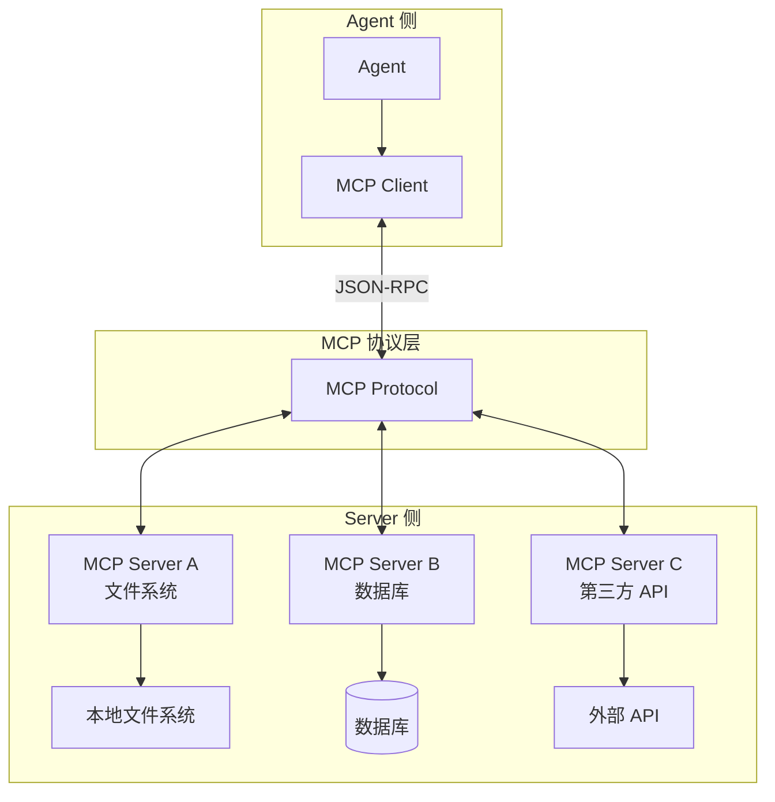
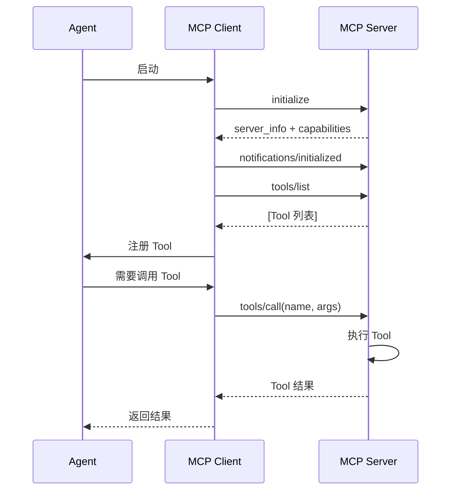

# 第 13 章：MCP：模型上下文协议

> **难度等级：** ⭐⭐⭐⭐
> **所属模块：** 第四部分：扩展与互操作
> **来源可信度：** 官方文档 / 源码 / 推导 / 观点
> **状态：** ✅ 已完成

---

## 学习目标

完成本章学习后，你将能够：

1. 理解 MCP 协议的设计理念和核心价值
2. 掌握 MCP 的 Client-Server 架构和通信流程
3. 理解 MCP 的 Tool 发现、描述和调用机制
4. 实现一个 MCP Client 和 MCP Server
5. 理解 MCP 与 Function Calling 的关系和区别
6. 区分 MCP 协议、具体产品 Connector 与 Plugin 分发单元

---

## 前置知识

- 阅读第 2 章「总体架构与生命周期」
- 阅读第 6 章「Tools 与 Function Calling」
- 了解 JSON-RPC 的基本概念

---

## 1. 背景

### 1.1 为什么需要 MCP

在 MCP 出现之前，Agent 集成第三方工具面临着严重的碎片化问题：

- 每个工具提供商有自己的 API 格式
- Agent 开发者需要为每个工具编写集成代码
- 工具发现依赖文档和手动配置
- 没有统一的安全模型

**MCP（Model Context Protocol）** 由 Anthropic 于 2024 年底推出，旨在解决这些问题。它定义了一个开放协议，标准化 LLM 应用与外部上下文、工具和工作流能力之间的连接；Tool 的提供、发现和调用只是其中一部分。

> **来源类型：** Fact —— 基于 MCP 官方规范 (modelcontextprotocol.io)

### 1.2 MCP 的核心价值

```
没有 MCP:  Agent → 集成代码 A → API A
           Agent → 集成代码 B → API B
           Agent → 集成代码 C → API C

有了 MCP:  Agent → MCP Client → MCP Protocol → MCP Server A → API A
                                              → MCP Server B → API B
                                              → MCP Server C → API C
```

MCP 将「1 对 N」的集成问题转化为「1 对 1 对 N」的标准化问题。

### 1.3 MCP 不是什么

在深入学习 MCP 之前，需要澄清几个常见误解：

| 误解 | 实际 |
|------|------|
| MCP 是 Agent 框架 | MCP 是连接 LLM 应用与外部能力的协议，不负责 Agent 的推理或编排 |
| MCP 替代 Function Calling | MCP 可用于发现和调用外部 Tool；Function Calling 是模型 API 向应用表达工具调用意图的一种机制，两者可以配合，但并非严格的上下位替代关系 |
| MCP 是 Anthropic 专属 | MCP 是开放协议，任何模型和框架都可以使用 |
| MCP Client 就是 Connector | MCP Client 实现协议会话；Connector 管理某个产品的身份、授权、端点与数据映射，可使用 MCP，也可使用 REST/SDK |

> **来源类型：** Fact —— 基于 MCP 官方规范

### 1.4 Host、Agent 与 MCP Client 的边界

MCP 官方架构把 Host 定义为容器与协调者：Host 创建 Client、控制连接权限、处理用户授权并聚合上下文；每个 Client 与一个 Server 维持隔离会话。由此可见，Agent 只是发起能力请求的运行主体，不应自己持有传输凭据或绕过 Host 直连 Server。

```text
Agent / Subagent → Agent Host → MCP Client (每个 Server 一条会话) → MCP Server
                         └→ Policy / Consent / Context Isolation
```

协议能力协商只说明“双方实现了什么”，不说明“本次 Agent 被允许做什么”。Host 还要把 Server 能力经过信任、租户、Agent、会话和审批策略过滤后，才注册进本次运行的 Tool 快照。

---

## 2. 核心概念

### 2.1 MCP 架构



> **图 13-1：** MCP 架构（以 Tool 为例）。Agent 所在的 Host 通过 MCP Client 与多个 MCP Server 通信；Server 还可以提供 Resource 与 Prompt 等能力。

### 2.2 MCP 核心概念

| 概念 | 说明 |
|------|------|
| Host | 发起连接的 LLM 应用，例如 IDE、聊天客户端或 Agent 运行时 |
| MCP Server | 实现 MCP 协议、向 Client 暴露能力的服务端 |
| MCP Client | Host 内部为每个 Server 建立连接的协议客户端 |
| Tool | Server 暴露的可执行能力 |
| Resource | Server 暴露的数据资源（文件、数据库记录等） |
| Prompt Template | Server 提供的 Prompt 模板 |
| Transport | 通信层；当前标准传输为 `stdio` 和 Streamable HTTP，旧版 HTTP+SSE 仅用于兼容 |

> **来源类型：** Fact —— 基于当前 MCP 规范 v2025-11-25（核对日期：2026-07-12）。文中最小示例仍按 v2024-11-05 的基础能力集合讲解，不能直接作为当前协议实现；实现时必须协商双方共同支持的版本，并以 [MCP Versioning](https://modelcontextprotocol.io/docs/learn/versioning) 为准。

### 2.3 MCP 通信流程



> **图 13-2：** MCP 通信时序图。初始化、能力协商、`initialized` 通知、列出 Tool、调用 Tool 的最小完整流程。

### 2.4 能力协商与双向能力

`initialize` 不只是“连通性检查”。Client 和 Server 先协商协议版本与能力，之后只能使用双方已协商的可选能力。第 3、4 节的教学代码只模拟了 Server 侧 Tool；真实 Host 还可能向 Server 提供下列 Client 侧能力。

| 提供方 | 能力 | 用途 | Host 的控制点 |
|--------|------|------|---------------|
| Server | Tools / Resources / Prompts | 可调用能力、可读资源、模板化提示 | 是否展示给模型、是否允许调用 |
| Server | Logging / Completions | 结构化日志、参数补全等辅助能力 | 日志脱敏、速率和存储策略 |
| Client | Roots | 告知 Server 可操作的文件系统或 URI 边界 | 最小范围、路径变化通知 |
| Client | Sampling | 允许 Server 请求 Host 代为进行模型采样 | 用户审批、模型选择、提示词可见性 |
| Client | Elicitation | 允许 Server 向用户请求额外信息 | UI 呈现、敏感字段限制、取消 |

协商成功不等于授权：Host 仍应对每次数据暴露、采样请求和 Tool 调用执行自己的权限与用户确认策略。对于不支持的能力，应在协商阶段明确关闭，而不是在运行时静默失败。

v2025-11-25 还加入了实验性 Tasks、Sampling 中的 Tool Calling，以及以 JSON Schema 2020-12 作为默认方言。它们不是基础 Tool 流程的必选项：只有双方在初始化时声明并协商对应能力后才能使用，旧客户端也不应被假定支持。

> **来源类型：** Fact —— 基于 MCP v2025-11-25 的 Lifecycle、Client Features、Server Features 与 Key Changes；具体 Host 的 UI 和审批策略属于产品实现

---

## 3. MCP Server 实现

### 3.1 最小 MCP Server

```python
"""
MCP Server - 最小实现
运行环境：Python 3.10+
依赖：无（模拟实现）
"""

import json
from dataclasses import dataclass, field
from typing import Any, Callable


@dataclass
class MCPServerInfo:
    """MCP Server 信息"""
    name: str
    version: str = "1.0.0"
    protocol_version: str = "2024-11-05"


@dataclass
class MCPTool:
    """MCP Tool 定义"""
    name: str
    description: str
    input_schema: dict
    handler: Callable


class MCPServer:
    """MCP Server 实现"""

    def __init__(self, info: MCPServerInfo):
        self.info = info
        self._tools: dict[str, MCPTool] = {}
        self._resources: dict[str, Any] = {}

    # ── Tool 管理 ──────────────────────────────

    def register_tool(self, tool: MCPTool):
        self._tools[tool.name] = tool

    def list_tools(self) -> list[dict]:
        return [
            {
                "name": t.name,
                "description": t.description,
                "inputSchema": t.input_schema,
            }
            for t in self._tools.values()
        ]

    def call_tool(self, name: str, arguments: dict) -> dict:
        tool = self._tools.get(name)
        if not tool:
            return {
                "isError": True,
                "content": [{"type": "text", "text": f"Tool not found: {name}"}]
            }

        try:
            result = tool.handler(**arguments)
            return {
                "content": [{"type": "text", "text": json.dumps(result, ensure_ascii=False)}]
            }
        except Exception as e:
            return {
                "isError": True,
                "content": [{"type": "text", "text": str(e)}]
            }

    # ── Resource 管理 ───────────────────────────

    def register_resource(self, uri: str, content: Any):
        self._resources[uri] = content

    def read_resource(self, uri: str) -> Any:
        return self._resources.get(uri)

    # ── 协议处理 ───────────────────────────────

    def handle_request(self, method: str, params: dict = None) -> dict:
        """处理 MCP 请求（模拟 JSON-RPC）"""
        params = params or {}

        if method == "initialize":
            return {
                "protocolVersion": self.info.protocol_version,
                "serverInfo": {
                    "name": self.info.name,
                    "version": self.info.version,
                },
                "capabilities": {
                    "tools": {"listChanged": True},
                    "resources": {"subscribe": False},
                }
            }

        elif method == "tools/list":
            return {"tools": self.list_tools()}

        elif method == "tools/call":
            return self.call_tool(
                name=params.get("name", ""),
                arguments=params.get("arguments", {})
            )

        elif method == "resources/list":
            return {
                "resources": [
                    {"uri": uri, "name": uri}
                    for uri in self._resources
                ]
            }

        elif method == "resources/read":
            uri = params.get("uri", "")
            content = self.read_resource(uri)
            return {
                "contents": [{
                    "uri": uri,
                    "text": str(content) if content else "Not found"
                }]
            }

        else:
            return {"error": f"Unknown method: {method}"}


def main():
    # 创建 MCP Server
    server = MCPServer(MCPServerInfo(
        name="weather-server",
        version="1.0.0"
    ))

    # 注册 Tool
    server.register_tool(MCPTool(
        name="get_weather",
        description="获取指定城市的天气信息",
        input_schema={
            "type": "object",
            "properties": {
                "city": {"type": "string", "description": "城市名称"},
                "unit": {"type": "string", "enum": ["celsius", "fahrenheit"]}
            },
            "required": ["city"]
        },
        handler=lambda city, unit="celsius": {
            "city": city,
            "temperature": 22,
            "unit": unit,
            "condition": "晴天",
            "humidity": 65
        }
    ))

    server.register_tool(MCPTool(
        name="get_forecast",
        description="获取未来天气预报",
        input_schema={
            "type": "object",
            "properties": {
                "city": {"type": "string"},
                "days": {"type": "integer", "minimum": 1, "maximum": 7}
            },
            "required": ["city"]
        },
        handler=lambda city, days=3: {
            "city": city,
            "forecast": [
                {"day": f"第{i}天", "high": 25+i, "low": 18+i, "condition": "晴"}
                for i in range(1, days+1)
            ]
        }
    ))

    print("=" * 60)
    print("  MCP Server 演示")
    print("=" * 60)

    # 模拟 MCP 协议交互
    requests = [
        ("initialize", {}),
        ("tools/list", {}),
        ("tools/call", {"name": "get_weather", "arguments": {"city": "北京"}}),
        ("tools/call", {"name": "get_forecast", "arguments": {"city": "上海", "days": 3}}),
        ("tools/call", {"name": "unknown_tool", "arguments": {}}),
    ]

    for method, params in requests:
        print(f"\n  → {method}")
        response = server.handle_request(method, params)
        print(f"  ← {json.dumps(response, ensure_ascii=False)[:200]}")

    print("\n" + "=" * 60)


if __name__ == "__main__":
    main()
```

---

## 4. MCP Client 实现

### 4.1 MCP Client

```python
"""
MCP Client - 教学实现
运行环境：Python 3.10+
依赖：无（模拟实现）

注意：本节代码引用前文定义的 MCPClient、MCPServer 等类，
完整可运行版本见 examples/mcp-client/python/
"""

from dataclasses import dataclass, field


@dataclass
class MCPClientConfig:
    """MCP Client 配置"""
    server_command: str = ""
    server_args: list[str] = field(default_factory=list)
    timeout: int = 30


class MCPClient:
    """MCP Client 实现"""

    def __init__(self, config: MCPClientConfig):
        self.config = config
        self._server: MCPServer | None = None
        self._tools: dict[str, dict] = {}
        self._initialized = False

    def connect(self, server: MCPServer):
        """连接到 MCP Server"""
        self._server = server

        # 初始化
        response = server.handle_request("initialize")
        if "error" not in response:
            self._initialized = True
            print(f"  已连接: {response['serverInfo']['name']}")
        else:
            print(f"  初始化失败: {response['error']}")
            return

        # 发现 Tool
        response = server.handle_request("tools/list")
        for tool in response.get("tools", []):
            self._tools[tool["name"]] = tool

    def list_tools(self) -> list[dict]:
        """列出所有可用 Tool"""
        return list(self._tools.values())

    def call_tool(self, name: str, arguments: dict) -> dict:
        """调用 Tool"""
        if not self._initialized:
            return {"error": "Client 未初始化"}

        if name not in self._tools:
            return {"error": f"Tool 不存在: {name}"}

        return self._server.handle_request("tools/call", {
            "name": name,
            "arguments": arguments
        })

    def get_tool_definitions(self) -> list[dict]:
        """获取 OpenAI 兼容的 Tool 定义"""
        return [
            {
                "type": "function",
                "function": {
                    "name": t["name"],
                    "description": t["description"],
                    "parameters": t["inputSchema"]
                }
            }
            for t in self._tools.values()
        ]


def main():
    # 创建 Server
    server = MCPServer(MCPServerInfo(name="weather-server"))
    server.register_tool(MCPTool(
        name="get_weather",
        description="获取天气",
        input_schema={
            "type": "object",
            "properties": {"city": {"type": "string"}},
            "required": ["city"]
        },
        handler=lambda city: {"city": city, "temp": 22, "condition": "晴天"}
    ))

    # 创建 Client 并连接
    client = MCPClient(MCPClientConfig())
    client.connect(server)

    print("=" * 60)
    print("  MCP Client 演示")
    print("=" * 60)

    # 列出 Tool
    print(f"\n  可用 Tool:")
    for tool in client.list_tools():
        print(f"    • {tool['name']}: {tool['description']}")

    # 调用 Tool
    print(f"\n  调用 get_weather:")
    result = client.call_tool("get_weather", {"city": "北京"})
    print(f"    {json.dumps(result, ensure_ascii=False)[:120]}")

    # 获取 OpenAI 兼容格式
    print(f"\n  OpenAI 兼容格式:")
    for td in client.get_tool_definitions():
        print(f"    {json.dumps(td, ensure_ascii=False)[:150]}")

    print("=" * 60)


if __name__ == "__main__":
    main()
```

---

## 5. MCP 与 Agent 集成

### 5.1 集成模式

```python
class MCPIntegratedAgent:
    """集成 MCP 的 Agent"""

    def __init__(self):
        self.mcp_clients: dict[str, MCPClient] = {}
        self.builtin_tools: dict[str, Tool] = {}
        self._all_tools: list[dict] = []

    def add_mcp_server(self, name: str, server: MCPServer):
        """添加 MCP Server"""
        client = MCPClient(MCPClientConfig())
        client.connect(server)
        self.mcp_clients[name] = client

    def get_all_tools(self) -> list[dict]:
        """获取所有 Tool（Built-in + MCP）"""
        tools = []

        # Built-in Tools
        for tool in self.builtin_tools.values():
            tools.append({
                "type": "function",
                "function": {
                    "name": tool.name,
                    "description": tool.description,
                    "parameters": tool.parameters
                }
            })

        # MCP Tools
        for server_name, client in self.mcp_clients.items():
            for definition in client.get_tool_definitions():
                # 模型可见名使用稳定 canonical identity，避免安装顺序改变语义。
                remote_name = definition["function"]["name"]
                namespaced = {
                    **definition,
                    "function": {
                        **definition["function"],
                        "name": f"{server_name}.{remote_name}",
                    },
                }
                tools.append(namespaced)

        return tools

    def execute_tool(self, name: str, arguments: dict) -> dict:
        """执行 Tool（优先 Built-in，其次 MCP）"""
        # 先查 Built-in
        if name in self.builtin_tools:
            return self.builtin_tools[name].handler(**arguments)

        # MCP Tool 必须带 <server>.<tool>，直接路由到唯一连接。
        if "." not in name:
            return {
                "success": False,
                "error": f"MCP Tool 必须使用 <server>.<tool>: {name}",
                "code": "invalid_tool_identity",
            }
        server_name, remote_name = name.split(".", 1)
        client = self.mcp_clients.get(server_name)
        if client is None:
            return {
                "success": False,
                "error": f"MCP Server 不存在: {server_name}",
                "code": "server_not_found",
            }
        if remote_name not in {tool["name"] for tool in client.list_tools()}:
            return {
                "success": False,
                "error": f"MCP Tool 不存在: {name}",
                "code": "tool_not_found",
            }
        result = client.call_tool(remote_name, arguments)
        if result.get("isError") or "error" in result:
            return {
                "success": False,
                "error": result.get("error", result.get("content", "MCP Tool 调用失败")),
                "code": "tool_call_failed",
            }
        return {"success": True, "result": result}
```

这里不能遍历所有 Server 并把“没有 `isError`”当作成功：不同教学 Client 可能用 `error` 字段表达失败，首个 Server 的 `tool_not_found` 也不应阻止路由到目标 Server。canonical name 让路由在调用前就唯一确定，并把 Server 不存在、Tool 不存在和远端执行失败分开建模。

---

### 5.2 MCPServerManager：从协议客户端到可安装配置

单个 `MCPClient` 负责一条协议连接；Host 还需要独立的 `MCPServerManager` 管理“安装”体验。它维护 Server 配置而不是复制协议实现。第 16 章的 `ManagerMCPProvider` 使用 `connect_enabled/connectEnabled` 取得已启用会话；Connection 必须同时支持 Tool 发现与调用，不能只缓存 Schema：

```text
add / remove / enable / disable
        ↓
原子持久化 .agent/mcp.json
        ↓
connect_enabled → start_enabled → TransportFactory.connect
        ↓
initialize / tools/list → Provider Adapter → Tool Registry
        ↓
tools/call；refresh / stop / close
```

配置区分 `stdio` 与 `streamable-http`，校验 Server 名称、启动命令和 URL；远程地址默认要求 HTTPS，本地 `localhost` 可使用 HTTP。列表输出会脱敏环境变量值。连接只有在 Tool 发现成功后才提交到 Manager，失败连接立即关闭；禁用或删除 Server 会同时关闭连接并移除其 Tool 快照。

```bash
cd examples/mcp-manager/python
python -m unittest -v test_main.py
python main.py --config .agent/mcp.json add catalog catalog-server
python main.py --config .agent/mcp.json list
python main.py --config .agent/mcp.json disable catalog
```

完整的 Python/TypeScript 离线实现位于 `examples/mcp-manager/`，测试使用 Fake Transport。生产 Adapter 应使用官方 SDK 实现真实初始化、版本/能力协商、`stdio` 进程或 Streamable HTTP、OAuth、超时、重连和 Server 身份验证。

### 5.3 Connector：具体产品的集成层

Connector 是产品或应用层概念，不是 MCP 规范中的第四种 Primitive。它封装“如何接入一个具体服务”，例如 GitHub、Google Drive、Salesforce 或企业内部工单系统。Connector 可以基于 MCP，也可以使用 REST/GraphQL、官方 SDK、数据库驱动或离线同步。

```text
GitHub Connector
├── service identity: github
├── endpoint / organization / repository scope
├── credential reference（不是明文 Token）
├── authentication adapter: OAuth App / GitHub App
├── data mapping: PR / Issue / Workflow Run
├── capability mapping: github.list_prs / github.create_comment
└── lifecycle: connected / degraded / revoked
```

| 概念 | 核心职责 | 不负责什么 |
|------|----------|------------|
| Tool | 表达一个可调用操作 | 不负责整个服务的认证和生命周期 |
| MCP | 标准化 Client/Server 的能力交换 | 不定义 GitHub、Drive 等产品的数据模型 |
| Connector | 管理具体服务身份、授权范围、端点、数据映射和健康状态 | 不决定 Agent 是否有权执行本次高风险动作 |
| Plugin | 安装、版本化和启停一组 Host 扩展 | 不天然等于远程服务连接 |

Connector 只保存 Credential Reference 和授权元数据；真实 Secret 应由操作系统凭据库、Secret Manager 或短期令牌服务管理。连接成功也不表示 Agent 可以自由调用其全部 Tool：Host 仍需按用户、租户、资源、参数和会话执行 `allow / ask / deny` Policy。

典型组合有三种：

```text
Connector → REST/SDK Adapter → Tool Registry
Connector → MCP Client → MCP Server → Tool / Resource / Prompt
Plugin → Connector Preset + Skills + Tool / MCP 配置
```

因此“GitHub Connector 基于 MCP”只是某个实现选择，不是 Connector 的定义。

#### App、Connector 与 Adapter

本书把 **App** 作为面向用户的已授权产品集成表面，例如用户在 UI 中连接并选择一个 GitHub 或 Drive 账户；**Connector** 是 Host 内管理该产品身份、授权范围、端点、映射和健康状态的集成单元；**Adapter** 是把某种 REST/SDK/MCP 具体接口转换为 Host Port 的代码实现。

```text
App（用户看见和授权）
  → Connector（产品连接与生命周期）
    → Adapter（协议/API 适配代码）
      → Tool / Resource（运行期能力与数据）
```

不同产品可能把 App 与 Connector 当作同义词；上述关系是本书用于讨论架构职责的工作定义。`API ≠ Connector`：API 只是 Connector 可采用的下游接口。

#### Connector 最小契约与生命周期

生产 Connector 不应只是“URL + Token”。建议至少暴露以下控制面：

| 契约 | 示例字段/操作 | 目的 |
|------|---------------|------|
| Identity | `connector_id`、`service`、`tenant_id`、`owner` | 防止跨租户或跨服务混用 |
| Auth | `credential_ref`、`scopes`、`expires_at`、`refresh()` | 不把 Secret 放进 Prompt、配置或 Trace |
| Resource scope | org/repo/drive/project allowlist | 将产品授权进一步收窄到业务资源 |
| Capability mapping | 产品 API ↔ 规范化 Tool/Resource | 隔离供应商数据模型与 Runtime |
| Health | `connect()`、`probe()`、`degrade()`、`revoke()` | 显式管理失效、限流和撤销 |
| Observability | request ID、actor、resource、outcome | 支持审计、排障与成本归属 |

推荐生命周期为 `configured → authorizing → connected → degraded/revoked → disconnected`。刷新令牌失败、Scope 被管理员撤销或下游限流时进入 `degraded/revoked`，并立即从新运行的能力快照移除相关 Tool；不要用无限重试掩盖身份失效。对于写操作，Connector 还应保留幂等键、下游请求 ID 和可展示给用户的目标资源摘要。

---

## 6. MCP Transport 层

### 6.1 支持的 Transport

| Transport | 说明 | 适用场景 |
|-----------|------|---------|
| stdio | 标准输入输出 | 本地进程通信 |
| Streamable HTTP | 单一 HTTP 端点；可选使用 SSE 传递流式消息 | 远程服务 |
| 旧版 HTTP+SSE | v2024-11-05 的旧传输 | 仅在兼容旧客户端或旧 Server 时使用 |

### 6.2 安全考量

- **Tool 白名单：** Agent 应维护允许调用的 Tool 白名单
- **权限确认：** 敏感操作（文件写入、网络请求）需要用户确认
- **沙箱隔离：** MCP Server 应在受限环境中运行
- **输入校验：** Agent 应校验 MCP Server 返回的数据

### 6.3 远程 MCP 的授权边界

对于 HTTP 传输，MCP 规范定义了基于 OAuth 的可选授权机制；`stdio` 本地进程通常从受控环境获取凭据，不能直接套用浏览器 OAuth 流程。无论采用哪种方式，都应区分“连接到 Server 的凭据”和“允许 Agent 执行具体 Tool 的用户授权”。

| 阶段 | 应验证的内容 |
|------|--------------|
| 发现与连接 | Server 身份、传输加密、允许的 Origin、授权 Server 元数据 |
| 获取令牌 | 令牌的目标资源、最小 Scope、用户同意与安全存储 |
| 发起请求 | 每个 HTTP 请求携带正确的授权信息和已协商的协议版本 |
| Server 校验 | 令牌有效期、受众（audience）是否为本 Server、Scope 与请求是否匹配 |
| 下游访问 | 不透传 Client 给 MCP Server 的令牌；由 Server 以独立凭据访问下游服务 |

令牌存在并不表示模型可以自由操作：Host 仍需在 Tool 层应用白名单、参数校验、人工确认和审计。认证、协议能力和业务授权是三层不同控制，任意一层缺失都可能扩大权限。

> **来源类型：** Fact + 推导分析 —— 授权机制依据 MCP v2025-11-25 Authorization；Tool 级审批是本书的 Host 安全设计建议

---

## 7. 最佳实践

1. **MCP Server 单一职责：** 每个 Server 聚焦一个领域（文件系统、数据库、API），不要混合。
2. **Tool 描述精准：** Tool 的名称、描述与输入 Schema 是 Host 向模型呈现能力的重要信号，必须清晰准确；Host 仍可结合策略、权限和上下文决定是否暴露或调用它。
3. **错误返回标准化：** 使用 `isError: true` 标记错误，在 `content` 中提供错误详情。
4. **版本兼容性：** 记录 MCP 协议版本，确保 Client 和 Server 版本兼容。
5. **安全优先：** 对 MCP Tool 调用进行权限检查，敏感操作需要用户确认。
6. **协商后使用：** 仅使用初始化阶段协商成功的能力；将版本、超时和取消策略显式配置。

---

## 8. 反模式

| 反模式 | 风险 | 推荐方案 |
|--------|------|---------|
| 将 MCP 当 Agent | 职责不清，混淆协议与编排 | MCP 提供外部上下文和能力的互操作，Agent 负责推理与编排 |
| 忽略 MCP Server 错误 | 错误传播，Agent 行为异常 | 统一错误处理，返回结构化错误 |
| 过多 MCP Server | 连接管理复杂，性能下降 | 按需连接，合理分组 |
| 不校验 MCP Tool 输入 | 安全风险 | Agent 应校验 Tool 参数 |

---

## 9. FAQ

### Q: MCP 和 OpenAI Function Calling 有什么区别？

MCP 是外部上下文和能力的互操作协议，涵盖 Tool、Resource 与 Prompt 等；Function Calling 是模型 API 将「请求调用某个函数」表达给宿主应用的接口形态。常见集成会将 MCP 的 Tool 描述转换为模型 API 所需的函数定义，再把模型产生的调用请求转发给 MCP Server。两者可以配合，但 MCP 既不依赖某一家模型 API，也不只解决 Tool 发现。

### Q: MCP 和 REST API 有什么区别？

MCP 是面向 LLM 应用的上下文和能力协议，提供 Tool、Resource、Prompt 等能力的发现与调用流程。REST API 是通用 Web 服务接口，通常需要由客户端自行约定认证、描述和集成方式。MCP 可以在连接后发现 Server 已声明的能力，但是否在运行时刷新、向模型暴露哪些能力，仍由 Host 的产品和安全策略决定。

### Q: 一个 Agent 可以连接多个 MCP Server 吗？

可以。这是 MCP 的核心设计目标之一。Agent 可以同时连接文件系统 Server、数据库 Server、第三方 API Server 等，所有 Tool 统一管理。

---

## 10. 官方参考

| 编号 | 来源 | 类型 | 说明 |
|------|------|------|------|
| REF-1 | [MCP Specification](https://modelcontextprotocol.io/specification) | 官方规范 | MCP 协议完整规范 |
| REF-2 | [MCP Python SDK](https://github.com/modelcontextprotocol/python-sdk) | 源码 | 官方 Python SDK |
| REF-3 | [MCP TypeScript SDK](https://github.com/modelcontextprotocol/typescript-sdk) | 源码 | 官方 TypeScript SDK |
| REF-4 | [Awesome MCP Servers](https://github.com/punkpeye/awesome-mcp-servers) | 社区 | 社区 MCP Server 列表 |
| REF-5 | [MCP Lifecycle](https://modelcontextprotocol.io/specification/2025-11-25/basic/lifecycle) | 官方规范 | 初始化、能力协商、超时与关闭 |
| REF-6 | [MCP Authorization](https://modelcontextprotocol.io/specification/2025-11-25/basic/authorization) | 官方规范 | HTTP 传输的授权边界 |
| REF-7 | [MCP v2025-11-25 Key Changes](https://modelcontextprotocol.io/specification/2025-11-25/changelog) | 官方规范 | Tasks、Schema 与授权等版本变化 |
| REF-8 | [MCP Architecture](https://modelcontextprotocol.io/specification/2025-06-18/architecture) | 官方规范 | Host、Client、Server 的职责和一对一会话边界 |

---

## 11. 延伸阅读

- [MCP Architecture Overview](https://modelcontextprotocol.io/docs/concepts/architecture) —— MCP 架构详解
- [Building MCP Servers](https://modelcontextprotocol.io/docs/concepts/server) —— 官方 Server 开发指南
- [Claude Code MCP Integration](https://docs.anthropic.com/en/docs/claude-code/mcp) —— Claude Code 的 MCP 集成

---

## 本章小结

MCP 标准化 Host 与外部 Tool、Resource、Prompt 等能力之间的连接，但不负责 Agent 的推理和任务编排。协议互操作并不会自动解决授权、信任和数据治理；实现时还必须绑定具体规范版本，并由 Host 明确审批与隔离策略。

Connector 则位于具体产品集成层，管理服务身份、凭据引用、授权范围、端点、数据映射与健康状态。它可以使用 MCP，但两者不能互换。

---

## 本章 Checklist

- [ ] 理解 MCP 协议的设计理念和核心价值
- [ ] 能画出 MCP 架构图
- [ ] 能实现 MCP Server 和 MCP Client
- [ ] 理解 MCP 与 Function Calling 的关系
- [ ] 理解 MCP 的安全考量
- [ ] 能区分协议 `MCPClient` 与 Host 的 `MCPServerManager`
- [ ] 能区分 Tool、MCP、Connector 与 Plugin 的职责
- [ ] 能持久化、启停、刷新并安全卸载 MCP Server
- [ ] 运行了 MCP Client/Server 与 Manager 示例代码
- [ ] 阅读了 MCP 官方规范
