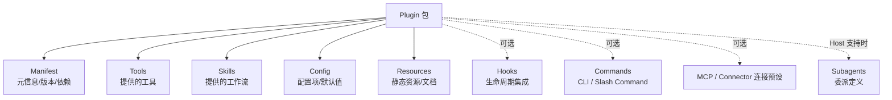
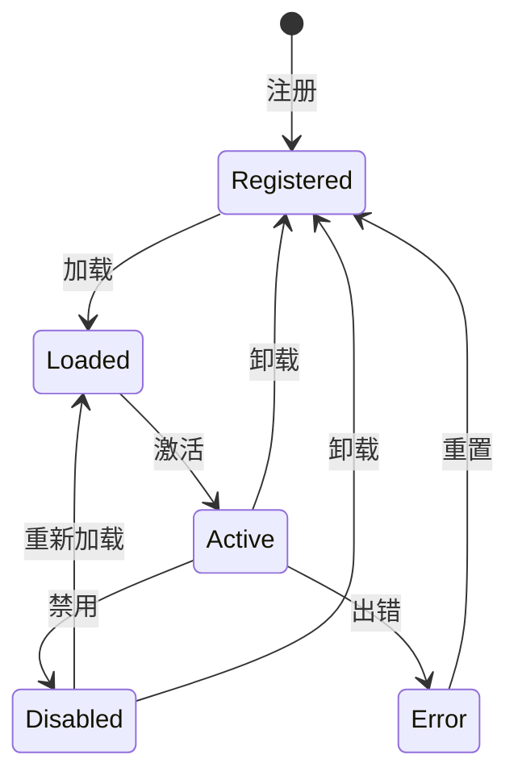

# 第 14 章：Plugin 体系

> **难度等级：** ⭐⭐⭐
> **所属模块：** 第四部分：扩展与互操作
> **来源可信度：** 官方文档 / 源码 / 推导 / 观点
> **状态：** ✅ 已完成

---

## 学习目标

完成本章学习后，你将能够：

1. 理解 Plugin 在 Agent 架构中的定位和作用
2. 掌握 Plugin 的加载、生命周期和隔离机制
3. 理解 Plugin 与 MCP、Skill 的区别和协作关系
4. 实现一个 Plugin 加载器
5. 理解 Plugin 安全模型

---

## 前置知识

- 阅读第 6 章「Tools 与 Function Calling」
- 阅读第 12 章「Skills：可复用工作流」
- 阅读第 13 章「MCP：模型上下文协议」

---

## 1. 背景

### 1.1 为什么需要 Plugin

MCP 解决了 Tool 的标准化提供问题，但一个完整的 Agent 生态还需要解决**扩展性**问题：

- 如何让第三方开发者贡献新功能？
- 如何在不修改 Agent 核心代码的情况下添加能力？
- 如何管理扩展的生命周期和依赖？

**Plugin 体系**提供了一种动态加载、隔离运行、可管理的扩展机制。

更准确地说，Plugin 首先是 **Host 定义的分发与生命周期单元**；它不必拥有任意代码执行 Runtime。某些产品允许同进程扩展代码，另一些产品只允许 Plugin 声明 Skills、Hooks、MCP/App 配置和静态资源。安全设计应从“声明式包”开始，只有确有需要时才增加隔离代码执行。

> **来源类型：** 推导分析 —— 基于 OpenAI Plugins 和 VS Code Extensions 的设计模式

### 1.2 Plugin 的定位

| 机制 | 提供什么 | 谁提供 | 加载方式 |
|------|---------|--------|---------|
| Built-in Tool | 核心功能 | Host / 应用开发者 | 代码或 Host 配置显式提供 |
| MCP Tool | 标准化外部能力 | Server 作者、内部平台或第三方 | 连接后协商与发现，或由 Host 固定配置 |
| Connector | 具体产品的身份、授权、端点和数据映射 | Host、企业平台或 SaaS 提供方 | 由 Host 配置、OAuth/凭据引用和 Adapter 建立连接 |
| Plugin | 可分发的扩展包（按 Host 能力包含 Tool、Skill、配置等） | Host 团队或第三方 | 由 Host 的安装、审核和加载模型决定 |
| Skill | 工作流模板 | 开发者、用户或项目维护者 | Host / Agent 按需匹配加载 |

Plugin 是一种可分发的扩展单元——它可以包含多个 Tool、Skill、配置和资源；具体可打包内容由 Host 的插件模型决定，不是跨产品的统一标准。

在第 2 章的五类正交概念中，Plugin 属于**分发单元（Distribution Unit）**，不是运行主体、协议或单个能力。它可以贡献这些类别中的配置或实现，但安装、启用、发现和本次运行授权是四个不同阶段。

---

## 2. 核心概念

### 2.1 Plugin 的组成



> **图 14-1：** Plugin 的组成结构。Tool、Skill、配置和资源是常见内容；Hook、命令、MCP 配置和 Subagent 定义仅是部分 Host 支持的可选打包模型。

### 2.2 Plugin 生命周期



> **图 14-2：** Plugin 生命周期状态机。从注册到加载、激活、禁用、卸载的完整生命周期。

### 2.3 可选能力与打包边界

Plugin 不应因为“可以打包一切”而成为绕过核心安全模型的后门。Manifest 应将每种能力单独声明，Host 在安装、激活和调用三个阶段分别判断兼容性与权限。

| 可选内容 | 适合解决的问题 | Host 需要额外检查的事项 |
|----------|----------------|--------------------------|
| Hook | 格式化、审计、策略检查等横切逻辑 | 事件范围、执行顺序、失败隔离 |
| CLI / Slash Command | 提供用户显式触发的工作流入口 | 参数校验、命名冲突、审批语义 |
| MCP 连接配置 | 为已知服务提供连接预设 | Server 信任、认证凭据、工具暴露范围 |
| Subagent 定义 | 声明可委派的专长和任务契约 | 上下文隔离、预算、Tool 权限、取消与审计 |

必须区分“包里有什么”和“运行时能做什么”：

- `Plugin ≠ Tool`：Plugin 是包，Tool 是结构化可调用能力；一个 Plugin 可以贡献零个、一个或多个 Tool。
- Plugin 中的 Tool 只有注册到 Tool Registry、进入本次能力快照并通过逐次策略检查后才能调用。
- Plugin 中的 Skill 仍遵循第 12 章的 Loader 与 Runtime 边界，不能借安装钩子直接执行 `scripts/`。
- Plugin 中的 MCP 配置只是连接预设；Server 信任、OAuth/凭据和 Tool 暴露范围由 Host/Connector 单独治理。
- Plugin 中的 Agent/Expert 定义只是配置；实例化 Subagent 时必须重新收窄权限、预算和上下文。

### 2.4 CLI 与 Slash Commands

CLI 是 Agent 可调用或面向开发者的命令行界面，具有参数、退出码和 `--help` 等自文档约定；Slash Command 是产品 UI 中由用户显式发起的快捷工作流，例如 `/review`。二者都属于交互入口，而不是新的推理组件。

| 入口 | 触发者 | 适合承载 | 不应承担 |
|------|--------|----------|----------|
| CLI | Agent 或开发者 | 可脚本化、可组合、可审计的系统操作 | 绕过 Sandbox 或任意拼接 Shell 字符串 |
| Slash Command | 用户 | 明确命名的常用工作流、预填参数 | 默认授予写入、网络或高风险权限 |

将命令映射到 Skill、Tool 或子代理时，仍要经过同一套权限、Guardrails 和运行时预算检查；“用户主动输入命令”不等同于已批准所有后续操作。

---

## 3. Plugin 系统实现

### 3.1 Plugin Manifest

```python
"""
Plugin 系统 - 教学实现
运行环境：Python 3.10+
依赖：无
"""

from dataclasses import dataclass, field
from enum import Enum
from typing import Any, Callable, Optional


class PluginState(Enum):
    REGISTERED = "registered"
    LOADED = "loaded"
    ACTIVE = "active"
    DISABLED = "disabled"
    ERROR = "error"


@dataclass
class PluginManifest:
    """Plugin 清单"""
    name: str
    version: str
    description: str = ""
    author: str = ""
    dependencies: list[str] = field(default_factory=list)
    min_agent_version: str = "1.0.0"
    permissions: list[str] = field(default_factory=list)


@dataclass
class Plugin:
    """Plugin 定义"""

    manifest: PluginManifest
    state: PluginState = PluginState.REGISTERED

    # Plugin 提供的能力
    tools: dict[str, Any] = field(default_factory=dict)
    skills: list[Any] = field(default_factory=list)
    config: dict = field(default_factory=dict)

    # 生命周期回调
    on_load: Optional[Callable] = None
    on_activate: Optional[Callable] = None
    on_deactivate: Optional[Callable] = None
    on_unload: Optional[Callable] = None


class PluginRegistry:
    """Plugin 注册中心"""

    def __init__(self, allowed_permissions: set[str]):
        self._plugins: dict[str, Plugin] = {}
        self._active_plugins: set[str] = set()
        self._allowed_permissions = allowed_permissions

    def register(self, plugin: Plugin):
        """注册 Plugin"""
        name = plugin.manifest.name
        if name in self._plugins:
            raise ValueError(f"Plugin '{name}' 已注册")

        # 检查依赖
        for dep in plugin.manifest.dependencies:
            if dep not in self._plugins:
                raise ValueError(
                    f"Plugin '{name}' 依赖 '{dep}'，但 '{dep}' 未注册"
                )

        self._plugins[name] = plugin
        plugin.state = PluginState.REGISTERED

    def load(self, name: str):
        """加载 Plugin"""
        plugin = self._get_plugin(name)
        if plugin.state != PluginState.REGISTERED:
            raise ValueError(f"Plugin '{name}' 当前状态不可加载: {plugin.state}")

        denied = sorted(
            set(plugin.manifest.permissions) - self._allowed_permissions
        )
        if denied:
            raise PermissionError(
                f"Plugin '{name}' 缺少授权: {', '.join(denied)}"
            )

        # 回调失败时状态仍为 REGISTERED，不产生“看似已加载”的半提交状态
        if plugin.on_load:
            plugin.on_load(plugin)
        plugin.state = PluginState.LOADED

    def activate(self, name: str):
        """激活 Plugin"""
        plugin = self._get_plugin(name)
        if plugin.state != PluginState.LOADED:
            raise ValueError(f"Plugin '{name}' 必须先加载才能激活")

        inactive_dependencies = [
            dep for dep in plugin.manifest.dependencies
            if dep not in self._active_plugins
        ]
        if inactive_dependencies:
            raise ValueError(
                f"Plugin '{name}' 的依赖尚未激活: {inactive_dependencies}"
            )

        owners = {
            tool_name: owner
            for owner in sorted(self._active_plugins)
            for tool_name in self._plugins[owner].tools
        }
        conflicts = {
            tool_name: owners[tool_name]
            for tool_name in plugin.tools
            if tool_name in owners
        }
        if conflicts:
            raise ValueError(
                f"Plugin '{name}' 的 Tool 名称冲突: {conflicts}"
            )

        # 先完成可能失败的回调，再原子提交 Registry 内部状态
        if plugin.on_activate:
            plugin.on_activate(plugin)
        plugin.state = PluginState.ACTIVE
        self._active_plugins.add(name)

    def deactivate(self, name: str):
        """禁用 Plugin"""
        plugin = self._get_plugin(name)
        if plugin.state != PluginState.ACTIVE:
            raise RuntimeError(f"Plugin '{name}' 未激活（当前状态: {plugin.state}）")
        if plugin.on_deactivate:
            plugin.on_deactivate(plugin)
        plugin.state = PluginState.DISABLED
        self._active_plugins.discard(name)

    def unload(self, name: str):
        """卸载 Plugin"""
        plugin = self._get_plugin(name)
        if plugin.state == PluginState.ACTIVE:
            self.deactivate(name)

        if plugin.on_unload:
            plugin.on_unload(plugin)
        plugin.state = PluginState.REGISTERED

    def get_active_tools(self) -> dict[str, Any]:
        """获取所有激活 Plugin 的 Tool"""
        tools: dict[str, Any] = {}
        for name in sorted(self._active_plugins):
            plugin = self._plugins[name]
            for tool_name, tool in plugin.tools.items():
                if tool_name in tools:
                    raise RuntimeError(
                        f"内部错误：激活 Plugin 存在 Tool 冲突: {tool_name}"
                    )
                tools[tool_name] = tool
        return tools

    def get_active_skills(self) -> list[Any]:
        """获取所有激活 Plugin 的 Skill"""
        skills = []
        for name in sorted(self._active_plugins):
            plugin = self._plugins[name]
            skills.extend(plugin.skills)
        return skills

    def list_plugins(self) -> list[dict]:
        """列出所有 Plugin"""
        return [
            {
                "name": p.manifest.name,
                "version": p.manifest.version,
                "state": p.state.value,
                "tools": list(p.tools.keys()),
                "skills": len(p.skills),
            }
            for p in self._plugins.values()
        ]

    def _get_plugin(self, name: str) -> Plugin:
        if name not in self._plugins:
            raise ValueError(f"Plugin '{name}' 不存在")
        return self._plugins[name]


def main():
    # Host 的部署策略决定允许集合；Manifest 声明本身不等于已授权
    registry = PluginRegistry({"read_file", "execute_command", "network"})

    # 创建 Plugin
    git_plugin = Plugin(
        manifest=PluginManifest(
            name="git-integration",
            version="1.0.0",
            description="Git 集成插件，提供版本控制相关功能",
            permissions=["read_file", "execute_command"],
        ),
        tools={
            "git_status": lambda: {"branch": "main", "changes": []},
            "git_commit": lambda msg: {"commit": "abc123", "message": msg},
            "git_diff": lambda: {"diff": "--- a/file.py\n+++ b/file.py\n..."},
        },
        skills=[],  # 可以包含 Skill
        config={"auto_stage": False, "push_on_commit": True},
    )

    db_plugin = Plugin(
        manifest=PluginManifest(
            name="database",
            version="1.0.0",
            description="数据库集成插件",
            permissions=["network"],
        ),
        tools={
            "db_query": lambda sql: {"rows": [], "sql": sql},
            "db_list_tables": lambda: ["users", "orders", "products"],
        },
    )

    print("=" * 60)
    print("  Plugin 系统演示")
    print("=" * 60)

    # 注册
    registry.register(git_plugin)
    registry.register(db_plugin)

    print("\n  已注册 Plugin:")
    for p in registry.list_plugins():
        print(f"    {p['name']} v{p['version']} [{p['state']}]")

    # 加载并激活
    for name in ["git-integration", "database"]:
        registry.load(name)
        registry.activate(name)

    print(f"\n  激活 Plugin: {registry._active_plugins}")

    # 获取所有 Tool
    print(f"\n  可用 Tool:")
    for name, tool in registry.get_active_tools().items():
        print(f"    • {name}")

    # 禁用
    registry.deactivate("database")
    print(f"\n  禁用 database 后:")
    print(f"    激活: {registry._active_plugins}")
    print(f"    Tool 数: {len(registry.get_active_tools())}")

    print("=" * 60)


if __name__ == "__main__":
    main()
```

### 3.2 PluginInstaller 与 PluginCatalog

运行期 `PluginLoader` 接收已经构造好的 Plugin 对象；安装期 `PluginInstaller` 负责治理磁盘包，两者之间由 Host 的可信 Factory 隔离。最小包结构如下：

```text
my-plugin/
├── plugin.json      # name/version/entrypoint/permissions/dependencies
├── README.md
└── resources/       # 可选静态资源
```

`entrypoint` 不是可以任意导入的文件路径，而是 Host 预先注册的 Factory ID。安装器只解析、校验和复制包，不 `eval`、不动态导入第三方代码；第 16 章的 Provider 根据 ID 选择受信任 Factory，Factory 才把安装记录解析成 `Plugin` 对象。

安装流程包含名称、Agent 最低版本、权限、依赖和符号链接检查，记录来源与 SHA-256，使用临时目录原子更新，并保留原启用状态。禁用或删除依赖项时会检查依赖方，避免留下不可满足的插件图。

```bash
cd examples/plugin-manager/python
python -m unittest -v test_main.py
python main.py --root .agent/plugins install /path/to/my-plugin
python main.py --root .agent/plugins update /path/to/my-plugin
python main.py --root .agent/plugins disable my-plugin
python main.py --root .agent/plugins remove my-plugin
```

完整 Python/TypeScript 实现位于 `examples/plugin-manager/`。它只支持可信本地目录；远程下载、签名验证、发布者信任、版本范围求解和进程沙箱属于生产扩展。

---

## 4. Plugin 安全模型

### 4.1 权限系统

Plugin 必须在 Manifest 中声明所需权限，Agent 在激活时检查：

```python
@dataclass
class Permission:
    """权限定义"""
    name: str
    description: str
    risk_level: str  # low, medium, high, critical

# 常见权限
PERMISSIONS = {
    "read_file": Permission("read_file", "读取文件", "low"),
    "write_file": Permission("write_file", "写入文件", "medium"),
    "execute_command": Permission("execute_command", "执行命令", "high"),
    "network": Permission("network", "网络访问", "medium"),
    "user_data": Permission("user_data", "访问用户数据", "high"),
}


class PermissionChecker:
    """权限检查器"""

    def __init__(self, allowed: set[str]):
        self.allowed = allowed

    def check(self, permissions: list[str]):
        """检查权限，返回未授权的权限列表"""
        return [p for p in permissions if p not in self.allowed]
```

Manifest 中的 `permissions` 只是请求，不是授权。Host 必须将请求与部署策略、用户同意或管理员策略求交集，并在执行能力之前强制检查。上面的 Registry 在 `load()` 时拒绝未授权权限；真实系统还应在 Tool 调用边界再次校验，避免加载后的配置变化或绕过。

生命周期状态采用“回调成功后提交”：回调抛错时 Registry 状态保持在转换前。这个原子性只覆盖 Registry 内部状态；回调若修改外部系统，仍需由 Plugin 自己提供幂等键、补偿操作或事务边界。

### 4.2 隔离策略

| 策略 | 说明 | 适用场景 |
|------|------|---------|
| 进程隔离 | 每个 Plugin 独立进程 | 高风险 Plugin |
| 沙箱隔离 | 受限执行环境 | 需要文件系统访问的 Plugin |
| 同进程 | 与 Agent 同进程运行 | 可信 Plugin |

---

## 5. 最佳实践

1. **Plugin 声明权限：** 每个 Plugin 必须声明所需权限，Agent 在激活时检查。
2. **依赖管理：** Plugin 的依赖应该在 Manifest 中显式声明，加载时检查。
3. **版本兼容性：** Plugin 声明兼容的 Agent 版本范围，避免不兼容的加载。
4. **优雅降级：** Plugin 出错时不应影响 Agent 核心功能，应支持禁用和重启。
5. **Plugin 隔离：** 高风险 Plugin 应运行在隔离环境中。

---

## 6. 反模式

| 反模式 | 风险 | 推荐方案 |
|--------|------|---------|
| Plugin 权限过大 | 安全风险 | 最小权限原则 |
| Plugin 间强耦合 | 脆弱的依赖关系 | 通过接口交互，不直接依赖 |
| 忽略 Plugin 错误 | Agent 不稳定 | 隔离 Plugin 错误，支持降级 |
| 同步阻塞 Plugin | Agent 响应慢 | 耗时操作异步化 |

---

## 7. FAQ

### Q: Plugin 和 Skill 有什么区别？

Plugin 是 Host 可安装、启用和隔离的扩展单元，可以打包 Tool、Skill、配置或生命周期集成。Skill 是可发现、可复用的任务知识与工作流，既可以随应用内置，也可以从文件、包或 Plugin 动态加载。两者不是“外部与内置”的固定二分：Plugin 是分发和生命周期边界，Skill 是能力表达与调用边界（→ 详见第 12 章「Skills 系统」）。

### Q: Plugin 和 MCP Server 有什么区别？

本章的教学实现将 Plugin 视为 Host 内的扩展对象；真实产品也可以选择独立进程、容器或远程隔离，因此不能把“Plugin 必然同进程”当作通用事实。MCP Server 则通过标准协议向 Host 暴露 Tool、Resource、Prompt 等能力，通常更适合跨语言、跨进程或跨产品连接。实际选择取决于 Host 的插件模型、隔离要求和部署边界。

### Q: 如何保证 Plugin 的安全性？

通过 Path Sandbox（限制文件系统访问）、Command Sandbox（限制可执行命令）、权限声明（Manifest 中声明所需权限）、隔离执行（独立进程或容器）等机制。建议为每个 Plugin 设置最小权限原则。

### Q: Plugin 之间如何通信？

Plugin 通过 Event Bus 间接通信，不应直接互相调用。一个 Plugin 发布事件，其他 Plugin 订阅感兴趣的事件。Plugin Registry 负责管理 Plugin 间的依赖关系。

### Q: 什么时候应该用 Plugin 而不是直接修改代码？

当功能需要独立开发、独立版本管理、由不同团队维护、需要动态启用/禁用、或需要支持第三方扩展时，使用 Plugin。当功能是核心工作流的一部分且很少变化时，直接修改代码更合适。

---

## 8. 官方参考

| 编号 | 来源 | 类型 | 说明 |
|------|------|------|------|
| REF-1 | [VS Code Extension API](https://code.visualstudio.com/api) | 官方文档 | Plugin 系统的经典参考 |
| REF-2 | [OpenAI Plugins (Archived)](https://platform.openai.com/docs/plugins) | 官方文档 | 早期的 Agent Plugin 尝试 |
| REF-3 | [Chrome Extension Manifest](https://developer.chrome.com/docs/extensions/mv3/manifest/) | 官方文档 | Manifest 设计参考 |
| REF-4 | [OpenClaw Tools and Plugins](https://github.com/openclaw/openclaw/blob/main/docs/tools/index.md) | 开源仓库文档 | Tool、Skill、Plugin 的分层与运行期能力过滤 |
| REF-5 | [Codex Plugin Structure](https://developers.openai.com/codex/plugins/build#plugin-structure) | 官方文档 | Plugin 打包 Skills、MCP、Apps、Hooks 与资源的产品实例 |

---

## 9. 延伸阅读

- [VS Code Extension Guide](https://code.visualstudio.com/api/get-started/your-first-extension) — 了解 VS Code 的插件模型，这是 Agent Plugin 系统的灵感来源之一
- [OpenAI Agents SDK](https://github.com/openai/openai-agents-python) — OpenAI 的 Agent SDK，包含 Tracing 等可观测性方案
- [Plugin Architecture Pattern (Martin Fowler)](https://martinfowler.com/articles/patterns-of-distributed-systems/) — 插件架构模式的企业级实践
- [Cursor Extension API](https://docs.cursor.com/) — Cursor 的扩展机制，展示 IDE Agent 的 Plugin 思路

---

## 本章小结

Plugin 是由 Host 定义生命周期、打包和权限模型的扩展单元，可以组合 Tool、Skill、配置与界面能力。它与 MCP 的边界取决于扩展归属和部署方式：前者强调 Host 内扩展治理，后者强调标准协议互操作，二者可以组合使用。

---

## 本章 Checklist

- [ ] 理解 Plugin 在 Agent 架构中的定位
- [ ] 能画出 Plugin 生命周期状态机
- [ ] 能实现 Plugin 注册、加载、激活、禁用、卸载
- [ ] 能区分安装期 `PluginInstaller`、可信 Factory 与运行期 `PluginLoader`
- [ ] 能验证 Plugin 权限、依赖、来源、校验和与启用状态
- [ ] 理解 Plugin 安全模型
- [ ] 理解 Plugin 与 MCP、Skill 的协作关系
- [ ] 运行了 `examples/plugin-manager/` 双语言契约测试
