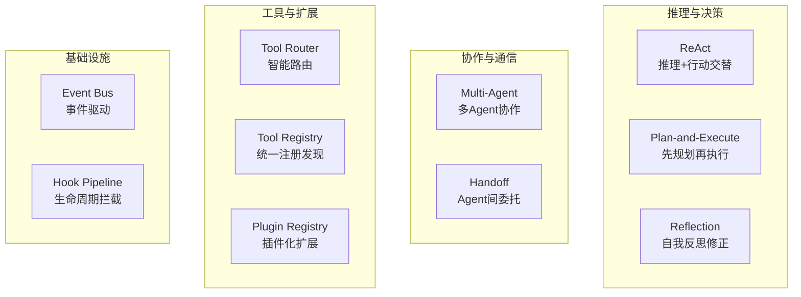
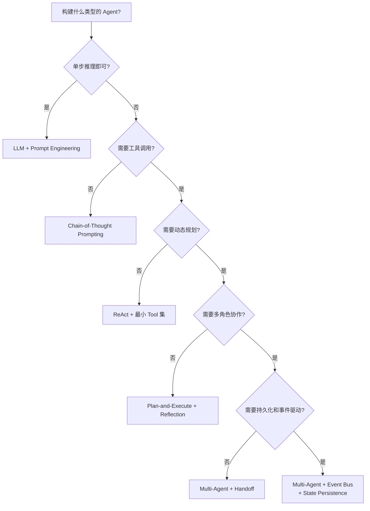

# 第 15 章：Agent 设计模式

> **难度等级：** ⭐⭐⭐⭐
> **所属模块：** 第五部分：规模化与生产
> **来源可信度：** 官方文档 / 论文 / 推导 / 观点
> **状态：** ✅ 已完成

---

## 学习目标

完成本章学习后，你将能够：

1. 掌握 10 种核心 Agent 设计模式
2. 理解每种模式的原理、优缺点和适用场景
3. 实现每种模式的最小可运行版本
4. 在架构设计中灵活组合多种模式

---

## 前置知识

- 建议阅读第 1--14 章，至少掌握第 5--7 章的规划、Tool 与 MVP 闭环
- 理解 Agent 架构的各个组件
- 了解基本的设计模式概念

---

## 1. 模式概览



> **图 15-1：** 10 种 Agent 设计模式分类。推理与决策、协作与通信、工具与扩展、基础设施四大类。

---

## 2. ReAct 模式

### 2.1 原理

ReAct（Reasoning + Acting）将推理和行动交替进行，每步行动后观察结果再决定下一步。

### 2.2 最小实现

```python
"""
ReAct 模式 - 完整实现
"""

class ReActLoop:
    """ReAct 循环"""

    def __init__(self, max_steps: int = 10):
        self.max_steps = max_steps
        self.trajectory: list[dict] = []

    def run(self, task: str, tools: dict, llm_reason) -> str:
        """运行 ReAct 循环"""
        context = f"任务: {task}\n可用工具: {list(tools.keys())}"

        for step in range(self.max_steps):
            # Thought: 推理
            thought = llm_reason(context)
            self.trajectory.append({"step": step, "type": "thought", "content": thought})

            if "最终答案" in thought:
                return thought

            # Action: 从推理中提取行动
            action, args = self._parse_action(thought, tools)
            self.trajectory.append({"step": step, "type": "action", "tool": action, "args": args})

            # Observation: 执行并观察
            if action == "noop" or action not in tools:
                result = {"result": "no action needed"}
            else:
                result = tools[action](**args)
            self.trajectory.append({"step": step, "type": "observation", "content": result})

            context += f"\nThought: {thought}\nAction: {action}({args})\nObservation: {result}"

        return "达到最大步数限制"

    def _parse_action(self, thought: str, tools: dict) -> tuple:
        """从推理中解析行动（简化实现）"""
        for name in tools:
            if name in thought.lower():
                return name, {}
        return "noop", {}
```

**优点：** 灵活、适应性强、能处理不确定性
**缺点：** 可能无限循环、缺乏全局规划
**适用场景：** 需要与外部交互的探索性任务

---

## 3. Plan-and-Execute 模式

### 3.1 原理

先制定完整计划，再逐步执行。执行过程中可动态调整计划。

### 3.2 最小实现

```python
class PlanAndExecute:
    """Plan-and-Execute 模式"""

    def __init__(self):
        self.plan: list[dict] = []
        self.results: list[dict] = []

    def create_plan(self, task: str, tools: list[str]) -> list[dict]:
        """制定计划"""
        # 简化实现：基于规则的任务分解
        plan = [
            {"id": 1, "desc": "分析任务需求", "tool": "analyze"},
            {"id": 2, "desc": "确定执行策略", "tool": "plan", "depends": [1]},
            {"id": 3, "desc": "执行核心操作", "tool": "execute", "depends": [2]},
            {"id": 4, "desc": "验证结果", "tool": "verify", "depends": [3]},
        ]
        return plan

    def execute(self, plan: list[dict], executor) -> list[dict]:
        """执行计划"""
        results = []
        completed = set()

        while len(completed) < len(plan):
            for step in plan:
                if step["id"] in completed:
                    continue
                # 检查依赖
                deps = step.get("depends", [])
                if all(d in completed for d in deps):
                    result = executor(step)
                    results.append({"step": step["id"], "result": result})
                    completed.add(step["id"])

        return results
```

**优点：** 结构清晰、可预测、易于调试
**缺点：** 对不确定性任务不够灵活
**适用场景：** 结构化任务、多步骤操作

---

## 4. Reflection 模式

### 4.1 原理

Agent 执行任务后，对自身输出进行反思和评估，如果发现问题则修正后重新执行。

### 4.2 最小实现

```python
class ReflectionAgent:
    """Reflection 模式"""

    def __init__(self, max_reflections: int = 3):
        self.max_reflections = max_reflections
        self.history: list[dict] = []

    def run(self, task: str, generator, evaluator) -> dict:
        """运行 Reflection 循环"""
        current_output = generator(task)

        for i in range(self.max_reflections):
            # 评估当前输出
            evaluation = evaluator(task, current_output)
            self.history.append({
                "iteration": i,
                "output": current_output,
                "evaluation": evaluation
            })

            # 如果评估通过，返回
            if evaluation.get("pass", False):
                return {"success": True, "output": current_output, "reflections": i + 1}

            # 否则基于反馈修正
            feedback = evaluation.get("feedback", "")
            current_output = generator(
                f"{task}\n\n上一次输出: {current_output}\n反馈: {feedback}\n请修正后重新输出。"
            )

        return {"success": False, "output": current_output, "reflections": self.max_reflections}
```

**优点：** 自我改进、质量提升、可减少人工审查
**缺点：** 额外推理成本、可能过度修正
**适用场景：** 代码生成、内容创作、复杂推理

---

## 5. Multi-Agent 模式

### 5.1 原理

多个 Agent 协作完成复杂任务，每个 Agent 负责不同角色或子任务。

### 5.2 最小实现

```python
class MultiAgentSystem:
    """Multi-Agent 系统"""

    def __init__(self):
        self.agents: dict[str, dict] = {}
        self.message_queue: list[dict] = []

    def register_agent(self, name: str, role: str, handler):
        """注册 Agent"""
        self.agents[name] = {"role": role, "handler": handler}

    def broadcast(self, sender: str, message: str):
        """广播消息给所有 Agent"""
        self.message_queue.append({"sender": sender, "message": message})

    def run(self, task: str, max_rounds: int = 5) -> dict:
        """运行多 Agent 协作"""
        self.broadcast("system", task)
        results = {}

        for round_num in range(max_rounds):
            round_messages = list(self.message_queue)
            self.message_queue.clear()

            if not round_messages:
                break

            for name, agent in self.agents.items():
                response = agent["handler"](name, agent["role"], round_messages)
                if response:
                    self.broadcast(name, response)
                    results[name] = response

        return results
```

**优点：** 任务分解、专业化、可扩展
**缺点：** 通信开销、协调复杂、一致性挑战
**适用场景：** 复杂项目、多角色协作、代码审查+生成

---

## 6. Handoff 模式

### 6.1 原理

Handoff（委托）模式允许一个 Agent 将任务或子任务委托给另一个更合适的 Agent 执行。与 Multi-Agent 的广播式协作不同，Handoff 是有向的、显式的控制权转移：发起方 Agent 明确指定接收方 Agent 和任务上下文，接收方完成处理后返回结果。这种模式在 OpenAI Agents SDK 中被作为核心机制实现。

### 6.2 最小实现

```python
class HandoffManager:
    """Handoff 模式 - Agent 间任务委托"""

    def __init__(self):
        self.agents: dict[str, dict] = {}
        self.handoff_rules: list[dict] = []
        self.handoff_history: list[dict] = []

    def register_agent(self, name: str, capabilities: list[str], handler):
        """注册 Agent 及其能力"""
        self.agents[name] = {
            "capabilities": capabilities,
            "handler": handler,
            "busy": False
        }

    def add_handoff_rule(self, from_agent: str, to_agent: str, condition: str):
        """添加委托规则"""
        self.handoff_rules.append({
            "from": from_agent,
            "to": to_agent,
            "condition": condition
        })

    def handoff(self, from_agent: str, to_agent: str, task: dict) -> dict:
        """执行 Handoff - 控制权从 from_agent 转移到 to_agent"""
        if to_agent not in self.agents:
            return {"success": False, "error": f"Agent {to_agent} not found"}

        if self.agents[to_agent]["busy"]:
            return {"success": False, "error": f"Agent {to_agent} is busy"}

        self.agents[to_agent]["busy"] = True
        try:
            result = self.agents[to_agent]["handler"](task)
            self.handoff_history.append({
                "from": from_agent,
                "to": to_agent,
                "task": task,
                "result": result
            })
            return {"success": True, "result": result}
        finally:
            self.agents[to_agent]["busy"] = False

    def find_capable_agent(self, required_capability: str,
                           exclude: str = None) -> str | None:
        """查找具备指定能力且空闲的 Agent"""
        for name, agent in self.agents.items():
            if name != exclude and required_capability in agent["capabilities"]:
                if not agent["busy"]:
                    return name
        return None
```

**优点：** 专业化分工、明确的责任边界、可追踪的委托链
**缺点：** 单点故障风险、委托链过长增加延迟、需要预定义 Agent 能力
**适用场景：** 需要不同专业能力的任务分解、客服系统中的技能路由、代码审查中的专家委托

### 6.3 Subagent 委派契约

Subagent 是由上层 Agent 委派、拥有独立执行上下文的 Agent 实例；“专家 Agent”通常只是带有特定 Instructions、Tool 权限和评估标准的 Subagent。它们不应共享主 Agent 的完整上下文、全部权限或无限预算。

| 契约项 | 委派时应明确的内容 |
|--------|--------------------|
| 任务边界 | 可交付结果、禁止做什么、何时返回而不是继续扩展 |
| 输入 | 经过筛选的上下文、引用来源、工作区或只读快照 |
| 权限 | 允许的 Tool、文件范围、网络与写入权限、是否需要人工确认 |
| 预算 | 最大步数、Token/成本上限、超时与并发配额 |
| 输出 | 结构化结论、证据或变更清单、失败原因与未完成项 |
| 生命周期 | 取消、重试、超时、结果验收和审计记录的责任方 |

适合委派的是可并行、边界清晰或确实需要专业上下文的子任务，例如独立模块审查、资料检索和测试设计。步骤高度串行、需要频繁共享细粒度状态的任务，单 Agent 加明确的 Tool 工作流通常成本更低、也更容易调试。

> **来源类型：** 推导分析 —— 基于 Multi-Agent 与 Handoff 模式的工程取舍；不同框架的具体 API 以其官方文档为准

### 6.4 本地 Handoff 与跨系统 A2A

Handoff 解决的是同一 Host 或同一应用内部的控制权转移；当协作方属于不同团队、不同运行时或不同信任边界时，还需要约定发现、任务状态、结果交付与身份验证。A2A（Agent-to-Agent）等跨 Agent 协议尝试解决这一层互操作，但它们不替代 Tool 协议，也不替代本地的委派契约。

| 问题 | 本地 Handoff | 跨系统 A2A 式协作 |
|------|--------------|-------------------|
| 发现方式 | 应用内注册表或路由规则 | 对外发布能力与身份信息 |
| 上下文 | 可传递受控的进程内状态 | 需要显式序列化、最小化和版本化 |
| 任务状态 | 可直接共享 Runtime 状态 | 需要任务 ID、异步状态与结果交付约定 |
| 信任边界 | 同一应用的权限模型 | 独立认证、授权、审计和数据边界 |

在引入跨系统协作前，先把本地 Subagent 的输入、输出、预算和取消语义做完整；否则协议只会放大原有的权限与可观测性缺口。

> **来源类型：** 推导分析 —— 参考 [A2A Protocol](https://a2a-protocol.org/latest/) 的跨 Agent 互操作定位；具体协议版本和实现能力应以官方规范为准

---

## 7. Tool Router 模式

### 7.1 原理

根据任务特征智能选择最合适的 Tool，而非将所有 Tool 暴露给模型。

### 7.2 实现

```python
class ToolRouter:
    """Tool Router 模式"""

    def __init__(self):
        self.routes: dict[str, list[str]] = {}

    def add_route(self, task_pattern: str, tools: list[str]):
        """添加路由规则"""
        self.routes[task_pattern] = tools

    def route(self, task: str, all_tools: dict) -> list:
        """根据任务路由到合适的 Tool 子集"""
        task_lower = task.lower()

        # 匹配路由规则
        matched_tools = set()
        for pattern, tool_names in self.routes.items():
            if pattern in task_lower:
                matched_tools.update(tool_names)

        # 如果没有匹配，返回所有 Tool
        if not matched_tools:
            return list(all_tools.keys())

        return list(matched_tools)

    def get_tool_definitions(self, task: str, all_tools: dict) -> list[dict]:
        """获取路由后的 Tool 定义"""
        tool_names = self.route(task, all_tools)
        return [
            {
                "type": "function",
                "function": {
                    "name": name,
                    "description": all_tools[name].description,
                    "parameters": all_tools[name].parameters
                }
            }
            for name in tool_names
            if name in all_tools
        ]
```

**优点：** 减少 Tool 选择困难、降低 Token 使用、提升准确性
**缺点：** 路由规则需要维护、可能遗漏合适 Tool
**适用场景：** Tool 数量多（>10 个）、不同类型任务需要不同 Tool 集

---

## 8. Tool Registry 模式

### 8.1 原理

Tool Registry 提供统一的工具注册、发现和执行机制。所有 Tool 通过中央注册表管理，Agent 按名称或分类查找 Tool，无需关心 Tool 的具体实现位置。这种模式将工具的定义（元数据）与执行（调用）解耦，便于动态添加/移除工具、按分类组织、以及生成 LLM 兼容的 Function Calling 定义。

### 8.2 最小实现

```python
from typing import Any, Callable

class ToolRegistry:
    """Tool Registry 模式 - 统一工具注册与发现"""

    def __init__(self):
        self._tools: dict[str, dict] = {}
        self._categories: dict[str, list[str]] = {}

    def register(self, name: str, func: Callable, description: str,
                 parameters: dict = None, category: str = "general") -> None:
        """注册工具"""
        self._tools[name] = {
            "func": func,
            "description": description,
            "parameters": parameters or {},
            "category": category,
            "enabled": True
        }
        self._categories.setdefault(category, []).append(name)

    def unregister(self, name: str) -> None:
        """注销工具"""
        tool = self._tools.pop(name, None)
        if tool:
            self._categories[tool["category"]].remove(name)

    def get(self, name: str) -> dict | None:
        """获取工具定义"""
        tool = self._tools.get(name)
        if tool and tool["enabled"]:
            return tool
        return None

    def list_by_category(self, category: str = None) -> list[str]:
        """按分类列出工具"""
        if category:
            return self._categories.get(category, [])
        return list(self._tools.keys())

    def get_definitions(self, tool_names: list[str] = None) -> list[dict]:
        """获取 OpenAI 兼容的工具定义列表"""
        names = tool_names or list(self._tools.keys())
        definitions = []
        for name in names:
            tool = self._tools.get(name)
            if tool and tool["enabled"]:
                definitions.append({
                    "type": "function",
                    "function": {
                        "name": name,
                        "description": tool["description"],
                        "parameters": tool["parameters"]
                    }
                })
        return definitions

    def execute(self, name: str, **kwargs) -> Any:
        """执行工具"""
        tool = self.get(name)
        if not tool:
            raise KeyError(f"Tool '{name}' not found or disabled")
        return tool["func"](**kwargs)
```

**优点：** 工具发现与执行解耦、支持分类管理、便

于动态注册/注销
**缺点：** 增加一层间接调用开销、需要维护元数据一致性
**适用场景：** 工具数量较多（>5 个）、需要动态加载/卸载工具、需要按场景筛选工具集

---

## 9. Plugin Registry 模式

### 9.1 原理

Plugin Registry 是 Tool Registry 的进一步抽象：插件不仅包含工具函数，还可能包含完整的生命周期管理（初始化、激活、停用、关闭）、配置管理、以及与其他组件的集成逻辑。插件通过统一的接口注册到系统中，系统可以在运行时动态加载、激活和停用插件，实现真正的"热插拔"扩展。

### 9.2 最小实现

```python
from abc import ABC, abstractmethod

class PluginBase(ABC):
    """插件基类"""

    @abstractmethod
    def name(self) -> str:
        """插件名称"""
        ...

    @abstractmethod
    def version(self) -> str:
        """插件版本"""
        ...

    def initialize(self, config: dict = None) -> None:
        """初始化插件（可选重写）"""
        pass

    def shutdown(self) -> None:
        """关闭插件（可选重写）"""
        pass

class PluginRegistry:
    """Plugin Registry 模式 - 插件化扩展系统"""

    def __init__(self):
        self._plugins: dict[str, PluginBase] = {}
        self._state: dict[str, str] = {}  # name -> status

    def register(self, plugin: PluginBase) -> None:
        """注册插件"""
        self._plugins[plugin.name()] = plugin
        self._state[plugin.name()] = "registered"

    def activate(self, name: str, config: dict = None) -> bool:
        """激活插件"""
        plugin = self._plugins.get(name)
        if not plugin:
            return False
        try:
            plugin.initialize(config)
            self._state[name] = "active"
            return True
        except Exception as e:
            self._state[name] = f"error: {e}"
            return False

    def deactivate(self, name: str) -> bool:
        """停用插件"""
        plugin = self._plugins.get(name)
        if not plugin:
            return False
        try:
            plugin.shutdown()
            self._state[name] = "inactive"
            return True
        except Exception:
            return False

    def get_active(self) -> list[str]:
        """获取所有活跃插件"""
        return [name for name, state in self._state.items()
                if state == "active"]

    def get_plugin(self, name: str) -> PluginBase | None:
        """获取插件实例"""
        return self._plugins.get(name)

    def list_all(self) -> list[dict]:
        """列出所有插件及其状态"""
        return [
            {"name": name, "version": p.version(),
             "status": self._state.get(name, "unknown")}
            for name, p in self._plugins.items()
        ]
```

**优点：** 完整的生命周期管理、热插拔支持、插件间隔离
**缺点：** 抽象层次较高、增加系统复杂度、插件质量参差不齐
**适用场景：** 需要第三方扩展的大型 Agent 系统、IDE 类 Agent（如 Cursor/Copilot 插件）、企业级 Agent 平台

---

## 10. Event Bus 模式

### 10.1 原理

使用事件总线解耦 Agent 各组件，组件通过发布/订阅事件通信。

### 10.2 实现

```python
from collections import defaultdict

class EventBus:
    """事件总线"""

    def __init__(self):
        self._subscribers: dict[str, list[callable]] = defaultdict(list)
        self._event_history: list[dict] = []

    def subscribe(self, event_type: str, handler):
        """订阅事件"""
        self._subscribers[event_type].append(handler)

    def publish(self, event_type: str, data: dict = None):
        """发布事件"""
        event = {"type": event_type, "data": data or {}, "timestamp": time.time()}
        self._event_history.append(event)

        for handler in self._subscribers.get(event_type, []):
            try:
                handler(event)
            except Exception as e:
                print(f"Event handler error [{event_type}]: {e}")

        # 也通知通配符订阅者
        for handler in self._subscribers.get("*", []):
            try:
                handler(event)
            except Exception:
                pass

    def get_history(self, event_type: str = None) -> list[dict]:
        """获取事件历史"""
        if event_type:
            return [e for e in self._event_history if e["type"] == event_type]
        return self._event_history
```

**优点：** 松耦合、可扩展、可观测
**缺点：** 调试困难、执行顺序不直观
**适用场景：** 大型 Agent 系统、多组件协调

---

## 11. Hook Pipeline 模式

### 11.1 原理

在生命周期关键节点设置拦截点，多个 Hook 按优先级顺序执行。

### 11.2 实现

```python
class HookPipeline:
    """Hook Pipeline 模式"""

    def __init__(self):
        self._hooks: dict[str, list[tuple[int, callable]]] = {}

    def register(self, event: str, handler, priority: int = 100):
        """注册 Hook（优先级越小越先执行）"""
        self._hooks.setdefault(event, []).append((priority, handler))
        self._hooks[event].sort(key=lambda x: x[0])

    def execute(self, event: str, context: dict, *args) -> dict:
        """执行 Hook Pipeline（支持额外参数传递）"""
        for _, handler in self._hooks.get(event, []):
            try:
                result = handler(context, *args)
                if result is False:  # 返回 False 表示中断
                    context["_interrupted"] = True
                    break
                if isinstance(result, dict):
                    context.update(result)
            except Exception as e:
                context["_errors"] = context.get("_errors", []) + [str(e)]
        return context
```

**优点：** 关注点分离、可组合、可配置
**缺点：** 顺序依赖、性能开销
**适用场景：** 权限检查、日志、监控、数据脱敏

---

## 12. 模式组合指南

**图 15-2：模式选择决策树**



| 场景 | 候选模式组合 | 必须验证的代价 |
|------|--------------|----------------|
| 简单 Agent | 直接 LLM 调用或 ReAct + 少量显式 Tool | 不要仅为“Agent 化”引入 Registry 或多 Agent |
| Coding Agent | ReAct 或 Plan-and-Execute；按需要加入 Reflection、Router、Hook | 文件写入、Shell 权限、评估成本与上下文选择 |
| 多角色协作 | Handoff 或受契约约束的 Subagent；必要时采用事件机制 | 委派边界、共享状态、身份授权与结果验收 |
| 长任务 / 企业平台 | 持久化 Runtime、审批、Trace；模式按任务增量组合 | 幂等、租户隔离、恢复、审计与运维成本 |
| 低延迟路径 | 最小 Tool 集、缓存、并行独立调用 | 并发竞态、缓存时效和质量回退 |

---

## 13. 最佳实践

1. **从简单模式开始：** ReAct 是最基础的 Agent 模式，先掌握它再扩展。
2. **模式组合而非堆砌：** 不是模式越多越好，根据实际需求选择。
3. **关注模式间的交互：** 多个模式组合时，注意它们之间的交互和冲突。
4. **提取可复用组件：** 将模式实现为可复用的组件，而非一次性代码。

---

## 14. 反模式

| 反模式 | 风险 | 推荐方案 |
|--------|------|---------|
| 过度设计模式 | 复杂度高，收益低 | 从简单开始，按需增加 |
| 模式不当使用 | 适用场景不匹配 | 理解每种模式的适用场景 |
| 忽略模式组合 | 模式间冲突 | 先单独测试，再组合 |

---

## 15. 官方参考

| 编号 | 来源 | 类型 | 说明 |
|------|------|------|------|
| REF-1 | [ReAct Paper](https://arxiv.org/abs/2210.03629) | 论文 | ReAct 模式的原论文 |
| REF-2 | [Reflexion Paper](https://arxiv.org/abs/2303.11366) | 论文 | Reflection 模式的原论文 |
| REF-3 | [AutoGen Paper](https://arxiv.org/abs/2308.08155) | 论文 | Multi-Agent 协作框架 |
| REF-4 | [Design Patterns (GoF)](https://en.wikipedia.org/wiki/Design_Patterns) | 书籍 | 经典设计模式参考 |

---

## 本章小结

设计模式是对重复工程问题的命名，不是必须集齐的能力清单。应先用最简单的单 Agent 和顺序流程验证任务，再依据并行收益、角色隔离、恢复或跨系统协作需求引入 Reflection、Handoff、Event Bus 或 Multi-Agent，并记录相应成本。

---

## 本章 Checklist

- [ ] 理解 10 种 Agent 设计模式
- [ ] 能实现每种模式的最小可运行版本
- [ ] 理解每种模式的适用场景
- [ ] 能根据需求组合多种模式
- [ ] 运行了各模式的示例代码
