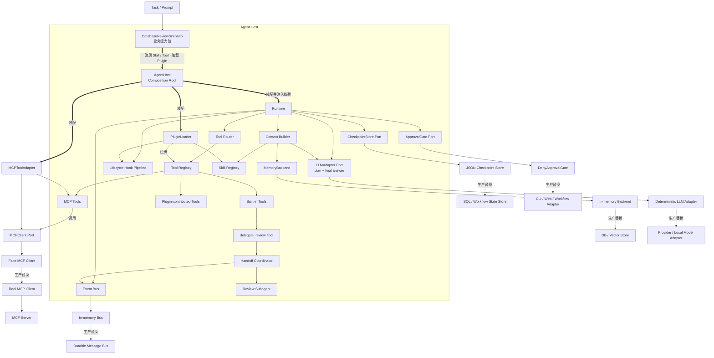
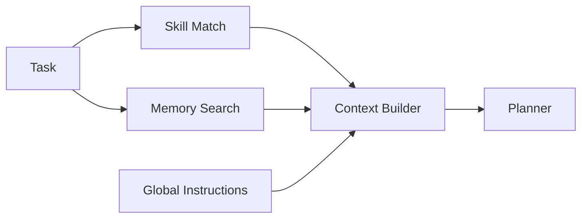
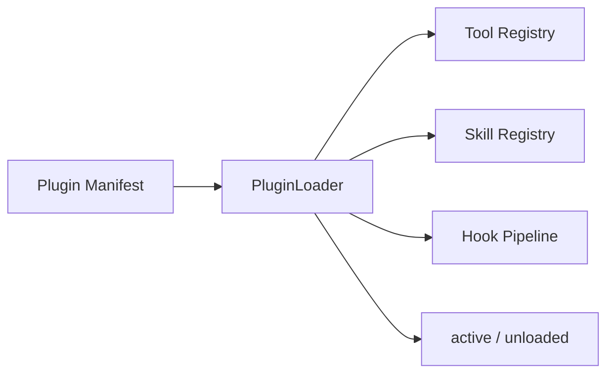
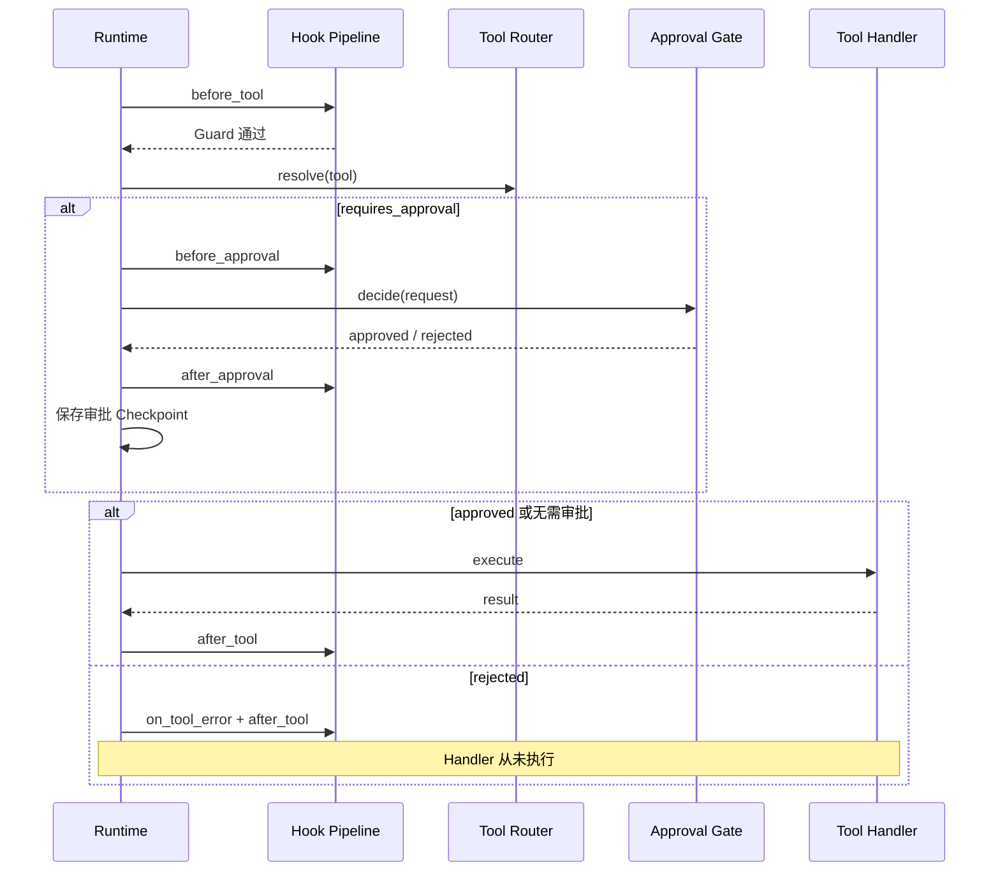
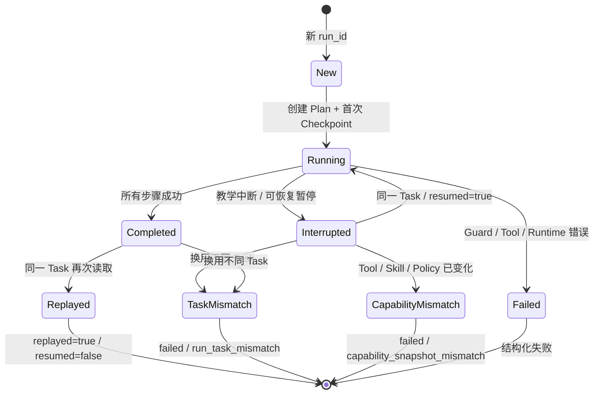

# 第 16 章：Agent Host 与场景最终组装

> **难度等级：** ⭐⭐⭐⭐⭐
> **所属模块：** 第五部分：规模化与生产
> **来源可信度：** 官方文档 / 源码 / 推导 / 观点
> **状态：** ✅ 已完成

---

## 学习目标

完成本章学习后，你将能够：

1. 将第 7 章 MVP 与第 8～15 章能力组装为一个可运行 Agent
2. 用 Port / Adapter 隔离 Runtime 与具体基础设施
3. 让 Skills、MCP 和 Plugin 通过统一扩展边界进入 Agent
4. 理解 Agent Host 组件与 Harness Engineering 实践的区别
4. 在 Tool 副作用之前加入 Hook、策略和人工审批
5. 用 Handoff、Subagent 和 Event Bus 完成最小编排闭环
6. 区分“功能闭环完整”和“生产基础设施完整”
7. 区分新运行、恢复、回放、任务冲突和失败终态

---

## 前置知识

- 阅读第 7 章「Agent MVP：从零实现」
- 建议阅读第 8～11 章的可靠运行组件
- 阅读第 12 章「Skills」、第 13 章「MCP」和第 14 章「Plugin」，理解扩展能力如何进入 Context 与 Tool Registry
- 阅读第 15 章，理解单 Agent、Handoff、Subagents 与事件驱动架构的适用边界
- 了解依赖注入、异步执行和结构化数据接口

---

## 1. 本章定位：组装，而不是重复实现

第 8～15 章分别解释 Memory、Runtime、Hooks、Tool Registry、Skills、MCP、Plugin 和编排模式。如果第 16 章把这些代码完整复制一遍，不仅篇幅失控，还会形成多份容易漂移的实现；如果只画架构图、定义空接口，又无法证明它们真的能协作。

本章采用中间方案：

> 将前面章节的能力提炼为稳定 Port，为每个 Port 提供一个离线最小 Adapter，再通过 Composition Root 和端到端测试证明最终组装成立。

### 1.1 完整性的两个层次

| 层次 | 本章是否完成 | 含义 |
|------|--------------|------|
| 功能闭环完整 | 是 | 每个关键组件有真实最小实现，并进入同一条 Runtime 执行链路 |
| 生产基础设施完整 | 否 | 不包含分布式存储、真实 Provider、完整 MCP Transport、Plugin 沙箱、审批后台和持久化消息系统 |

因此，本章可以称为“最终组装参考实现”，但不把教学代码误称为生产框架。

### 1.2 从 MVP 到最终组装

| 阶段 | 增加的能力 | 保持不变的契约 |
|------|------------|----------------|
| 第 7 章 | 最小 Runtime、Planner、Tool、Observation | 只有明确完成才返回成功 |
| 第 8～11 章 | Memory、恢复、Hooks、Registry、Router | Runtime 仍负责协调而不吞掉组件边界 |
| 第 12～14 章 | Skill Loader、MCP Adapter、Plugin Loader | 扩展只能通过 Context、Hook 或 Tool Registry 进入 |
| 第 15～16 章 | Approval、Handoff、Subagent、Event Bus | 外部副作用受控，父子任务可追踪 |

### 1.3 Harness Engineering：设计单次 Run 的工作环境

`AgentHost` 是本章的产品/代码组件；**Harness Engineering** 是设计和持续优化 Agent 单次 Run 工作环境的工程实践，两者不是同义词。一个 Harness 通常包括：

| 设计面 | 本章落点 | 要验证的问题 |
|--------|----------|--------------|
| 意图与 Context | LLM Adapter、Context Builder、Skill/Memory | Agent 是否获得完成任务所需且获权的信息？ |
| 行动表面 | Tool Registry、Router、MCP Adapter | Tool 是否可发现、可消歧、可校验和可撤回？ |
| 环境边界 | Workspace、Policy、Approval、Sandbox Port | Agent 实际能访问什么，越界能否被强制阻断？ |
| 反馈 | Observation、Hook、测试/验证 Tool、Event Bus | Agent 是否得到可操作而非噪声化的反馈？ |
| 状态与恢复 | RunState、Checkpoint、CapabilitySnapshot | 中断后能否诚实恢复，能力变化时能否拒绝旧计划？ |
| 资源与终止 | 步数、超时、重试、取消、成本预算 | 何时继续、停止、失败或交给人工？ |
| 可观测性 | Trace、父子 Span、结构化事件 | 能否定位决策、调用、审批和失败的因果链？ |

Harness Engineering 不等于“给模型更多工具”。工具、Context 和自动化越多，攻击面、认知负担和恢复复杂度也越大。改进 Harness 应以真实任务评估、失败轨迹和人工接管成本为依据。

> **来源类型：** 公开工程实践 + 本书推导 —— 参考 OpenAI《Harness engineering》对环境、意图和反馈循环的公开描述；本书将其映射到通用 Agent Host Port，不推断任何产品未公开的内部架构。

---

## 2. 最终组装架构

第 2 章的五类正交概念在本章落到同一个 Host，但它们不会因此变成包含树：`AgentHost` 运行 Agent/Subagent，Registry 管理 Tool/Skill，MCP Client 承载协议，Connector Adapter 接入具体产品，Plugin Runtime 管理分发包。数据库审查 Scenario 只选择和组合这些能力。



> **图 16-1：** Agent Host 与场景最终组装架构。图按 Task → Scenario → AgentHost → Runtime → Port / Registry → Adapter 纵向展开；粗线表示装配关系，实线表示运行期调用或注册关系，虚线表示生产 Adapter 替换。Runtime 通过 LLM Adapter 生成 Plan 和最终答案，通过 CheckpointStore 保存状态，并直接调用 Approval Gate；Handoff 则由场景注册的 `delegate_review` Tool Handler 进入 Coordinator。MCP Client 与 Server 是通信两端，不是彼此替换关系。

图中的 `Plugin-contributed Tools` 不是第三种 Tool 语义，只表示来源：进入 Registry 后，它与 Built-in/MCP 来源的 Tool 一样接受命名、Schema、Policy、审批、超时和审计治理。Scenario 在运行期 Composition Root 中注册 Skill/Tool 并加载已经构造的 Plugin；它不承担磁盘包安装，也不会执行 Skill 附带脚本。

### 2.1 Composition Root 为什么重要

如果 Runtime 在构造函数内部直接创建数据库、MCP SDK、审批 UI 和子 Agent，它就无法独立测试，也无法替换实现。本章的 `AgentHost` 是通用 Composition Root：默认创建离线 Adapter，同时允许从构造函数注入替代实现。`DatabaseReviewAgent` 显式安装数据库审查 Scenario；它是具体应用类型，不承担兼容 Facade 职责。

```python
host = AgentHost(
    checkpoint_path,
    llm=my_llm_adapter,
    memory=my_memory_backend,
    mcp_client=my_mcp_client,
    installed_skills=my_installed_skill_provider,
    mcp_servers=my_mcp_server_provider,
    installed_plugins=my_installed_plugin_provider,
    approval=my_approval_gate,
    event_bus=my_event_bus,
    subagent=my_agent_runner,
    checkpoint_store=my_checkpoint_store,
)
```

TypeScript 通过第三个 `dependencies` 参数注入同一组端口。Runtime 与具体 SDK 无直接依赖。

---

## 3. 稳定 Port 与最小 Adapter

### 3.1 MemoryBackend

Memory 不再是 Runtime 内部的一段列表，而是可替换端口：

```python
class MemoryBackend(Protocol):
    # Python 接受同步返回值或 Awaitable；TypeScript 接受值或 Promise。
    def append(self, run_id: str, entry: MemoryEntry) -> None | Awaitable[None]: ...
    def recent(self, run_id: str, limit: int = 12) -> list[MemoryEntry] | Awaitable[list[MemoryEntry]]: ...
    def remember(self, namespace: str, entry: MemoryEntry) -> None | Awaitable[None]: ...
    def search(self, namespace: str, query: str,
               limit: int = 5) -> list[MemoryEntry] | Awaitable[list[MemoryEntry]]: ...
```

本章的 `InMemoryMemoryBackend` 提供：

- 短期记忆：本教学实现按 `run_id` 隔离追加与最近记录
- 长期记忆：按 Namespace 保存跨 Run 信息；应用可在外层将稳定信息绑定到用户或 Session
- 检索：确定性的词项和中文二元片段评分

它证明检索结果可以在规划前进入 Context，但不冒充向量语义检索。同步教学实现和异步 SQL、文档数据库或向量数据库 Adapter 都能直接注入。

### 3.2 CheckpointStore

Checkpoint 也通过 Port 注入，而不是固定在 Runtime 内：

```python
class CheckpointStore(Protocol):
    def save(self, state: RunState) -> None | Awaitable[None]: ...
    def load(self, run_id: str) -> RunState | None | Awaitable[RunState | None]: ...
```

默认 `JsonCheckpointStore` 通过临时文件替换提供单进程原子写入。生产系统可以注入 SQL、工作流状态存储或其他持久化 Adapter；它们仍需自行处理并发版本、租户隔离、Schema 迁移和保留策略。

Checkpoint 同时保存 `CapabilitySnapshot`：Tool 名称/Schema/来源、Skill 内容校验和、Policy 版本和关键配置共同生成 `snapshot_hash`。恢复前必须比较当前能力快照；不兼容时返回 `failed/capability_snapshot_mismatch`，而不是让旧计划调用已经改变语义的 Tool。审批 ID 也绑定该 Hash，旧能力上的审批不能自动授权新版本能力。

### 3.3 完整生命周期 Hook Pipeline

本章统一了以下事件：

```text
新任务：before_run → before_plan → after_plan
恢复：  before_run → on_resume
执行：  before_tool
          → before_approval → after_approval
          → after_tool / on_tool_error
结束：  after_run → on_finish
```

Hook 分成两类：

| 类型 | 用途 | 失败策略 |
|------|------|----------|
| Guard | 权限、Allowlist、策略、审批前置条件 | fail-closed，阻止 Tool Handler |
| Observer | 日志、Tracing、指标、审计副本 | 隔离错误，写入 `observer_error` Trace |

Hook 支持优先级和 Owner。Plugin 卸载时会移除其注册的 Hook，避免残留回调继续运行。
Python Hook 可返回 `Awaitable`，TypeScript Hook 可返回 `Promise`；同步教学 Hook 仍可直接注册。Runtime 在进入下一生命周期事件前统一等待其完成。

### 3.4 Tool Registry 与 Router

统一 Tool 元数据包括：

```text
name / description / parameters
source / source_name
state / tags
requires_approval
handler
```

`source` 只能是 `builtin`、`mcp` 或 `plugin`；`state` 包含 `active`、`disabled`、`deprecated` 和 `error`。Registry 负责注册和来源索引语义，Router 只暴露并执行 `active` Tool。Planner 获取的是 Router 过滤后的 Tool，而不是 Registry 的原始全集。

执行前必须再次 `resolve()`，因为 Tool 可能在计划生成后被禁用。Router 还会执行示例支持的 JSON Schema 子集校验，包括必填字段、基础类型、枚举和未知字段拒绝；校验失败不会进入 Handler。

---

## 4. Skills、MCP 与 Plugin 接入

### 4.1 Skill 在规划前进入 Context



> **图 16-2：** Skill 与 Memory 的加载时序。Skill 指令和检索结果都在 Planner 调用前进入 Context，与第 12 章图 12-2 和可运行代码一致。

第 12 章的 `SkillInstaller` 负责磁盘安装和治理，本章只依赖 `InstalledSkillProvider.load_skills()`。`AgentHost` 首次运行时把 Provider 返回的 Skill 注册到运行期 `SkillRegistry`。规划前先执行 metadata discovery，只返回名称、关键词和 Owner；策略选择后才按名称加载正文，并写入 `skills_discovered` 与 `skills_loaded` Trace。同名核心 Skill 默认拒绝覆盖。这样既保留渐进式披露，也让 Runtime 不需要知道安装目录、Manifest 或复制算法。

### 4.2 MCPToolAdapter

MCP 不需要进入 Runtime 内部。Adapter 将 MCP Tool 转成统一 Tool：

```text
MCPClient.list_tools()
→ MCPToolAdapter 转换名称、描述和 Input Schema
→ ToolRegistry.register(source=mcp)
→ ToolRouter.execute()
→ MCPClient.call_tool()
```

示例使用 `FakeMCPClient` 离线验证发现和调用路径。MCP 发现与调用都支持异步接口；内部 canonical name 始终是 `<server>.<tool>`，因此安装顺序不会改变 Tool 身份。Registry 只在无歧义时提供短名 Alias；Alias 不替代 canonical identity，Capability Snapshot 也保存 Alias 映射。替换真实 Client 时，Registry、Router、Planner 和 Runtime 都不需要修改。

第 13 章的 `MCPServerManager` 通过薄 Adapter 实现本章的 `MCPServerProvider.connect_enabled()`，返回 `(server_name, MCPClient)` 列表。首次运行连接所有已启用 Server，每个 Server 使用独立 `MCPToolAdapter`；Host 退出时显式调用 `close_extensions()` / `closeExtensions()`，先关闭 Manager，再按 Server 来源卸载 Tool。单个 `mcp_client` 参数仍保留为最小教学和兼容路径。

### 4.3 PluginLoader

Plugin 通过受控的三个注册面扩展 Agent：



> **图 16-3：** Plugin 加载边界。Loader 先校验 Manifest 权限和所有资源冲突，再统一提交；任一步骤异常都会按 Owner 回滚，避免半加载。示例 Plugin `review-pack` 注册两个 Tool，其中 `propose_change` 标记为需要审批。卸载时按 Plugin 来源移除 Tool、Skill 和 Hook。

`permissions` 不只是描述字段：注册 Tool、Skill 或 Hook 分别要求对应权限。Skill 与 Hook 记录 Owner，同名核心资源不会被 Plugin 静默覆盖。Plugin 仍在 Host 进程内运行，因此本章不提供安全沙箱；生产系统还必须考虑签名、依赖验证、资源限制和进程隔离。

运行策略支持 `managed / project / user / local / session` 五类 `ConfigScope`。普通配置值可以按产品定义优先级解析，但安全权限采用限制性合并：任意层的 `deny` 都从最终 Allow 集合移除对应能力，低层配置不能放宽 managed 禁止项。

第 14 章的 `PluginCatalog` 不直接进入 Runtime。Host Adapter 通过可信 Factory 将已启用安装记录转换为 `Plugin`，再由 `InstalledPluginProvider.load_plugins()` 提供给 Composition Root。首次运行按依赖顺序加载；关闭时按逆序尝试卸载，并聚合清理错误，不能在失败时声称所有贡献项都已移除。安装器不会自动获得运行期权限，`PluginLoader` 仍会重新执行 Manifest 权限和冲突检查。

### 4.4 安装面到运行面的具体 Adapter

Provider Port 不是“留给读者自行想象”的占位接口。双语言示例中的 `installed_adapters.py/ts` 提供三条可运行桥接：

| 安装/管理对象 | Adapter | 运行期输出 |
|---|---|---|
| 第 12 章 `SkillCatalog` | `CatalogSkillProvider` | `Skill[]`，Owner 标记为安装来源 |
| 第 13 章 `MCPServerManager` | `ManagerMCPProvider` + `ManagedMCPClient` | 已启用的 `<server, MCPClient>` 会话 |
| 第 14 章 `PluginCatalog` | `CatalogPluginProvider` + 可信 Factory Map | 按依赖顺序构造的 `Plugin[]` |

MCP Manager 因此不仅要缓存 `list_tools`，Connection 还必须保留 `call_tool`；否则“管理器已连接”无法变成 Runtime 可调用能力。Plugin Adapter 不读取 `entrypoint` 后动态导入代码，而是把它当成 Factory ID，在 Host 预注册映射中解析；构造结果的名称和版本必须与安装记录一致。

扩展生命周期采用事务边界：Python 使用初始化锁，TypeScript 使用 single-flight Promise；任一 Skill、MCP 或 Plugin 加载失败都会逆序移除本轮已注册资源并关闭 Provider，随后可以安全重试。关闭采用 best-effort，单个资源失败不会跳过其余清理，错误在清理完成后聚合报告。

---

## 5. Human Approval Gate

高风险操作不能把“是否执行”交给 Tool Handler 自己判断。`PolicyEngine` 先基于主体、能力、参数、资源、`run_id`、来源和风险返回 `allow / ask / deny`：`deny` 立即关闭执行，`allow` 直接进入 Handler，只有 `ask` 才交给 `ApprovalGate`。应用若需要按租户、用户或 Session 授权，应在 Composition Root 中把这些身份解析为 Policy Layer 或扩展 `PolicyRequest`，不能假装当前教学请求已经携带它们。因此 Approval 是策略交互 Adapter，不是另一套并行授权系统。审批必须发生在 Router 已解析 Tool、但 Handler 尚未调用的窗口：



> **图 16-4：** 审批执行顺序。请求包含依赖结果解析出的执行预览、风险和幂等键；审批结果在 Handler 之前写入 Checkpoint，恢复时复用已有决定。

审批不是对空 Tool 参数做“盲批”。Tool 先通过 `prepare` 生成解析后的执行意图，再形成结构化请求：

```python
@dataclass(frozen=True)
class ApprovalRequest:
    id: str
    run_id: str
    tool: str
    arguments: dict[str, Any]
    reason: str
    preview: dict[str, Any]       # resolved intent + dependency results
    risk: str
    idempotency_key: str
```

这形成 `prepare → approve → execute` 边界：审批者看到实际目标和依赖结果，决定先于 Handler 持久化。不过，审批 Checkpoint 不能替代 Tool 自身的幂等或事务；如果进程在外部副作用提交后、结果 Checkpoint 保存前崩溃，恢复时仍需由 Tool 使用幂等键查询或去重。

示例默认使用 fail-closed 的 `DenyApprovalGate`。入口程序和需要成功路径的测试显式注入 `AutoApproveGate` 或 `ScriptedApprovalGate`；后者也用于证明拒绝后 Handler 调用次数仍为零。真实系统可以替换成 CLI、Web、工单或策略服务。

---

## 6. Handoff、Subagent 与 Event Bus

第 15 章的三种能力在本章形成一个最小闭环：

- `HandoffRequest`：传递子任务、父 Run、父 `trace_id`、父 `span_id` 和深度
- `AgentRunner`：对子 Agent 的异步统一调用协议
- `ReviewSubagent`：确定性的离线审查实现
- `HandoffCoordinator`：限制最大深度并协调执行
- `EventBus`：发布 `handoff.created` 和 `handoff.completed`

```text
Plugin-contributed Tool 生成变更建议
→ delegate_review Built-in Tool
→ HandoffCoordinator
→ ReviewSubagent
→ 结构化审查结果
→ compose_report
```

Event Bus 同时记录 `task.started` 和 `task.completed`。发布和 Subscriber 均支持异步实现；Subscriber 也区分 Guard 与 Observer：Guard 失败关闭流程，Observer 失败隔离为 `observer.error` 事件。内存 Bus 只证明发布/订阅边界，不提供持久化、重放或 Exactly-once 语义。

---

## 7. 端到端最终组装

可运行场景不是把组件并排列在图中，而是让它们进入同一条链路：

通用 `AgentHost` 只管理 Port、Registry、扩展生命周期、Policy、Checkpoint 与执行器，不注册任何数据库审查专用 Skill/Tool/Memory。`database_review_scenario.py` / `database-review-scenario.ts` 单独安装 Demo 能力；`DatabaseReviewAgent` 明确表示 `AgentHost + DatabaseReviewScenario`。这样类型名称与真实职责一致，新增业务场景也不需要复制或修改 Host。

```text
Task
→ Skill 匹配 + Memory 检索
→ Planner
→ MCP Tool 查找候选
→ Built-in Tool 检查文件
→ Plugin-contributed Tool 汇总
→ Human Approval Gate
→ Plugin-contributed Tool 生成变更建议
→ Handoff 给 Review Subagent
→ Event Bus 发布父子任务事件
→ 组合结果
→ Memory / Trace / Checkpoint
```

源码位于：

- [Agent Host 示例说明](https://github.com/dollarser/modern-ai-agent-architecture/tree/main/examples/agent-host)
- [Python 组装实现](https://github.com/dollarser/modern-ai-agent-architecture/blob/main/examples/agent-host/python/assembly.py)
- [TypeScript 组装实现](https://github.com/dollarser/modern-ai-agent-architecture/blob/main/examples/agent-host/typescript/assembly.ts)

### 7.1 运行方式

```bash
# Python
cd examples/agent-host/python
python main.py
python -m unittest -v test_main.py

# TypeScript
cd ../typescript
npm ci
npm run build
npm test
npm start
```

入口程序显式启用教学用自动审批，先中断，再用同一个 `run_id` 从 JSON Checkpoint 恢复。默认 Adapter 和 Tool 都是确定性的，不需要 API Key；未配置审批器时，高风险 Tool 默认拒绝。

### 7.2 已验证契约

| 契约 | 测试保证 |
|------|----------|
| Skill 和 Memory 在规划前加载 | Planner 收到 Skill 指令和长期记忆检索结果 |
| 扩展来源可追踪 | MCP Tool 标记 `mcp`，Plugin-contributed Tool 标记 `plugin` |
| 安装型扩展启动 | Installed Skill 与已启用 MCP Server 在首次规划前加载 |
| 安装型扩展关闭 | Manager 关闭连接并按 Server 来源卸载 Tool |
| 安装型 Plugin | Provider 经可信 Factory 构造，启动加载、关闭逆序卸载 |
| 安装面真实接入 | Skill Catalog、MCP Manager 与 Plugin Catalog 经三个 Adapter 进入 Host |
| Tool 状态受 Router 控制 | Disabled Tool 不向 Planner 暴露，也不能执行 |
| Tool 参数在 Handler 前校验 | 必填字段、基础类型、枚举和未知字段错误被拒绝 |
| Plugin 可以卸载 | Plugin 贡献的 Tool、Skill 和 Hook 按 Owner 移除 |
| Plugin 加载保持原子 | 权限或资源冲突在提交前失败，异常回滚不残留部分资源 |
| 审批位于副作用之前 | 拒绝时 Handler 调用次数为零 |
| 审批不会 fail-open | 默认 Gate 拒绝；决定在 Handler 前持久化，请求包含预览和幂等键 |
| Guard 与 Observer 语义不同 | Guard fail-closed；Observer 错误隔离 |
| Handoff 保留父子关系 | Event Bus 和结果包含父 Run / Trace 信息 |
| 异步 Port 双语言对齐 | Memory、Checkpoint、Event Bus、Hook、Tool、MCP、Approval 与 Subagent 可直接注入异步实现 |
| MCP 同名不覆盖 | 多 Server 冲突时生成带 Server Namespace 的别名 |
| Checkpoint 真正恢复 | Plan、结果、审批、计数与 Trace 从新实例恢复 |
| 失败不误报成功 | 只有 `status=completed` 返回 `success=true` |
| Run 不跨任务复用 | 同一 `run_id` 换任务返回 `failed/run_task_mismatch` |
| 顶层异常诚实收敛 | 规划、Memory、Hook、最终答案或 Checkpoint 异常触发 `on_error` 并返回 `failed` |
| Python / TypeScript 契约一致 | 两套测试覆盖相同端到端场景 |
| 受限编码任务闭环 | 工作区列举、读取、搜索、精确 Patch、预注册测试和结果汇报真实运行 |
| 编码副作用默认拒绝 | Patch 与测试均需审批；拒绝 Patch 后文件字节不变 |
| 工作区路径受限 | `../` 越界和指向工作区外的既有符号链接被拒绝 |
| 多轮身份不混用 | 一个 Session 保存多轮 Message；每条用户消息创建新的 Task/Run |
| 历史进入新 Run | Application 裁剪历史后显式传给 Planner Context，不复用旧 Run |

### 7.3 受限 Coding Agent 纵向切片

`DatabaseReviewAgent` 证明扩展组件能够组装，但不应被误解为编码能力。为闭合本书的开发主线，示例另提供 `CodingAgent`：它复用同一个通用 Host，只安装工作区能力和专用确定性计划。

```text
Task
→ list_files
→ read_file + search_code
→ Policy / Approval
→ apply_patch（精确匹配一次并原子替换）
→ Policy / Approval
→ run_check（固定 argv 的预注册测试）
→ report_change
```

这里没有提供“执行任意 Shell”或“写入任意绝对路径”的 Tool。`run_check` 只接受内部标识 `unit`，Adapter 再映射为 Python `-m unittest -q` 或 Node `--test`；用户输入不会拼接进命令行。`Workspace` 先解析固定根目录，所有文件参数必须留在根目录下，工作区外符号链接不会被遍历或读取。`apply_patch` 仅在旧文本恰好出现一次时写入临时文件并原子替换，避免模糊匹配悄悄改错位置。

这是**可运行的安全教学切片**，不是生产沙箱：它没有容器、文件系统配额、进程树回收、完整 Unified Diff、Git 事务或跨平台命令策略。生产实现应保留相同 Tool 契约，但把 Workspace 和 Process Adapter 替换为 OS/容器级隔离实现。

### 7.4 Run 恢复、回放与失败语义

同一个 `run_id` 只能绑定一个 Task。恢复不是重新执行所有步骤，而是加载 Plan、结果、审批、计数、Trace 和 Memory，再继续尚未完成的依赖步骤：



> **图 16-5：** Run 状态与读取语义。`resumed` 表示继续未完成 Run，`replayed` 表示读取已完成结果；二者不能混用。恢复时，Checkpoint 中缺失于当前 `MemoryBackend` 的历史会重新灌入。顶层规划、Memory、Hook、最终答案或 Checkpoint 异常统一触发 `on_error` 并返回 `failed`；Python `CancelledError` 和 TypeScript `AbortError` 保留取消语义，不转换成普通失败。

本章的 `AgentHost` 刻意保持为 **Run-scoped Host**：`run_id` 是 Checkpoint、审批和执行结果的键。其上层另提供 `ConversationApplication + JsonSessionStore`，负责 Session、Message、Task 与 Run 的映射；这证明对话能力可以组合在 Host 之外，而不必把 `run_id` 错改成 Session。Host 仍用不可变 `task` 文本校验同一 Run 的恢复输入。

> **取舍依据：** [A2A Life of a Task](https://a2aproject.github.io/A2A/latest/topics/life-of-a-task/) 明确说明一个 `contextId` 可组合多个 Task。本例只实现教学型 Session Store，不实现完整对话产品；但它已经显式保存 Session → Message → Task/Run 映射，避免用 `session_id` 掩盖一对一执行键。

### 7.5 Application Session：多轮对话如何进入新 Run

应用层的数据关系是：

```text
Session(session_id)
├── Message(user, task-1, run-1)
├── Message(assistant, task-1, run-1)
├── Message(user, task-2, run-2)
└── Message(assistant, task-2, run-2)

TaskRecord(task_id, run_id, request, status)
```

`ConversationApplication.send()` 先加载 Session，截取最近若干条历史，再为当前用户消息创建全新的 `task_id/run_id`。用户意图和执行身份必须在 Runtime 调用前落盘；Run 完成后，Application 再写入 Assistant Message 和 Task 终态。历史以显式 `conversation_context` 传给 AgentHost 的 Planner，它不会改变 Run 的恢复身份，也不会把整个 Session 无上限复制进 Context。

教学 `JsonSessionStore` 使用原子替换并在进程内串行化发送，但它不提供多进程事务、租户隔离或分布式锁。生产实现应为 `session_id + message_id`、`task_id` 和 `run_id` 分别设置唯一约束和幂等键，并定义并发消息的排序策略。

---

## 8. 性能与韧性边界

本章保留依赖感知并行、结构化重试、Tool 超时和 Checkpoint，但需要明确边界：

| 能力 | 教学实现 | 生产环境还需要 |
|------|----------|----------------|
| 并行 | 只并行依赖已满足的步骤 | 限流、背压、资源池、取消传播 |
| Run 能力视图 | 规划前冻结 Tool Registry | 跨进程租约、版本化连接池、优雅热卸载 |
| 重试 | 只重试 `retryable=true` | 幂等键、错误分类、Retry-After、抖动退避 |
| 超时 | Runtime 停止等待 | Provider 取消协议和资源隔离 |
| Checkpoint | JSON 原子替换 | 事务、并发控制、Schema 迁移、保留策略 |
| Session Store | JSON 原子替换、进程内串行发送 | 消息幂等、并发排序、租户隔离、事务和保留策略 |
| 能力快照 | Tool/Skill/Policy/配置摘要与恢复拒绝 | 兼容迁移、签名身份和版本注册中心 |
| Memory | 内存词项检索 | 持久化、Embedding、权限和遗忘策略 |
| MCP | Fake Client | 真实 Transport、认证、能力协商和断线恢复 |
| Plugin | 进程内加载 | 签名、沙箱、供应链治理和资源配额 |
| Approval | 默认拒绝、Demo 显式自动或脚本决定 | 身份、超时、委托、审计和 UI |
| Event Bus | 内存发布/订阅 | 持久化、重放、消费确认和去重 |
| LLM | 确定性离线 Adapter | Provider 认证、限流、取消、用量和输出校验 |

不能因为 Runtime 超时就假设外部副作用已经取消，也不能因为 Checkpoint 保存成功就假设 Tool 事务一定提交。副作用 Tool 必须提供幂等键，并记录可核对的执行标识。

---

## 9. 最佳实践

1. **让 Runtime 依赖 Port：** SDK、数据库和 UI 都留在 Adapter 内。
2. **只有一个 Composition Root：** 组件创建与业务执行分离。
3. **扩展统一进入 Context、Hook 或 Tool Registry：** 不允许 Plugin 修改 Runtime 私有状态。
4. **执行时重新授权：** 规划时可见不代表执行时仍然允许。
5. **统一策略语义：** Policy 返回 `allow/ask/deny`，Approval 只实现 `ask` 的交互。
6. **审批先于副作用：** 拒绝必须保证 Handler 没有被调用。
7. **恢复时验证能力身份：** Checkpoint 与审批都绑定 Capability Snapshot。
8. **扩展生命周期必须可回滚：** 初始化失败不留下半加载 Registry，关闭继续清理所有资源。
9. **每个 Run 冻结能力视图：** 热更新只影响新 Run，不能改变已规划执行的 Tool。
10. **安全配置限制性合并：** 任意 Scope 的 deny 都不能被更低层 allow 放宽。
11. **Skill 正文按需加载：** 先发现元数据，再选择、加载和审计正文。
12. **明确教学 Adapter 的边界：** Fake MCP、内存 Memory 和自动审批不能包装成生产能力。
13. **编码工具使用结构化参数：** 路径、Patch 和检查 ID 分开传递，不拼接 Shell 字符串。

---

## 10. 官方参考

| 参考 | 类型 | 本章用途 |
|------|------|----------|
| [Model Context Protocol](https://modelcontextprotocol.io/) | 官方规范 | MCP Client、Tool 发现与调用边界 |
| [A2A Life of a Task](https://a2aproject.github.io/A2A/latest/topics/life-of-a-task/) | 官方规范 | `contextId` 组合多个 Task，支撑 Session/Context 与单次 Run 分离 |
| [OpenAI Agents SDK](https://openai.github.io/openai-agents-python/) | 官方文档 | Agent、Handoff、Guardrail 和 Tracing 设计参考 |
| [Anthropic Building Effective Agents](https://www.anthropic.com/research/building-effective-agents) | 官方文章 | Workflow、Agent 与编排模式取舍 |
| [OpenTelemetry](https://opentelemetry.io/docs/) | 通用可观测性标准 | 仅参考 Trace/Span/Metrics 与上下文传播；不用于定义 Agent、Task、Run 或 Session |

---

## 本章小结

第 16 章不再提供一份与前文割裂的“超级 Agent”伪代码，而是把第 7～15 章的能力收敛为可替换 Port，并提供真实的离线最小 Adapter。Skills、Memory、MCP、Plugin、Hooks、Approval、Handoff、Subagent、Event Bus、Checkpoint 和 Runtime 已进入同一条可测试链路。

这使示例达到了“功能闭环完整”：组件能注册、调用、拒绝、卸载、恢复和追踪；同时它仍然诚实地不是生产基础设施完整版。生产化工作应在不修改 Runtime 契约的前提下替换 Adapter。

---

## 本章 Checklist

- [ ] 能解释 Port、Adapter 与 Composition Root 的职责
- [ ] 能替换 `MemoryBackend` 而不修改 Runtime
- [ ] 能区分 Guard Hook 与 Observer Hook 的失败策略
- [ ] 能通过 Tool 来源和状态完成 Router 过滤
- [ ] 能把 MCP Tool 转换并注册到统一 Tool Registry
- [ ] 能解释 MCP 同名 Tool 的 Server Namespace / Alias 策略
- [ ] 能通过 Provider Port 接入安装型 Skill/MCP，而不是让 Runtime 直接读取安装目录
- [ ] 能通过可信 Factory 与 `InstalledPluginProvider` 接入已启用 Plugin
- [ ] 能解释三个安装/管理 Adapter 如何把磁盘记录或连接转换为运行期对象
- [ ] 能在 Host 关闭时断开 MCP Manager 并按来源卸载 Tool
- [ ] 能原子加载和卸载 Plugin 贡献的 Tool、Skill 与 Hook，并校验 Manifest 权限
- [ ] 能在 Handler 前完成 Tool Schema 校验
- [ ] 能说明 `prepare → approve → execute`，并保证默认拒绝和拒绝后 Handler 不执行
- [ ] 能完成一次带父子 Trace 的 Handoff
- [ ] 能直接注入异步 Memory、Checkpoint、Event Bus、Hook、Tool、MCP、Approval 与 Subagent
- [ ] 能区分 `resumed`、`replayed`、`run_task_mismatch` 与普通失败
- [ ] 能从 Checkpoint 恢复且不重复审批，并将历史回灌到 MemoryBackend
- [ ] 能说明教学实现与生产基础设施之间的边界
- [ ] 能运行受限 Coding Agent，并解释 Workspace、Approval、精确 Patch 和预注册检查的安全边界
- [ ] 能解释一个 Session 为什么可以包含多个 Task/Run，并把历史作为 Context 而不是恢复键
