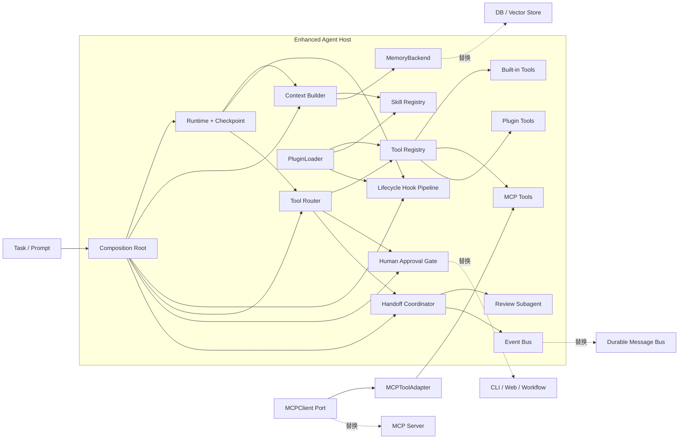
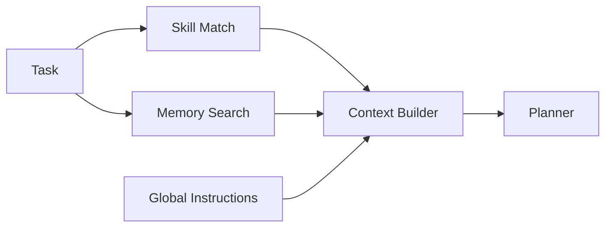
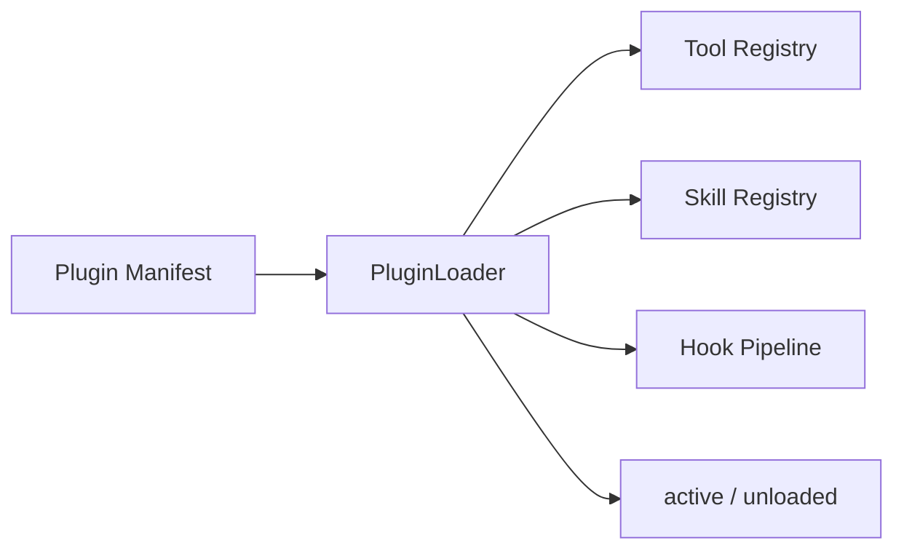
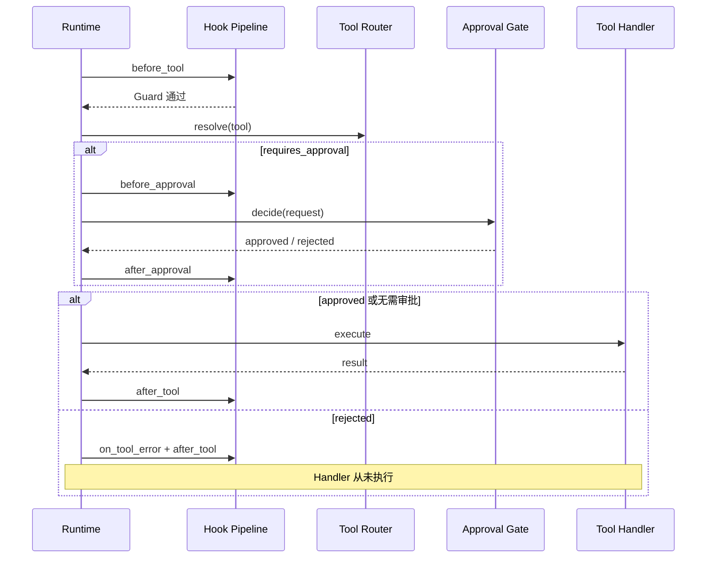

# 第 16 章：增强版 Agent 最终组装

> **难度等级：** ⭐⭐⭐⭐⭐
> **所属模块：** 第五部分：规模化与生产
> **来源可信度：** 官方文档 / 源码 / 推导 / 观点
> **状态：** ✅ 已完成

---

## 学习目标

完成本章学习后，你将能够：

1. 将第 7 章 MVP 与第 8～15 章能力组装为一个可运行 Agent
2. 用 Port / Adapter 隔离 Runtime 与具体基础设施
3. 让 Skills、MCP 和 Plugin 通过统一扩展边界进入 Agent
4. 在 Tool 副作用之前加入 Hook、策略和人工审批
5. 用 Handoff、Subagent 和 Event Bus 完成最小编排闭环
6. 区分“功能闭环完整”和“生产基础设施完整”

---

## 前置知识

- 阅读第 7 章「Agent MVP：从零实现」
- 建议阅读第 8～11 章的可靠运行组件
- 阅读第 12 章「Skills」、第 13 章「MCP」和第 14 章「Plugin」，理解扩展能力如何进入 Context 与 Tool Registry
- 阅读第 15 章，理解单 Agent、Handoff、Subagents 与事件驱动架构的适用边界
- 了解依赖注入、异步执行和结构化数据接口

---

## 1. 本章定位：组装，而不是重复实现

第 8～15 章分别解释 Memory、Runtime、Hooks、Tool Registry、Skills、MCP、Plugin 和编排模式。如果第 16 章把这些代码完整复制一遍，不仅篇幅失控，还会形成多份容易漂移的实现；如果只画架构图、定义空接口，又无法证明它们真的能协作。

本章采用中间方案：

> 将前面章节的能力提炼为稳定 Port，为每个 Port 提供一个离线最小 Adapter，再通过 Composition Root 和端到端测试证明最终组装成立。

### 1.1 完整性的两个层次

| 层次 | 本章是否完成 | 含义 |
|------|--------------|------|
| 功能闭环完整 | 是 | 每个关键组件有真实最小实现，并进入同一条 Runtime 执行链路 |
| 生产基础设施完整 | 否 | 不包含分布式存储、真实 Provider、完整 MCP Transport、Plugin 沙箱、审批后台和持久化消息系统 |

因此，本章可以称为“最终组装参考实现”，但不把教学代码误称为生产框架。

### 1.2 从 MVP 到最终组装

| 阶段 | 增加的能力 | 保持不变的契约 |
|------|------------|----------------|
| 第 7 章 | 最小 Runtime、Planner、Tool、Observation | 只有明确完成才返回成功 |
| 第 8～11 章 | Memory、恢复、Hooks、Registry、Router | Runtime 仍负责协调而不吞掉组件边界 |
| 第 12～14 章 | Skill Loader、MCP Adapter、Plugin Loader | 扩展只能通过 Context、Hook 或 Tool Registry 进入 |
| 第 15～16 章 | Approval、Handoff、Subagent、Event Bus | 外部副作用受控，父子任务可追踪 |

---

## 2. 最终组装架构



> **图 16-1：** Enhanced Agent 最终组装架构。实线是本章离线实现的真实调用关系，虚线表示生产环境可替换的基础设施。Composition Root 负责装配，Runtime 只依赖稳定 Port。

### 2.1 Composition Root 为什么重要

如果 Runtime 在构造函数内部直接创建数据库、MCP SDK、审批 UI 和子 Agent，它就无法独立测试，也无法替换实现。本章的 `EnhancedAgent` 是 Composition Root：默认创建离线 Adapter，同时允许从构造函数注入替代实现。

```python
agent = EnhancedAgent(
    checkpoint_path,
    llm=my_llm_adapter,
    memory=my_memory_backend,
    mcp_client=my_mcp_client,
    approval=my_approval_gate,
    event_bus=my_event_bus,
    subagent=my_agent_runner,
)
```

TypeScript 通过第三个 `dependencies` 参数注入同一组端口。Runtime 与具体 SDK 无直接依赖。

---

## 3. 稳定 Port 与最小 Adapter

### 3.1 MemoryBackend

Memory 不再是 Runtime 内部的一段列表，而是可替换端口：

```python
class MemoryBackend(Protocol):
    def append(self, session_id: str, entry: MemoryEntry) -> None: ...
    def recent(self, session_id: str, limit: int = 12) -> list[MemoryEntry]: ...
    def remember(self, namespace: str, entry: MemoryEntry) -> None: ...
    def search(self, namespace: str, query: str,
               limit: int = 5) -> list[MemoryEntry]: ...
```

本章的 `InMemoryMemoryBackend` 提供：

- 短期记忆：按 `session_id` 隔离的追加与最近记录
- 长期记忆：按 Namespace 保存跨 Session 信息
- 检索：确定性的词项和中文二元片段评分

它证明检索结果可以在规划前进入 Context，但不冒充向量语义检索。生产环境可以实现同一接口，接入 SQL、文档数据库或向量数据库。

### 3.2 完整生命周期 Hook Pipeline

本章统一了以下事件：

```text
新任务：before_run → before_plan → after_plan
恢复：  before_run → on_resume
执行：  before_tool
          → before_approval → after_approval
          → after_tool / on_tool_error
结束：  after_run → on_finish
```

Hook 分成两类：

| 类型 | 用途 | 失败策略 |
|------|------|----------|
| Guard | 权限、Allowlist、策略、审批前置条件 | fail-closed，阻止 Tool Handler |
| Observer | 日志、Tracing、指标、审计副本 | 隔离错误，写入 `observer_error` Trace |

Hook 支持优先级和 Owner。Plugin 卸载时会移除其注册的 Hook，避免残留回调继续运行。

### 3.3 Tool Registry 与 Router

统一 Tool 元数据包括：

```text
name / description / parameters
source / source_name
state / tags
requires_approval
handler
```

`source` 只能是 `builtin`、`mcp` 或 `plugin`；`state` 包含 `active`、`disabled`、`deprecated` 和 `error`。Registry 负责注册和来源索引语义，Router 只暴露并执行 `active` Tool。Planner 获取的是 Router 过滤后的 Tool，而不是 Registry 的原始全集。

执行前必须再次 `resolve()`，因为 Tool 可能在计划生成后被禁用。

---

## 4. Skills、MCP 与 Plugin 接入

### 4.1 Skill 在规划前进入 Context



> **图 16-2：** Skill 与 Memory 的加载时序。Skill 指令和检索结果都在 Planner 调用前进入 Context，与第 12 章图 12-2 和可运行代码一致。

### 4.2 MCPToolAdapter

MCP 不需要进入 Runtime 内部。Adapter 将 MCP Tool 转成统一 Tool：

```text
MCPClient.list_tools()
→ MCPToolAdapter 转换名称、描述和 Input Schema
→ ToolRegistry.register(source=mcp)
→ ToolRouter.execute()
→ MCPClient.call_tool()
```

示例使用 `FakeMCPClient` 离线验证发现和调用路径。替换真实 Client 时，Registry、Router、Planner 和 Runtime 都不需要修改。

### 4.3 PluginLoader

Plugin 通过受控的三个注册面扩展 Agent：



> **图 16-3：** Plugin 加载边界。示例 Plugin `review-pack` 注册两个 Tool，其中 `propose_change` 标记为需要审批。卸载时按 Plugin 来源移除 Tool、Skill 和 Hook。

Plugin 仍在 Host 进程内运行，因此本章不提供安全沙箱。生产系统必须额外考虑签名、权限、依赖验证、资源限制和进程隔离。

---

## 5. Human Approval Gate

高风险操作不能把“是否执行”交给 Tool Handler 自己判断。审批必须发生在 Router 已解析 Tool、但 Handler 尚未调用的窗口：



> **图 16-4：** 审批执行顺序。审批结果写入 Checkpoint；恢复时复用已有决定，避免同一步骤重复请求审批。

示例提供 `AutoApproveGate` 和 `ScriptedApprovalGate`。后者用于证明拒绝后 Handler 调用次数仍为零。真实系统可以替换成 CLI、Web、工单或策略服务。

---

## 6. Handoff、Subagent 与 Event Bus

第 15 章的三种能力在本章形成一个最小闭环：

- `HandoffRequest`：传递子任务、父 Session、父 Trace 和深度
- `AgentRunner`：对子 Agent 的统一调用协议
- `ReviewSubagent`：确定性的离线审查实现
- `HandoffCoordinator`：限制最大深度并协调执行
- `EventBus`：发布 `handoff.created` 和 `handoff.completed`

```text
Plugin Tool 生成变更建议
→ HandoffCoordinator
→ ReviewSubagent
→ 结构化审查结果
→ compose_report
```

Event Bus 同时记录 `task.started` 和 `task.completed`。内存 Bus 只证明发布/订阅边界，不提供持久化、重放或 Exactly-once 语义。

---

## 7. 端到端最终组装

可运行场景不是把组件并排列在图中，而是让它们进入同一条链路：

```text
Task
→ Skill 匹配 + Memory 检索
→ Planner
→ MCP Tool 查找候选
→ Built-in Tool 检查文件
→ Plugin Tool 汇总
→ Human Approval Gate
→ Plugin Tool 生成变更建议
→ Handoff 给 Review Subagent
→ Event Bus 发布父子任务事件
→ 组合结果
→ Memory / Trace / Checkpoint
```

源码位于：

- [Enhanced Agent 示例说明](https://github.com/dollarser/modern-ai-agent-architecture/tree/main/examples/enhanced-agent)
- [Python 组装实现](https://github.com/dollarser/modern-ai-agent-architecture/blob/main/examples/enhanced-agent/python/assembly.py)
- [TypeScript 组装实现](https://github.com/dollarser/modern-ai-agent-architecture/blob/main/examples/enhanced-agent/typescript/assembly.ts)

### 7.1 运行方式

```bash
# Python
cd examples/enhanced-agent/python
python main.py
python -m unittest -v test_main.py

# TypeScript
cd ../typescript
npm install
npm run build
npm test
npm start
```

入口程序先中断，再用同一个 Session 从 JSON Checkpoint 恢复。默认 Adapter 和 Tool 都是确定性的，不需要 API Key。

### 7.2 已验证契约

| 契约 | 测试保证 |
|------|----------|
| Skill 和 Memory 在规划前加载 | Planner 收到 Skill 指令和长期记忆检索结果 |
| 扩展来源可追踪 | MCP Tool 标记 `mcp`，Plugin Tool 标记 `plugin` |
| Tool 状态受 Router 控制 | Disabled Tool 不向 Planner 暴露，也不能执行 |
| Plugin 可以卸载 | Plugin Tool、Skill 和 Hook 按 Owner 移除 |
| 审批位于副作用之前 | 拒绝时 Handler 调用次数为零 |
| Guard 与 Observer 语义不同 | Guard fail-closed；Observer 错误隔离 |
| Handoff 保留父子关系 | Event Bus 和结果包含父 Session / Trace 信息 |
| Checkpoint 真正恢复 | Plan、结果、审批、计数与 Trace 从新实例恢复 |
| 失败不误报成功 | 只有 `status=completed` 返回 `success=true` |
| Python / TypeScript 契约一致 | 两套测试覆盖相同端到端场景 |

---

## 8. 性能与韧性边界

本章保留依赖感知并行、结构化重试、Tool 超时和 Checkpoint，但需要明确边界：

| 能力 | 教学实现 | 生产环境还需要 |
|------|----------|----------------|
| 并行 | 只并行依赖已满足的步骤 | 限流、背压、资源池、取消传播 |
| 重试 | 只重试 `retryable=true` | 幂等键、错误分类、Retry-After、抖动退避 |
| 超时 | Runtime 停止等待 | Provider 取消协议和资源隔离 |
| Checkpoint | JSON 原子替换 | 事务、并发控制、Schema 迁移、保留策略 |
| Memory | 内存词项检索 | 持久化、Embedding、权限和遗忘策略 |
| MCP | Fake Client | 真实 Transport、认证、能力协商和断线恢复 |
| Plugin | 进程内加载 | 签名、沙箱、供应链治理和资源配额 |
| Approval | 自动或脚本决定 | 身份、超时、委托、审计和 UI |
| Event Bus | 内存发布/订阅 | 持久化、重放、消费确认和去重 |

不能因为 Runtime 超时就假设外部副作用已经取消，也不能因为 Checkpoint 保存成功就假设 Tool 事务一定提交。副作用 Tool 必须提供幂等键，并记录可核对的执行标识。

---

## 9. 最佳实践

1. **让 Runtime 依赖 Port：** SDK、数据库和 UI 都留在 Adapter 内。
2. **只有一个 Composition Root：** 组件创建与业务执行分离。
3. **扩展统一进入 Context、Hook 或 Tool Registry：** 不允许 Plugin 修改 Runtime 私有状态。
4. **执行时重新授权：** 规划时可见不代表执行时仍然允许。
5. **审批先于副作用：** 拒绝必须保证 Handler 没有被调用。
6. **恢复时防止重复副作用：** 保存审批、步骤结果和幂等标识。
7. **明确教学 Adapter 的边界：** Fake MCP、内存 Memory 和自动审批不能包装成生产能力。

---

## 10. 官方参考

| 参考 | 类型 | 本章用途 |
|------|------|----------|
| [Model Context Protocol](https://modelcontextprotocol.io/) | 官方规范 | MCP Client、Tool 发现与调用边界 |
| [OpenAI Agents SDK](https://openai.github.io/openai-agents-python/) | 官方文档 | Agent、Handoff、Guardrail 和 Tracing 设计参考 |
| [Anthropic Building Effective Agents](https://www.anthropic.com/research/building-effective-agents) | 官方文章 | Workflow、Agent 与编排模式取舍 |
| [OpenTelemetry](https://opentelemetry.io/docs/) | 官方文档 | Trace、Metrics 与上下文传播 |

---

## 本章小结

第 16 章不再提供一份与前文割裂的“超级 Agent”伪代码，而是把第 7～15 章的能力收敛为可替换 Port，并提供真实的离线最小 Adapter。Skills、Memory、MCP、Plugin、Hooks、Approval、Handoff、Subagent、Event Bus、Checkpoint 和 Runtime 已进入同一条可测试链路。

这使示例达到了“功能闭环完整”：组件能注册、调用、拒绝、卸载、恢复和追踪；同时它仍然诚实地不是生产基础设施完整版。生产化工作应在不修改 Runtime 契约的前提下替换 Adapter。

---

## 本章 Checklist

- [ ] 能解释 Port、Adapter 与 Composition Root 的职责
- [ ] 能替换 `MemoryBackend` 而不修改 Runtime
- [ ] 能区分 Guard Hook 与 Observer Hook 的失败策略
- [ ] 能通过 Tool 来源和状态完成 Router 过滤
- [ ] 能把 MCP Tool 转换并注册到统一 Tool Registry
- [ ] 能加载和卸载 Plugin Tool、Skill 与 Hook
- [ ] 能保证审批拒绝后 Tool Handler 不执行
- [ ] 能完成一次带父子 Trace 的 Handoff
- [ ] 能从 Checkpoint 恢复且不重复审批已完成步骤
- [ ] 能说明教学实现与生产基础设施之间的边界
