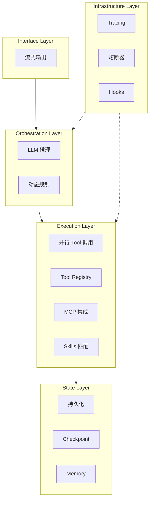
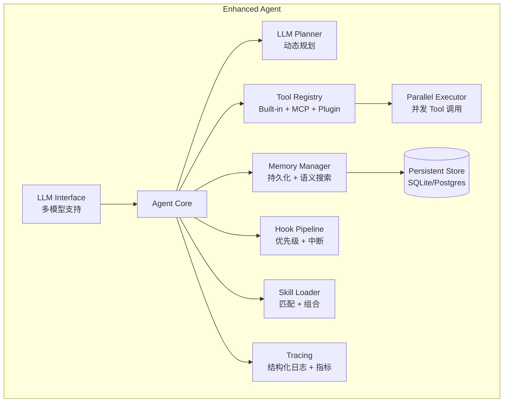

# 第 16 章：增强版 Agent 实现

> **难度等级：** ⭐⭐⭐⭐⭐
> **所属模块：** 第五部分：规模化与生产
> **来源可信度：** 官方文档 / 源码 / 推导 / 观点
> **状态：** ✅ 已完成

---

## 学习目标

完成本章学习后，你将能够：

1. 将 MVP Agent 升级为生产级增强版
2. 集成真实 LLM 实现动态推理和规划
3. 实现并行 Tool 调用和流式输出
4. 实现状态持久化和中断恢复
5. 掌握 Agent 的性能优化和韧性策略

---

## 前置知识

- 阅读第 7 章「Agent MVP：从零实现」
- 建议阅读第 8--11 章的可靠运行组件和第 15 章的模式选择
- 了解 LLM API 的基本使用

---

## 1. MVP vs Enhanced 对比

| 维度 | 第 7 章最小 MVP | 增强版可选能力 |
|------|-------------------|------------------|
| 推理 | 规则或固定流程 | 可接入 LLM 动态推理，并以 schema / 预算约束 |
| 规划 | 模板化计划 | 可加入 LLM 规划与自适应调整 |
| Tool 选择 | 少量静态映射 | 可加入模型选择、Router 或策略过滤 |
| 执行 | 串行执行 | 可对独立操作并行执行 |
| 输出 | 一次性返回 | 可提供流式输出 |
| 状态 | 当前任务内存状态 | 可持久化并支持中断恢复 |
| 错误处理 | 基础失败返回 | 可加入分级降级、重试与熔断 |
| 监控 | 控制台输出 | 可加入结构化指标与 Trace |
| MCP / Skills | 不作为 MVP 必需能力 | 可按互操作与工作流复用需求接入 |

### 1.1 升级决策：不要把 Enhanced 当作默认答案

**Why / What：** Enhanced Agent 是为真实模型调用、长任务和可恢复执行补齐工程能力的实现层，不是“功能越多越好”的模板。它解决的是 MVP 在动态决策、外部副作用和运行中断下的边界，而不是替代清晰的任务定义和 Tool 设计。

| When：出现的信号 | 优先增加的能力 | Trade-off：新增复杂度 |
|------------------|----------------|------------------------|
| 规则 Planner 覆盖不了任务差异 | LLM Planner 与结构化计划校验 | 输出不确定、评估成本上升；设置步数、预算和计划 schema |
| 独立 Tool 调用占据主要等待时间 | 依赖感知的并行执行 | 竞态、限流与部分失败更复杂；只并行无数据依赖且可安全重试的调用 |
| 用户需要中断、审批后继续或长任务恢复 | 持久化状态与检查点 | 幂等、迁移和数据保留成为必须设计；副作用操作需记录幂等键和恢复策略 |
| 难以定位质量、成本或安全问题 | Trace、指标、Guardrails 与审批 | 遥测和日志会带来存储、隐私与访问控制负担；实施最小采集和脱敏 |

当任务仍是短、只读、确定且流量有限的流程时，第 7 章的 MVP 往往更可控。只有问题的收益足以覆盖上述运行与治理成本，才逐项升级，而不是一次性启用所有能力。

**图 16-1：增强版 Agent 分层架构**



---

## 2. 增强版架构



> **图 16-2：** 增强版 Agent 架构。它展示可按需加入的 LLM 接口、并行执行、持久化、Tracing、Skills 与 MCP 集成，而不是要求所有部署同时启用这些能力。

---

## 3. LLM 集成

### 3.1 多模型接口

```python
"""
增强版 Agent - LLM 集成
"""

from abc import ABC, abstractmethod
from dataclasses import dataclass, field
from typing import Optional, AsyncIterator
import json
import asyncio


@dataclass
class LLMResponse:
    """LLM 响应"""
    content: str
    tool_calls: list[dict] = field(default_factory=list)
    finish_reason: str = "stop"
    usage: dict = field(default_factory=dict)


class LLMProvider(ABC):
    """LLM 提供商抽象接口"""

    @abstractmethod
    async def chat(self, messages: list[dict],
                   tools: list[dict] = None,
                   temperature: float = 0.7) -> LLMResponse:
        """发送对话请求"""
        ...

    @abstractmethod
    async def chat_stream(self, messages: list[dict],
                          tools: list[dict] = None) -> AsyncIterator[str]:
        """流式对话"""
        ...


class OpenAIProvider(LLMProvider):
    """OpenAI 兼容提供商"""

    def __init__(self, api_key: str, model: str,
                 base_url: str = "https://api.openai.com/v1"):
        self.api_key = api_key
        self.model = model
        self.base_url = base_url

    async def chat(self, messages, tools=None, temperature=0.7):
        return LLMResponse(
            content="根据分析，我需要执行以下步骤...",
            usage={"prompt_tokens": 100, "completion_tokens": 50}
        )

    async def chat_stream(self, messages, tools=None):
        for word in ["根据", "分析", "，", "任务", "需要", "..."]:
            yield word
            await asyncio.sleep(0.01)


class AnthropicProvider(LLMProvider):
    """Anthropic Claude 提供商"""

    def __init__(self, api_key: str, model: str):
        self.api_key = api_key
        self.model = model

    async def chat(self, messages, tools=None, temperature=0.7):
        return LLMResponse(
            content="Let me analyze this task step by step...",
            usage={"input_tokens": 100, "output_tokens": 50}
        )

    async def chat_stream(self, messages, tools=None):
        for word in ["Let", " me", " analyze", " this", "..."]:
            yield word
            await asyncio.sleep(0.01)
```

### 3.2 LLM 驱动的 Planner

```python
class LLMPlanner:
    """LLM 驱动的任务规划器"""

    PLANNING_PROMPT = """你是一个任务规划器。根据用户的任务，制定详细的执行计划。

可用工具:
{tools}

请输出 JSON 格式的执行计划:
{{
    "plan": [
        {{
            "id": 1,
            "description": "步骤描述",
            "tool": "使用的工具名称",
            "tool_args": {{"参数名": "参数值"}},
            "depends_on": [],
            "expected_output": "预期输出"
        }}
    ],
    "reasoning": "整体规划理由",
    "estimated_steps": 3
}}

任务: {task}"""

    def __init__(self, llm: LLMProvider):
        self.llm = llm

    async def create_plan(self, task: str,
                          tools: list[dict]) -> dict:
        """创建动态执行计划"""
        tools_desc = "\n".join(
            f"- {t['function']['name']}: {t['function']['description']}"
            for t in tools
        )
        prompt = self.PLANNING_PROMPT.format(tools=tools_desc, task=task)
        response = await self.llm.chat([
            {"role": "user", "content": prompt}
        ])
        try:
            return json.loads(response.content)
        except json.JSONDecodeError:
            return {
                "plan": [
                    {"id": 1, "description": "分析任务", "tool": "analyze",
                     "tool_args": {}, "depends_on": [], "expected_output": "分析结果"},
                    {"id": 2, "description": "执行操作", "tool": "execute",
                     "tool_args": {}, "depends_on": [1], "expected_output": "执行结果"},
                ],
                "reasoning": "回退到默认计划",
                "estimated_steps": 2
            }

    async def replan(self, task: str, completed: list[dict],
                     failed: list[dict], tools: list[dict]) -> dict:
        """根据执行反馈重新规划"""
        context = (
            f"已完成步骤: {json.dumps(completed, ensure_ascii=False)}\n"
            f"失败步骤: {json.dumps(failed, ensure_ascii=False)}\n"
            f"请根据当前状态调整后续计划。"
        )
        return await self.create_plan(f"{task}\n\n{context}", tools)
```

---

## 4. 并行执行引擎

### 4.1 依赖感知的并行执行

```python
class ParallelExecutor:
    """支持依赖关系的并行执行器"""

    def __init__(self, max_workers: int = 5, timeout: float = 30.0):
        self.max_workers = max_workers
        self.timeout = timeout

    async def execute_with_deps(self, plan: list[dict],
                                registry) -> list[dict]:
        """按依赖关系拓扑执行"""
        results: dict[int, dict] = {}
        completed: set[int] = set()
        failed: set[int] = set()

        while len(completed) < len(plan):
            # 找出所有依赖已满足的步骤
            ready = []
            for step in plan:
                sid = step["id"]
                if sid in completed:
                    continue
                deps = step.get("depends_on", [])
                if any(d in failed for d in deps):
                    # 依赖步骤失败，跳过此步骤
                    results[sid] = {"success": False, "error": "依赖步骤失败，跳过"}
                    completed.add(sid)
                    failed.add(sid)
                    continue
                if all(d in completed for d in deps):
                    ready.append(step)

            if not ready:
                # 检查是否有死锁（所有未完成步骤的依赖都不满足）
                pending = [s for s in plan if s["id"] not in completed]
                stuck = all(
                    not all(d in completed for d in s.get("depends_on", []))
                    for s in pending
                )
                if stuck:
                    # 跳过卡住的步骤
                    for s in pending:
                        results[s["id"]] = {"success": False, "error": "依赖步骤失败，跳过"}
                        completed.add(s["id"])
                break

            # 并行执行所有准备好的步骤
            tasks = [self._execute_single(s, registry) for s in ready]
            step_results = await asyncio.gather(*tasks, return_exceptions=True)

            for step, result in zip(ready, step_results):
                if isinstance(result, Exception):
                    result = {"success": False, "error": str(result)}
                results[step["id"]] = result
                completed.add(step["id"])

                # 如果步骤失败，可选择中断或继续
                if not result.get("success"):
                    # 标记步骤失败，跳过依赖此步骤的后续步骤
                    failed.add(step["id"])

        return [results.get(s["id"], {}) for s in plan]

    async def _execute_single(self, step: dict, registry) -> dict:
        """执行单个步骤"""
        tool_name = step.get("tool", "")
        tool_args = step.get("tool_args", {})
        try:
            return await asyncio.wait_for(
                asyncio.to_thread(registry.execute, tool_name, tool_args),
                timeout=self.timeout
            )
        except asyncio.TimeoutError:
            return {"success": False, "error": f"Tool '{tool_name}' 执行超时"}
        except Exception as e:
            return {"success": False, "error": str(e)}
```

---

## 5. 状态持久化

### 5.1 检查点系统

```python
import sqlite3
import uuid
import json
from datetime import datetime
from typing import Optional


class CheckpointManager:
    """检查点管理器 - 支持 Agent 状态持久化和恢复"""

    def __init__(self, db_path: str = "agent_checkpoints.db"):
        self.conn = sqlite3.connect(db_path)
        self.conn.row_factory = sqlite3.Row
        self._init_db()

    def _init_db(self):
        self.conn.executescript("""
            CREATE TABLE IF NOT EXISTS checkpoints (
                id TEXT PRIMARY KEY,
                session_id TEXT NOT NULL,
                state TEXT,
                step_count INTEGER DEFAULT 0,
                memory TEXT,
                created_at TIMESTAMP DEFAULT CURRENT_TIMESTAMP
            );
            CREATE INDEX IF NOT EXISTS idx_checkpoint_session
                ON checkpoints(session_id, created_at DESC);
        """)
        self.conn.commit()

    def save(self, session_id: str, agent_state: dict) -> str:
        cid = f"{session_id}_{datetime.now().strftime('%Y%m%d_%H%M%S')}_{uuid.uuid4().hex[:6]}"
        self.conn.execute(
            """INSERT INTO checkpoints (id, session_id, state, step_count, memory)
               VALUES (?, ?, ?, ?, ?)""",
            (cid, session_id, json.dumps(agent_state.get("state", {})),
             agent_state.get("step_count", 0),
             json.dumps(agent_state.get("memory", []), ensure_ascii=False))
        )
        self.conn.commit()
        return cid

    def load(self, session_id: str) -> Optional[dict]:
        cursor = self.conn.execute(
            "SELECT * FROM checkpoints WHERE session_id = ? "
            "ORDER BY created_at DESC LIMIT 1",
            (session_id,)
        )
        row = cursor.fetchone()
        if row:
            return {
                "id": row["id"], "session_id": row["session_id"],
                "state": json.loads(row["state"]),
                "step_count": row["step_count"],
                "memory": json.loads(row["memory"]),
                "created_at": row["created_at"]
            }
        return None

    def cleanup(self, session_id: str, keep_latest: int = 5):
        self.conn.execute("""
            DELETE FROM checkpoints WHERE session_id = ? AND id NOT IN (
                SELECT id FROM checkpoints WHERE session_id = ?
                ORDER BY created_at DESC LIMIT ?
            )
        """, (session_id, session_id, keep_latest))
        self.conn.commit()
```

---

## 6. 错误处理与韧性

### 6.1 熔断器

```python
class CircuitBreaker:
    """熔断器 - 防止级联故障"""

    def __init__(self, threshold: int = 5, recovery_time: float = 60.0):
        self.threshold = threshold
        self.recovery_time = recovery_time
        self._failures: dict[str, list[float]] = {}
        self._open_circuits: dict[str, float] = {}

    def record_failure(self, name: str):
        now = time.time()
        self._failures.setdefault(name, []).append(now)
        self._failures[name] = [
            t for t in self._failures[name] if now - t < self.recovery_time
        ]
        if len(self._failures[name]) >= self.threshold:
            self._open_circuits[name] = now

    def record_success(self, name: str):
        self._failures.pop(name, None)
        self._open_circuits.pop(name, None)

    def is_open(self, name: str) -> bool:
        if name not in self._open_circuits:
            return False
        if time.time() - self._open_circuits[name] > self.recovery_time:
            self._open_circuits.pop(name, None)
            self._failures.pop(name, None)
            return False
        return True


class ResilientExecutor:
    """韧性执行器 - 带重试和熔断"""

    def __init__(self, max_retries: int = 3, backoff_base: float = 1.0):
        self.max_retries = max_retries
        self.backoff_base = backoff_base
        self.circuit_breaker = CircuitBreaker()

    async def execute(self, tool_name: str, args: dict, registry) -> dict:
        if self.circuit_breaker.is_open(tool_name):
            return {"success": False, "error": f"Tool '{tool_name}' 已熔断，请稍后重试"}

        last_error = None
        for attempt in range(self.max_retries + 1):
            try:
                result = await asyncio.to_thread(registry.execute, tool_name, args)
                if result.get("success"):
                    self.circuit_breaker.record_success(tool_name)
                return result
            except Exception as e:
                last_error = str(e)
                if attempt < self.max_retries:
                    await asyncio.sleep(self.backoff_base * (2 ** attempt))

        self.circuit_breaker.record_failure(tool_name)
        return {"success": False, "error": f"执行失败(已重试{self.max_retries}次): {last_error}"}
```

---

## 7. 增强版 Agent 完整实现

```python
class EnhancedAgent:
    """增强版 Agent - 完整实现

    注意：本节代码引用本章前文定义的组件（CheckpointManager、ParallelExecutor、
    ResilientExecutor、SkillRegistry 等），完整可运行版本见 examples/ 目录。
    """

    def __init__(self, config: dict):
        self.config = config
        self.step_count = 0
        self.llm = self._create_llm(config)
        self.planner = LLMPlanner(self.llm)
        self.tools = ToolRegistry()
        self.memory = Memory()
        self.hooks = HookSystem()
        self.executor = ParallelExecutor()
        self.checkpoint = CheckpointManager()
        self.resilient = ResilientExecutor()
        self.skills = SkillRegistry()
        self._setup()

    def _create_llm(self, config: dict) -> LLMProvider:
        provider = config.get("llm_provider", "openai")
        if provider == "openai":
            return OpenAIProvider(api_key=config["api_key"], model=config["model"])
        elif provider == "anthropic":
            return AnthropicProvider(api_key=config["api_key"], model=config["model"])
        raise ValueError(f"Unknown provider: {provider}")

    def _setup(self):
        self._register_builtin_tools()
        self.hooks.on("before_execute", lambda ctx, step: print(f"  [Exec] {step.get('description', '')}"))
        self.hooks.on("after_execute", lambda ctx, step, result: print(f"  [Done] {'✓' if result.get('success') else '✗'}"))

    async def run(self, task: str, session_id: str = None) -> dict:
        session_id = session_id or str(uuid.uuid4())
        start_time = time.time()

        print(f"\n{'='*70}")
        print(f"  Enhanced Agent [{session_id[:8]}]")
        print(f"{'='*70}")

        # 尝试恢复
        cp = self.checkpoint.load(session_id)
        if cp:
            print(f"  📍 从检查点恢复: {cp['id']}")

        self.memory.add("user", task, importance=5)

        try:
            while self.step_count < self.config.get("max_steps", 10):
                self.step_count += 1

                # 1. Reasoning（LLM 响应用于上下文记录，实际规划由 Planner 独立完成）
                self.hooks.trigger("before_reasoning", self)
                tools_def = self.tools.get_definitions()
                response = await self.llm.chat(
                    self._build_messages(), tools=tools_def
                )
                self.hooks.trigger("after_reasoning", self, response)

                # 2. Planning
                plan = await self.planner.create_plan(task, tools_def)

                # 3. Execute
                results = await self.executor.execute_with_deps(
                    plan["plan"], self.tools
                )
                for step, result in zip(plan["plan"], results):
                    self.memory.add("tool", json.dumps(result, ensure_ascii=False))

                # 4. Checkpoint
                self.checkpoint.save(session_id, {
                    "state": {"task": task, "plan": plan},
                    "step_count": self.step_count,
                    "memory": [{"role": m.role, "content": m.content[:200]}
                              for m in self.memory.short_term]
                })

                if all(r.get("success") for r in results):
                    break

        except Exception as e:
            return {"success": False, "error": str(e), "session_id": session_id}

        elapsed = time.time() - start_time
        result = {
            "success": True, "session_id": session_id,
            "elapsed": f"{elapsed:.1f}s", "steps": self.step_count
        }
        print(f"  ✅ 完成 | {elapsed:.1f}s | {self.step_count} 步")
        print(f"{'='*70}\n")
        return result

    def _build_messages(self) -> list[dict]:
        messages = [
            {"role": "system", "content": self.config.get("instructions", "")}
        ]
        for entry in list(self.memory.short_term)[-15:]:
            messages.append({"role": entry.role, "content": entry.content[:2000]})
        return messages
```

---

## 8. 性能优化策略

| 策略 | 实现方式 | 主要影响与验证方式 |
|------|---------|--------------------|
| 并行 Tool 调用 | 依赖拓扑排序 + `asyncio.gather` | 可能缩短关键路径；验证依赖、限流与部分失败 |
| 流式输出 | `AsyncIterator` 逐 token 返回 | 改善首个可见结果时间；不等同于降低总耗时 |
| Tool 结果缓存 | 仅对读操作按输入、权限与时效缓存 | 减少重复调用；验证失效和越权复用 |
| 上下文压缩 | 对旧消息生成可追溯摘要 | 可能减少输入 Token；回归测试信息损失 |
| 连接池复用 | HTTP 连接池 | 可能减少连接开销；观察连接泄露与下游限流 |
| 预加载 Skills | 后台异步匹配 | 以命中率与额外 Context 成本决定是否启用 |

---

## 9. 最佳实践

1. **渐进式增强：** 从 MVP 开始，每次只增强一个维度，充分测试后再继续。
2. **错误处理优先：** 在生产环境中，完善的错误处理比新功能更重要。
3. **监控先行：** 在增强功能之前建立 Tracing 和指标收集。
4. **性能基准：** 每次增强后测量性能，确保无回归。

---

## 10. 官方参考

| 编号 | 来源 | 类型 | 说明 |
|------|------|------|------|
| REF-1 | [OpenAI Agents SDK](https://openai.github.io/openai-agents-python/) | 官方文档 | 增强版 Agent 参考实现 |
| REF-2 | [LangGraph Persistence](https://langchain-ai.github.io/langgraph/how-tos/persistence/) | 官方文档 | 状态持久化实现 |
| REF-3 | [Circuit Breaker Pattern](https://martinfowler.com/bliki/CircuitBreaker.html) | 博文 | 熔断器模式 |

---

## 本章小结

增强版 Agent 展示了多个组件如何通过稳定接口组合，但“功能更多”不等于“系统更可靠”。每次增强都应对应一个已观察到的失败模式，并同时补上配置、追踪、资源限制和回归测试，避免把教学组合实现误当作生产框架。

---

## 本章 Checklist

- [ ] 理解 MVP 到 Enhanced 的 10 个升级维度
- [ ] 能实现 LLM 驱动的动态规划器
- [ ] 能实现依赖感知的并行执行器
- [ ] 能实现状态持久化和中断恢复
- [ ] 理解熔断器和韧性策略
- [ ] 运行了增强版 Agent 示例代码
