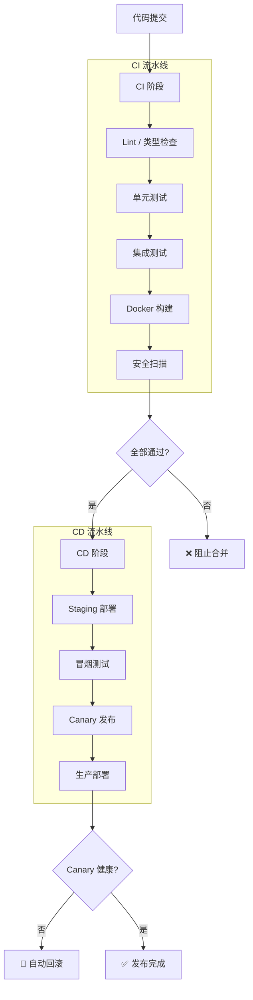

# 第 17 章：工程实践与生产部署

> **难度等级：** ⭐⭐⭐⭐
> **所属模块：** 第五部分：规模化与生产
> **来源可信度：** 官方文档 / 源码 / 推导 / 观点
> **状态：** ✅ 已完成

---

## 学习目标

完成本章学习后，你将能够：

1. 掌握 Agent 项目的工程化实践
2. 理解 Agent 的测试策略和质量保证
3. 掌握 Agent 的安全设计和权限控制
4. 理解 Agent 的部署方案和运维监控
5. 掌握成本控制和性能优化

---

## 前置知识

- 建议完成第 7 章 MVP；生产实现还应理解第 8--16 章中的状态、运行时、扩展与增强能力
- 了解 CI/CD、Docker、Kubernetes 基本概念
- 了解测试驱动开发（TDD）

---

## 1. 工程化实践

### 1.1 项目结构

```
agent-project/
├── src/
│   ├── core/           # Agent 核心
│   ├── tools/          # Tool 实现
│   ├── memory/         # Memory 管理
│   ├── hooks/          # Hook 系统
│   ├── skills/         # Skill 模板
│   ├── mcp/            # MCP 集成
│   └── llm/            # LLM 接口
├── tests/
│   ├── unit/           # 单元测试
│   ├── integration/    # 集成测试
│   └── e2e/            # 端到端测试
├── config/
│   ├── dev.yaml        # 开发环境
│   ├── staging.yaml    # 预发布环境
│   └── prod.yaml       # 生产环境
├── deploy/
│   ├── Dockerfile
│   ├── docker-compose.yml
│   └── k8s/
├── scripts/
│   ├── setup.sh
│   └── migrate.sh
├── docs/
├── .github/workflows/
├── Makefile
├── pyproject.toml
└── README.md
```

### 1.2 配置管理

```python
"""
配置管理 - 多环境支持
"""

import os
import yaml
from dataclasses import dataclass
from typing import Optional


@dataclass
class AgentDeployConfig:
    """Agent 部署配置"""
    # LLM
    llm_provider: str = "provider-name"
    llm_model: str = "provider-configured-model"
    llm_api_key_env: str = "LLM_API_KEY"

    # Runtime
    max_steps: int = 10
    step_timeout: float = 30.0
    total_timeout: float = 300.0

    # Memory
    memory_backend: str = "sqlite"
    memory_path: str = "data/memory.db"

    # Tool
    max_parallel_tools: int = 5
    tool_cache_size: int = 128

    # Security
    allowed_tools: list[str] = None
    require_user_approval: bool = True
    sandbox_enabled: bool = True


class ConfigLoader:
    """配置加载器"""

    @staticmethod
    def load(env: str = "dev") -> AgentDeployConfig:
        config_path = f"config/{env}.yaml"
        if os.path.exists(config_path):
            with open(config_path) as f:
                data = yaml.safe_load(f)
            return AgentDeployConfig(**data)
        return AgentDeployConfig()  # 默认配置
```

---

## 2. 测试策略

### 2.1 测试金字塔

```
         ╱─────╲
        ╱  E2E  ╲        少量端到端测试
       ╱─────────╲
      ╱ Integration╲     中等集成测试
     ╱───────────────╲
    ╱   Unit Tests    ╲   大量单元测试
   ╱───────────────────╲
```

### 2.2 单元测试

```python
"""
Agent 单元测试
"""

import pytest
from unittest.mock import AsyncMock, MagicMock


class TestAgentCore:
    """测试 Agent 核心逻辑"""

    @pytest.fixture
    def agent(self):
        return AgentMVP(AgentConfig(max_steps=5))

    def test_initialization(self, agent):
        assert agent.state == AgentState.LOADING
        assert len(agent.tools.list_all()) > 0

    def test_tool_registration(self, agent):
        tools = agent.tools.list_all()
        assert "read_file" in tools
        assert "write_file" in tools


class TestToolExecution:
    """测试 Tool 执行"""

    @pytest.fixture
    def registry(self):
        reg = ToolRegistry()
        reg.register(Tool(
            name="test_tool",
            description="测试工具",
            parameters={"type": "object", "properties": {"value": {"type": "string"}}, "required": ["value"]},
            handler=lambda value: {"success": True, "value": value}
        ))
        return reg

    def test_execute_success(self, registry):
        result = registry.execute("test_tool", {"value": "hello"})
        assert result["success"] is True
        assert result["value"] == "hello"

    def test_execute_not_found(self, registry):
        result = registry.execute("nonexistent", {})
        assert result["success"] is False


class TestMemoryOperations:
    """测试 Memory 操作"""

    @pytest.fixture
    def memory(self):
        return Memory(short_term_size=10)

    def test_add_and_retrieve(self, memory):
        memory.add("user", "test message")
        context = memory.get_context()
        assert "test message" in context

    def test_save_and_recall(self, memory):
        memory.save("key1", "value1")
        assert memory.recall("key1") == "value1"

    def test_search(self, memory):
        memory.save("python", "Python 异步编程指南")
        memory.save("js", "JavaScript 教程")
        results = memory.search("Python")
        assert len(results) > 0
        assert "异步编程" in results[0]


class TestHooks:
    """测试 Hook 系统"""

    @pytest.fixture
    def hooks(self):
        return HookSystem()

    def test_register_and_trigger(self, hooks):
        triggered = []
        hooks.on("before_reasoning", lambda *args: triggered.append(True))
        hooks.trigger("before_reasoning", None)
        assert len(triggered) == 1

    def test_hook_error_isolation(self, hooks):
        def bad_hook(*args):
            raise RuntimeError("test error")
        hooks.on("before_reasoning", bad_hook)
        # 不应抛出异常
        hooks.trigger("before_reasoning", None)
```

### 2.3 集成测试

```python
class TestAgentIntegration:
    """Agent 集成测试"""

    @pytest.mark.asyncio
    async def test_full_loop(self):
        """测试完整 Agent 循环"""
        agent = AgentMVP(AgentConfig(max_steps=3))
        result = await agent.run("搜索代码")
        assert result["success"] is True
        assert result["steps"] > 0

    @pytest.mark.asyncio
    async def test_tool_chain(self):
        """测试 Tool 链式调用"""
        agent = AgentMVP(AgentConfig(max_steps=5))
        # 先搜索，再读取
        result = await agent.run("搜索并读取 main.py")
        assert result["success"] is True

    @pytest.mark.asyncio
    async def test_error_recovery(self):
        """测试错误恢复"""
        registry = ToolRegistry()
        call_count = 0

        def flaky_tool(**kwargs):
            nonlocal call_count
            call_count += 1
            if call_count < 3:
                raise ConnectionError("模拟网络错误")
            return {"success": True}

        registry.register(Tool(
            name="flaky", description="不稳定工具",
            parameters={"type": "object", "properties": {}},
            handler=flaky_tool
        ))
        # 应该通过重试成功
        result = await ResilientExecutor(max_retries=3).execute(
            "flaky", {}, registry
        )
        assert result["success"] is True
        assert call_count == 3
```

---

## 3. 安全设计

### 3.1 安全原则

| 原则 | 说明 | 实现 |
|------|------|------|
| 最小权限 | Agent 只拥有完成任务所需的最小权限 | Tool 白名单 |
| 用户确认 | 敏感操作需用户确认 | 权限 Hook |
| 沙箱隔离 | Agent 在受限环境中运行 | Docker 容器 |
| 输入校验 | 校验所有外部输入 | 参数 Schema 校验 |
| 审计日志 | 记录所有关键操作 | 日志 Hook |
| 密钥管理 | 不在代码中硬编码密钥 | 环境变量/密钥管理服务 |

### 3.2 权限系统

```python
class PermissionSystem:
    """权限系统"""

    def __init__(self):
        self._permissions: dict[str, set[str]] = {}  # role -> {permissions}
        self._tool_permissions: dict[str, str] = {}   # tool -> required_permission

    def set_role_permissions(self, role: str, permissions: set[str]):
        self._permissions[role] = permissions

    def set_tool_permission(self, tool: str, permission: str):
        self._tool_permissions[tool] = permission

    def check(self, role: str, tool: str) -> bool:
        """检查角色是否有权限使用 Tool"""
        required = self._tool_permissions.get(tool)
        if not required:
            return True  # 无权限要求的 Tool 默认允许
        return required in self._permissions.get(role, set())

    def create_permission_hook(self, role: str):
        """创建权限检查 Hook"""
        def hook(ctx):
            tool_name = ctx.data.get("tool_name", "")
            if not self.check(role, tool_name):
                raise PermissionError(f"角色 '{role}' 无权使用 Tool '{tool_name}'")
        return hook
```

### 3.3 沙箱执行

```python
class SandboxExecutor:
    """沙箱执行器"""

    def __init__(self, allowed_paths: list[str] = None,
                 allowed_commands: list[str] = None,
                 max_file_size: int = 10 * 1024 * 1024):
        self.allowed_paths = allowed_paths or ["/tmp", "./workspace"]
        self.allowed_commands = allowed_commands or ["ls", "cat", "grep", "find"]
        self.max_file_size = max_file_size

    def validate_path(self, path: str) -> bool:
        """验证路径是否在允许范围内"""
        import os
        real_path = os.path.realpath(path)
        return any(real_path == os.path.realpath(p) or real_path.startswith(os.path.realpath(p) + os.sep)
                   for p in self.allowed_paths)

    def validate_command(self, command: str) -> bool:
        """验证命令是否允许"""
        if not command:
            return False
        parts = command.split()
        cmd_name = parts[0]
        # 检查是否包含命令分隔符
        if any(sep in command for sep in [';', '|', '&', '&&', '||']):
            return False
        return cmd_name in self.allowed_commands

    def validate(self, tool_name: str, args: dict) -> dict:
        """验证工具调用是否安全（不执行实际操作）"""
        if tool_name == "read_file":
            if not self.validate_path(args.get("path", "")):
                return {"success": False, "error": "路径不在允许范围内"}
        elif tool_name == "execute_command":
            if not self.validate_command(args.get("command", "")):
                return {"success": False, "error": "命令不允许"}
        return {"success": True}
```

### 3.4 Guardrails：贯穿执行路径的控制

Guardrails 不是只在 System Prompt 中写一条“请遵守规则”，而是一组分布在输入、模型、Tool 和输出边界上的可执行控制。它们应与权限系统、Hook、Sandbox 和审计日志配合；任一单点都不能完整防御提示注入、越权调用或敏感信息泄露。

| 边界 | 主要风险 | 推荐控制 | 失败后的默认行为 |
|------|----------|----------|------------------|
| 外部输入与检索内容 | 提示注入、恶意指令、错误来源 | 标记不可信数据、隔离指令与数据、来源校验 | 不提升权限，不把内容当作系统指令 |
| 模型输出 | 格式错误、敏感内容、虚构调用 | 结构化 Schema 校验、内容策略、人工复核阈值 | 拒绝执行或要求模型修正 |
| Tool 调用 | 越权、破坏性操作、数据外传 | 参数校验、最小权限、用户确认、速率限制 | 拒绝、降级为只读或转人工 |
| Sandbox 与网络 | 路径逃逸、命令注入、资源耗尽 | 文件/网络隔离、命令白名单、CPU/内存/时间限制 | 终止执行并记录审计事件 |
| 最终输出与日志 | 泄露凭据、个人数据或内部内容 | 输出脱敏、字段级日志过滤、保留期控制 | 隐藏敏感字段并提示用户 |

对每个高风险 Tool，应把“允许、需要确认、拒绝”设计为可测试的策略，而不是依赖模型自行判断。第 10 章的 Hook 适合承载策略检查，第 6 章的 Schema 适合承载参数约束，第 9 章的 Runtime 负责把拒绝、超时和取消变成一致的终止行为。

> **来源类型：** 推导分析 —— 基于纵深防御原则和本书 Tool、Hook、Runtime、Sandbox 的职责划分

### 3.5 Human-in-the-Loop：审批不是一次弹窗

人工介入（Human-in-the-Loop）适用于写文件、执行命令、访问敏感数据、发送外部请求等后果不可逆或难以撤回的动作。审批请求应是 Runtime 可持久化的状态，而不是临时 UI 分支：用户批准、拒绝、超时或会话恢复后都应能得到确定结果。

| 状态 | Runtime 行为 | 审计信息 |
|------|--------------|----------|
| Pending | 暂停受保护动作，不继续执行依赖步骤 | 操作摘要、参数摘要、风险和请求时间 |
| Approved | 在原有权限范围内恢复执行 | 审批人、时间、批准范围 |
| Rejected | 返回结构化拒绝，让 Agent 选择安全替代方案 | 拒绝原因与后续处理 |
| Expired / Cancelled | 终止或重新请求，不默认为批准 | 超时/取消来源与状态快照 |

审批 UI 应让用户理解“将要做什么、影响什么、使用什么数据”，而不只显示 Tool 名称。对于批量或可重复动作，可设计有范围和有效期的审批；不得把一次批准升级成无边界的长期权限。

> **来源类型：** 推导分析 —— 参考 [OpenAI Agents SDK 的 Human-in-the-Loop 文档](https://openai.github.io/openai-agents-python/human_in_the_loop/) 及本书 Runtime/Guardrails 的设计原则

---

## 4. 部署方案

**图 17-1：CI/CD 流水线全景**



### 4.1 Docker 部署

```dockerfile
# Dockerfile
FROM python:3.12-slim

WORKDIR /app

COPY requirements.txt .
RUN pip install --no-cache-dir -r requirements.txt

COPY src/ ./src/
COPY config/ ./config/

ENV AGENT_ENV=prod

CMD ["python", "-m", "src.main"]
```

```yaml
# docker-compose.yml
version: '3.8'
services:
  agent:
    build: .
    environment:
      - OPENAI_API_KEY=${OPENAI_API_KEY}
      - AGENT_ENV=prod
    volumes:
      - ./data:/app/data
      - ./workspace:/app/workspace
    restart: unless-stopped

  agent-api:
    build:
      context: .
      dockerfile: Dockerfile.api
    ports:
      - "8080:8080"
    environment:
      - OPENAI_API_KEY=${OPENAI_API_KEY}
    depends_on:
      - redis
      - postgres

  redis:
    image: redis:7-alpine

  postgres:
    image: pgvector/pgvector:pg16
    environment:
      - POSTGRES_DB=agent
      - POSTGRES_USER=agent
      - POSTGRES_PASSWORD=${DB_PASSWORD}
    volumes:
      - postgres_data:/var/lib/postgresql/data

volumes:
  postgres_data:
```

### 4.2 部署检查清单

| 检查项 | 说明 |
|--------|------|
| ✅ 环境变量配置 | API Key、数据库密码等通过环境变量注入 |
| ✅ 健康检查 | 提供 `/health` 端点 |
| ✅ 日志收集 | 结构化日志，输出到 stdout |
| ✅ 指标暴露 | Prometheus metrics 端点 |
| ✅ 优雅关闭 | 处理 SIGTERM，完成当前任务后退出 |
| ✅ 资源限制 | CPU/内存限制，防止资源耗尽 |
| ✅ 网络策略 | 限制出站/入站流量 |
| ✅ 备份策略 | 定期备份 Memory 和 Checkpoint |

---

## 5. 监控与可观测性

### 5.1 关键指标

| 指标 | 类型 | 说明 |
|------|------|------|
| agent_step_count | Counter | Agent 执行步数 |
| tool_call_count | Counter | Tool 调用次数 |
| tool_call_latency | Histogram | Tool 调用延迟 |
| tool_error_count | Counter | Tool 错误次数 |
| llm_token_usage | Counter | LLM Token 使用量 |
| agent_run_duration | Histogram | Agent 运行时长 |
| memory_entries | Gauge | Memory 条目数 |
| circuit_breaker_state | Gauge | 熔断器状态 |

### 5.2 结构化日志

```python
import structlog

logger = structlog.get_logger()

class StructuredLogger:
    """结构化日志"""

    @staticmethod
    def log_agent_start(session_id: str, task: str):
        logger.info("agent_start", session_id=session_id, task=task[:200])

    @staticmethod
    def log_tool_call(session_id: str, tool: str, args: dict, duration: float):
        logger.info("tool_call", session_id=session_id, tool=tool,
                     args_summary=str(args)[:200], duration_ms=duration * 1000)

    @staticmethod
    def log_tool_error(session_id: str, tool: str, error: str):
        logger.error("tool_error", session_id=session_id, tool=tool, error=error)

    @staticmethod
    def log_agent_finish(session_id: str, success: bool, steps: int, duration: float):
        logger.info("agent_finish", session_id=session_id, success=success,
                     steps=steps, duration_s=duration)
```

### 5.3 Trace、回放与数据最小化

可观测性不仅是“多打日志”。一次可诊断的 Agent Trace 至少需要关联任务版本、模型/Prompt 版本、Tool 调用、审批决定、重试和最终结果，才能区分模型、上下文、Tool 或策略导致的问题。回放应优先使用脱敏或合成数据；若必须使用生产上下文，应限制访问、记录审批并设定保留期，避免 Trace 本身成为新的敏感数据源。

---

## 6. 成本控制

### 6.1 成本优化策略

| 策略 | 说明 | 主要影响与验证方式 |
|------|------|---------|
| 模型选择 | 简单任务用较低成本模型，复杂任务使用高能力模型 | 先以任务质量基线验证路由是否损害结果 |
| 上下文压缩 | 压缩历史消息 | 输入 Token 与延迟可能下降，需检查信息损失 |
| Tool 结果截断 | 限制 Tool 返回值大小 | 减少输入量，需保留错误、来源和关键字段 |
| 缓存复用 | 在时效与权限允许时复用相同查询 | 减少重复下游调用，需防止过期或越权复用 |
| 批处理 | 合并独立请求 | 可减少连接和调度开销，未必降低 Token 成本 |

### 6.2 Token 使用追踪

```python
class TokenTracker:
    """Token 使用追踪"""

    def __init__(self, budget: int = 1000000):
        self.budget = budget
        self.used = 0
        self.calls = 0

    def record(self, prompt_tokens: int, completion_tokens: int):
        self.used += prompt_tokens + completion_tokens
        self.calls += 1

    def remaining(self) -> int:
        return max(0, self.budget - self.used)

    def is_over_budget(self) -> bool:
        return self.used >= self.budget

    def cost_estimate(self, price_per_token: float) -> float:
        """价格由当前模型与区域的计费元数据传入，不在代码中硬编码。"""
        return self.used * price_per_token
```

---

## 7. 最佳实践

1. **配置即代码：** 所有配置通过 YAML/环境变量管理，纳入版本控制。
2. **测试驱动：** 核心路径必须有测试覆盖，变更前先写测试。
3. **安全左移：** 在开发阶段就考虑安全，而非上线后补救。
4. **可观测性内置：** 日志、指标、追踪从第一天就集成。
5. **渐进式发布：** 使用 Canary/Blue-Green 部署，逐步引流。

---

## 8. 官方参考

| 编号 | 来源 | 类型 | 说明 |
|------|------|------|------|
| REF-1 | [Docker Best Practices](https://docs.docker.com/develop/dev-best-practices/) | 官方文档 | Docker 部署最佳实践 |
| REF-2 | [OpenAI Rate Limits](https://platform.openai.com/docs/guides/rate-limits) | 官方文档 | API 速率限制 |
| REF-3 | [OWASP LLM Top 10](https://owasp.org/www-project-top-10-for-large-language-model-applications/) | 社区 | LLM 安全风险 |

---

## 本章小结

生产化的重点从“能运行”转向“可控制、可观察、可恢复”。权限、沙箱、密钥、日志、追踪、部署和成本控制需要形成纵深防御；高风险动作保留明确的人类决策点，且日志与回放本身也必须遵循最小化和访问控制。

---

## 本章 Checklist

- [ ] 理解 Agent 项目的工程化结构
- [ ] 能编写单元测试、集成测试和 E2E 测试
- [ ] 理解安全设计原则和权限系统
- [ ] 能使用 Docker 部署 Agent
- [ ] 理解监控指标和成本控制策略
- [ ] 运行了测试示例代码
