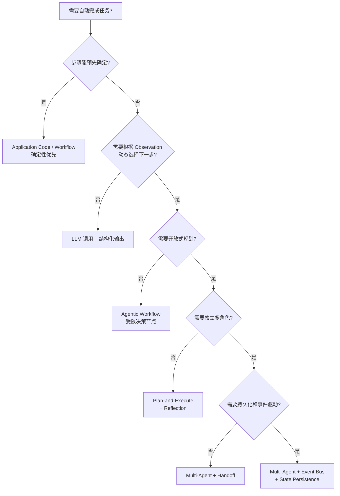
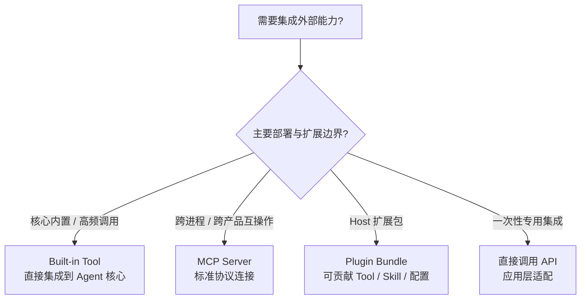
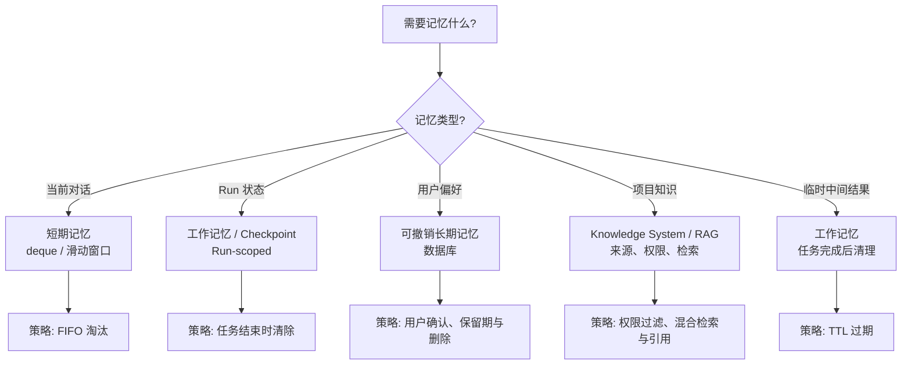

# 第 18 章：最佳实践、评估与反模式

> **难度等级：** ⭐⭐⭐
> **所属模块：** 第五部分：规模化与生产
> **来源可信度：** 官方文档 / 源码 / 推导 / 观点
> **状态：** ✅ 已完成

---

## 学习目标

完成本章学习后，你将能够：

1. 掌握全书最佳实践的系统化总结
2. 识别和避免 Agent 开发中的常见反模式
3. 建立 Agent 设计与评估的决策框架
4. 为任务结果、执行轨迹、安全和成本建立可回归的评估基线
5. 区分 Agent 内部循环与跨 Run Loop Engineering，并理解 Agentic Engineering 总框架

---

## 前置知识

- 建议完成第 7 章 MVP 和第 17 章工程实践；其余章节可按待评审系统的能力选择回读
- 本章是全书最佳实践、评估与反模式的汇总和索引

---

## 1. 最佳实践总览

### 1.1 架构设计

| 实践 | 说明 | 参考章节 |
|------|------|---------|
| 关注点分离 | Prompt、Instructions、Tools、Memory、Hooks 各司其职 | 第2章 |
| 组件化设计 | 每个组件独立、可替换、可测试 | 第2章 |
| 先 MVP 后增强 | 从最小可用开始，逐步增强 | 第 7 章 |
| 模式组合 | 根据场景组合设计模式，而非堆砌 | 第 15 章 |
| 配置驱动 | 行为通过配置控制，避免硬编码 | 第 7 章 |

### 1.2 Prompt 与 Instructions

| 实践 | 说明 | 参考章节 |
|------|------|---------|
| Prompt 和 Instructions 分离 | Prompt 聚焦任务，Instructions 聚焦行为准则 | 第3章 |
| 结构化 Prompt | 使用模板，包含任务、上下文、约束、输出格式 | 第3章 |
| Instructions 分层设计 | 角色 → 行为准则 → 安全规则 → 工具使用 → 输出风格 | 第3章 |
| Instructions 最小化 | 每条规则有明确必要性；依据 Context 预算和任务风险拆分少见细节 | 第3章 |

### 1.3 Tool 设计

| 实践 | 说明 | 参考章节 |
|------|------|---------|
| Tool 描述精准 | 描述是模型选择的重要依据；同时以 schema、候选集和执行前授权约束实际调用 | 第6章 |
| 按复杂度管理 Tool | 多来源、动态启停或需审计时使用 Registry；少量静态 Tool 可显式声明 | 第 11 章 |
| 返回结构化结果 | 所有 Tool 返回统一格式，包含 success 字段 | 第6章 |
| 参数严格校验 | 在 Handler 中校验所有参数，不依赖模型输出 | 第6章 |
| 速率限制 | 对高频 Tool 设置速率限制，保护下游服务 | 第 11 章 |

### 1.4 Memory

| 实践 | 说明 | 参考章节 |
|------|------|---------|
| 分层存储 | 短期、工作、长期记忆各司其职 | 第 8 章 |
| 重要性标注 | 标注记忆重要性，优先保留高重要性记忆 | 第 8 章 |
| 定期清理 | 实施遗忘策略，防止记忆无限增长 | 第 8 章 |
| 检索优化 | 根据查询类型组合结构化过滤、全文/关键词和语义检索，再做权限过滤与排序 | 第 8 章 |

### 1.5 Hooks

| 实践 | 说明 | 参考章节 |
|------|------|---------|
| 只做横切关注点 | 日志、监控、权限、脱敏，不包含业务逻辑 | 第 10 章 |
| 快速执行 | Hook 不应阻塞主流程，耗时操作异步化 | 第 10 章 |
| 失败语义分类 | Guard 失败阻断操作；Observer 失败隔离并告警；Transformation 按契约回滚或拒绝 | 第 10、17 章 |
| 优先级排序 | 权限检查 HIGH，日志 LOW | 第 10 章 |

### 1.6 安装型扩展

| 实践 | 说明 | 参考章节 |
|------|------|---------|
| 安装不等于授权 | Manifest 是权限请求，Host 和 Tool 调用边界仍须授权 | 第 12--14、16 章 |
| 来源可追踪 | 记录来源、版本和校验和，更新采用原子替换并支持回滚 | 第 12、17 章 |
| 凭据不泄漏 | MCP 环境变量保存受控引用，列表、日志和 Trace 必须脱敏 | 第 13、17 章 |
| 生命周期对称 | 启用、禁用、删除和关闭同步处理连接与 Registry 资源 | 第 13、16 章 |
| 供应链隔离 | Skill、MCP 子进程和 Plugin 使用签名、Allowlist、沙箱和审计 | 第 12--14、17 章 |

### 1.7 工程实践

| 实践 | 说明 | 参考章节 |
|------|------|---------|
| 测试驱动 | 核心路径必须有测试覆盖 | 第 17 章 |
| 安全左移 | 开发阶段就考虑安全，非上线后补救 | 第 17 章 |
| 可观测性内置 | 日志、指标、追踪从第一天集成 | 第 17 章 |
| 渐进式发布 | Canary/Blue-Green 部署，逐步引流 | 第 17 章 |

---

## 2. 反模式汇总

### 2.1 架构反模式

| 反模式 | 风险 | 推荐方案 |
|--------|------|---------|
| 单体 Agent 设计 | 所有逻辑耦合，难以维护和测试 | 组件化设计，关注点分离 |
| 过度设计 MVP | 开发周期长，核心价值不明确 | 先实现最小可用版本 |
| 忽略错误处理 | 错误传播，Agent 行为异常 | 分级错误处理 + 熔断 |
| 模式堆砌 | 不必要的复杂度 | 根据场景选择，从简单开始 |

### 2.2 概念混淆反模式

| 反模式 | 风险 | 推荐方案 |
|--------|------|---------|
| Prompt 承担 Instructions 职责 | 上下文膨胀，每次对话重复规则 | 分离 Prompt 和 Instructions |
| 将 Skill 当 Tool | 架构混淆 | Skill 是工作流，Tool 是执行 |
| 将 MCP 当 Agent | 职责不清 | MCP 标准化外部能力连接，Agent 负责推理与任务编排 |
| Tool 数量失控 | 模型选择困难，延迟增加 | 合理分组，动态注册 |

### 2.3 安全反模式

| 反模式 | 风险 | 推荐方案 |
|--------|------|---------|
| 无权限控制 | 任意 Tool 调用 | Tool 白名单 + 用户确认 |
| 密钥硬编码 | 密钥泄露 | 环境变量 + 密钥管理服务 |
| 忽略输入校验 | 注入攻击 | 严格校验所有输入 |
| 无沙箱隔离 | 恶意代码执行 | 容器化部署 + 路径限制 |

### 2.4 性能反模式

| 反模式 | 风险 | 推荐方案 |
|--------|------|---------|
| 无超时控制 | Agent 无限执行 | 多层超时：步骤 + 总时间 + Token |
| 同步阻塞 | 响应慢 | 独立 Tool 并行执行 |
| Memory 无限增长 | 上下文溢出 | 实施遗忘策略 |
| 不缓存 Tool 结果 | 重复调用浪费资源 | 读操作结果缓存 |

---

## 3. 决策框架

### 3.1 架构决策树

先判断任务是否真的需要循环决策，再按工具调用、动态规划、多角色协作和持久化需求逐层增加复杂度。第 15 章图 15-2 从设计模式角度给出更完整的模式选择，可与本图对照阅读。



> **图 18-1：** 架构决策流程。从确定性应用代码或 Workflow 开始，只有下一步确实依赖开放式 Observation 时才引入 Agent，再按规划和协作需求增加复杂度。

### 3.2 Tool 集成决策



> **图 18-2：** Tool 集成决策流程。选型依据是部署、信任和分发边界；Plugin 是扩展包，MCP 是协议，二者都不等同于 Tool。

选择依据不是能力名称，而是部署和扩展边界：核心高频能力适合内置，跨进程或跨产品互操作优先考虑 MCP，Host 自有扩展包使用 Plugin，一次性集成可直接适配 API。

### 3.3 Memory 策略决策



> **图 18-3：** Memory 策略决策流程。Run 状态、用户偏好、外部知识和临时 Artifact 使用不同的身份、写入、检索、保留与删除策略。

Memory 选型首先取决于信息用途，而不是存储技术。会话、任务状态、用户偏好和项目知识应采用不同的写入确认、权限、保留与删除策略。

### 3.4 Loop Engineering：设计跨 Run 的反馈循环

本书把 Loop Engineering 保守地定义为：设计一个**有触发、有验证、有状态、有预算且有明确停止规则**的跨 Run 循环。它位于单次 Agent Harness 外层：

```text
Loop Specification
├── Trigger：定时、事件、队列或人工启动
├── Work Discovery：本轮处理哪些目标
├── Context Preparation：为新 Run 准备最小输入
├── Isolated Run：独立工作区、身份、预算和能力快照
├── Verifier：测试、规则、人工或独立评估者
├── State Persistence：记录结果、失败与下一轮游标
├── Stop Rule：完成、失败、预算耗尽、无进展或人工停止
├── Human Gate：合并、部署、发送等不可逆边界
└── Escalation：无法验证或连续失败时转人工
```

必须区分两种循环：

| 循环 | 所在范围 | 典型状态 |
|------|----------|----------|
| Agent Loop | 单次 Run 内部 | Reason → Act → Observe → Replan |
| Operational Loop | 多个 Run 外部 | Discover → Dispatch → Verify → Persist → Stop/Repeat |

`Loop Engineering ≠ 写一个 while 循环`，也不等于让 Agent 无限自治。生成者自称“完成”不能充当唯一 Verifier；验证失败应产生结构化证据和终态，而不是无界地把同一 Prompt 再发一次。

#### Loop 反模式

- 没有最大轮次、时间、Token 或费用预算。
- 生成与验证共享同一未经核查的假设，没有独立证据。
- 每轮携带全部历史，导致 Context 膨胀和错误累积。
- 外部副作用缺少幂等键，重跑会重复发送、写入或部署。
- 自动合并、部署或关闭工单，没有 Human Gate 或补偿策略。
- 只记录最终文本，不保存 Run、Verifier、Artifact 和停止原因。

Loop Engineering 是较新的工作术语，尚无跨产品统一标准。本书采用上述工程定义用于组织实践，不把它写成取代 Prompt、Context 或 Harness Engineering 的必然阶段。

### 3.5 Agentic Engineering：生产工程总框架

Agentic Engineering 不是又一个 Runtime 组件，而是交付 Agent 系统的总称：

```text
Agentic Engineering
├── Prompt / Context Engineering
├── Tool / Workflow Engineering
├── Harness / Loop Engineering
├── Evaluation Engineering
├── Safety / Policy Engineering
├── Data / Memory Governance
└── Deployment / Observability / Operations
```

一个系统只有“能调用 Tool”还不足以称为工程完整。至少要能回答：目标和成功标准是什么、模型看到了什么、动作由谁授权、失败如何恢复、结果如何验证、成本如何限制、数据如何删除、版本变化如何回归。第 16 章提供 Harness 参考实现，本章的评估和反模式、第 17 章的安全与运维共同构成 Agentic Engineering 的生产闭环。

---

## 4. 设计原则速查

### 4.1 SOLID 原则在 Agent 中的应用

| 原则 | Agent 应用 |
|------|-----------|
| 单一职责（SRP） | 每个 Tool 只做一件事；每个 Skill 只覆盖一个工作流 |
| 开闭原则（OCP） | 通过 Plugin/MCP 扩展 Tool，而非修改核心代码 |
| 里氏替换（LSP） | LLM Provider 接口可替换（OpenAI ↔ Anthropic） |
| 接口隔离（ISP） | Tool 接口精简，不强制实现不需要的方法 |
| 依赖倒置（DIP） | Agent 依赖抽象 LLM Adapter，而非具体 Provider SDK |

### 4.2 五大架构原则

```
1. 关注点分离 → 组件独立，职责清晰
2. 最小知识原则 → 组件间松耦合，通过接口通信
3. 不要重复自己 → 提取公共模式为可复用组件
4. 显式优于隐式 → 显式规划优于隐式推理
5. 简单优于复杂 → 从 MVP 开始，按需增加复杂度
```

---

## 5. 常见陷阱与应对

### 5.1 开发陷阱

| 陷阱 | 表现 | 应对 |
|------|------|------|
| 过早优化 | 在验证可行性之前就优化性能 | 先跑通，再优化 |
| 过度抽象 | 为"未来可能的需求"增加抽象层 | 需要时再抽象 |
| 测试不足 | 只有 Happy Path 测试 | 覆盖边界条件、错误路径 |
| 文档缺失 | 只有代码，没有设计文档 | 关键决策记录在 ADR 中 |

### 5.2 运维陷阱

| 陷阱 | 表现 | 应对 |
|------|------|------|
| 监控盲区 | 只有日志，没有指标和告警 | 建立完整的可观测性体系 |
| 无降级策略 | 一个组件故障导致整个系统不可用 | 实施熔断和降级 |
| 成本失控 | Token 使用超出预算 | 设置 Token 预算和告警 |
| 无备份 | 状态丢失无法恢复 | 定期 Checkpoint 和备份 |

---

## 6. 测试与轨迹评估

### 6.1 Agent 测试金字塔

Agent 测试比传统软件测试更具挑战性，因为 LLM 输出具有非确定性。建议采用分层测试策略：

| 层级 | 测试内容 | 方法 | 优先级 |
|------|---------|------|------|
| 单元测试 | Tool Handler、Memory 操作、Hook 逻辑 | 标准 pytest/unittest，Mock LLM | 每次提交必跑 |
| 集成测试 | 组件协作、Tool Registry 路由、MCP 通信 | Mock LLM + 真实组件 | 每次合并或发布前 |
| 端到端测试 | 完整 Agent 循环、多步任务 | 版本固定的真实模型 + Golden Test | 关键任务、定期运行 |
| 评估测试 | 输出质量、安全性、成本 | LLM-as-Judge + 人工抽检 | 每次 Prompt、模型或策略变更 |

### 6.2 Mock LLM 策略

在单元和集成测试中，Mock LLM 是确保测试可重复的关键：

```python
from dataclasses import dataclass
from typing import AsyncIterator

@dataclass
class LLMResponse:
    """本节通用 Chat Provider 的测试响应对象"""
    content: str
    finish_reason: str = "stop"
    usage: dict = None

class MockLLMProvider:
    """用于测试 Chat 接口的 Provider Mock；按被测 Port 实现。"""
    def __init__(self, responses: list[str]):
        self.responses = responses
        self.call_count = 0

    async def chat(self, messages: list[dict]) -> LLMResponse:
        if self.call_count < len(self.responses):
            resp = self.responses[self.call_count]
            self.call_count += 1
            return LLMResponse(content=resp)
        return LLMResponse(content="测试结束")

    async def chat_stream(self, messages: list[dict]) -> AsyncIterator[LLMResponse]:
        """流式调用（Mock 实现：一次性返回全部内容）"""
        response = await self.chat(messages)
        yield response

    def reset(self):
        self.call_count = 0
```

### 6.3 评估方法

| 方法 | 适用场景 | 优点 | 缺点 |
|------|---------|------|------|
| Golden Test | 已知正确输出的任务 | 可自动化、可回归 | 无法覆盖开放性任务 |
| LLM-as-Judge | 开放性任务质量评估 | 可评估语义质量 | 评估本身有偏差 |
| 人工评估 | 关键路径、安全相关 | 最可靠 | 成本高、速度慢 |
| A/B 测试 | 生产环境对比 | 真实用户反馈 | 需要流量 |
| 对比基线 | 新版本 vs 旧版本 | 量化改进 | 需要稳定基线 |

### 6.4 关键评估指标

**功能性指标：** 任务完成率、满足质量与安全不变量后的冗余步骤数、工具调用准确率、错误恢复率。步骤少不天然更好：必要的验证、审批和来源核查不能为了压缩轨迹而删除。

**质量性指标：** 输出正确性、相关性、完整性、一致性

**效率性指标：** Token 使用量、延迟（首 Token / 完整响应）、并发吞吐

**安全性指标：** Prompt 注入拦截率、越权调用次数、敏感信息泄露次数

> 参考第 17 章「工程实践」中的测试策略部分，了解测试基础设施的搭建。

### 6.5 轨迹级评估契约

只检查最终文字是否“看起来正确”不足以评估 Agent。一次任务可能答案可接受，但访问了错误数据、绕过了审批、重复调用昂贵 Tool，或在失败后偶然得到结果。应把每个代表任务写成可版本化的评估契约：

| 契约项 | 要记录或断言什么 | 示例 |
|--------|------------------|------|
| 任务与前置状态 | 输入、可用 Tool、检索语料版本、用户权限 | “只读用户查询本周订单” |
| 结果断言 | 必须包含的事实、结构或可接受的评分范围 | 订单总数与引用来源一致 |
| 轨迹断言 | 必须/禁止的 Tool、最大调用次数、依赖顺序 | 只能调用 `orders.search`，不得调用写入 Tool |
| 安全断言 | 审批、脱敏、租户隔离和拒绝行为 | 缺少审批时写操作不得执行；异步审批可停在 `pending`，同步默认拒绝可进入 `denied/failed` |
| 资源包络 | 延迟、Token、下游费用和重试上限 | P95 延迟、最大步骤数和会话预算 |
| 可复现信息 | 模型、Prompt、策略、代码、数据集和评估器版本 | 每次运行均写入 trace metadata |

**Trade-off：** 轨迹断言会限制实现自由度，开放任务也难以规定唯一正确路径；因此将不变量（授权、来源、预算、禁止操作）设为硬断言，把语言风格和策略偏好设为评分项或人工抽检项。不要用脆弱的逐字匹配替代任务质量判断。

### 6.6 LLM-as-Judge 的校准

LLM 评审适合扩展开放性任务的覆盖面，不应成为唯一真值。先由领域人员为一小批样本给出清晰 rubric 和盲评结果，再比较评审模型与人工的一致性；对分歧大、涉及安全或高价值决策的样本保留人工复核。评审提示、模型版本和评分阈值也是被测系统的一部分，必须随评估集版本化。

---

## 7. 成本优化策略

### 7.1 Token 成本模型

Agent 的成本来自模型输入/输出 Token、检索与 Tool 的下游计费、存储和日志等。各项占比随任务、模型和 Tool 输出差异很大，应先测量真实 Trace，再决定优化目标。

| 优化方向 | 策略 | 主要影响与验证方式 | 风险 |
|---------|------|---------|------|
| 模型路由 | 简单任务用低成本模型，复杂任务用高能力模型 | 需要任务质量基线 | 路由判断错误导致质量下降 |
| 上下文压缩 | 摘要历史对话，截断 Tool 结果 | 输入 Token 与延迟可能下降 | 信息丢失影响推理质量 |
| 结果缓存 | 复用满足时效和权限条件的 Tool 结果 | 减少重复调用 | 缓存过期导致数据不一致或越权复用 |
| 批量调用 | 并行独立 Tool 调用 | 可降低关键路径延迟 | 不必然降低 Token 或下游成本 |
| 提前终止 | 满足任务完成条件后立即停止 | 避免无效循环 | 终止判断错误导致任务未完成 |

### 7.2 模型路由实现

```python
class ModelRouter:
    """根据任务复杂度选择模型"""
    def select_model(self, task: str, context_size: int) -> str:
        if context_size < 1000 and "简单" in task:
            return "economy-model"  # 由部署配置映射为实际模型
        elif context_size < 8000:
            return "standard-model"
        else:
            return "high-capability-model"
```

### 7.3 成本监控

建议为每个 Agent 会话建立成本追踪：

- **Token 计数器：** 记录每次 LLM 调用的输入/输出 Token 数
- **Tool 调用计费：** 记录每个 Tool 的调用次数和下游成本
- **预算告警：** 设置单次会话和每日总预算，超限自动降级或终止
- **成本看板：** 按用户、任务类型、时间维度展示成本分布

> 参考第 17 章「工程实践」中的可观测性部分，了解指标采集和告警的搭建。

---

## 8. 资料来源与边界

本章的模式、反模式和选型建议属于基于前述章节的工程归纳，不是任何单一产品的能力承诺。人工审批的暂停、记录与恢复语义可参考 [OpenAI Agents SDK 的 Human-in-the-loop 文档](https://openai.github.io/openai-agents-python/human_in_the_loop/)；实际实现仍须根据所用 SDK、协议版本、数据边界和组织策略复核。

> **来源类型：** 推导分析 + 官方文档。安全与运维控制以第 17 章为主，评估契约以本章的可复核任务、轨迹、安全与资源约束为准。

## 本章小结

最佳实践只有在约束条件明确时才有意义。应把任务结果、执行轨迹、安全边界和资源消耗写成可复核的评估契约，用失败样本推动架构演进；模式、缓存、并行和更强模型都应作为有成本的选择，而不是默认答案。

---

## 9. 本章 Checklist

- [ ] 理解全书最佳实践的系统化总结
- [ ] 能识别 20+ 种常见反模式
- [ ] 掌握 Agent 设计的决策框架
- [ ] 理解 SOLID 原则在 Agent 中的应用
- [ ] 能避免常见开发和运维陷阱
- [ ] 能为一个代表任务定义结果、轨迹、安全和资源评估契约
