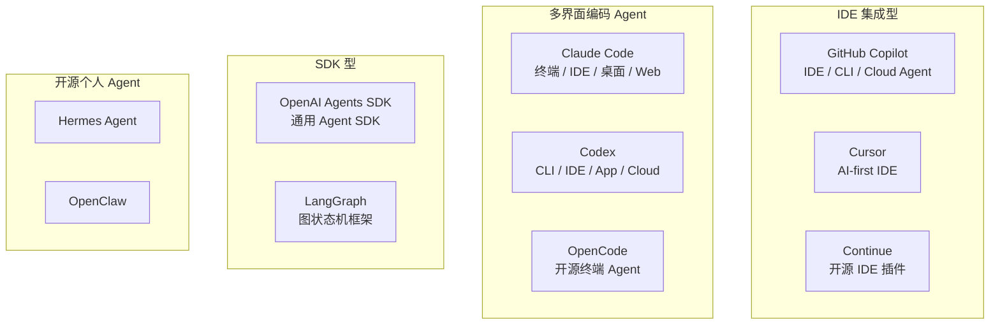

# 第 19 章：主流框架架构分析

> **难度等级：** ⭐⭐⭐⭐⭐
> **所属模块：** 第六部分：案例与索引
> **来源可信度：** 官方文档 / 源码 / 推导 / 观点
> **状态：** ✅ 已完成
> **事实核查日期：** 2026-07-12
> **核查范围：** 产品能力会变化；表中“官方文档”仅表示可在对应公开资料中核查，闭源内部机制仍按推导处理。每次版本更新应复核第 12 节链接和本章对比表。

---

## 学习目标

完成本章学习后，你将能够：

1. 理解六大主流 Agent 框架的架构设计
2. 对比各框架在 Runtime、Tool Registry、Memory、MCP、Hooks、Skills 等维度的设计差异
3. 掌握框架选型的评估标准
4. 理解各框架的设计哲学和适用场景
5. 从框架设计中提取可复用的架构模式

---

## 前置知识

- 建议阅读第 1--14 章，先建立组件和互操作的判断框架
- 阅读第 17--18 章后，可将工程约束和评估契约用于真实试点比较
- 了解各框架的基本使用方式

---

## 1. 分析框架

> **图 19-1：** 代表性产品与框架的主要定位。产品可能跨越多个界面，分类用于选型分析而非互斥标签；具体能力随版本变化，应以本章核查日期和官方资料为准。

---

## 2. 分析维度

每个框架从以下 8 个维度分析。这里的「支持」指公开文档可确认的产品或 SDK 能力，不等同于公开了内部实现；闭源产品的 Runtime、Planner 和上下文选择策略通常只能作推断。

| 维度 | 说明 |
|------|------|
| Runtime | Agent 主循环的设计与实现 |
| Planner | 任务规划和分解机制 |
| Tool Registry | Tool 的注册、发现和调度 |
| Memory | 记忆管理与上下文策略 |
| MCP Client | MCP 协议的集成方式 |
| Hooks | 生命周期事件拦截 |
| Skills | 可复用工作流支持 |
| Context 管理 | 上下文窗口管理策略 |

> **来源类型：** 推导分析 —— 基于各框架官方文档和源码的架构分析。标注为「推导」的内容基于公开信息推断，可能与实际实现有差异。

---

## 3. GitHub Copilot

### 3.1 概述

GitHub Copilot 是 GitHub 与 OpenAI 合作开发的 AI 编程助手，深度集成到 VS Code、JetBrains 等 IDE 中。它从最初的代码补全工具逐步演进为具有 Agent 能力的完整编程助手。

**定位：** IDE 内嵌的 AI 编程伙伴

**核心能力：** 代码补全、Chat、Agent 模式、代码审查、CLI

> **来源类型：** Fact —— 基于 GitHub Copilot 官方文档

### 3.2 架构分析

| 维度 | 分析 | 来源可信度 |
|------|------|-----------|
| Runtime | 基于 IDE 扩展进程，通过 VS Code Extension API 与编辑器交互。Agent 模式引入了多步骤推理循环。 | 推导 |
| Planner | 隐式规划为主，通过模型推理确定下一步操作。GitHub Copilot Chat 的 Agent 模式支持基本的任务分解。 | 推导 |
| Tool Registry | 公开产品提供文件、代码搜索、终端和 Git 等能力；具体可用工具会随客户端、模式和权限配置而变化。 | 官方文档 |
| Memory | 依赖 IDE 的工作区上下文（打开的文件、光标位置、最近编辑）。对话历史限制在合理长度内。 | 推导 |
| MCP Client | 支持 MCP 协议，可以连接 MCP Server 扩展工具能力。 | 官方文档 |
| Hooks | 通过 VS Code Extension API 实现生命周期管理。 | 推导 |
| Skills | GitHub 已公开 Agent Skills；不同 Copilot Surface 的发现位置、组织策略与可用范围仍需按官方文档核查。 | 官方文档 |
| Context 管理 | 可使用工作区、打开文件、编辑器状态等上下文；具体检索和排序策略没有完整公开，不应视为固定算法。 | 推导 |

### 3.3 设计特点

**优势：**
- 与 IDE 的深度集成，上下文感知能力强
- 同时覆盖代码补全、Chat、Agent 模式和代码审查等开发环节
- 可复用 VS Code 与 GitHub 生态中的工作区和协作上下文

**局限：**
- 具体 Agent 能力随客户端、订阅、模式与组织策略变化，需要按目标环境验证
- 工作流主要由产品界面和公开扩展点控制，不能假定可替换其内部 Runtime
- 闭源部分的规划、检索和上下文排序机制无法从公开资料完整核查

> **来源类型：** 推导分析 —— 基于使用体验和公开文档

---

## 4. Claude Code

### 4.1 概述

Claude Code 是 Anthropic 推出的 Agentic Coding 工具，可用于终端、IDE、桌面应用和 Web。它仍是本书观察终端 Agent 的代表性案例，但不能再将产品整体等同于 CLI；公开资料可确认其部分 Tool、MCP、Hooks、Skills 与项目指令能力，不能据此推断它“完整实现了”本书的所有抽象组件。

**定位：** 跨终端、IDE、桌面与 Web 的编码 Agent

**核心能力：** 代码生成、文件操作、Shell 执行、MCP 集成、Skills 系统、Hooks 系统

> **来源类型：** Fact —— 产品定位与所列公开能力基于 Claude Code 官方文档；内部架构仍按后文的推导处理

### 4.2 架构分析

| 维度 | 分析 | 来源可信度 |
|------|------|-----------|
| Runtime | 可执行多轮工具调用；内部步骤不公开，`Reasoning → Planning → Tool Calling → Observation` 是本书的分析模型，而不是官方公开的实现流程。 | 推导 |
| Planner | 可观察到多步 Tool 交互；具体规划算法、是否形成显式计划及其表示方式未完整公开。 | 推导 |
| Tool Registry | 公开产品提供文件、Shell、搜索等内置能力，并可配置 MCP 扩展；内部注册与路由机制未公开。 | 官方文档 / 推导 |
| Memory | 会话、工作区和项目指令可提供上下文；记忆命令与持久化范围应以所用版本的官方文档为准。 | 官方文档 / 推导 |
| MCP Client | 支持连接 MCP Server；具体版本、传输和产品交互以官方文档为准。 | 官方文档 |
| Hooks | 提供文档化的生命周期 Hook，可用于执行前后控制和通知；具体事件名与行为以所用版本文档为准。 | 官方文档 |
| Skills | 支持文档化的 Skills 扩展机制；加载方式、作用域和模板格式以所用版本文档为准。 | 官方文档 |
| Context 管理 | 公开资料可确认其会利用项目指令、工作区和会话上下文；具体文件选择、压缩与 Token 预算策略未完整公开。 | 推导 |

### 4.3 设计特点

**优势：**
- 公开文档覆盖终端 Tool、MCP、Hooks、Skills 等多个主题，是本书的有用案例
- 与开发工具链集成紧密，适合观察终端 Agent 的权限与交互边界
- 终端形态便于与脚本、版本控制和现有开发命令组合

**局限：**
- 不同 Surface 的能力、权限和自动化边界并不完全相同，团队采用前需要分别验证终端、IDE、桌面与 Web 工作流
- 模型、云提供商和认证方式存在版本与部署差异，应按官方支持矩阵验证
- 作为闭源产品，内部规划、上下文选择和 Tool 路由细节不能从公开资料完整核查

> **来源类型：** 推导分析 —— 基于官方文档和使用体验

---

## 5. Cursor

### 5.1 概述

Cursor 是一款 AI-first 的代码编辑器，基于 VS Code 深度定制，将 AI 能力直接嵌入编辑器的核心体验中。

**定位：** AI-first IDE

**核心能力：** Tab 补全、内联编辑、Chat、Composer（Agent 模式）、代码库索引

> **来源类型：** Fact —— 基于 Cursor 官方文档

### 5.2 架构分析

| 维度 | 分析 | 来源可信度 |
|------|------|-----------|
| Runtime | 基于 Composer 的 Agent 模式，支持多步骤自动化操作。与编辑器深度集成，操作结果实时反映在 UI 中。 | 推导 |
| Planner | 模型内隐式规划，通过 Composer 的多步迭代实现任务分解。 | 推导 |
| Tool Registry | Agent 可使用编辑器提供的文件、搜索、终端等能力；实际工具集和权限策略随产品版本、模式与配置变化。 | 推导 |
| Memory | 代码库索引（Codebase Indexing）提供项目级上下文。通过 `.cursor/rules/` 目录（原 `.cursorrules`）定义行为准则。 | 官方文档 |
| MCP Client | 支持 MCP 协议，可连接外部 MCP Server。 | 官方文档 |
| Hooks | 通过编辑器事件系统实现，非独立 Hook 框架。 | 推导 |
| Skills | Rules 用于持久化指令，并非本书定义的可发现、可编排 Skill Registry；不要将两者等同。 | 推导 |
| Context 管理 | 代码库索引 + 当前文件 + 相关文件 + 聊天历史。使用 @ 符号引用特定上下文。 | 官方文档 |

### 5.3 设计特点

**优势：**
- 将补全、对话、多文件编辑和 Agent 操作集中在编辑器工作流中
- 代码库索引可提供项目级检索上下文
- 编辑结果可直接在工作区中检查和继续修改

**局限：**
- 闭源部分的索引、排序和规划机制不能从公开资料完整核查
- 能力与编辑器客户端深度绑定，不适合直接等同于可嵌入的通用 Agent SDK
- 功能、模式名称和权限边界持续演进，需要绑定版本复核

> **来源类型：** 推导分析 —— 基于使用体验和公开文档

---

## 6. OpenAI Agents SDK

### 6.1 概述

OpenAI Agents SDK 是 OpenAI 推出的通用 Agent 构建框架，提供了一套完整的 Agent 开发工具。

**定位：** 通用 Agent SDK

**核心能力：** Agent 定义、Tool 管理、Handoff、Guardrails、Hooks、Sessions、Tracing

> **来源类型：** Fact —— 基于 OpenAI Agents SDK 官方文档和源码

### 6.2 架构分析

| 维度 | 分析 | 来源可信度 |
|------|------|-----------|
| Runtime | 基于 `Runner` 类的 Agent 循环。支持 `run()` 和 `run_streamed()` 两种模式。 | 官方源码 |
| Planner | 模型内隐式规划，通过 `instructions` 和 system prompt 指导规划行为。 | 官方文档 |
| Tool Registry | 函数式 Tool 定义，支持 `@function_tool` 装饰器。内置 Handoff 机制实现 Agent 间控制权转移。 | 官方文档 |
| Memory | Run history 可由应用显式传入，也可通过 Sessions 持久化；Sessions 提供 SQLite、Redis、SQLAlchemy、Dapr、MongoDB、加密 Session 等实现，`context` 用于运行期依赖而不是模型可见历史。 | 官方文档 |
| MCP Client | 支持 MCP 协议，可集成 MCP Server。 | 官方文档 |
| Hooks | 提供 Run/Agent 生命周期 Hooks；Tool 与 Agent Guardrail 结果、Handoff 和模型/Tool 调用可进入 Trace。 | 官方文档 |
| Skills | 无独立 Skills 概念，通过 `instructions` + `function_tool` 组合实现。 | 官方文档 |
| Context 管理 | Run 输入和 `context` 用于传递运行期状态；较长会话的保存、裁剪与恢复应通过 Sessions 或应用层策略实现，不能假定 SDK 会自动完成。 | 官方文档 |

### 6.3 设计特点

**优势：**
- 设计简洁，学习曲线平缓
- Handoff 机制是 Agent 间协作的创新设计
- 内置 Tracing，便于调试和监控
- 开源，可定制和扩展

**局限：**
- 相对较新，生态不如 LangGraph 成熟
- 默认路径针对 OpenAI Responses API 优化；使用非 OpenAI Provider 时需逐项验证 Tool、结构化输出、多模态和用量统计等兼容性
- 没有与本书第 12 章完全等价的独立 Skill Registry；可通过 instructions、Tool、Handoff 或应用层扩展组合工作流
- Hooks 已覆盖 Run/Agent、LLM、Tool 与 Handoff 生命周期；是否满足治理需求应按具体事件、失败语义和隔离边界验证，不宜用笼统的“成熟度”排序

> **来源类型：** 推导分析 —— 基于源码和官方文档

---

## 7. LangGraph

### 7.1 概述

LangGraph 是 LangChain 团队推出的基于图状态机的 Agent 框架。它将 Agent 工作流建模为有向图（Graph），节点代表操作，边代表状态转移。

**定位：** 图状态机 Agent 框架

**核心能力：** 图定义、状态管理、条件分支、循环、人工介入、持久化

> **来源类型：** Fact —— 基于 LangGraph 官方文档

### 7.2 架构分析

| 维度 | 分析 | 来源可信度 |
|------|------|-----------|
| Runtime | 基于图执行引擎。`StateGraph` 定义状态和转移，编译后执行。支持 `invoke()`、`stream()` 等调用方式。 | 官方文档 |
| Planner | 通过图结构定义规划逻辑。支持条件边（`add_conditional_edges`）实现动态路由。 | 官方文档 |
| Tool Registry | 通过 `ToolNode` 和 `tools` 参数管理。与 LangChain 的 Tool 生态集成。 | 官方文档 |
| Memory | 可通过 `checkpointer` 持久化图状态，并选择 SQLite、Postgres 等后端；保存、恢复范围和部署语义取决于配置。 | 官方文档 |
| MCP Client | 通过 LangChain 的 MCP 集成支持。 | 官方文档 |
| Hooks | 通过节点前后处理函数和 `interrupt` 机制实现。 | 官方文档 |
| Skills | 无独立 Skills 概念，通过子图（subgraph）实现可复用工作流。 | 官方文档 |
| Context 管理 | 状态对象（`State`）承载上下文。支持自定义 State Schema。 | 官方文档 |

### 7.3 设计特点

**优势：**
- 图模型直观，适合复杂工作流
- 状态持久化是核心特性，支持中断恢复
- 人工介入（Human-in-the-Loop）支持完善
- 生态成熟，文档丰富

**局限：**
- 图模型对简单任务过度设计
- 学习曲线较陡
- 依赖 LangChain 生态，耦合度较高

> **来源类型：** 推导分析 —— 基于官方文档和源码

---

## 8. Continue

### 8.1 概述

Continue 是开源的 AI 代码助手，以 VS Code / JetBrains 插件形式运行。支持多种 LLM 提供商，强调开放性和可定制性。

**定位：** 开源 IDE AI 插件

**核心能力：** Chat、Autocomplete、Edit、Agent 模式、模型切换

> **来源类型：** Fact —— 基于 Continue 官方文档

### 8.2 架构分析

| 维度 | 分析 | 来源可信度 |
|------|------|-----------|
| Runtime | 基于插件架构，通过 IDE API 与编辑器交互。Agent 模式引入多步骤循环。 | 官方源码 |
| Planner | 模型内隐式规划，通过 system prompt 和 slash commands 指导行为。 | 官方文档 |
| Tool Registry | 插件内置工具：文件操作、终端、搜索。通过 MCP 和自定义 Tool 扩展。 | 官方文档 |
| Memory | 对话历史管理。通过 `@` 上下文引用（文件、文件夹、URL 等）提供上下文。 | 官方文档 |
| MCP Client | 支持 MCP 协议，可连接 MCP Server。 | 官方文档 |
| Hooks | 通过插件生命周期和自定义 slash commands 实现类似功能。 | 推导 |
| Skills | 通过 slash commands 和 rules 实现工作流模板。 | 官方文档 |
| Context 管理 | 支持多种上下文提供者（文件、文件夹、Git diff、终端输出等）。 | 官方文档 |

### 8.3 设计特点

**优势：**
- 完全开源，社区驱动
- 模型无关，支持多种 LLM 提供商
- 可定制性强，支持自定义 slash commands 和 rules
- 与多种 IDE 兼容

**局限：**
- Agent 能力相对较新
- 社区规模小于 Copilot 和 Cursor
- 部分功能仍在快速迭代中

> **来源类型：** 推导分析 —— 基于官方文档和源码

---

## 8.5 补充对标：Codex、OpenCode、Hermes Agent 与 OpenClaw

这些项目覆盖了第 12～16 章新增的安装型扩展、作用域、策略和 Host 生命周期，不应只在第 16 章审查中出现。这里保留可由官方文档或开源仓库确认的边界，不推断闭源内部 Planner。

| 产品 / 项目 | 可核查的扩展与治理能力 | 主要架构启示 |
|-------------|------------------------|--------------|
| Codex | Skills、MCP、项目配置、Sandbox 与 Approval；MCP 支持 stdio 和 Streamable HTTP，并支持 Bearer/OAuth | 配置作用域、运行授权和 Sandbox 是不同层；共享 MCP 配置不表示每次调用自动获准 |
| OpenCode | 本地/远程 MCP、OAuth、Plugin、Skills，以及 `allow / ask / deny` 权限 | 统一三态 Policy 比散落的布尔开关更易审计；大量 MCP Tool 需要按需发现和上下文预算 |
| Hermes Agent | 渐进式 Skills、信任/扫描/隔离、多个 Plugin 来源、MCP 与命令审批 | 安装来源、供应链信任、运行权限和隔离必须分层 |
| OpenClaw | Skills、Tool 策略与可组合扩展面 | 扩展发现不应绕过 Host 的 Tool Policy；用户控制和来源信息应进入运行治理 |

**官方或一手资料：** [Codex MCP](https://developers.openai.com/codex/mcp/)、[Codex Skills](https://developers.openai.com/codex/skills/)、[Codex Security](https://developers.openai.com/codex/security/)、[OpenCode MCP](https://opencode.ai/docs/mcp-servers/)、[OpenCode Permissions](https://opencode.ai/docs/permissions/)、[Hermes Agent](https://github.com/nousresearch/hermes-agent)、[OpenClaw Tools](https://github.com/openclaw/openclaw/blob/main/docs/tools/index.md)。

---

## 9. 框架对比

“易用性”和“架构完整度”无法在不同产品、团队和版本之间得到可复核的统一分数，因此本书不再使用带精确坐标的能力象限。选型应从实际控制边界开始：

| 首要约束 | 应优先比较的候选类型 | 需要验证的 Trade-off |
|----------|----------------------|----------------------|
| IDE 内的低摩擦编码体验 | IDE 集成型产品 | 工作区权限、企业策略、离线/私有部署和可扩展性 |
| 终端与仓库工作流 | CLI 型 Agent | Shell 与文件权限、审批、非交互执行和审计 |
| 自建单 Agent 或服务 | SDK 型框架 | Tool 模型、trace、评估、模型提供商和部署控制 |
| 显式状态图、长任务恢复 | 工作流 / 图框架 | 状态模型学习成本、持久化、幂等和运维 |
| 开源扩展或多模型接入 | 可自托管的插件 / SDK 方案 | 维护责任、生态成熟度和安全更新 |

> **来源类型：** 推导分析。该表是选型起点，不是产品排名；应使用同一任务、同一数据边界和同一评估契约进行试点比较。

### 9.1 试点核查表

静态“✅ / ❌”矩阵很容易把产品版本、部署选项和相邻能力混成一个结论。对每个候选方案，应在相同任务与数据边界下记录下表，而不是把本书的抽象层直接当成产品功能名。

| 维度 | 应核查的证据 | 不应由此推断 |
|------|--------------|--------------|
| Tool 与 MCP | 当前版本的连接方式、本地/远程传输、授权和 Tool 暴露范围 | “支持 MCP”就自动满足权限、审计或企业部署要求 |
| 状态与恢复 | 会话、检查点、存储后端、恢复与幂等语义 | 有对话历史就等于可恢复长任务 |
| Hooks 与人工介入 | 事件点、拒绝/审批状态、取消与审计 API | 有回调或 UI 就等于具备可治理的审批模型 |
| Skills / 指令 | 发现、加载、版本、上下文预算和用户可见性 | Rules、Slash Command 或 Prompt 文件天然等同于 Skill Registry |
| 模型与部署 | 可用 Provider、区域、私有化、数据保留与降级策略 | 一个产品标签可以代表所有部署模式的能力 |

> **试点记录建议：** 为每个候选记录产品版本、部署方式、官方链接、测试日期、通过的评估契约和未满足的约束。这样能力变化时只需重跑试点，而不是维护一张容易过期的勾叉表。

### 9.2 选型指南

| 场景 | 候选方向 | 需要进一步验证 |
|------|---------|------|
| 日常编码辅助 | GitHub Copilot、Cursor、Continue 等 IDE 集成型产品 | 支持的 IDE、组织策略、模型、MCP 与本地数据边界 |
| 终端开发工作流 | Claude Code 或同类 CLI Agent | Shell/文件授权、自动化能力、审计与团队工作流 |
| 构建自定义 Agent | OpenAI Agents SDK、LangGraph 或其他 SDK | 控制流、状态、模型提供商、trace、评估与部署需求 |
| 复杂工作流编排 | LangGraph 或同类状态机/工作流框架 | 恢复语义、持久化后端、图模型复杂度和运行成本 |
| 开源定制 | Continue、开源 SDK 或自建组件 | 维护投入、升级节奏、模型兼容性与安全响应 |
| 学习 Agent 架构 | MVP + 任选一个 SDK/产品的公开文档 | 以第 2、14、16、18、19 章的概念和评估契约检查观察结果 |

---

## 10. 架构模式提取

### 10.1 从框架中提取的通用模式

| 本书抽象 | 可从公开资料观察到的实现方式 | 边界 |
|----------|----------------------------------|------|
| Agent Loop | SDK 可能公开执行循环；产品通常只暴露多步行为 | 不假定所有产品公开其规划或终止算法 |
| Tool 管理 | 代码 API、Host 配置或 ToolNode 等方式管理能力 | 不假定存在名为 Tool Registry 的统一内部模块 |
| MCP 集成 | 支持 MCP 的 Host 可协商并连接外部能力 | 具体版本、传输、授权和审批仍需逐项核查 |
| Skills / 指令 | Host 可提供 Skill、Rule、Prompt 文件或子图等复用机制 | 名称相近不表示生命周期、发现或权限语义相同 |
| Hooks / 人工介入 | 事件 API、节点拦截或审批状态可承载横切控制 | 回调不自动构成安全边界，审批不自动持久化 |
| 状态持久化与 Handoff | 部分框架提供检查点、状态图或控制权转移抽象 | 应验证恢复、幂等、跨系统身份与审计语义 |

---

## 11. 最佳实践

1. **不要过早选定框架：** 先理解 Agent 架构原理，再根据需求选择框架。
2. **评估互操作边界：** 若需要连接外部能力，比较 MCP、直接 API 与 Host 插件模型的授权、部署和运维代价。
3. **评估可定制性：** 如果未来需要深度定制，优先选择开源框架。
4. **考虑学习成本：** LangGraph 功能强大但学习曲线陡峭，简单场景用 OpenAI Agents SDK 更合适。

---

## 12. 官方参考

| 编号 | 来源 | 类型 | 说明 |
|------|------|------|------|
| REF-1 | [GitHub Copilot Docs](https://docs.github.com/en/copilot) | 官方文档 | Copilot 完整文档 |
| REF-2 | [Claude Code Docs](https://code.claude.com/docs) | 官方文档 | Claude Code 的终端、IDE、桌面与 Web 形态 |
| REF-3 | [Cursor Docs](https://docs.cursor.com/) | 官方文档 | Cursor 官方文档 |
| REF-4 | [OpenAI Agents SDK](https://github.com/openai/openai-agents-python) | 源码 | OpenAI Agents SDK 源码 |
| REF-7 | [OpenAI Agents SDK Models](https://openai.github.io/openai-agents-python/models/) | 官方文档 | ModelProvider、非 OpenAI Provider 与兼容性边界 |
| REF-8 | [OpenAI Agents SDK Agents](https://openai.github.io/openai-agents-python/agents/) | 官方文档 | Agent 与 Run 生命周期 Hooks |
| REF-5 | [LangGraph Docs](https://langchain-ai.github.io/langgraph/) | 官方文档 | LangGraph 官方文档 |
| REF-6 | [Continue Docs](https://docs.continue.dev/) | 官方文档 | Continue 官方文档 |
| REF-9 | [GitHub Copilot Agent Skills](https://docs.github.com/en/copilot/how-tos/copilot-on-github/customize-copilot/customize-cloud-agent/add-skills) | 官方文档 | Copilot Coding Agent 的 Skill 发现与使用 |
| REF-10 | [OpenAI Agents SDK Sessions](https://openai.github.io/openai-agents-python/sessions/) | 官方文档 | Session 实现、恢复和持久化选择 |
| REF-11 | [OpenAI Agents SDK Tracing](https://openai.github.io/openai-agents-python/tracing/) | 官方文档 | Run、Tool、Guardrail 与 Handoff Trace |
| REF-12 | [GitHub Copilot Plugins](https://docs.github.com/en/copilot/concepts/agents/about-plugins) | 官方文档 | Plugin 作为 Agents、Skills、Hooks、MCP/LSP 配置的可安装分发包 |

---

## 本章小结

框架和产品的公开能力可以用统一维度比较，但闭源内部机制不能从界面行为反推为事实。选型应从任务、部署、数据边界和治理要求出发，使用同一评估契约进行试点；本章对具体产品的描述必须与事实核查日期和直接来源一起维护。

---

## 本章 Checklist

- [ ] 理解六大框架的架构设计
- [ ] 能对比各框架在 8 个维度的差异
- [ ] 理解各框架的设计哲学和适用场景
- [ ] 掌握框架选型的评估标准
- [ ] 能从框架设计中提取通用架构模式
