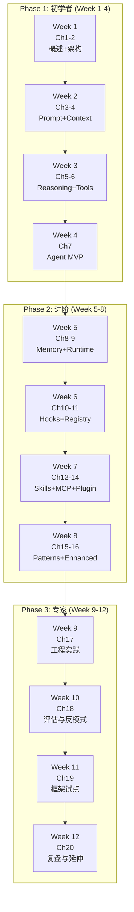

# 第 20 章：常见架构问题与选型指南

> **难度等级：** ⭐⭐
> **注意：** 附录 [FAQ 问题索引](../../faq/FAQ.md) 只负责定位；本章是全书 FAQ 的唯一完整答案来源。
> **所属模块：** 第六部分：案例与索引
> **来源可信度：** 官方文档 / 源码 / 论文 / 推导 / 观点
> **状态：** ✅ 已完成

---

## 学习目标

本章是全书的知识索引，帮助你：

1. 快速查找常见问题的答案
2. 发现进一步学习的方向
3. 了解 Agent 领域的前沿趋势

---

## 1. 综合 FAQ

### 架构与设计

**Q: Agent 和普通 LLM 应用有什么区别？**

普通 LLM 应用是「输入 → 输出」的线性流程，Agent 是「推理 → 规划 → 执行 → 观察 → 再推理」的循环。Agent 具备 Tool 调用、Memory 管理、多步骤规划等能力。（-> 详见第 1 章「AI Agent 简介与历史演进」和第 2 章「总体架构与生命周期」）

**Q: 什么时候应该用 Agent，什么时候用简单的 LLM 调用？**

- 简单问答、文本生成 → 直接 LLM 调用
- 需要多步推理但不需要工具 → Chain-of-Thought Prompting
- 需要工具调用、外部交互 → Agent
- 复杂多步骤任务 → Plan-and-Execute Agent

**Q: 如何设计 Agent 的 Instructions？**

分层设计：角色定义 → 行为准则 → 安全规则 → 工具使用规则 → 输出风格。保持最小化，每条规则有明确理由。（-> 详见第 3 章「Prompt 与 Instructions」）

**Q: Agent 的上下文窗口如何管理？**

为生成结果和后续 Tool 输出预留明确预算，再按信息可恢复性、任务相关性和权限要求选择裁剪、摘要、优先级排序或检索。百分比只是起点，必须依据模型限制、响应长度和真实 Tool 输出校准。（-> 详见第 4 章「Context 管理」）

### 工具与 MCP

**Q: Built-in Tool 和 MCP Tool 如何选择？**

先看控制边界，而不是只按调用频率分类：能力稳定、与 Host 同部署且需严格控制性能和权限时，可考虑 Built-in Tool；需要与第三方或独立进程互操作、复用标准能力描述时，评估 MCP；需要把 Host 定义的指令、Tool、Hook 或界面等作为一个可分发单元管理时，评估 Plugin。三者都仍需要逐次授权、版本治理和故障隔离。（-> 详见第 6、13、14 章）

**Q: MCP 会取代 Function Calling 吗？**

不会。MCP 是外部上下文与能力的互操作协议，可涉及 Tool、Resource、Prompt 等能力；Function Calling 是模型发出结构化工具调用的一类机制。两者可配合，但不互相取代。（-> 详见第 13 章「MCP」和第 6 章「Tools 与 Function Calling」）

**Q: Agent 应该有多少个 Tool？**

没有可靠的通用数量阈值。候选 Tool 的名称和 schema 已开始相似、模型误选上升，或不同用户/任务只需其中一部分时，应按场景暴露最小候选集，并使用 Registry、Router 和授权策略管理。（-> 详见第 11 章「Tool Registry」）

### 记忆与状态

**Q: Memory 和 Context 管理有什么区别？**

Memory 关注「存什么」和「怎么检索」，Context 关注「当前放什么」和「怎么裁剪」。长期记忆通过检索进入当前上下文。（-> 详见第 4 章「Context 管理」和第 8 章「Memory」）

**Q: 长期记忆应该用什么存储？**

先按查询模式、并发、租户隔离、备份与删除义务选择存储，而非只按记录数选择。原型可用 SQLite；已有关系型数据与过滤需求时可使用 PostgreSQL 及其向量扩展；只有检索规模、延迟或运维能力确有要求时，再评估专用检索服务。无论选哪种，都要保存来源、版本、权限和删除策略。（-> 详见第 8 章「Memory」）

**Q: 如何平衡记忆的「记住」和「遗忘」？**

先定义数据类别、用途、可撤销性和保留期限，再组合重要性、时效、来源可信度、用户删除请求与存储成本等信号。时间衰减只能辅助排序或清理；用户偏好、审计记录和受监管数据不能仅凭“重要”或“过期”决定保留。（-> 详见第 8 章）

### 框架与选型

**Q: 应该选择哪个 Agent 框架？**

先确定任务形态和控制边界：IDE/终端产品优先比较其本地工作流与企业策略；自定义 Agent 比较 Tool、状态、审批和 tracing 的 SDK 能力；显式状态图或复杂恢复流程再评估工作流框架。产品能力与定价变化很快，不能用单一“推荐榜”替代版本、部署、数据边界和团队技能的核查。（-> 详见第 19 章「主流框架架构分析」）

**Q: 开源框架和闭源产品如何选择？**

需要深度定制、私有部署或可审计扩展时，可比较 SDK/工作流框架的许可证、运行边界和运维成本；需要现成 IDE/终端体验时，可比较产品的权限模型、数据策略、部署方式与企业治理能力。不要把“开源”自动等同于可控或安全，也不要把“产品化”自动等同于低运维或低风险。（-> 详见第 19 章）

### 实践与部署

**Q: Agent 如何保证安全性？**

最小权限原则、Tool 白名单、用户确认敏感操作、沙箱隔离、密钥管理。（-> 详见第 17 章「工程实践」安全部分和第 10 章「Hooks」权限检查）

**Q: Agent 如何控制成本？**

模型选择（简单任务用较低成本模型）、上下文压缩、Tool 结果截断、缓存复用；应先基于真实 Trace 测量成本构成。（-> 详见第 18 章「最佳实践、评估与反模式」成本优化策略）

**Q: Agent 如何监控和调试？**

结构化日志 + 指标 + Tracing。关键指标：步数、Tool 调用延迟、Token 使用、错误率。（→ 详见第 17 章「工程实践」）

### 错误处理与恢复

**Q: Tool 调用失败时 Agent 应该怎么处理？**

先区分可重试的瞬时失败、需要修正参数的业务失败和不可重试的授权/校验失败。仅对幂等且可能恢复的操作使用有上限的退避重试；重试次数、总耗时和替代方案应按下游语义与风险校准。耗尽预算后返回结构化失败或请求人工处理，不能无限循环。（→ 详见第 9 章「Runtime」中的 `_execute_with_retry` 实现）

**Q: 如何防止 Agent 进入无限循环？**

至少设置单步超时、总会话预算和最大步数，并让 Runtime 在每个执行边界强制检查。具体阈值要按 Tool 的 P95/P99 延迟、用户等待预期、费用预算和补偿语义校准；达到任一限制时保存可恢复状态并返回可解释的终止原因。（→ 详见第 9 章「Runtime」超时管理）

**Q: Agent 遇到不支持的 Tool 调用怎么办？**

返回结构化错误（`{"success": false, "error": "Tool not found"}`），让 LLM 在下一轮推理中自行调整策略。不要抛出未捕获异常，这会中断整个 Agent 循环。

### 流式输出与实时响应

**Q: Agent 如何实现流式输出？**

使用 SSE（Server-Sent Events）或 WebSocket 将 LLM 的流式响应实时推送给用户。Tool 执行阶段可以显示「正在执行...」状态提示。关键是区分 LLM 输出流（可流式）和 Tool 执行流（需等待完成）。第 16 章采用可替换 `LLMAdapter`，流式能力应作为 Adapter 与 Host 输出协议的扩展，而不是假设所有 Provider 都支持相同事件格式。

**Q: 如何处理 Tool 执行中的长时间操作？**

对于耗时 Tool（如大文件处理、批量查询），采用异步模式：Tool 立即返回一个任务 ID，Agent 可以继续其他工作或告知用户等待，通过轮询或回调获取最终结果。

### 多 Agent 协作

**Q: 什么时候应该用多 Agent 而非单 Agent？**

当任务涉及多种专业角色（如代码审查 + 文档生成）、需要并行处理独立子任务、或单 Agent 上下文窗口不足时。如果任务高度串行且步骤间依赖紧密，单 Agent 更简单高效。（→ 详见第 15 章「设计模式」中的 Multi-Agent 模式）

**Q: 多 Agent 之间如何通信？**

三种主要方式：直接调用（一个 Agent 显式调用另一个）、共享黑板（通过公共 Memory 区域交换信息）、事件总线（通过发布/订阅解耦通信）。选择取决于耦合度需求和扩展性要求。

### 安全与防御

**Q: 如何防御 Prompt 注入攻击？**

把外部内容视为不可信数据，隔离其指令性文本；在 Tool 执行处重新进行身份、参数和范围授权；对高风险动作加入审批和沙箱；输出前执行敏感信息控制。Instructions 和关键词过滤可以辅助检测，但不能作为访问控制。没有任何单一措施能完全防御，需要纵深防御策略。（→ 详见第 10 章「Hooks」和第 17 章「工程实践」安全部分）

**Q: Agent 执行代码时如何保证安全？**

沙箱隔离是核心：使用容器化执行（Docker/gVisor）、限制文件系统访问范围、禁用网络访问（除非必需）、设置 CPU/内存/时间限制。永远不要在宿主环境中直接执行 Agent 生成的代码。

### 评估与质量

**Q: 如何评估 Agent 的输出质量？**

组合使用：Golden Test（已知正确答案的任务）、LLM-as-Judge（语义质量评分）、人工评估（关键路径抽检）、A/B 测试（新旧版本对比）。建议建立评估数据集，并同时检查结果、轨迹、安全和资源包络。（→ 详见第 18 章「最佳实践、评估与反模式」测试与评估策略）

**Q: 如何衡量 Agent 是否在变好？**

定义核心指标基线（任务完成率、平均步数、Token 效率、用户满意度），每次改动后对比。版本管理不仅管理代码，也要管理 Prompt 和 Instructions 的版本。

### 生产调试

**Q: 生产环境中 Agent 行为异常如何排查？**

第一步查看受控的结构化日志和 Trace（每个步骤的输入/输出摘要）。第二步使用脱敏或合成的上下文重放，必要时仅在严格访问控制下定位原始记录。第三步隔离变量：Prompt、Tool、检索、模型或策略。生产数据的留存、访问和回放必须符合数据最小化原则。（→ 详见第 17 章「工程实践」）

**Q: 如何处理 LLM 输出的非确定性？**

同一输入仍可能产生不同输出。降低采样随机性可以提高可重复性，但不能保证完全确定；对高风险结果应使用 schema 校验、Tool 侧授权、评估集与人工复核。缓存只适用于输入、权限、数据版本和时效条件都相同的读操作，评估中还应多次运行并记录模型与配置版本。

### 模型迁移

**Q: 切换 LLM 提供商时需要注意什么？**

关键差异：Token 计算方式不同（影响上下文窗口估算）、Function Calling 格式差异（OpenAI vs Anthropic）、系统提示词位置不同、Tool 描述的敏感度不同。建议通过 LLMProvider 抽象接口隔离差异，并为每个 Provider 编写适配层。（→ 详见第 2 章「总体架构」中的 LLM 接口抽象）

**Q: 从 GPT-4 迁移到 Claude（或反向）需要改什么？**

主要改动：Function Calling 的 JSON Schema 格式可能需要调整；系统提示词的措辞可能需要优化（不同模型对不同措辞的响应不同）；上下文窗口大小不同导致 Memory 策略需要调整；Token 计数器需要更换。建议保留旧版本作为回退。

---

## 2. 延伸阅读

### 2.1 学术论文

| 论文 | 年份 | 核心贡献 | 相关章节 |
|------|------|---------|---------|
| [Attention Is All You Need](https://arxiv.org/abs/1706.03762) | 2017 | Transformer 架构 | 第1章 |
| [GPT-3: Language Models are Few-Shot Learners](https://arxiv.org/abs/2005.14165) | 2020 | LLM 基础能力 | 第1章 |
| [Chain-of-Thought Prompting](https://arxiv.org/abs/2201.11903) | 2022 | 逐步推理 | 第5章 |
| [ReAct: Synergizing Reasoning and Acting](https://arxiv.org/abs/2210.03629) | 2022 | Reasoning + Acting | 第1章, 第5章, 第 15 章 |
| [Constitutional AI](https://arxiv.org/abs/2212.08073) | 2022 | 规则约束 AI | 第3章 |
| [Toolformer](https://arxiv.org/abs/2302.04761) | 2023 | 模型自学使用工具 | 第1章, 第6章 |
| [Reflexion](https://arxiv.org/abs/2303.11366) | 2023 | 自我反思 | 第5章, 第 15 章 |
| [Generative Agents](https://arxiv.org/abs/2304.03442) | 2023 | 记忆与反思 Agent | 第 8 章, 第 15 章 |
| [Tree of Thoughts](https://arxiv.org/abs/2305.10601) | 2023 | 多路径推理 | 第5章 |
| [Gorilla](https://arxiv.org/abs/2305.15334) | 2023 | LLM 连接海量 API | 第6章 |
| [Voyager](https://arxiv.org/abs/2305.16291) | 2023 | 动态技能学习 | 第5章, 第 15 章 |
| [Lost in the Middle](https://arxiv.org/abs/2307.03172) | 2023 | 长上下文注意力 | 第4章 |
| [AutoGen](https://arxiv.org/abs/2308.08155) | 2023 | 多 Agent 协作 | 第 15 章 |
| [MemGPT](https://arxiv.org/abs/2310.08560) | 2023 | 虚拟内存管理 | 第 8 章 |
| [SWE-agent: Agent-Computer Interfaces](https://arxiv.org/abs/2405.15793) | 2024 | 软件工程 Agent 交互设计 | 第 7 章, 第 19 章 |
| [Agentless: Demystifying LLM-based Software Engineering Agents](https://arxiv.org/abs/2407.01489) | 2024 | 无 Agent 自动修复范式 | 第 15 章 |
| [OpenAI o1 System Card](https://openai.com/index/openai-o1-system-card/) | 2024 | 推理时计算 (test-time compute) | 第5章 |
| [Anthropic: Building Effective Agents](https://www.anthropic.com/research/building-effective-agents) | 2024 | Agent 架构实践指南 | 第 7 章 |
| [Computer Use: Claude Agent on Desktop](https://www.anthropic.com/news/claude-computer-use) | 2024 | Agent 操控图形界面 | 第6章 |

### 2.2 官方文档与规范

| 资源 | 说明 |
|------|------|
| [MCP Specification](https://modelcontextprotocol.io/) | MCP 协议完整规范 |
| [OpenAI API Docs](https://platform.openai.com/docs/) | OpenAI API 文档 |
| [Anthropic Docs](https://docs.anthropic.com/) | Anthropic Claude 文档 |
| [LangGraph Docs](https://langchain-ai.github.io/langgraph/) | LangGraph 官方文档 |
| [OpenAI Agents SDK](https://openai.github.io/openai-agents-python/) | OpenAI Agents SDK 文档 |
| [Claude Code Docs](https://docs.anthropic.com/en/docs/claude-code) | Claude Code 文档 |
| [GitHub Copilot Docs](https://docs.github.com/en/copilot) | Copilot 文档 |
| [Cursor Docs](https://docs.cursor.com/) | Cursor 文档 |
| [Continue Docs](https://docs.continue.dev/) | Continue 文档 |

### 2.3 社区与博客

| 资源 | 说明 |
|------|------|
| [Lilian Weng's Blog](https://lilianweng.github.io/) | LLM Agent 综述 |
| [Anthropic Research](https://www.anthropic.com/research) | Anthropic 研究博客 |
| [OpenAI Blog](https://openai.com/blog) | OpenAI 官方博客 |
| [LangChain Blog](https://blog.langchain.dev/) | LangChain 团队博客 |
| [Awesome MCP Servers](https://github.com/punkpeye/awesome-mcp-servers) | MCP Server 社区列表 |
| [Awesome LLM Agents](https://github.com/hyp1231/awesome-llm-powered-agent) | LLM Agent 资源汇总 |

### 2.4 推荐学习路径

**图 20-1：12 周学习路线图**



**初学者路径（4 周）：**
```
Week 1: 第1-2章（概述 + 架构）
Week 2: 第3-4章（Prompt + Context）
Week 3: 第5-6章（Reasoning + Tools）
Week 4: 第 7 章（Agent MVP）
```

**进阶路径（4 周）：**
```
Week 1: 第8-9章（Memory + Runtime）
Week 2: 第10-11章（Hooks + Tool Registry）
Week 3: 第12-14章（Skills + MCP + Plugin）
Week 4: 第15-16章（设计模式 + 增强版 Agent）
```

**专家路径（4 周）：**
```
Week 1: 第17章（工程实践）
Week 2: 第18章（最佳实践、评估与反模式）
Week 3: 第19章（框架分析与试点选型）
Week 4: 第20章（FAQ、复盘与延伸阅读）
```

---

## 3. 观察方向与不确定性

本节不是路线图或预测承诺，而是截至本书核查日期值得持续关注的方向。技术成熟度、产品支持和标准状态应以实际项目的官方文档、试点结果与风险评估为准。

### 3.1 技术趋势

| 趋势 | 说明 | 影响 | 准备建议 |
|------|------|------|---------|
| MCP 与能力互操作 | 更多外部能力可能以标准协议接入 | 连接和授权面扩大，治理要求随之增加 | 根据部署边界比较 MCP、内置 Tool 与直接 API，而非一律优先某一种 |
| 跨 Agent 协作 | 不同运行时之间的发现、任务状态和结果交付协议 | 可组合性提高，也增加身份、授权和审计复杂度 | 保持本地委派契约明确，审慎评估跨系统协议 |
| 推理时计算 | 模型或应用可为难题投入更多步骤或计算 | 质量可能提高，成本和延迟也可能显著增加 | 用评估集确定哪些任务值得更高预算 |
| 多模态交互 | 图像、音频、视频可成为输入、输出或 Tool 数据 | 数据处理、版权、隐私与评估更复杂 | 先为实际任务定义媒体处理和权限边界 |
| 本地与混合部署 | 一部分模型或 Tool 可在本地/私有环境运行 | 数据边界更强，但能力、运维和硬件限制不同 | 以数据分类、延迟和可用性设计降级方案 |
| 系统级集成 | 操作系统、浏览器和企业平台可能提供更多 Agent 接口 | 更强能力也意味着更高权限风险 | 以沙箱、最小权限和审批作为前置条件 |
| 评估实践成熟 | 更多团队建立领域评估集和轨迹测试 | 结果更可比较，但仍受任务定义影响 | 建立内部基线，不等待“统一标准”再开始 |

### 3.2 架构演进预测

```
可观察方向：单 Agent 的可靠 Tool 使用、状态恢复与评估
 ↓
可能扩展：多 Agent 委派、跨系统协作、按任务分配推理预算
 ↓
需要持续验证：多模态工作流、混合部署和更深的系统级集成
```

### 3.3 趋势对架构设计的影响

**能力互操作的影响：** 若外部能力越来越多，Tool Registry 可能需要同时管理本地 Tool、MCP 连接、版本、权限和冲突。是否支持动态加载取决于安全审查、会话隔离和运维能力，不是所有系统的默认需求。

**推理时计算的影响：** 对确有难度分层和质量收益证据的任务，Runtime 可能需要支持按预算调整推理深度；无论是否动态调整，最大步数、总预算和终止条件仍应保留。先用评估集验证额外计算带来的收益，再决定是否增加 Token 与延迟预算。

**多模态的影响：** 当任务确实处理图像、音频或视频时，Context、Tool 契约与存储检索可能需要支持相应数据类型、引用和权限；不处理这些媒体的系统无需为此预置复杂管线。应先验证模型计费、媒体保留和数据访问边界。

**本地与混合部署的影响：** 当数据不能离开特定边界或云端不可用时，可考虑本地模型或离线降级。是否支持多 Provider 和本地回退，应由数据分类、可接受质量、硬件和故障恢复要求决定；不能假定本地 Tool 或模型总能提供毫秒级体验。

---

## 4. 贡献指南

本书是开源项目，欢迎通过以下方式贡献：

- **报告问题：** 在 GitHub Issues 中报告事实错误、过时信息或改进建议
- **提交内容：** 通过 Pull Request 提交章节内容、代码示例或图表
- **分享经验：** 分享你在 Agent 开发中的实践经验和案例

详见 [CONTRIBUTING.md](../../CONTRIBUTING.md)。

---

## 5. 致谢

感谢所有为 AI Agent 技术发展做出贡献的研究者、工程师和开源社区成员。本书的架构分析基于以下框架和项目的公开文档与源码：

- GitHub Copilot (GitHub/Microsoft)
- Claude Code (Anthropic)
- Cursor (Anysphere)
- OpenAI Agents SDK (OpenAI)
- LangGraph (LangChain)
- Continue (Continue Dev)

---

## 本章小结

常见问题的答案最终都回到同一组判断：任务是否需要 Agent、能力边界在哪里、失败如何处理、风险由谁授权，以及复杂度是否带来可测量收益。产品和协议会变化，选型时应回到专题章节的原则、直接来源和目标环境验证。

---

## 本章 Checklist

- [ ] 浏览了所有 FAQ，标记了感兴趣的问题
- [ ] 阅读了至少 5 篇推荐论文
- [ ] 收藏了重要的官方文档链接
- [ ] 制定了个人学习路径
- [ ] 了解了 Agent 领域的前沿趋势
- [ ] 理解了各技术趋势对架构设计的影响
- [ ] 能针对常见问题找到对应章节深入学习
